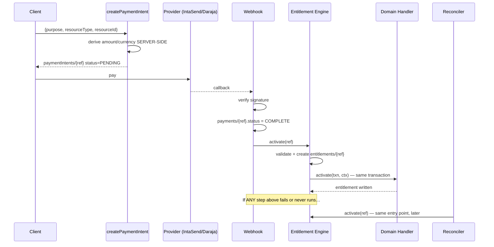

# Payment Architecture Unification

**Status:** DESIGN — awaiting Architecture Review Gate verdict
**Date:** 2026-07-21
**Supersedes:** per-domain payment handling in every monetized module
**Related:** [[Payments]] · [[Subscriptions]] · [[Marketplace]] · [[Events]] · [[Orders]] · [[SmartPOS]] · [[Platform Constitution]]

---

## 1. The failure class

Six audited domains lose paid entitlements, and they lose them for the *same* reason expressed six
different ways. The bug is not in any one module — it is that **every module owns its own payment
lifecycle**.

| Domain | How the entitlement is granted today | Failure |
|---|---|---|
| Digital / entertainment downloads | nothing writes `completed` | terminal `pending_payment` |
| Hub registration | `localStorage.setItem` | entitlement exists in one browser profile |
| Marketplace orders | `fetch()` from the buyer's tab | tab close ⇒ paid, no order |
| Bookings | `paymentStatus: paymentId ? 'paid' : …` | forgeable, and lost on crash |
| Event tickets | nothing flips `awaiting_payment` → `valid` | ticket unusable at the gate |
| Legal / healthcare | CF accepts no payment reference | fee recorded, payment discarded |

Three structural causes sit underneath:

1. **Activation is triggered by the client.** SokoniPay only fires `onSuccess` after the user clicks
   "Continue" (`sokoni-pay.js:336`). A manual click is not a durable event.
2. **There is no single record that means "this payment has been honoured."** Each domain infers it
   from its own document, so nothing can ask the platform-wide question *"which payments have not
   been honoured?"*
3. **Reconciliation is hardcoded to one purpose.** `reconcileSubscriptionEntitlements` filters
   `purpose == 'subscription'`, and `createPaymentIntent` only ever mints that purpose — so no other
   domain is sweepable *even in principle*.

Fixing six domains individually would leave cause (3) intact and guarantee a seventh.

---

## 2. The invariant

> **One payment reference ⇒ exactly one `entitlements/{paymentRef}` document.**
> Its existence *is* the definition of "honoured". Creating it and performing the domain's
> activation happen in **one Firestore transaction**.

Everything below follows mechanically from that single sentence:

- **Never activate twice** — the ledger document is create-only; a second attempt sees it and stops.
- **Never miss activation** — a sweep for COMPLETE payments lacking a ledger document is a
  *purpose-agnostic* query, so it works for domains that do not exist yet.
- **Never orphan a payment** — an orphan is now a first-class, queryable state rather than an
  invisible one.
- **Browser-independent** — the ledger is written server-side from the webhook or the reconciler.

The deterministic document ID is the whole trick. `.add()` with a random ID cannot express
"exactly once"; `doc(paymentRef).create()` can.

---

## 3. Canonical lifecycle



The reconciler is not a parallel implementation. It calls **the same entry point** with the same
guarantees; it only differs in *when*. That is what makes recovery trustworthy — there is no second
code path to keep in sync.

---

## 4. Canonical `paymentIntents/{ref}`

Extends the existing collection (`functions/payment-intents.js`) — not a new one.

| Field | Notes |
|---|---|
| `purpose` | registry key — **the only routing input** |
| `resourceType` / `resourceId` | what is being bought (`event`, `evt_123`) |
| `ownerUid` | who receives the entitlement |
| `businessId` | nullable; drives business-ownership checks |
| `amount` / `currency` | **derived server-side from the catalogue, never client-sent** |
| `provider` | `intasend` \| `daraja` \| `wallet` |
| `status` | `PENDING` → `COMPLETE` \| `FAILED` \| `EXPIRED` |
| `createdAt` | drives the reconciliation window |

`createPaymentIntent` already derives price server-side and refuses client amounts — that property is
correct and is generalized, not replaced.

---

## 5. Purpose registry

A declarative map. **Adding a monetized feature must not require touching the engine or the
reconciler** — that is the design's acceptance test.

```js
// functions/payment-purposes.js
registerPurpose('event_ticket', {
  resourceType: 'event',
  handler:      require('./event-hub').entitlement,
  expires:      false,
  refundable:   true,
});
```

Initial registry: `subscription`, `marketplace_order`, `booking`, `event_ticket`,
`digital_download`, `entertainment_purchase`, `hub_registration`, `advertisement`,
`featured_listing`, `wallet_topup`, `course_purchase`, `consultation`, `ride_booking`.

An unregistered purpose is a **hard error that alerts** — never a silent skip. A silent skip is how
the current class of bug survives.

---

## 6. Domain contract

Every monetized module exposes exactly four functions and **no payment verification of its own**:

```js
module.exports.entitlement = {
  // Domain-specific preconditions only. Payment validity is NOT the domain's job.
  validate(ctx),            // → { ok: true } | throws HttpsError
  activate(txn, ctx),       // MUST use the passed txn. MUST be idempotent.
  revoke(txn, ctx, reason), // refund / chargeback / expiry
  status(ctx),              // → { active, expiresAt, detail }
};
```

`ctx` is `{ paymentRef, intent, payment, ownerUid, businessId, amount, currency, resourceId }`.

Two rules make this safe:

- `activate` **must** use the supplied transaction. A handler that writes outside it breaks
  exactly-once and is a review-blocking defect.
- `activate` receives an already-validated payment. Domains never re-derive payment truth, which is
  precisely the mistake `booking.js:465` makes today by trusting a client string.

---

## 7. Entitlement Engine

```js
async function activateEntitlement(paymentRef, { source }) {
  const intent  = await load('paymentIntents', paymentRef);   // must exist
  const payment = await load('payments', paymentRef);         // must exist
  const spec    = PURPOSE_REGISTRY[intent.purpose];           // unregistered ⇒ throw + alert

  assertPaymentHonourable(intent, payment);   // §8 — all checks, server-side only

  return db.runTransaction(async (txn) => {
    const ledgerRef = db.collection('entitlements').doc(paymentRef);
    if ((await txn.get(ledgerRef)).exists) return { alreadyActive: true };   // exactly-once

    await spec.handler.validate({ txn, ...ctx });
    const result = await spec.handler.activate(txn, ctx);

    txn.create(ledgerRef, {
      paymentRef, purpose: intent.purpose,
      resourceType: intent.resourceType, resourceId: intent.resourceId,
      ownerUid: intent.ownerUid, businessId: intent.businessId ?? null,
      amount: intent.amount, currency: intent.currency,
      status: 'ACTIVE', activatedAt: FieldValue.serverTimestamp(),
      source,                       // 'webhook' | 'reconciler' | 'admin'
    });
    return { activated: true, result };
  });
}
```

Read-then-create inside the transaction is what survives a retry storm: two concurrent callers
contend on `entitlements/{paymentRef}`, one commits, the other re-reads and returns `alreadyActive`.

**Provenance (`source`) lives on the ledger, never on the domain's own document** — a reconciler-
activated ticket must be indistinguishable from a webhook-activated one, or downstream code starts
branching on how it was created.

---

## 8. Security — every check, one place

`assertPaymentHonourable` centralizes what is currently scattered or missing:

| Check | Failure it prevents |
|---|---|
| intent + payment exist | fabricated reference |
| `payment.status` is a **terminal success** | activating a PENDING payment |
| `payment.uid === intent.ownerUid` | activating another user's payment |
| business ownership, when `businessId` set | cross-tenant grant |
| `payment.amount >= intent.amount` | underpayment |
| `payment.currency === intent.currency` | currency substitution |
| purpose registered, `resourceId` present | routing to the wrong domain |
| not `REFUNDED` / `REVERSED` | entitlement surviving a refund |
| intent not `EXPIRED` | stale intent replay |
| ledger absent | double activation |

**All inputs are server-side.** The client supplies `{purpose, resourceType, resourceId}` at intent
creation and *nothing* thereafter. This directly closes `booking.js:465`, where an authenticated
caller can pass any string and mint a `paid` booking — an authorization hole, not merely a
reliability gap.

---

## 9. Universal Reconciliation Engine

Generalizes the committed `reconcileSubscriptionEntitlements` (commit `5fdcc51`) by deleting its one
hardcoded filter:

```js
.where('status', '==', 'COMPLETE')                 // was: purpose == 'subscription'
.where('createdAt', '>=', floor).where('createdAt', '<=', ceiling)
```

For each intent whose `entitlements/{ref}` is absent → call `activateEntitlement(ref, {source:'reconciler'})`.

- **Grace 2 min / lookback 24 h**, every 10 min.
- **Alert-only by default**, auto-heal behind `_systemConfig/reconciliation.autoHeal`, flag read
  **fails closed**. Staged rollout: deploy → trust the alerts → enable healing.
- Requires index `paymentIntents(status ASC, createdAt ASC)`.
- Purpose-agnostic **by construction**: it never names a domain, so a future purpose is swept the
  day it is registered.

Orders, tickets, downloads and bookings are all repaired by this one engine, because each is just
its purpose's `activate()`.

---

## 10. Failure simulation — convergence

| Scenario | Convergence |
|---|---|
| Webhook never arrives | reconciler activates ≤ 12 min |
| Webhook rejected (signature) | payment stays non-terminal ⇒ **correctly** not activated; alert raised |
| Duplicate webhook | second sees ledger ⇒ `alreadyActive` |
| Late webhook | reconciler already activated ⇒ `alreadyActive` |
| Browser closed / network drop | irrelevant — activation is server-side |
| Payment COMPLETE before intent | no intent ⇒ orphan alert (never a silent skip) |
| Transaction conflict | Firestore retries; ledger read decides |
| Retry storm | all but one return `alreadyActive` |
| Duplicate purchase | two intents, two refs, two entitlements — **correct**; dedupe is a domain `validate()` concern |
| Refund / chargeback | `revoke()`; ledger → `REVOKED` |
| Expiry | `status()` recomputes from dates |
| Delayed scheduler | window is 24 h, not 10 min — a late run loses nothing |

Every row lands on exactly one of: **ACTIVE**, **not-activated-with-alert**, or **REVOKED**.

---

## 11. Migration matrix

Each domain implements four functions; none implements payment verification.

| Phase | Domain | Breaking? | Effort | Notes |
|---|---|---|---|---|
| **1** | Engine + registry + reconciler + `entitlements` | no | M | Additive. Nothing consumes it yet. |
| **1** | `subscription` | no | S | Re-point the committed backstop at the generic engine |
| **2** | `event_ticket` | no | S | First real repair: `awaiting_payment` → `valid` |
| **2** | `digital_download`, `entertainment_purchase` | no | S | Writes the `completed` nothing writes today |
| **3** | `marketplace_order` | **yes** | L | Order creation moves out of the buyer's tab. Highest risk, highest value. Dual-run with the existing path before cutover. |
| **3** | `booking` | **yes** | M | Removes client `paymentId`. **Security fix — do not defer.** |
| **4** | `hub_registration` | **yes** | M | Replaces `localStorage` entitlement |
| **4** | `consultation` (legal/health) | yes | M | CF must accept an intent ref |
| **5** | `featured_listing`, `advertisement` | yes | M | Also fixes `.add()` duplicate listings |
| **5** | `wallet_topup` | no | S | Already correct — adopt for uniformity, not repair |

Ordering rationale: phases 1–2 are **purely additive** and repair two CRITICALs with no breaking
change. Phase 3 carries the real risk and gets a dual-run. Bookings is scheduled early *despite*
being breaking, because it is an authorization hole.

---

## 12. Observability

Derived from `entitlements` + `paymentIntents` — no new instrumentation:

`pending` · `awaiting activation` (COMPLETE, no ledger — **the headline number, should trend to 0**)
· `activated` · `recovered by reconciler` · `duplicates blocked` · `failed` · `refunds` ·
`chargebacks` · `mean activation latency` · `reconciliation success rate` ·
**entitlement health score** = `activated / (activated + awaiting)`.

Every failure carries a correlation ID, a structured Cloud Logging line, an audit record and a P1
`adminAlert`, reusing the logger already in `payment-reconciliation.js`.

---

## 13. Deployment, rollback, regression

**Deploy order (per phase):** indexes → functions → rules → client. Never re-deploy while a deploy
is running.

**Rollback:** phases 1–2 revert cleanly (additive; the engine is inert with an empty registry).
Phase 3+ is guarded by dual-run — disable the new path, the legacy path is still live. Auto-heal
reverts by setting one flag false. `entitlements` documents are never deleted on rollback; they are
the audit trail.

**Regression surface.** Untouched: POS, search, notifications, admin, analytics, offline mode,
realtime sync, IndexedDB, rules. Touched: subscriptions (phase 1, re-point only), then each migrated
domain. The `entitlements` collection is new, so nothing reads it until something is written.

**Standing risk:** phase 3 changes where marketplace orders are created. That is the single most
load-bearing path on the platform and must not ship without a dual-run and a real end-to-end
purchase.

---

## 14. Readiness

| | Score | Basis |
|---|---|---|
| Payments → entitlement | **3 / 10** | 4 CRITICAL + 2 HIGH open; money can be taken without entitlement |
| Payment *collection* | 8 / 10 | provider integration and server-side pricing are sound |
| Reconciliation coverage | 2 / 10 | subscription-only, and undeployed |
| Post-unification (projected) | 9 / 10 | pending runtime proof, not design approval |

**Not production ready for payments.**

## 15. Certification roadmap

1. Architecture Review Gate verdict on this document — **APPROVE / REVISE / REJECT**
2. Phase 1 merged, deployed, alert-only; `awaiting activation` observed for 48 h
3. Phases 2 → 5, each proven by a real purchase before the next begins
4. All twelve simulations in §10 executed against production
5. `awaiting activation` sustained at 0 with the reconciler in auto-heal
6. Certification — **only** on runtime evidence. Engineering Complete ≠ Production Complete.
