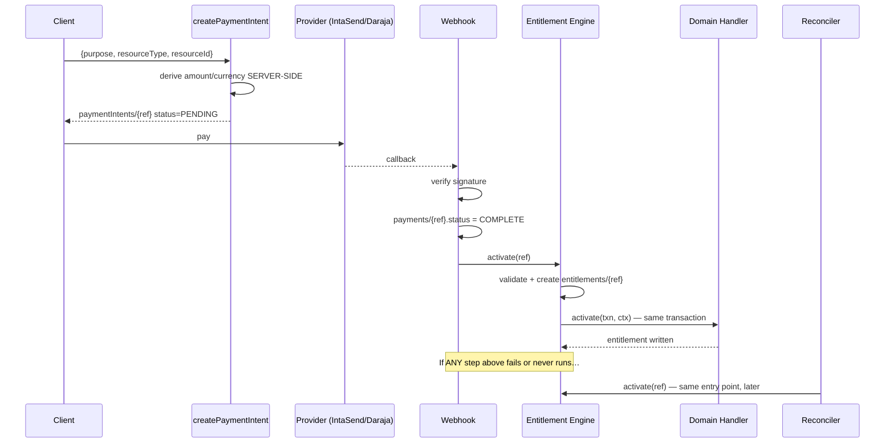

# Payment Architecture Unification

**Status:** DESIGN — awaiting Architecture Review Gate verdict
**Date:** 2026-07-21
**Supersedes:** per-domain payment handling in every monetized module
**Related:** [[Payments]] · [[Subscriptions]] · [[Marketplace]] · [[Events]] · [[Orders]] · [[SmartPOS]] · [[Platform Constitution]]

---

## 1. The failure class

Six audited domains lose paid entitlements, and they lose them for the *same* reason expressed six
different ways. The bug is not in any one module — it is that **every module owns its own payment
lifecycle**.

| Domain | How the entitlement is granted today | Failure |
|---|---|---|
| Digital / entertainment downloads | nothing writes `completed` | terminal `pending_payment` |
| Hub registration | `localStorage.setItem` | entitlement exists in one browser profile |
| Marketplace orders | `fetch()` from the buyer's tab | tab close ⇒ paid, no order |
| Bookings | `paymentStatus: paymentId ? 'paid' : …` | forgeable, and lost on crash |
| Event tickets | nothing flips `awaiting_payment` → `valid` | ticket unusable at the gate |
| Legal / healthcare | CF accepts no payment reference | fee recorded, payment discarded |

Three structural causes sit underneath:

1. **Activation is triggered by the client.** SokoniPay only fires `onSuccess` after the user clicks
   "Continue" (`sokoni-pay.js:336`). A manual click is not a durable event.
2. **There is no single record that means "this payment has been honoured."** Each domain infers it
   from its own document, so nothing can ask the platform-wide question *"which payments have not
   been honoured?"*
3. **Reconciliation is hardcoded to one purpose.** `reconcileSubscriptionEntitlements` filters
   `purpose == 'subscription'`, and `createPaymentIntent` only ever mints that purpose — so no other
   domain is sweepable *even in principle*.

Fixing six domains individually would leave cause (3) intact and guarantee a seventh.

---

## 2. The invariant

> **One payment reference ⇒ exactly one `entitlements/{paymentRef}` document.**
> Its existence *is* the definition of "honoured". Creating it and performing the domain's
> activation happen in **one Firestore transaction**.

Everything below follows mechanically from that single sentence:

- **Never activate twice** — the ledger document is create-only; a second attempt sees it and stops.
- **Never miss activation** — a sweep for COMPLETE payments lacking a ledger document is a
  *purpose-agnostic* query, so it works for domains that do not exist yet.
- **Never orphan a payment** — an orphan is now a first-class, queryable state rather than an
  invisible one.
- **Browser-independent** — the ledger is written server-side from the webhook or the reconciler.

The deterministic document ID is the whole trick. `.add()` with a random ID cannot express
"exactly once"; `doc(paymentRef).create()` can.

---

## 3. Canonical lifecycle


```mermaid
sequenceDiagram
    participant C as Client
    participant PI as createPaymentIntent
    participant P as Provider (IntaSend/Daraja)
    participant W as Webhook
    participant EE as Entitlement Engine
    participant D as Domain Handler
    participant R as Reconciler

    C->>PI: {purpose, resourceType, resourceId}
    PI->>PI: derive amount/currency SERVER-SIDE
    PI-->>C: paymentIntents/{ref} status=PENDING
    C->>P: pay
    P-->>W: callback
    W->>W: verify signature
    W->>W: payments/{ref}.status = COMPLETE
    W->>EE: activate(ref)
    EE->>EE: validate + create entitlements/{ref}
    EE->>D: activate(txn, ctx) — same transaction
    D-->>EE: entitlement written
    Note over W,EE: If ANY step above fails or never runs…
    R->>EE: activate(ref) — same entry point, later
```

The reconciler is not a parallel implementation. It calls **the same entry point** with the same
guarantees; it only differs in *when*. That is what makes recovery trustworthy — there is no second
code path to keep in sync.

---

## 4. Canonical `paymentIntents/{ref}`

Extends the existing collection (`functions/payment-intents.js`) — not a new one.

| Field | Notes |
|---|---|
| `purpose` | registry key — **the only routing input** |
| `resourceType` / `resourceId` | what is being bought (`event`, `evt_123`) |
| `ownerUid` | who receives the entitlement |
| `businessId` | nullable; drives business-ownership checks |
| `amount` / `currency` | **derived server-side from the catalogue, never client-sent** |
| `provider` | `intasend` \| `daraja` \| `wallet` |
| `status` | `PENDING` → `COMPLETE` \| `FAILED` \| `EXPIRED` |
| `createdAt` | drives the reconciliation window |

`createPaymentIntent` already derives price server-side and refuses client amounts — that property is
correct and is generalized, not replaced.

---

## 5. Purpose registry

A declarative map. **Adding a monetized feature must not require touching the engine or the
reconciler** — that is the design's acceptance test.

```js
// functions/payment-purposes.js
registerPurpose('event_ticket', {
  resourceType: 'event',
  handler:      require('./event-hub').entitlement,
  expires:      false,
  refundable:   true,
});
```

Initial registry: `subscription`, `marketplace_order`, `booking`, `event_ticket`,
`digital_download`, `entertainment_purchase`, `hub_registration`, `advertisement`,
`featured_listing`, `wallet_topup`, `course_purchase`, `consultation`, `ride_booking`.

An unregistered purpose is a **hard error that alerts** — never a silent skip. A silent skip is how
the current class of bug survives.

### 5a. Registry as built (2026-09-21)

The shipped registry diverges from the initial list above, and the divergence is the point: a
purpose is registered **only when a server-side price authority exists for it**. A purpose whose
pricer has nothing authoritative to read would either throw on every call (dead weight that reads as
coverage) or fall back to a client figure — which is the exact defect the registry exists to remove.

| Purpose | Price authority | Added |
|---|---|---|
| `digital_download` | `digitalProducts/{id}.price` | earlier |
| `event_ticket` | `events/{id}.ticketPrice` \| `ticketTiers[].price` | earlier |
| `service_booking` | `providerBookings/{id}.price + .fee` (immutable D3 snapshot) | earlier |
| `healthcare_subscription` | `healthcare-plans.js` table | earlier |
| `pos_till_sale` | `sokoni-qr-authority.priceTillSale` | earlier |
| `product_order` | catalogue via `validateOrderLines` + delivery-engine | earlier |
| `hub_registration` | hub tier catalogue | earlier |
| **`car_hub`** | **`rentalBookings/{id}.totalAmount`** (server snapshot from `rentalBook`) | **2026-09-21** |
| **`accommodation`** | **`venueBookings/{id}.pricing.total`** (snapshot taken under the slot-lock transaction) | **2026-09-21** |

**Deposit semantics differ between the two new purposes and are NOT inferred.**

- `rentalBookings.depositAmount` is a **refundable security deposit, additive** to the rental. It is
  **deliberately not charged**: the field is written by `rentalBook` and read by *nothing* — there is
  no collection, release or refund path anywhere in `functions/`. It is carried as
  `metadata.securityDepositUncollected` for whoever builds that lifecycle.
- `venueBookings.pricing.deposit` is a **portion of the total** (`total × depositPercent`,
  `venue-booking.js:203`), so the full total is charged and the deposit is reported as metadata only.

Two fields with the same name and opposite meanings is how a customer gets double-charged. Each
pricer states which it has; neither guesses.

### 5b. Purposes deliberately NOT registered

| Candidate | Why not |
|---|---|
| `talent_booking` (DJ / MC / performer) | **Already covered by `service_booking`.** `DJ` and `MC` are provider subcategories under *Creative & Media* (`provider-onboarding.js:131`), and `Sound Engineer` / `Lighting Technician` under *Events*. A performer booking is a `providerBookings` document. A second purpose over the same resource type would fork the authority — two pricers, one resource, guaranteed drift. The work for `entertainment.html` is to route onto `service_booking`, not to register a new purpose. |
| `property` | **No payable server resource exists.** `propertyListings.price` is the value of the property itself, not a platform-collected amount. `scheduleViewing` charges nothing. Landlord rent collection (`landlord.html:1659`) runs on a browser IntaSend key against `localStorage` state with no Firestore price authority at all. A pricer here would have to invent its source. Blocked until a rent/deposit resource is created server-side. |

`sokoni-bnb.js` writes its own client-side `bnbBookings` and is **not** served by `accommodation`.
That path must be rewired onto `venueCreateBooking` before it can be paid for.

**Test:** `scripts/test-payment-purposes-verticals.js` — 42 assertions, each refusal paired with a
legitimate path that must succeed, and each absence paired with an inverting control.

---

## 5c. Hosted checkout and method capability (2026-09-21)

Multi-method collection — card, Google Pay, Apple Pay, PesaLink — is **not** an extension of the
STK rail. STK is M-PESA-only by construction (`shared/stk-gateway.js` hard-codes
`method: 'M-PESA'`). Everything else requires IntaSend's **hosted checkout**, which also happens to
be the only way a customer can enter card details somewhere a SOKONI cashier cannot see them.

### The client: `functions/shared/intasend-checkout.js`

One implementation, same shape as `shared/stk-gateway.js`: takes no reservation, writes no
document, treats a non-answer as a throw rather than a refusal, and never logs a key. It shares
`classifyOutcome` semantics with the STK rail *exactly* — a test asserts the two agree on every
status code, because two rails disagreeing about what "accepted" means is the defect the shared
module exists to prevent.

**Omitting `method` is the feature.** When no method is named, IntaSend presents whatever the
account has enabled. Hard-coding a list here would put SOKONI back in the business of asserting
capability it cannot see — which is the same failure as the ten checkout tiles.

### Why the vendored SDK could not be used

`intasend-node` does target `/api/v1/checkout/` (`dist/collection.js:22`), and
`payment-orchestrator.js:262` calls it. **That call cannot ever have worked:**

```js
new IntaSend('', INTASEND_SK.value(), …)   // publishable = '', secret = PRIVATE
sdk.collection().charge({…})               // charge() then sets secret_key = ''
```

`charge()` blanks the secret key because checkout is the **public-key** flow, and the orchestrator
passes `''` as the publishable key — so the request carries no `Authorization`, no
`INTASEND_PUBLIC_API_KEY` and no `public_key`. Unauthenticated, every time. `charge()` also mutates
`secret_key` on the instance, de-authenticating any later call on the same client.

> This corrects the Phase 1 audit, which reported that no `POST /api/v1/checkout/` call existed
> anywhere. A call exists; it is unauthenticated and in an orphaned core. The conclusion —
> **SOKONI has no working server-side checkout** — is unchanged.

### The auth contract is ASSERTED, not proven

Public-key header + `public_key` in the body, no `Authorization`. That is what the vendored client
does and it is the only in-repo evidence. **No SOKONI code has ever successfully created a checkout
session.** Until `scripts/probe-intasend-capability.js` runs against production, treat it as
unverified. The module accepts `privateKey` purely so it can be visibly withheld.

### The probe: `scripts/probe-intasend-capability.js`

IntaSend exposes no "list my enabled methods" endpoint, so capability can only be learned by
**asking for a session per method**. That creates real (unpaid, unopened) invoices, so the probe:

* runs against **sandbox** unless `--live`;
* requires `--live --i-understand-this-creates-invoices` together;
* refuses a live key without `--live`, and `--live` without a live key;
* never self-runs from a hook, suite or deploy step, and writes nothing to Firestore.

It reports three verdicts per method. **`UNKNOWN` is not `unavailable`** — it means no answer, a
5xx, or a malformed body, and must never dim a tile. Only `ENABLED` may light one.

**Not yet run.** Doing so is an outward-facing action against the production account and is the
owner's to authorize.

### Fabricated checkout URLs

Two code paths returned `https://payment.intasend.com/pay/checkout/?ref=<our own ref>` — a URL
built from a SOKONI identifier, pointing at no IntaSend invoice, capable of collecting nothing.

| Path | State |
|---|---|
| `payment-orchestrator.js:291` CARD branch | **fixed** — throws `unimplemented` rather than returning a dead link, after having already moved the payment to PENDING and incremented its attempt counter |
| `pos-qr.js:481` CARD branch | **fix written, NOT applied** — see §5d |

### Card at marketplace checkout

`card` joined `UNINTEGRATED_PAYMENTS` in `checkout.html`. It was not merely unverified; it was the
worst of the ten tiles because it *looked* like it worked:

* `IPayInstance.charge({ amount: orderTotal })` named the amount **from the browser** — no
  `paymentIntent`, the exact opposite of the M-Pesa path beside it;
* it carried **no `api_ref`**, so `webhookIntasend` could never key a card charge to an order even
  in principle — the money was unreconcilable by construction;
* its `COMPLETE` handler called `saveAndRedirect(…, paymentVerified = true)`, marking the order
  **PAID** on an event raised in the customer's own browser.

The handler now passes `false` as a second lock, so premature re-enablement yields an order awaiting
confirmation — recoverable — rather than a free order.

Re-enabling requires all three of: probe proves card is enabled · session created server-side
through `intasend-checkout.js` carrying our `api_ref` · confirmation via `webhookIntasend`.

**Test:** `scripts/test-intasend-checkout.js` — 50 assertions, including that the private key
appears in neither headers nor body, with a positive control proving the request was not simply
empty.

---

## 5d. Blocked: `pos-qr.js` card branch

The same fabricated-URL fix is written and tested for `pos-qr.js:481`, and **deliberately not
applied**. Applying it breaks two assertions in two **closed** certifications:

| Gate | Assertion |
|---|---|
| `certify-p3a-pos-qr-association.js` · `G7-posqr` | `pos-qr.js` byte-identical — P1's `completePOSQRPayment` remains the ONLY authority for paid |
| `certify-intasend-webhook-retirement.js` · `F6-pos-qr.js` | `pos-qr.js` byte-identical — P1/P2/P3/P3-A untouched |

These are byte-identity gates over a file whose rail is certified closed. **Any** legitimate change
to it trips them, and re-baselining a closed certification is a governance act, not a code change.

Exposure while it stands: `method` arrives from `request.data`, so an authenticated till caller can
request `card` and receive a link that collects nothing. It cannot create a false payment —
`completePOSQRPayment` remains the only writer of `paid` — so this is a dead-end, not a leak.

**Owner decision required:** re-baseline both certifications and apply, or leave the branch until the
POS card rail is built properly.

---

## 5e. POS multi-tender (2026-09-21)

One sale, N tenders — cash + M-PESA + card + anything else the account has enabled, together.

### `sokoni-pos-tender.js` — the allocation model

Pure: no DOM, no network, no clock, no Firestore, asserted by test. Integer cents throughout,
converted once in `fromShillings`. It replaces nothing — pos.js's two-way split still works — but
it is the model everything new builds on, because the existing split is implemented by
**monkey-patching `payment.complete` and `mpesa.sendSTK` at runtime** (pos.js:4176-4200), which
cannot express a third tender and leaks a patched function if anything throws mid-flight.

Three tender kinds, and the distinction is load-bearing:

| Kind | Settled by | May overpay? | Example |
|---|---|---|---|
| `CASH` | the cashier taking notes | **yes** — it is the only source of change | Cash |
| `EXTERNAL` | `webhookIntasend`, never the till | no | M-PESA STK, Card, Google Pay |
| `RECORDED` | already moved outside SOKONI; we write it down | no | merchant's own M-PESA Till code |

**Only cash gives change.** No external rail can hand notes back, so none may exceed the balance.
**The till never decides a sale is paid** — external tenders land in `awaitingConfirmation`.

### Capability gating

`methodsFor(capability)` returns cash + M-PESA Till *always*, and adds external methods only for
codes the server reports as `ENABLED`. Absent, unknown or unreachable capability ⇒ the till still
sells for cash and Till code and says why the grid is short. **UNKNOWN is not AVAILABLE** — the
same rule the probe (§5c) reports under. An unrecognised code is skipped, never rendered raw.

### `sokoni-pos-pay-console.js` — the surface

Additive: every existing POS method button survives untouched, reached from one new Multi-Pay tile.
Tapping a method auto-fills the remaining balance onto it; allocation is SET not ADD, so a numpad
firing per keystroke cannot stack tenders.

**No PAN, expiry or CVV field exists in the console and none will be added.** Card is collected on
the customer's device via IntaSend's hosted page, reached by phone link, QR, or handing over a
customer-facing screen.

### Open seam

`SPos.payment.completeMultiTender` is **not written**. The console refuses with "Payment handler
not wired — nothing was charged" rather than pretending. Wiring it touches the live sale path and
needs a server-side multi-tender sale record; that is the next slice and wants its own
certification.

**Test:** `scripts/test-pos-tender.js` — 76 assertions, both rules tested in both directions, with
inverting controls on every absence.

---

## 5f. The universal till line — `pos_service_sale` (2026-09-21)

A till should not care whether it is selling a phone charger, ten printed pages, a haircut, a car
wash or a government application. To the payment rail they are identical: a merchant's authorized
operator charging their own customer for a basket of priced lines. One purpose covers all of it,
and it reaches `createPaymentIntent → IntaSend → webhookIntasend` exactly like every other.

### No new collection

**A service is a `posProducts` row with `trackStock: false`**, a `unit` ("page", "document",
"session") and optionally `variablePrice: true`. pos.js already understands that shape — it
excludes such rows from low-stock alerts (`pos.js:3104`). A `posServices` collection would fork the
catalogue and force search, reports, receipts and marketplace sync to learn about a second one.

### Three price sources, never conflated

This is the integrity property of the whole feature. Every line records where its figure came from:

| Source | Who set the price | Bounded by | Attributed |
|---|---|---|---|
| `catalogue` | the server, from `posProducts.price` | catalogue | no — the cashier chose an item, not an amount |
| `variable` | the cashier, on an item the merchant marked counter-priced | quick-charge ceiling | yes, to the cashier uid |
| `quick_charge` | the cashier, no catalogue item at all | quick-charge ceiling | yes, to the cashier uid |

A reconciliation that cannot tell a catalogue price from a keyed-in one cannot answer *"did the
cashier overcharge?"* — which is the question a till exists to make answerable.

### Why a cashier may name a price here, and nowhere else

Everywhere else on this rail the server derives the amount and the client is refused, because there
the client is the **buyer** — a buyer naming their own price is the B1 defect. Here the client is
the **merchant's own authorized operator**. That is the same trust boundary `priceTillSale` already
enforces (`sokoni-qr-authority.js:240`), not a new one.

It is still bounded, attributed and labelled:

* **Bounded** by `posSettings/{merchantId}.quickChargeMaxCents`, read from the *merchant's* config
  so a cashier cannot raise their own ceiling. Absent ⇒ a hard default of KES 20,000, never
  "unlimited" — the safe reading of a missing limit is the strict one. The ceiling applies to the
  **line**, so quantity cannot be used to walk past it.
* **Disableable** entirely per merchant, without affecting catalogue lines.
* **A fixed catalogue price is IGNORED when the request tries to override it** — not validated
  against, ignored. A fixed price that a request can override is not a fixed price.

### Arithmetic is pure

`functions/shared/pos-service-pricing.js` has no Firestore, no clock, no network — same discipline
as `money-authority.js`. The purpose entry does the catalogue lookup and error translation and
computes nothing, exactly as `pos_till_sale` delegates to `sokoni-qr-authority`.

### A defect the suite caught in its own change

The first draft used `Number(line.qty) || 1`, which collapses **absent** and **explicit zero** — a
line the cashier had zeroed out charged for one of it. Absent now defaults to 1; an explicit 0 is
refused.

**Test:** `scripts/test-pos-service-pricing.js` — 67 assertions, every refusal paired with an
inverting control.

### The catalogue that feeds it — `catalogue.html` (2026-09-21)

`pos_service_sale` prices rows from `posProducts`. Until now nothing could create a service row,
because **`trackStock` had no writer anywhere in the repository** — it is read by `pos.js:3104`
and by the pricer, and written by nothing. Every existing row has it absent, which both readers
already treat as PRODUCT (`trackStock !== false`), so no existing row changes meaning; the editor
writes it explicitly on both kinds and that is what makes services real.

A separate field, plain `track` (`pos-inventory-sync.js:109`, `pos.js:750`), is written and read
by nothing in a product context. **Deliberately left alone** — reconciling the two is an
inventory-semantics change, not a catalogue change.

`sokoni-catalogue-model.js` is pure and holds the rules: classification, scope-gated creation,
merge-preserving edits, and the display contract that **absent stock is UNMETERED, not zero**
(rendering `0` would read as out-of-stock and stop a legitimate sale). The page is standalone
rather than part of merchant-v2, which is currently owned by five other worktrees.

The KES 20,000 quick-charge ceiling is **not** duplicated in the frontend — the page states that
the server enforces a limit without naming a number it has no authority over.

**Test:** `scripts/test-catalogue-model.js` — 81 assertions.

### Entitlement is separate from identity — `sokoni-merchant-nav.js` (2026-09-21)

The hierarchy, and the one boundary that must not blur:

```
ADMIN APPROVAL → BUSINESS SCOPE → SUBSCRIPTION → FEATURES → CATALOGUE / POS → PAYMENT → LEDGER
   (identity, not purchasable)      (per side, independent)
```

`merchantSubscriptions/{uid}` and `providerSubscriptions/{uid}` are separate documents under one
account (`subscription-core.js:107,130`), resolved per role. A dual business has **two
independently managed subscriptions**, not a "dual plan".

| Rule | Consequence |
|---|---|
| A subscription **never** creates a workspace | Paying for a seller plan with no seller approval shows nothing, and the reason invites applying, not paying |
| An approval **without** a subscription still shows its workspace, restricted | The data is theirs; a lapsed card does not make a catalogue vanish |
| Account-level sections never lock | Billing especially — locking the page where a lapse is fixed is a trap |
| The two sides are independent | Cancelling seller leaves the services side byte-identical; the business stays DUAL, just not dual-ACTIVE |
| The Till opens while **either** side is usable | A cyber café whose provider plan lapsed can still sell a flash disk |

`catalogue.html` gates creation on **scope AND entitlement** via `creatableKinds(nav)`; reading
stays open either way.

Built as a standalone embeddable module rather than inside `merchant-v2.html`, which is currently
owned by five other worktrees.

**Test:** `scripts/test-merchant-nav.js` — 71 assertions, both boundary properties tested with
inverting controls.

---

## 5g. Dual businesses — products AND services (2026-09-21)

A cyber café sells airtime and prints documents. A salon sells product and cuts hair. A garage
sells parts and fits them. Treating *seller* and *provider* as mutually exclusive forces those
businesses into two accounts, two catalogues and two sets of books — and SOKONI then cannot report
what **one** business earned, which is exactly what a tax return asks.

### It was already storable. Nothing read it.

Approval writes `sellers/{uid}` for a seller and `providers/{uid}` for a provider — two
collections, both keyed by the **same uid**. An account holding both documents has always been a
dual business in storage. The gap was never the schema; no code asked the combined question.

### `functions/shared/business-scope.js`

Pure. Given the two registry documents it returns `{ sellsProducts, providesServices, isDual,
isTrading, scopes[], reasons{} }`.

| Rule | Why |
|---|---|
| Scope comes **only** from the registry docs approval wrote | `businessType`, `category`, `hub`, `isProvider`, `role` are self-claimable labels. A scope derived from them is a scope anyone can grant themselves. Tested: a record claiming `businessType:'provider'` gets **no** service scope. |
| Subscriptions are **not** consulted | `capability-authority.js` states it: a capability says what a plan permits, never who someone is. Scope is identity, and identity is not purchasable. |
| Unknown status is **not** active | A status the module cannot interpret is when to refuse, not when to assume goodwill. It is reported *as itself* (`unknown_status:quantum`) rather than bucketed as "suspended", which would hide a drifted intake vocabulary. |
| Suspension revokes **per scope** | A suspended shop with a live provider record keeps selling services and stops selling products. |
| `reasons` explains **why** | `not_applied` vs `pending_review` vs `suspended` vs `rejected` is the entire content of a support conversation, and a boolean cannot carry it. |

### Why `resolveRole` was not changed

`application-lifecycle.js:194` returns **one** role (`{role, by}`) and every downstream reader
expects a scalar. Widening it would ripple through the whole approval path — and that file is
under a standing deployment blocker for its release-only `setCustomUserClaims` call. **Changing
blocked code to add a feature is how a blocker becomes permanent.** Nothing here touches role
resolution; it reads what approval already writes.

### Not a third merchant guard

Two guards already claim to be canonical (`merchant-authority.js` and
`business-bootstrap._assertMerchantAccess`). `canUseMerchantWorkspace()` answers *"what may this
business trade"* and explicitly **not** *"is this request allowed"* — callers still pass through
the existing guard. A third access guard would be worse than either.

### Enforced at the till

`pos_service_sale` now resolves scope before pricing and passes it to the pricer, which checks
every line: `trackStock !== false` ⇒ product, `trackStock === false` ⇒ service. A services-only
provider cannot start selling stock by posting a product row. Registry read failures **fail
closed** to "not trading".

A **quick charge is neither kind** — a delivery fee, a callout, a government application. It
requires only that the business be trading at all, so a products-only shop can still bill delivery
while a suspended account cannot bill through the free-text field.

The scope in force is stamped on the intent (`metadata.businessScope`), because a later suspension
must not rewrite the history of a sale that was legitimate when it happened.

**Test:** `scripts/test-business-scope.js` — 47 assertions, plus 12 in the pricer suite covering
enforcement and an agreement check between the pricer's inlined predicate and the real module.

### The intake — `business-apply.html` (2026-09-21)

Products · Services · **Both**. The same page is the upgrade path: when one side is already
approved it relabels to *Add to your business*, and an approved or in-review side is disabled
rather than offered (the primitive would refuse it server-side anyway).

**A dual business is TWO applications, not one with a `scopes[]` array.** They are decided
separately and suspended separately — a cyber café whose seller approval is withdrawn must keep
providing services. One document carrying both scopes cannot express a half-suspension without
inventing a per-scope status inside it, which is two documents wearing a trench coat.

`sokoni-provider-application.js` files `applications/{uid}--provider` and **reuses** the merchant
module's `FORBIDDEN` list, `decideAction` and `canonStatus`. Two copies of a security filter is one
that gets updated and one that does not; a test asserts neither is re-declared locally.

Partial submission is never reported as success — "Both" files two applications, and if one is
refused the page says which. A dual applicant told "success" would wait for a review nobody
requested.

| Verified before relying on it | Result |
|---|---|
| Does `providerPublish` let a provider self-approve? | **No.** It writes content only; `status`, `searchable`, `isPublic`, `acceptsBookings` come from `projectProvider()` on admin approval and nothing else (`provider-onboarding.js:395`). The §5g scope model holds. |

**Test:** `scripts/test-provider-application.js` — 46 assertions.

---

## 6. Domain contract

Every monetized module exposes exactly four functions and **no payment verification of its own**:

```js
module.exports.entitlement = {
  // Domain-specific preconditions only. Payment validity is NOT the domain's job.
  validate(ctx),            // → { ok: true } | throws HttpsError
  activate(txn, ctx),       // MUST use the passed txn. MUST be idempotent.
  revoke(txn, ctx, reason), // refund / chargeback / expiry
  status(ctx),              // → { active, expiresAt, detail }
};
```

`ctx` is `{ paymentRef, intent, payment, ownerUid, businessId, amount, currency, resourceId }`.

Two rules make this safe:

- `activate` **must** use the supplied transaction. A handler that writes outside it breaks
  exactly-once and is a review-blocking defect.
- `activate` receives an already-validated payment. Domains never re-derive payment truth, which is
  precisely the mistake `booking.js:465` makes today by trusting a client string.

---

## 7. Entitlement Engine

```js
async function activateEntitlement(paymentRef, { source }) {
  const intent  = await load('paymentIntents', paymentRef);   // must exist
  const payment = await load('payments', paymentRef);         // must exist
  const spec    = PURPOSE_REGISTRY[intent.purpose];           // unregistered ⇒ throw + alert

  assertPaymentHonourable(intent, payment);   // §8 — all checks, server-side only

  return db.runTransaction(async (txn) => {
    const ledgerRef = db.collection('entitlements').doc(paymentRef);
    if ((await txn.get(ledgerRef)).exists) return { alreadyActive: true };   // exactly-once

    await spec.handler.validate({ txn, ...ctx });
    const result = await spec.handler.activate(txn, ctx);

    txn.create(ledgerRef, {
      paymentRef, purpose: intent.purpose,
      resourceType: intent.resourceType, resourceId: intent.resourceId,
      ownerUid: intent.ownerUid, businessId: intent.businessId ?? null,
      amount: intent.amount, currency: intent.currency,
      status: 'ACTIVE', activatedAt: FieldValue.serverTimestamp(),
      source,                       // 'webhook' | 'reconciler' | 'admin'
    });
    return { activated: true, result };
  });
}
```

Read-then-create inside the transaction is what survives a retry storm: two concurrent callers
contend on `entitlements/{paymentRef}`, one commits, the other re-reads and returns `alreadyActive`.

**Provenance (`source`) lives on the ledger, never on the domain's own document** — a reconciler-
activated ticket must be indistinguishable from a webhook-activated one, or downstream code starts
branching on how it was created.

---

## 8. Security — every check, one place

`assertPaymentHonourable` centralizes what is currently scattered or missing:

| Check | Failure it prevents |
|---|---|
| intent + payment exist | fabricated reference |
| `payment.status` is a **terminal success** | activating a PENDING payment |
| `payment.uid === intent.ownerUid` | activating another user's payment |
| business ownership, when `businessId` set | cross-tenant grant |
| `payment.amount >= intent.amount` | underpayment |
| `payment.currency === intent.currency` | currency substitution |
| purpose registered, `resourceId` present | routing to the wrong domain |
| not `REFUNDED` / `REVERSED` | entitlement surviving a refund |
| intent not `EXPIRED` | stale intent replay |
| ledger absent | double activation |

**All inputs are server-side.** The client supplies `{purpose, resourceType, resourceId}` at intent
creation and *nothing* thereafter. This directly closes `booking.js:465`, where an authenticated
caller can pass any string and mint a `paid` booking — an authorization hole, not merely a
reliability gap.

---

## 9. Universal Reconciliation Engine

Generalizes the committed `reconcileSubscriptionEntitlements` (commit `5fdcc51`) by deleting its one
hardcoded filter:

```js
.where('status', '==', 'COMPLETE')                 // was: purpose == 'subscription'
.where('createdAt', '>=', floor).where('createdAt', '<=', ceiling)
```

For each intent whose `entitlements/{ref}` is absent → call `activateEntitlement(ref, {source:'reconciler'})`.

- **Grace 2 min / lookback 24 h**, every 10 min.
- **Alert-only by default**, auto-heal behind `_systemConfig/reconciliation.autoHeal`, flag read
  **fails closed**. Staged rollout: deploy → trust the alerts → enable healing.
- Requires index `paymentIntents(status ASC, createdAt ASC)`.
- Purpose-agnostic **by construction**: it never names a domain, so a future purpose is swept the
  day it is registered.

Orders, tickets, downloads and bookings are all repaired by this one engine, because each is just
its purpose's `activate()`.

---

## 10. Failure simulation — convergence

| Scenario | Convergence |
|---|---|
| Webhook never arrives | reconciler activates ≤ 12 min |
| Webhook rejected (signature) | payment stays non-terminal ⇒ **correctly** not activated; alert raised |
| Duplicate webhook | second sees ledger ⇒ `alreadyActive` |
| Late webhook | reconciler already activated ⇒ `alreadyActive` |
| Browser closed / network drop | irrelevant — activation is server-side |
| Payment COMPLETE before intent | no intent ⇒ orphan alert (never a silent skip) |
| Transaction conflict | Firestore retries; ledger read decides |
| Retry storm | all but one return `alreadyActive` |
| Duplicate purchase | two intents, two refs, two entitlements — **correct**; dedupe is a domain `validate()` concern |
| Refund / chargeback | `revoke()`; ledger → `REVOKED` |
| Expiry | `status()` recomputes from dates |
| Delayed scheduler | window is 24 h, not 10 min — a late run loses nothing |

Every row lands on exactly one of: **ACTIVE**, **not-activated-with-alert**, or **REVOKED**.

---

## 11. Migration matrix

Each domain implements four functions; none implements payment verification.

| Phase | Domain | Breaking? | Effort | Notes |
|---|---|---|---|---|
| **1** | Engine + registry + reconciler + `entitlements` | no | M | Additive. Nothing consumes it yet. |
| **1** | `subscription` | no | S | Re-point the committed backstop at the generic engine |
| **2** | `event_ticket` | no | S | First real repair: `awaiting_payment` → `valid` |
| **2** | `digital_download`, `entertainment_purchase` | no | S | Writes the `completed` nothing writes today |
| **3** | `marketplace_order` | **yes** | L | Order creation moves out of the buyer's tab. Highest risk, highest value. Dual-run with the existing path before cutover. |
| **3** | `booking` | **yes** | M | Removes client `paymentId`. **Security fix — do not defer.** |
| **4** | `hub_registration` | **yes** | M | Replaces `localStorage` entitlement |
| **4** | `consultation` (legal/health) | yes | M | CF must accept an intent ref |
| **5** | `featured_listing`, `advertisement` | yes | M | Also fixes `.add()` duplicate listings |
| **5** | `wallet_topup` | no | S | Already correct — adopt for uniformity, not repair |

Ordering rationale: phases 1–2 are **purely additive** and repair two CRITICALs with no breaking
change. Phase 3 carries the real risk and gets a dual-run. Bookings is scheduled early *despite*
being breaking, because it is an authorization hole.

---

## 12. Observability

Derived from `entitlements` + `paymentIntents` — no new instrumentation:

`pending` · `awaiting activation` (COMPLETE, no ledger — **the headline number, should trend to 0**)
· `activated` · `recovered by reconciler` · `duplicates blocked` · `failed` · `refunds` ·
`chargebacks` · `mean activation latency` · `reconciliation success rate` ·
**entitlement health score** = `activated / (activated + awaiting)`.

Every failure carries a correlation ID, a structured Cloud Logging line, an audit record and a P1
`adminAlert`, reusing the logger already in `payment-reconciliation.js`.

---

## 13. Deployment, rollback, regression

**Deploy order (per phase):** indexes → functions → rules → client. Never re-deploy while a deploy
is running.

**Rollback:** phases 1–2 revert cleanly (additive; the engine is inert with an empty registry).
Phase 3+ is guarded by dual-run — disable the new path, the legacy path is still live. Auto-heal
reverts by setting one flag false. `entitlements` documents are never deleted on rollback; they are
the audit trail.

**Regression surface.** Untouched: POS, search, notifications, admin, analytics, offline mode,
realtime sync, IndexedDB, rules. Touched: subscriptions (phase 1, re-point only), then each migrated
domain. The `entitlements` collection is new, so nothing reads it until something is written.

**Standing risk:** phase 3 changes where marketplace orders are created. That is the single most
load-bearing path on the platform and must not ship without a dual-run and a real end-to-end
purchase.

---

## 14. Readiness

| | Score | Basis |
|---|---|---|
| Payments → entitlement | **3 / 10** | 4 CRITICAL + 2 HIGH open; money can be taken without entitlement |
| Payment *collection* | 8 / 10 | provider integration and server-side pricing are sound |
| Reconciliation coverage | 2 / 10 | subscription-only, and undeployed |
| Post-unification (projected) | 9 / 10 | pending runtime proof, not design approval |

**Not production ready for payments.**

## 15. Certification roadmap

1. Architecture Review Gate verdict on this document — **APPROVE / REVISE / REJECT**
2. Phase 1 merged, deployed, alert-only; `awaiting activation` observed for 48 h
3. Phases 2 → 5, each proven by a real purchase before the next begins
4. All twelve simulations in §10 executed against production
5. `awaiting activation` sustained at 0 with the reconciler in auto-heal
6. Certification — **only** on runtime evidence. Engineering Complete ≠ Production Complete.
