# Phase 4 — FAANG-Level Architecture Audit

> ⚠️ **CORRECTED 2026-07-12:** the "200 composite index hard limit" stated below is **FALSE**. The live quota API (`serviceusage`) reports **1000** composite indexes per database; production holds **284**, all READY. Never hardcode this limit — read it live. See [[FIRESTORE-INDEX-ARCHITECTURE]].

**Reviewer role:** Principal Software Architect (distributed systems & platform engineering)
**Date:** 2026-07-08
**Scope:** Entire SOKONI platform (web PWA, ~1,800 Cloud Functions, Firestore ×2, Redis, CI/CD)
**Method:** Evidence-based code audit (five parallel domain investigations, file:line grounded)
**Verdict:** **C+ — feature-complete with excellent security primitives and CI/CD maturity, but not yet internet-scale.** Three classes of problem block "millions of users": (1) **topology** (single-region function sprawl on a hard quota ceiling), (2) an **inert distributed layer** (Redis provisioned but unreachable, so locks/rate-limiting/queues silently no-op or fail-open), and (3) a **handful of correctness/data-hotspot defects** (Daraja double-credit race, `Date.now()` order IDs, global single-doc counters). All are addressable without a rewrite — see the [roadmap](#8-phased-roadmap).

Related: [[DEPLOY_QUEUE]] · [[SECURITY_CERTIFICATION]] · [[LAUNCH_CERTIFICATION]] · [[REDIS_ARCHITECTURE]]

---

## 1. Executive scorecard

| # | Dimension | Grade | Headline finding |
|---|-----------|:----:|------------------|
| A | Performance Engineering | **C−** | No bundler: 6.3 MB unminified JS across 237 files; home page loads 53 `<script>` tags; render-blocking `security.js`; LCP hero unpreloaded |
| B | Distributed Systems | **C** | Redis layer entirely inert (missing VPC connector) → locks/queues/presence no-op; no Pub/Sub or Cloud Tasks; single region |
| C | Concurrency & Parallelism | **B−** | IntaSend + wallet paths exemplary (deterministic idempotency + transactions); **Daraja callback has a double-credit race**; Redis locks fail-open |
| D | Communication Architecture | **C+** | 1,551 `onCall` monoculture; no SSE/WebSocket/gRPC strategy; event bus present but **non-delivering + mis-keyed** |
| E | Infrastructure | **C+** | Cloudflare CDN/WAF + strong CSP/headers, but **single region + single GCP project** for all stages |
| F | Architecture (boundaries) | **C** | Monolithic single functions codebase; **1,785 exports** ship as one deploy; 3 parallel search stacks |
| G | Data Engineering | **C** | **200/200 composite indexes (hard limit)**; global single-doc write hotspots; monotonic order IDs |
| H | Security | **B−** | Strong RBAC/storage/idempotency, but **App Check on only 27% of callables (not on payments)**, raw-`innerHTML` XSS surface, rider-GPS read `if true` |
| I | Reliability | **C** | Health-gated canary + auto-rollback (good), but **rate limiting disabled platform-wide** (Redis down), at-most-once Redis queue, dead event bus |
| J | AI (KASS) | **B** | Tool-calling + Firestore tools already live; grounded; lacks RAG/vector retrieval + durable memory |
| K | DevOps & CI/CD | **B−** | Mature GitHub Actions (ci/deploy/canary/backup), but **no env isolation**, legacy `FIREBASE_TOKEN`, rules coupled to code deploy |

**Overall: C+.** The platform is far more mature than a typical startup (real CI/CD, canary rollout, RBAC via custom claims, deterministic payment idempotency, strong storage rules). What separates it from "FAANG-scale" is **operational topology and a small set of correctness bugs**, not a lack of features.

---

## 2. Strengths (do not regress)

Recorded so the roadmap doesn't accidentally undo good work:

- **Payments — IntaSend path is textbook.** `verifyIntasendPayment` uses the invoice ref as a deterministic idempotency doc `paymentVerifications/{ref}` with the existence-check + order-write + session-consume inside one `runTransaction` (`functions/index.js:2280-2339`). Concurrent retries cannot double-create.
- **Security primitives.** Custom-claim RBAC (`request.auth.token.admin/superAdmin`, not spoofable Firestore fields — `firestore.rules:5-19`); write guards (`noAdminFields()`, `noPrivilegeEscalation()`); financial collections are `write: if false` (server-only); webhook HMAC-SHA256 + `crypto.timingSafeEqual` + replay guard (`functions/index.js:4808-4829`).
- **Storage rules are excellent** — MIME allowlists, size caps, `notExecutable()` (blocks SVG/scripts/archives), owner-scoped, default-deny (`storage.rules`).
- **CI/CD is real and health-gated** — `.github/workflows/`: ESLint + blocking secret scan + `npm audit --audit-level=high` + index-count guard + 17 Jest suites + Playwright E2E (`ci.yml`); staging→smoke→**manual-approval prod** + rollback job (`deploy.yml`); **health-gated progressive canary with auto-rollback** (`canary-deploy.yml`); nightly Firestore/Storage/Typesense backup (`backup.yml`).
- **Init hygiene** — `firebase-admin` guarded with `getApps().length` (61 files); Firestore clients module-scoped and reused (212 sites); Redis reads fallback-safe.
- **Frontend hygiene where present** — Firebase modular v10 dynamic import (not heavy compat), 7 preconnect + 3 dns-prefetch hints, non-blocking CSS via `media="print" onload`.
- **Backups** — PITR checks + scheduled GCS export to `gs://sokoni-aeb26-backups`.

---

## 3. Prioritized critical-issue register

Ranked by **blast radius at scale**. P0 = correctness/security/availability threat; P1 = scalability/reliability; P2 = debt/polish.

### P0 — fix first

| ID | Issue | Evidence | Impact at millions of users |
|----|-------|----------|-----------------------------|
| **P0-1** | **Daraja STK callback double-credit race.** Dedup is a non-transactional read-check-write; `sellerPayments.add()` uses an auto-ID. Two Safaricom retries can both pass `status==='pending'` and create duplicate seller credits. | `functions/index.js:2884-2956` (fix pattern exists at `:2280-2339`) | Direct financial loss / reconciliation nightmares |
| **P0-2** | **Order IDs are `SKN`+`Date.now().slice(-8)`** → (a) monotonic key hotspots one tablet, (b) ms-collision **silently overwrites orders** (lost order = lost money). | `functions/index.js:2284` | Data loss + write hotspot above ~hundreds of orders/sec |
| **P0-3** | **Global single-doc write hotspots.** `funnelStats/{today}`, Typesense `daily_{date}`, `impactEnvironmental/totals` are `FieldValue.increment` on ONE doc, hit on every session action. Firestore caps ~1 sustained write/s/doc. | `conversion-analytics.js:47`, `typesense-analytics.js:153`, `impact.js:956` | Guaranteed contention failures under load |
| **P0-4** | **Single-region function sprawl on a hard quota ceiling.** ~1,800 Gen2 services 100% in `us-central1`; Cloud Run CPU allocation is **per-region** → zero headroom, blocks all new-function deploys. | `firebase.json:2-10`; 330+ `region:'us-central1'`; [[DEPLOY_QUEUE]] (187 CFs blocked) | New capability delivery is blocked today; no regional failover |
| **P0-5** | **Rate limiting disabled platform-wide.** Redis is unreachable (no VPC connector) and `checkRateLimit` **fails open** — brute-force/OTP/payment-abuse protection is silently off (violates the project's own standing security rule). | `redis-rate-limiter.js:18-19`, `redis-service.js:423-433`; `redis-layer.js:24-32` (hard-coded missing `vpcConnector`) | Credential stuffing / OTP abuse / payment hammering |
| **P0-6** | **App Check not enforced on the payment endpoint.** `enforceAppCheck` on only **413/1,551** callables; **absent on `initiateSTKPush`**. | `functions/index.js:4713` | Automated payment-endpoint abuse from unregistered clients |
| **P0-7** | **Rider real-time GPS is world-readable.** `deliveryLocations/{riderId}` `allow read: if true`; `driverLocations` readable by any signed-in user. | `firestore.rules:1196, 203, 1027` | Privacy breach; stalking/safety risk for drivers |

### P1 — scale & reliability foundations

| ID | Issue | Evidence |
|----|-------|----------|
| **P1-1** | **Redis layer entirely inert** (VPC connector `sokoni-redis-connector` doesn't exist). Locks, presence, POS real-time sync, Redis event streams, Redis queue all no-op; several **fail-open**. | `redis-service.js:124-153,345,560`, `redis-integrations.js:37-38` |
| **P1-2** | **Event bus never delivers + route-key mismatch.** `onPlatformEventCreated` only records intent; emitted `order.order.created` doesn't match router key `order.created` → event→job automation silently dead. | `platform-event-bus.js:305-310, 53-67` vs `async-jobs.js:146-169` |
| **P1-3** | **At-most-once Redis queue + job loss.** `zpopmin` removes before dispatch; `QueueService.push` drops silently when Redis down (no Firestore fallback) → receipt/report jobs vanish. **3 parallel queue systems + a dead near-duplicate engine sharing `asyncJobs`.** | `redis-service.js:641,628-635`; `task-queue.js`; dead `async-jobs-engine.js` |
| **P1-4** | **No build pipeline.** 6.3 MB unminified JS / 237 files; 53 scripts + 29 links on the home page; render-blocking `security.js` (first in `<head>`, injects 5 more scripts). | `package.json` (no bundler), `index.html:10`, `security.js:18-40` |
| **P1-5** | **Firestore at 200/200 composite indexes** with **zero redundant/prunable indexes** — next new query on `(default)` is blocked. | `firestore.indexes.json` |
| **P1-6** | **Order write fan-out ×5** — one `orders/{id}` create fires 5 CFs, several writing into the same global counters (compounds P0-3). | `email-triggers.js:543`, `index.js:2587`, `redis-integrations.js:62`, `etims.js:749`, `hub-etims.js:967` |
| **P1-7** | **No environment isolation.** One GCP project for all stages; "staging" is a hosting preview channel while **functions/rules/storage deploy straight to prod**. | `.firebaserc`, `deploy.yml:333-351` |
| **P1-8** | **Monolithic functions codebase.** 1,785 exports + 129 eager top-level `require`s ship as ONE codebase → every cold start loads 139k LOC + 121 `defineSecret`s; one bad module breaks the whole deploy. | `firebase.json:2-10`, `functions/index.js:8257-8633` |
| **P1-9** | **Pervasive raw `innerHTML`** on user-authored content (reviews/community are `read: if true`); provided sanitizer is regex-based (bypassable). 525+ sites in first 30 files. | `security.js:111-120`; `firestore.rules` |

### P2 — debt & polish
- **P2-1** Three search stacks (Algolia 13 + Typesense 9 + custom 9 = 31 modules) — pick one; retire the rest (biggest single lever on function count **and** the index ceiling).
- **P2-2** Lifecycle via scheduled query-and-delete instead of **native Firestore TTL** (bills a read+delete per expired doc).
- **P2-3** Cold starts: convert eager `require`/`defineSecret` to lazy after codebase split; cap `maxInstances` (1,659 inherit 1000 → stampede risk once quota lifts).
- **P2-4** `pay.html` uses a different Firebase `appId` than the platform — App Check may be misregistered on the most sensitive page (`pay.html:675`).
- **P2-5** CI deploy auth uses legacy long-lived `FIREBASE_TOKEN` (`deploy.yml:337`); backups already use Workload Identity — migrate deploys too.
- **P2-6** "Circuit breakers" are descriptive, not real; no shared breaker around SendGrid/Anthropic/IntaSend.
- **P2-7** SW precaches ~144 files on install; manual date-string cache version (`service-worker.js:14`) is bug-prone.

---

## 4. Current-state architecture

```mermaid
graph TD
  U[Browser / PWA<br/>53 scripts, 6.3MB JS, no bundler] -->|HTTPS| CF[Cloudflare CDN + WAF]
  CF --> FH[Firebase Hosting<br/>single site]
  U -->|callable/HTTPS| GCF[~1,800 Gen2 Cloud Functions<br/>ONE codebase · us-central1 ONLY]
  GCF --> FS[(Firestore default<br/>200/200 indexes)]
  GCF --> OPS[(Firestore sokoni-ops<br/>28 indexes)]
  GCF -.->|VPC connector MISSING| RED[(Redis / Memorystore<br/>10.127.36.43 — UNREACHABLE)]
  GCF --> GCS[(Cloud Storage)]
  GCF --> SM[Secret Manager]
  GCF --> INT[IntaSend / Daraja M-Pesa]
  GCF --> AL[Algolia] & TS[Typesense] & CS[custom search]
  subgraph "Inert / broken"
    RED
    EB[platform-event-bus<br/>records intent, never delivers]
    Q1[async-jobs] & Q2[task-queue] & Q3[redis-queue]
  end
  GCF --> EB
  style RED fill:#3a0000,stroke:#c00
  style EB fill:#3a2a00,stroke:#c90
  style GCF fill:#1a2a3a,stroke:#39f
```

**Reading it:** a strong perimeter (Cloudflare + Hosting + strong CSP) and a solid data core (Firestore + backups), but a **single-region compute monolith**, an **unreachable Redis tier**, a **non-delivering event bus**, and **three competing queue systems**.

---

## 5. Target-state architecture

```mermaid
graph TD
  U[PWA<br/>bundled: 3 chunks, ~1.3MB, route-split] -->|HTTPS| CF[Cloudflare CDN + WAF + edge cache]
  CF --> FH[Firebase Hosting multi-CDN]
  U -->|API| GW[API surface: callable + selective HTTP]
  GW --> C1[codebase: core-commerce<br/>us-central1 + europe-west1]
  GW --> C2[codebase: pos]
  GW --> C3[codebase: search<br/>ONE backend]
  GW --> C4[codebase: finos/payments<br/>warm minInstances]
  GW --> C5[codebase: triggers+schedulers<br/>2nd region]
  C1 & C2 & C3 & C4 --> FS[(Firestore<br/>sharded counters, auto-IDs, TTL)]
  C4 --> TASKS[Cloud Tasks<br/>at-least-once, backoff]
  C1 --> PS[Pub/Sub event bus<br/>real fan-out]
  PS --> WK[background workers]
  C1 -.->|VPC connector| RED[(Redis — reachable<br/>locks, rate-limit, cache)]
  C4 --> INT[IntaSend / Daraja<br/>idempotent + App Check]
  style RED fill:#002a10,stroke:#0c0
  style PS fill:#002a10,stroke:#0c0
  style TASKS fill:#002a10,stroke:#0c0
```

Key deltas: **multi-region codebases**, **one search backend**, **Cloud Tasks/Pub-Sub replacing Firestore/Redis polling**, **reachable Redis**, **sharded counters + auto-IDs + TTL** in Firestore, and a **bundled/route-split frontend**.

---

## 6. Domain deep-dives (A–K)

### A. Performance Engineering
**Findings:** No bundler/minifier (`package.json`); 237 JS files / 6.3 MB, 33 CSS / 1.5 MB; home page = 53 `<script>` + 29 `<link>`; `security.js` render-blocks as first `<head>` element and synchronously injects 5 scripts; likely LCP element (hero `assets/backG1.jpeg`) is a CSS `background` invisible to the preloader and **not preloaded**; 9/14 `` unsized (CLS); SW precaches ~144 files on install.
**Targets & fixes:** Introduce **esbuild/Vite** → JS 6.3 MB → ~1.3 MB (−70%), 43 requests → 3; `defer` `security.js` (or inline only the ~10-line referral guard); `<link rel=preload as=image>` the hero; add image dimensions; trim SW precache to ~15 shell assets (rest stale-while-revalidate); route-split `inspiq.js`/search-pro/fraud/payment engines.
**Measurable targets:** LCP **< 2.5 s** (mobile p75), INP **< 200 ms**, CLS **< 0.1**, TTFB **< 0.8 s**, home JS transfer **< 400 KB** gzipped. Expected: LCP −0.8–1.5 s, FCP −200–600 ms.

### B/I. Distributed Systems & Reliability
**Findings:** Redis inert (VPC gap) → locks/rate-limit/presence/queue no-op, several fail-open; **no Pub/Sub, no Cloud Tasks** — every queue is Firestore- or Redis-collection polling; three job systems + a dead duplicate (`async-jobs-engine.js`) sharing `asyncJobs`; event bus records intent but never delivers, and route keys don't match emitted types; Redis queue is at-most-once (`zpopmin` before dispatch).
**Fixes:** Provision `sokoni-redis-connector` (or formally demote Redis to best-effort cache and delete the hard-coded `vpcConnector`); **adopt Cloud Tasks** for the enqueue path (native at-least-once + backoff + rate control) and/or **Pub/Sub** (`onMessagePublished`) for the event bus; standardize on `async-jobs.js` and delete the dead engine + `platform-events.js`; add a shared circuit breaker around SendGrid/Anthropic/IntaSend.
**Targets:** availability **99.9% → 99.95%**; zero silent job loss (at-least-once); breaker opens < 5 failures.

### C. Concurrency & Parallelism
**Findings:** 215 `runTransaction` sites; IntaSend + wallet correct; **Daraja callback double-credit race** (P0-1); Redis inventory/payment locks **fail-open** so oversell is only *flagged*, not prevented (`index.js:2358-2365`).
**Fixes:** Wrap Daraja dedup + `sellerPayments` write in a transaction with a deterministic ID (`sellerPayments/{mpesaCode}`); make inventory decrement *reject* oversell inside the transaction rather than logging `oversoldAlerts`; once Redis is reachable, use its locks as an optimization, never the sole guard.

### D. Communication Architecture
**Findings:** 1,551 `onCall` — a callable monoculture; no SSE/WebSocket/gRPC selection; realtime (POS sync, presence, chat, delivery tracking) rides Firestore listeners + (inert) Redis pub/sub.
**Recommendation:** Keep callables for request/response; use **Firestore realtime listeners** for live UI (already the right tool); add **SSE** for one-way server push (order status, dispatch) to cut listener cost; reserve **WebSockets** only for POS/rider bidirectional; **webhooks** already correct for IntaSend/Daraja. gRPC not warranted (Cloud Functions + browser clients).

### E. Infrastructure
**Findings:** Cloudflare CDN/WAF + strong CSP/headers (`firebase.json:167`), dual Firestore DBs, Secret Manager, backups — but **single region** and **single GCP project** for all stages.
**Fixes:** second region for latency-tolerant workloads (immediately lifts the per-region quota); **separate `sokoni-staging` project**; confirm Cloudflare cache rules don't cache the SW (see [[project_cloudflare_sw_cache]]).

### F. Architecture boundaries
**Recommendation (do NOT over-split):** convert the single `functions` object in `firebase.json` into **6–8 codebases by domain** — `core-commerce`, `pos`, `search`, `finos`, `loyalty`, `admin`, `triggers`, `ai`. This gives independent deploys, isolated blast radius, per-codebase regions/quota, and smaller cold-start bundles — **without** the operational cost of true microservices. Keep everything else modular-in-monolith.

### G. Data Engineering
**Findings:** 200/200 indexes (0 prunable); global single-doc counters (P0-3); monotonic order IDs (P0-2); order fan-out ×5; lifecycle via scheduled deletes not TTL; rules file 171 KB (65% of limit) with 34 in-rule `get()`s.
**Fixes:** **sharded counters** (N=10→100) or offload event counts to **BigQuery** (Firestore→BigQuery extension); **auto-ID order docs** with `SKN…` as a display field; **native TTL** on `expiresAt` collections; index governance (every new index must cite its query; route new hubs to `sokoni-ops`); **complete the search offload** to Algolia/Typesense (every text query served there is a Firestore index you don't need — verify keys are live in prod).

### H. Security
**Findings:** No plaintext leaks (public Firebase/IntaSend keys are safe by design); **App Check on 27% of callables, not on `initiateSTKPush`** (P0-6); rider GPS `read: if true` (P0-7); raw-`innerHTML` XSS surface (P1-9); client-side-only lockout/CSRF (acceptable only because a durable server limiter exists). Strengths: custom-claim RBAC, write guards, HMAC webhooks, storage rules.
**Fixes:** add `enforceAppCheck:true` to all financial callables; scope location reads to transaction participants; replace regex `safeHTML()` with **DOMPurify** (or `textContent`) at review/community/chat/product render sites; reconcile `pay.html` app config.

### J. AI Engineering (KASS)
**Current (from platform state):** `sokoniChat` CF with 6 Firestore tools + Claude Haiku, rich cards, 3-failure connectivity threshold — already tool-calling and grounded in live Firestore. **Gaps:** no vector/embedding **RAG** (semantic product/help search), no durable cross-session **memory**, no personalization store, and it can't drive **workflow automation** because the event bus/queues it would trigger are broken (P1-2/P1-3).
**Roadmap:** add an embeddings collection (Vertex AI or `text-embedding` via the AI SDK) for RAG over products + help + policies; a `kassMemory/{uid}` durable context store; wire KASS actions to **Cloud Tasks** (booking, payment guidance, reorder) once the queue is real; ground every answer with a tool-call to current Firestore/search state (already the pattern — extend coverage).

### K. DevOps & CI/CD
**Findings (assumption corrected — CI/CD is mature):** GitHub Actions with lint + blocking secret scan + `npm audit` + index guard + Jest + Playwright + health-gated canary + auto-rollback + nightly backups. **Gaps:** no env isolation (P1-7); legacy `FIREBASE_TOKEN` (P2-5); rules deploy coupled to code with the same approval; shallow secret scanner (misses `AIza…`, `SG.`, PEM); canary Cloudflare weight steps `continue-on-error:true` (may mask rollout state).
**Fixes:** staging project; migrate deploy auth to Workload Identity; separate rules-deploy gate; broaden secret-scan patterns; stop force-tracking `functions/.env`.

---

## 7. Expected impact summary

| Lever | Performance | Scalability | Security | Reliability | Maintainability |
|-------|:-:|:-:|:-:|:-:|:-:|
| Bundler + route-split | ●●● | ● | – | ● | ●● |
| Multi-region + codebase split | ● | ●●● | – | ●● | ●●● |
| Sharded counters + auto-IDs + TTL | ●● | ●●● | – | ●● | ● |
| Cloud Tasks/Pub-Sub + kill dup queues | ● | ●● | – | ●●● | ●●● |
| Fix Daraja idempotency | – | – | ●● | ●●● | ● |
| Redis VPC connector (or demote) | ●● | ●● | ●●● | ●● | ● |
| App Check on payments + GPS scoping | – | – | ●●● | ● | – |
| Staging project + WIF auth | – | – | ●● | ●● | ●● |

(● minor · ●● significant · ●●● major)

---

## 8. Phased roadmap

**Phase 4.1 — Stop the bleeding (P0, ~1–2 weeks, low risk, mostly non-destructive)**
1. Fix Daraja double-credit (transaction + deterministic ID) — **P0-1**
2. Auto-ID order docs, `SKN…` as display field — **P0-2**
3. Add `enforceAppCheck` to `initiateSTKPush` + all financial callables — **P0-6**
4. Scope rider/driver location reads to participants — **P0-7**
5. Decide Redis: **provision `sokoni-redis-connector`** OR demote to best-effort + move rate limiting to a durable Firestore counter so it stops failing open — **P0-5 / P1-1**

**Phase 4.2 — Unblock scale (P0-4 + P1, ~2–4 weeks)**
6. Split `firebase.json` into 6–8 codebases by domain — **P1-8**
7. Move latency-tolerant codebases (triggers, schedulers, admin) to a **second region** → clears the CPU ceiling — **P0-4**
8. Sharded counters for `funnelStats`/Typesense-daily/`impact` (or BigQuery offload) — **P0-3**
9. Consolidate to one queue on **Cloud Tasks**; delete dead `async-jobs-engine.js`/`platform-events.js` — **P1-3**
10. Fix or replace the event bus (Pub/Sub + aligned route keys) — **P1-2**

**Phase 4.3 — Frontend & data efficiency (~3–4 weeks)**
11. Introduce esbuild/Vite; bundle + minify + route-split; automate SW cache version — **P1-4, P2-7**
12. Preload LCP hero, size images, trim SW precache — **A**
13. Native TTL policies; retire scheduled-delete cleanups — **P2-2**
14. Consolidate to one search backend; verify it's live in prod — **P2-1**

**Phase 4.4 — Hardening & excellence (ongoing)**
15. Separate `sokoni-staging` project; WIF deploy auth; rules-deploy gate; broaden secret scan — **P1-7, P2-5**
16. DOMPurify at user-content render sites — **P1-9**
17. Shared circuit breakers around external providers — **P2-6**
18. KASS RAG + durable memory + workflow actions — **J**
19. Chaos testing (kill a region, drop Redis, replay webhooks) once redundancy exists.

**Availability roadmap:** 99.9% today (single region caps you here) → **99.95%** after 4.2 (multi-region + at-least-once queues) → **99.99%** after 4.4 (chaos-tested redundancy, staging gate).

---

## 9. Risk register & remaining technical debt

| Risk | Likelihood | Severity | Mitigation |
|------|:-:|:-:|-----------|
| Daraja double-credit fires in prod | Med | High | P0-1 (immediate) |
| Order collision loses an order | Low–Med | High | P0-2 |
| Counter hotspot outage under a traffic spike | Med at scale | High | P0-3 |
| Brute-force/OTP abuse (rate-limit off) | Med | High | P0-5 |
| Codebase-split or region migration regresses a trigger | Med | Med | Staging project first (4.4 item 15) before 4.2 — sequence risk |
| Search backend ambiguity (which is live?) | — | Med | P2-1 audit + pick one |
| PITR verification still a placeholder | Low | Med | Confirm `async-job-handlers.js:615` is wired |

**Standing tech debt:** 3 search stacks, 3 queue systems, 2 event buses, 2–3 offline-banner systems (partially consolidated this cycle), dead duplicate modules — all symptoms of **"add rather than replace."** The single most valuable cultural fix is a **"consolidate before adding"** rule enforced in code review, plus the codebase-split so ownership boundaries are explicit.

---

## 10. Bottom line

SOKONI is a **genuinely impressive, security-conscious, CI/CD-mature platform** that is **one topology change and a handful of bug fixes away from real scalability**. It does **not** need a rewrite or a microservices explosion. Execute Phase 4.1 (correctness/security) and 4.2 (multi-region + codebase split + sharded counters + Cloud Tasks), and the platform moves from "impressive MVP at national scale" to "production-ready cloud-native marketplace" with a clear, low-risk path to millions of users.

_This is an analysis deliverable — no application code was changed to produce it. Recommend starting with Phase 4.1 items 1–4 (isolated, high-value, low-risk); each can be shipped and verified independently._
