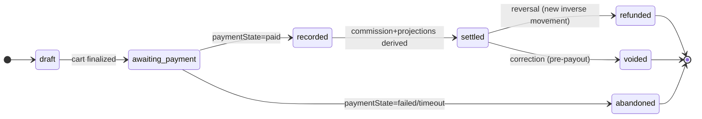

# POS Settlement Convergence — architecture design (no implementation)

**Status:** DESIGN ONLY. No code, no candidate. An architectural decision record for the RC
owner to review before the financial path is touched.
**Precedes:** any implementation candidate. Depends on the trace in
`docs/POS_SALES_LIFECYCLE_AUDIT.md` (the D1–D12 divergence inventory).
**Decision taken (by the platform owner):** converge on a **new single settlement authority**,
not on `posRetailSales` or `posSales`.

Related: [[project_posretailsales_field_divergence]] · [[reference_canonical_collections]] ·
[[feedback_client_cannot_establish_financial_fact]] · [[project_users_merchantid_forgeable]]
(ownership primitive at the write boundary) · [[project_commission_engine]] · [[project_settlement_engine]].

---

## 0. The one architectural rule this design exists to enforce

> **entry path → canonical settlement authority → projections**
> **NOT** entry path → collection A/B/C → reconciliation.

Every clause below is subordinate to this. A "settlement authority" that all three entry paths
write *independently* is just D1 under a new name. There is exactly **one writer of financial
truth**, and Orders / Revenue / Commission / Analytics / Receipts / Inventory are **read-only
projections** of it. Reconciliation becomes a *safety assertion over projections*, never the
mechanism that makes surfaces agree.

---

## 1. Authority model

A new canonical collection — the **Retail Settlement Ledger**, `retailSettlements` — is the sole
financial authority for a POS economic sale. Named to avoid the reserved authorities
(`providerPayouts` = provider payouts, `commissionLedger` = commission derivation,
`payoutRequests` = withdrawals); "settlement" here = *the recorded economic sale*, not a payout.

```mermaid
flowchart TD
  subgraph Entry["Entry paths (become thin writers)"]
    TILL[Till checkout]
    OFF[Offline / live client]
    DISP[Dispatch / API]
  end
  TILL & OFF & DISP -->|canonical txnId + idempotent upsert| AUTH[("retailSettlements<br/>THE financial authority<br/>CF Admin write-only")]
  AUTH -->|trigger projects| ORD[[orders / OrderService feed]]
  AUTH -->|trigger projects| ANA[[analytics / posBISnapshots]]
  AUTH -->|trigger projects| RCPT[[receipts]]
  AUTH -->|on paid| COMM[[commissionLedger entry]]
  AUTH -->|same txn| INV[(products.stock + inventoryMovements/{txnId})]
  AUTH -.->|transition-window shim| LEG1[[posRetailSales projection]]
  AUTH -.->|transition-window shim| LEG2[[posSales projection]]
```

Invariant: **no surface other than `retailSettlements` is ever an independent financial
authority.** `posRetailSales` and `posSales` survive only as *projections* during migration, then
retire.

---

## 2. Canonical transaction ID — generation, propagation, offline

One economic sale ⇒ one `txnId`, stable across every path, retry, and offline replay.

- **Format (proposal):** `rt_<merchantId>_<deviceId>_<clientMonotonic>` — or a ULID minted at the
  point of sale. The requirement is not the format but the three properties: **globally unique,
  deterministic per economic sale, and mintable offline** (so the client can create it before any
  network round-trip).
- **Generation point:** at the point of sale (the terminal), *before* payment — because the
  offline path must own an id the eventual online replay will reuse. The server never *invents* a
  new id for a sale that already has one; it only accepts the supplied `txnId`.
- **Propagation:** `txnId` is the `retailSettlements` **document id**, the `posIdempotency` key,
  the `inventoryMovements` key, the receipt's `saleId`, the commission entry's reference, and the
  projection doc ids. One id threads the entire lifecycle.
- **Offline reconciliation:** because persistence is idempotent on `txnId` (§5), an offline sale
  and its later online sync are the *same* document — the second write is a no-op merge, not a
  second sale. This is what structurally forecloses the MIRROR "second economic sale" (§9).
- **Anti-forgery:** `txnId` embeds `merchantId`; the write boundary (§12) verifies the
  authenticated merchant owns that `merchantId` and rejects a mismatch, so a client cannot mint an
  id under another merchant.

---

## 3. Settlement record — schema and immutable fields

`retailSettlements/{txnId}` — canonical representation resolves every D3/D4 spelling split:

| Field | Canonical meaning | Immutable after create? |
|---|---|---|
| `txnId` | canonical id (== doc id) | **yes** |
| `merchantId` | owner identity — **the single owner key** (== owning uid) | **yes** |
| `sellerId` | mirror of `merchantId` for legacy reads (same value) | **yes** |
| `branchId`, `deviceId`, `cashierId` | origin (cashier = local profile id) | **yes** |
| `lineItems[]` | `{productId, qty, unitPrice, taxRate, lineTotal}` | **yes** |
| `money` | `{subtotal, discountTotal, taxTotal, grandTotal, currency}` — **one money block, one basis** | **yes** |
| `taxBasis` | explicit (`inclusive-16` / `per-item`) — no hidden assumption | **yes** |
| `paymentState` | see §4 | mutable via state machine only |
| `settlementState` | see §4 | mutable via state machine only |
| `paymentRefs[]` | provider payment ids / mpesa codes (mixed tender) | append-only |
| `createdAt` (server), `saleDateMs`, `saleDate` (`YYYY-MM-DD`) | time — **always written** (fixes the `saleDate`-missing D-bug) | **yes** |
| `origin` | `till` / `offline` / `dispatch` — provenance, not authority | **yes** |
| `version` | schema version | — |

**Money is written once, canonically.** No consumer re-derives revenue from a different field
name. `grandTotal` is the single revenue figure; `taxTotal` the single tax figure; cost is
persisted (`money.costTotal`) so profit is never silently 0.

---

## 4. State machine — payment vs settlement are orthogonal and explicit

Two independent state fields, because "money arrived" ≠ "economic sale is final revenue."



- `paymentState ∈ {unpaid, pending, paid, failed, reversed}` — the money fact, driven by the
  payment provider / webhook (authoritative payment event only — never client-asserted).
- `settlementState ∈ {draft, awaiting_payment, recorded, settled, refunded, voided, abandoned}` —
  the economic-sale lifecycle.
- **Revenue/commission derive only at `paymentState=paid AND settlementState≥recorded`** (§8).
  A `failed`/`abandoned` sale can never produce revenue — closes the "false revenue" risk.
- Refund/void create **inverse movements** referencing the original `txnId`; they never delete or
  mutate the immutable sale fields.

---

## 5. Idempotency model (generalizes `posIdempotency`)

The canonical write is idempotent **on `txnId`**, using the proven atomic-claim pattern:

1. `retailSettlements/{txnId}` created via a transaction that also runs the stock movement (§6).
2. The create is `create()` (not `set`) for the **first** transition — `ALREADY_EXISTS` means the
   sale already exists; the caller receives the existing record (cached-result semantics), never a
   second sale.
3. State transitions (`awaiting_payment→recorded`, refunds) are guarded transactions that
   short-circuit if the target state is already present (replay-safe).
4. `posIdempotency` is folded in: `idempotencyKey == txnId`. One claim, one id.

**A retry — HTTP retry, double-tap, two terminals, offline-then-online — can never create a
second financial sale**, because all of them carry the same `txnId` and collide on the document.

---

## 6. Inventory — bound to the same economic transaction

- Stock decrement and the settlement write commit in **one Firestore transaction**, and the
  decrement is journaled to `inventoryMovements/{txnId}` (keyed by the same id).
- Idempotent on `txnId`: replay finds the movement already applied and does nothing — **no double
  decrement** (this is what D6 was violating on DISPATCH).
- Server-authoritative for online paths. For the **offline** path, the client provisionally
  decrements local stock; on sync the server applies the *authoritative* movement keyed by `txnId`
  and the client reconciles to it — the movement ledger prevents a second decrement when the
  offline sale finally lands. Oversell is guarded before payment, floored at zero, flagged post-hoc
  (existing rule, preserved).

---

## 7. Projections — Orders, Analytics/BI, Receipts derive from the authority

A single `onWrite(retailSettlements/{txnId})` trigger fans out **derived** documents. Projections
are disposable and rebuildable from the authority; they hold no fact the authority lacks.

- **Orders:** the OrderService feed reads a projection (or the authority directly once migrated),
  not a competing collection. During transition, the trigger writes the legacy `posRetailSales`
  shape so the existing `seller.html`→postMessage→shell path keeps working unchanged.
- **Analytics/BI:** `getPOSAnalytics`, `pos-bi`, `posBISnapshots`, `posDailySummary` become
  consumers of the authority. Aggregates are recomputable from `retailSettlements`; the
  `saleDate`-missing bug disappears because `saleDate` is always written (§3). No aggregate is a
  source of truth.
- **Receipts:** one canonical relationship — `receipts/{txnId}` (or `posReceipts/{txnId}`),
  derived on `recorded`. The two-receipt-collection split (D11) collapses to one keyed by `txnId`.

---

## 8. Revenue / commission — authoritative calculation point

- Commission derives from `retailSettlements` on the `paymentState=paid` transition, producing a
  `commissionLedger/{txnId}` entry (the existing engine reads/extends `commissionLedger`, keyed by
  a payment reference — `txnId` becomes that reference for POS).
- **Never** computed from Orders or any UI collection. This is the invariant
  [[feedback_client_cannot_establish_financial_fact]] demands: a server-derived settlement event
  is the only thing that moves money, applying the current commercial rule (5%, min KES 10) once
  per `txnId`, idempotently.
- POS sales thereby enter revenue/commission/settlement for the first time (closes D8), and the
  backend money-parity proof (`analytics-reconcile`) gains a POS input (closes D9).

---

## 9. Migration / compatibility / offline — without double settlement

| Concern | Transition strategy |
|---|---|
| `posRetailSales` | Becomes a **projection** of the authority (trigger-written), then read-migrated, then retired. Never an authority again. |
| `posSales` | Same — projection for analytics during transition, then analytics reads the authority, then retired. |
| `posTransactions` | Remains the **offline client queue** (an inbox), but its consumer becomes "upsert into `retailSettlements` by `txnId`," replacing the MIRROR-writes-a-second-shape path. |
| MIRROR path | **Retired as an authority.** Idempotent-on-`txnId` upsert means the offline original and its online replay are one document — it can no longer manufacture a second economic sale. |
| Existing clients | All three entry writers are re-pointed to the **canonical write** (supply/derive `txnId`, call one settlement callable). A compatibility shim maps old payload shapes to the schema. Clients mid-upgrade converge on the same `txnId` derivation, so a partially-upgraded fleet cannot double-settle. |
| Retry/replay | §10 matrix — every path resolves to the same `txnId` collision. |
| Failure recovery | §11. |

---

## 10. Retry / replay behavior — per path (must be exhaustive)

| Trigger | Behavior |
|---|---|
| HTTP retry of the settlement callable | same `txnId` → `ALREADY_EXISTS` → existing record returned; no second sale/decrement |
| Double-tap / two terminals | atomic `create` — exactly one wins; others get the cached result |
| Offline sale, later online sync | same client-minted `txnId` → upsert merge; one sale |
| Payment webhook redelivery | state transition guarded; `paid→paid` is a no-op |
| Projection trigger re-fire | projections are derived/deterministic on `txnId` → idempotent rewrite |
| Commission re-derivation | `commissionLedger/{txnId}` guarded; one entry per economic sale |

---

## 11. Failure recovery — both directions

- **Payment success, sale-write failure:** the payment event carries `txnId`; a reconciliation
  sweep finds `paymentState=paid` with no `settlementState≥recorded` and completes the settlement
  idempotently. Money is never stranded without a sale.
- **Sale write success, payment failure/timeout:** `settlementState=awaiting_payment` with
  `paymentState∈{failed,pending}` → the sale is **not** revenue, projections show it as
  unpaid/abandoned, stock reservation is released (or never committed) — no false revenue.
- **Partial/mixed tender:** `paymentRefs[]` accumulates; `paid` only when covered. Preserves the
  existing mixed-tender behavior on one record.

---

## 12. Rules / authz at the authoritative write boundary

- `retailSettlements`: `allow write: if false` — **CF Admin SDK only**. Reads authorized by the
  single owner key: `resource.data.merchantId == request.auth.uid || isAdmin()`.
- The write CF authorizes merchant ownership using the **corrected ownership primitive** from the
  security slices ([[project_users_merchantid_forgeable]] `assertMerchantMember` /
  `assertSellerSelfOrAdmin`) — the write boundary is where ownership is proven, not the client.
  This design **depends on** those primitives being landed, and must not reintroduce a forgeable
  `merchantId`/`sellerId` trust path.
- Projections inherit read rules matching their legacy readers during transition, then the readers
  move to `retailSettlements`.

---

## 13. D6 and D12 stay explicit release gates (not absorbed)

- **D6 (DISPATCH non-idempotent double-write):** the convergence *fixes* it by construction
  (idempotent on `txnId`), but it remains a **named acceptance test and release gate** — a retry
  of every entry path must be proven to produce exactly one sale and one stock movement. It is not
  considered closed merely because the design subsumes it.
- **D12 (served-rules skew):** the canonical read rule for `retailSettlements` (and any transition
  projection) **must be verified against the actually-served ruleset**, not the
  `firestore.rules.live` artifact (which the trace showed lagging on the `posRetailSales`
  `merchantId` clause). Rules release is a separate gate owned by the release owner
  ([[reference_hosting_vs_rules_release_split]]), constrained by the compiled-size ceiling
  ([[reference_rules_compiled_size_ceiling]]).

---

## 14. Acceptance tests (to be executed against the eventual candidate)

1. One economic sale ⇒ exactly one `retailSettlements` doc; `txnId` stable across every entry path.
2. Retry / double-tap / two-terminal on each path ⇒ no second sale, no second stock decrement (**D6**).
3. Offline sale then online sync ⇒ one document (no second economic sale).
4. `paymentState=failed/abandoned` ⇒ zero revenue, zero commission, stock released.
5. `paid` ⇒ exactly one `commissionLedger/{txnId}` at the commercial rule; POS revenue appears in the parity proof (**D8/D9**).
6. Orders, Analytics, Receipts projections match the authority field-for-field (money, owner, id).
7. Multi-shop isolation: merchant A cannot read/settle merchant B's `txnId` (owner boundary, §12).
8. Reconciliation totals (authority vs each projection vs commission) agree to the cent.
9. Served-ruleset read verification for the canonical + projection collections (**D12**).
10. Failure-recovery sweeps (§11) close both stranded-payment and unpaid-sale cases idempotently.

---

## 15. Decision table (the owner's checklist, filled in)

| Concern | Decision |
|---|---|
| Canonical transaction ID | client/point-of-sale minted, `rt_<merchantId>_<deviceId>_<mono>` (or ULID); server accepts, never re-mints; threads all surfaces; offline-safe (§2) |
| Settlement record | `retailSettlements/{txnId}`, immutable sale fields, one money block, one owner key (§3) |
| Payment state | orthogonal `paymentState {unpaid,pending,paid,failed,reversed}` vs `settlementState` (§4) |
| Inventory | one transaction with the sale write; `inventoryMovements/{txnId}` idempotent journal (§6) |
| Orders | projection of the authority; legacy `posRetailSales` shape during transition (§7) |
| Revenue/commission | derived at `paid` from the authority → `commissionLedger/{txnId}`; never from UI (§8) |
| Analytics | projection/consumer of the authority; aggregates recomputable; `saleDate` always present (§7) |
| Receipts | one canonical `receipts/{txnId}` (§7) |
| `posRetailSales` | projection → read-migrate → retire; never re-authoritative (§9) |
| `posSales` | projection → read-migrate → retire; never re-authoritative (§9) |
| Existing clients | re-pointed to one settlement callable; shim maps old shapes; same `txnId` derivation → no double settlement (§9) |
| Retry/replay | idempotent-on-`txnId` for every path (§10) |
| Offline sync | client-minted `txnId` + upsert merge; movement journal prevents double stock (§2/§6) |
| Failure recovery | bidirectional reconciliation sweeps (§11) |
| Rules/authz | CF-only write; owner-key read; ownership proven via the landed security primitive; D12 served-rules gate (§12) |

---

## 16. What this design deliberately does NOT do

- No implementation, no candidate, no collection created, no rule changed.
- Does not pick the `txnId` format as final — names the required properties; the owner ratifies.
- Does not schedule the migration cutover — that is a release-owner plan, sequenced **after** the
  two security candidates land (this design depends on the ownership primitive).
- Does not fold D6/D12 into "handled by the redesign" — they remain independently gated.
