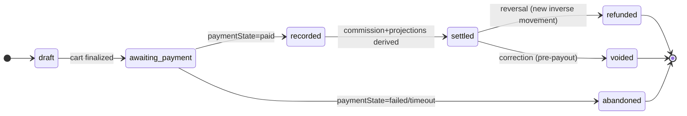

# POS Settlement Convergence — architecture design (no implementation)

**Status:** DESIGN ONLY. No code, no candidate. An architectural decision record for the RC
owner to review before the financial path is touched.
**Precedes:** any implementation candidate. Depends on the trace in
`docs/POS_SALES_LIFECYCLE_AUDIT.md` (the D1–D12 divergence inventory).
**Decision taken (by the platform owner):** converge on a **new single settlement authority**,
not on `posRetailSales` or `posSales`.

Related: [[project_posretailsales_field_divergence]] · [[reference_canonical_collections]] ·
[[feedback_client_cannot_establish_financial_fact]] · [[project_users_merchantid_forgeable]]
(ownership primitive at the write boundary) · [[project_commission_engine]] · [[project_settlement_engine]].

---

## 0. The one architectural rule this design exists to enforce

> **entry path → canonical settlement authority → projections**
> **NOT** entry path → collection A/B/C → reconciliation.

Every clause below is subordinate to this. A "settlement authority" that all three entry paths
write *independently* is just D1 under a new name. There is exactly **one writer of financial
truth**, and Orders / Revenue / Commission / Analytics / Receipts / Inventory are **read-only
projections** of it. Reconciliation becomes a *safety assertion over projections*, never the
mechanism that makes surfaces agree.

---

## 1. Authority model

A new canonical collection — the **Retail Settlement Ledger**, `retailSettlements` — is the sole
financial authority for a POS economic sale. Named to avoid the reserved authorities
(`providerPayouts` = provider payouts, `commissionLedger` = commission derivation,
`payoutRequests` = withdrawals); "settlement" here = *the recorded economic sale*, not a payout.

```mermaid
flowchart TD
  subgraph Entry["Entry paths (become thin writers)"]
    TILL[Till checkout]
    OFF[Offline / live client]
    DISP[Dispatch / API]
  end
  TILL & OFF & DISP -->|canonical txnId + idempotent upsert| AUTH[("retailSettlements<br/>THE financial authority<br/>CF Admin write-only")]
  AUTH -->|trigger projects| ORD[[orders / OrderService feed]]
  AUTH -->|trigger projects| ANA[[analytics / posBISnapshots]]
  AUTH -->|trigger projects| RCPT[[receipts]]
  AUTH -->|on paid| COMM[[commissionLedger entry]]
  AUTH -->|same txn| INV[(products.stock + inventoryMovements/{txnId})]
  AUTH -.->|transition-window shim| LEG1[[posRetailSales projection]]
  AUTH -.->|transition-window shim| LEG2[[posSales projection]]
```

Invariant: **no surface other than `retailSettlements` is ever an independent financial
authority.** `posRetailSales` and `posSales` survive only as *projections* during migration, then
retire.

---

## 2. Canonical transaction ID — generation, propagation, offline

One economic sale ⇒ one `txnId`, stable across every path, retry, and offline replay.

- **Format (proposal):** `rt_<merchantId>_<deviceId>_<clientMonotonic>` — or a ULID minted at the
  point of sale. The requirement is not the format but the three properties: **globally unique,
  deterministic per economic sale, and mintable offline** (so the client can create it before any
  network round-trip).
- **Generation point:** at the point of sale (the terminal), *before* payment — because the
  offline path must own an id the eventual online replay will reuse. The server never *invents* a
  new id for a sale that already has one; it only accepts the supplied `txnId`.
- **Propagation:** `txnId` is the `retailSettlements` **document id**, the `posIdempotency` key,
  the `inventoryMovements` key, the receipt's `saleId`, the commission entry's reference, and the
  projection doc ids. One id threads the entire lifecycle.
- **Offline reconciliation:** because persistence is idempotent on `txnId` (§5), an offline sale
  and its later online sync are the *same* document — the second write is a no-op merge, not a
  second sale. This is what structurally forecloses the MIRROR "second economic sale" (§9).
- **Anti-forgery:** `txnId` embeds `merchantId`; the write boundary (§12) verifies the
  authenticated merchant owns that `merchantId` and rejects a mismatch, so a client cannot mint an
  id under another merchant.

---

## 3. Settlement record — schema and immutable fields

`retailSettlements/{txnId}` — canonical representation resolves every D3/D4 spelling split:

| Field | Canonical meaning | Immutable after create? |
|---|---|---|
| `txnId` | canonical id (== doc id) | **yes** |
| `merchantId` | owner identity — **the single owner key** (== owning uid) | **yes** |
| `sellerId` | mirror of `merchantId` for legacy reads (same value) | **yes** |
| `branchId`, `deviceId`, `cashierId` | origin (cashier = local profile id) | **yes** |
| `lineItems[]` | `{productId, qty, unitPrice, taxRate, lineTotal}` | **yes** |
| `money` | `{subtotal, discountTotal, taxTotal, grandTotal, currency}` — **one money block, one basis** | **yes** |
| `taxBasis` | explicit (`inclusive-16` / `per-item`) — no hidden assumption | **yes** |
| `paymentState` | see §4 | mutable via state machine only |
| `settlementState` | see §4 | mutable via state machine only |
| `paymentRefs[]` | provider payment ids / mpesa codes (mixed tender) | append-only |
| `createdAt` (server), `saleDateMs`, `saleDate` (`YYYY-MM-DD`) | time — **always written** (fixes the `saleDate`-missing D-bug) | **yes** |
| `origin` | `till` / `offline` / `dispatch` — provenance, not authority | **yes** |
| `version` | schema version | — |

**Money is written once, canonically.** No consumer re-derives revenue from a different field
name. `grandTotal` is the single revenue figure; `taxTotal` the single tax figure; cost is
persisted (`money.costTotal`) so profit is never silently 0.

---

## 4. State machine — payment vs settlement are orthogonal and explicit

Two independent state fields, because "money arrived" ≠ "economic sale is final revenue."



- `paymentState ∈ {unpaid, pending, paid, failed, reversed}` — the money fact, driven by the
  payment provider / webhook (authoritative payment event only — never client-asserted).
- `settlementState ∈ {draft, awaiting_payment, recorded, settled, refunded, voided, abandoned}` —
  the economic-sale lifecycle.
- **Revenue/commission derive only at `paymentState=paid AND settlementState≥recorded`** (§8).
  A `failed`/`abandoned` sale can never produce revenue — closes the "false revenue" risk.
- Refund/void create **inverse movements** referencing the original `txnId`; they never delete or
  mutate the immutable sale fields.

---

## 5. Idempotency model (generalizes `posIdempotency`)

The canonical write is idempotent **on `txnId`**, using the proven atomic-claim pattern:

1. `retailSettlements/{txnId}` created via a transaction that also runs the stock movement (§6).
2. The create is `create()` (not `set`) for the **first** transition — `ALREADY_EXISTS` means the
   sale already exists; the caller receives the existing record (cached-result semantics), never a
   second sale.
3. State transitions (`awaiting_payment→recorded`, refunds) are guarded transactions that
   short-circuit if the target state is already present (replay-safe).
4. `posIdempotency` is folded in: `idempotencyKey == txnId`. One claim, one id.

**A retry — HTTP retry, double-tap, two terminals, offline-then-online — can never create a
second financial sale**, because all of them carry the same `txnId` and collide on the document.

---

## 6. Inventory — bound to the same economic transaction

- Stock decrement and the settlement write commit in **one Firestore transaction**, and the
  decrement is journaled to `inventoryMovements/{txnId}` (keyed by the same id).
- Idempotent on `txnId`: replay finds the movement already applied and does nothing — **no double
  decrement** (this is what D6 was violating on DISPATCH).
- Server-authoritative for online paths. For the **offline** path, the client provisionally
  decrements local stock; on sync the server applies the *authoritative* movement keyed by `txnId`
  and the client reconciles to it — the movement ledger prevents a second decrement when the
  offline sale finally lands. Oversell is guarded before payment, floored at zero, flagged post-hoc
  (existing rule, preserved).

---

## 7. Projections — Orders, Analytics/BI, Receipts derive from the authority

A single `onWrite(retailSettlements/{txnId})` trigger fans out **derived** documents. Projections
are disposable and rebuildable from the authority; they hold no fact the authority lacks.

- **Orders:** the OrderService feed reads a projection (or the authority directly once migrated),
  not a competing collection. During transition, the trigger writes the legacy `posRetailSales`
  shape so the existing `seller.html`→postMessage→shell path keeps working unchanged.
- **Analytics/BI:** `getPOSAnalytics`, `pos-bi`, `posBISnapshots`, `posDailySummary` become
  consumers of the authority. Aggregates are recomputable from `retailSettlements`; the
  `saleDate`-missing bug disappears because `saleDate` is always written (§3). No aggregate is a
  source of truth.
- **Receipts:** one canonical relationship — `receipts/{txnId}` (or `posReceipts/{txnId}`),
  derived on `recorded`. The two-receipt-collection split (D11) collapses to one keyed by `txnId`.

---

## 8. Revenue / commission — authoritative calculation point

- Commission derives from `retailSettlements` on the `paymentState=paid` transition, producing a
  `commissionLedger/{txnId}` entry (the existing engine reads/extends `commissionLedger`, keyed by
  a payment reference — `txnId` becomes that reference for POS).
- **Never** computed from Orders or any UI collection. This is the invariant
  [[feedback_client_cannot_establish_financial_fact]] demands: a server-derived settlement event
  is the only thing that moves money, applying the current commercial rule (5%, min KES 10) once
  per `txnId`, idempotently.
- POS sales thereby enter revenue/commission/settlement for the first time (closes D8), and the
  backend money-parity proof (`analytics-reconcile`) gains a POS input (closes D9).

---

## 9. Migration / compatibility / offline — without double settlement

| Concern | Transition strategy |
|---|---|
| `posRetailSales` | Becomes a **projection** of the authority (trigger-written), then read-migrated, then retired. Never an authority again. |
| `posSales` | Same — projection for analytics during transition, then analytics reads the authority, then retired. |
| `posTransactions` | Remains the **offline client queue** (an inbox), but its consumer becomes "upsert into `retailSettlements` by `txnId`," replacing the MIRROR-writes-a-second-shape path. |
| MIRROR path | **Retired as an authority.** Idempotent-on-`txnId` upsert means the offline original and its online replay are one document — it can no longer manufacture a second economic sale. |
| Existing clients | All three entry writers are re-pointed to the **canonical write** (supply/derive `txnId`, call one settlement callable). A compatibility shim maps old payload shapes to the schema. Clients mid-upgrade converge on the same `txnId` derivation, so a partially-upgraded fleet cannot double-settle. |
| Retry/replay | §10 matrix — every path resolves to the same `txnId` collision. |
| Failure recovery | §11. |

---

## 10. Retry / replay behavior — per path (must be exhaustive)

| Trigger | Behavior |
|---|---|
| HTTP retry of the settlement callable | same `txnId` → `ALREADY_EXISTS` → existing record returned; no second sale/decrement |
| Double-tap / two terminals | atomic `create` — exactly one wins; others get the cached result |
| Offline sale, later online sync | same client-minted `txnId` → upsert merge; one sale |
| Payment webhook redelivery | state transition guarded; `paid→paid` is a no-op |
| Projection trigger re-fire | projections are derived/deterministic on `txnId` → idempotent rewrite |
| Commission re-derivation | `commissionLedger/{txnId}` guarded; one entry per economic sale |

---

## 11. Failure recovery — both directions

- **Payment success, sale-write failure:** the payment event carries `txnId`; a reconciliation
  sweep finds `paymentState=paid` with no `settlementState≥recorded` and completes the settlement
  idempotently. Money is never stranded without a sale.
- **Sale write success, payment failure/timeout:** `settlementState=awaiting_payment` with
  `paymentState∈{failed,pending}` → the sale is **not** revenue, projections show it as
  unpaid/abandoned, stock reservation is released (or never committed) — no false revenue.
- **Partial/mixed tender:** `paymentRefs[]` accumulates; `paid` only when covered. Preserves the
  existing mixed-tender behavior on one record.

---

## 12. Rules / authz at the authoritative write boundary

- `retailSettlements`: `allow write: if false` — **CF Admin SDK only**. Reads authorized by the
  single owner key: `resource.data.merchantId == request.auth.uid || isAdmin()`.
- The write CF authorizes merchant ownership using the **corrected ownership primitive** from the
  security slices ([[project_users_merchantid_forgeable]] `assertMerchantMember` /
  `assertSellerSelfOrAdmin`) — the write boundary is where ownership is proven, not the client.
  This design **depends on** those primitives being landed, and must not reintroduce a forgeable
  `merchantId`/`sellerId` trust path.
- Projections inherit read rules matching their legacy readers during transition, then the readers
  move to `retailSettlements`.

---

## 13. D6 and D12 stay explicit release gates (not absorbed)

- **D6 (DISPATCH non-idempotent double-write):** the convergence *fixes* it by construction
  (idempotent on `txnId`), but it remains a **named acceptance test and release gate** — a retry
  of every entry path must be proven to produce exactly one sale and one stock movement. It is not
  considered closed merely because the design subsumes it.
- **D12 (served-rules skew):** the canonical read rule for `retailSettlements` (and any transition
  projection) **must be verified against the actually-served ruleset**, not the
  `firestore.rules.live` artifact (which the trace showed lagging on the `posRetailSales`
  `merchantId` clause). Rules release is a separate gate owned by the release owner
  ([[reference_hosting_vs_rules_release_split]]), constrained by the compiled-size ceiling
  ([[reference_rules_compiled_size_ceiling]]).

---

## 14. Acceptance tests (to be executed against the eventual candidate)

1. One economic sale ⇒ exactly one `retailSettlements` doc; `txnId` stable across every entry path.
2. Retry / double-tap / two-terminal on each path ⇒ no second sale, no second stock decrement (**D6**).
3. Offline sale then online sync ⇒ one document (no second economic sale).
4. `paymentState=failed/abandoned` ⇒ zero revenue, zero commission, stock released.
5. `paid` ⇒ exactly one `commissionLedger/{txnId}` at the commercial rule; POS revenue appears in the parity proof (**D8/D9**).
6. Orders, Analytics, Receipts projections match the authority field-for-field (money, owner, id).
7. Multi-shop isolation: merchant A cannot read/settle merchant B's `txnId` (owner boundary, §12).
8. Reconciliation totals (authority vs each projection vs commission) agree to the cent.
9. Served-ruleset read verification for the canonical + projection collections (**D12**).
10. Failure-recovery sweeps (§11) close both stranded-payment and unpaid-sale cases idempotently.

---

## 15. Decision table (the owner's checklist, filled in)

| Concern | Decision |
|---|---|
| Canonical transaction ID | client/point-of-sale minted, `rt_<merchantId>_<deviceId>_<mono>` (or ULID); server accepts, never re-mints; threads all surfaces; offline-safe (§2) |
| Settlement record | `retailSettlements/{txnId}`, immutable sale fields, one money block, one owner key (§3) |
| Payment state | orthogonal `paymentState {unpaid,pending,paid,failed,reversed}` vs `settlementState` (§4) |
| Inventory | one transaction with the sale write; `inventoryMovements/{txnId}` idempotent journal (§6) |
| Orders | projection of the authority; legacy `posRetailSales` shape during transition (§7) |
| Revenue/commission | derived at `paid` from the authority → `commissionLedger/{txnId}`; never from UI (§8) |
| Analytics | projection/consumer of the authority; aggregates recomputable; `saleDate` always present (§7) |
| Receipts | one canonical `receipts/{txnId}` (§7) |
| `posRetailSales` | projection → read-migrate → retire; never re-authoritative (§9) |
| `posSales` | projection → read-migrate → retire; never re-authoritative (§9) |
| Existing clients | re-pointed to one settlement callable; shim maps old shapes; same `txnId` derivation → no double settlement (§9) |
| Retry/replay | idempotent-on-`txnId` for every path (§10) |
| Offline sync | client-minted `txnId` + upsert merge; movement journal prevents double stock (§2/§6) |
| Failure recovery | bidirectional reconciliation sweeps (§11) |
| Rules/authz | CF-only write; owner-key read; ownership proven via the landed security primitive; D12 served-rules gate (§12) |

---

## 16. What this design deliberately does NOT do

- No implementation, no candidate, no collection created, no rule changed.
- Does not pick the `txnId` format as final — names the required properties; the owner ratifies.
- Does not schedule the migration cutover — that is a release-owner plan, sequenced **after** the
  two security candidates land (this design depends on the ownership primitive).
- Does not fold D6/D12 into "handled by the redesign" — they remain independently gated.

---

# Amendment A — multi-tender settlement (2026-09-21)

**Status:** AMENDMENT, pending owner ratification. Sections 0–16 above remain as ratified; this
amendment SUPERSEDES the specific clauses it names and adds nothing that contradicts §0.
**Occasioned by:** the `completeMultiTender` preflight at `64a9a85`, which established that a POS
sale can be settled by several tenders at once and that the ratified text cannot express it.
**Still DESIGN ONLY.** No collection, no callable, no code.

## A.0 What the preflight found in the LIVE code

Recorded here because the amendment's shape follows from it, and because each is a defect that
exists today independently of this design:

| Finding | Evidence |
|---|---|
| `recordPOSSale` has **no caller idempotency** — `saleId` is `saleRef.id`, minted per call, so two identical calls create two sales | `pos-retail-engine.js:215`, `:279` |
| It accepts **one** `payment {method, ref, amount}` — multi-tender is not representable server-side | `pos-retail-engine.js:220` |
| Inventory is decremented **inside the sale write, before payment is authoritative** | `pos-retail-engine.js:376` |
| `retailSettlements` appears **once in all of `functions/`, inside a comment** — unimplemented | `index.js:7653` |
| The paid-state target for Till sales today is `paymentIntents/{ref}`, NOT any sale collection | `index.js:7650` |
| The P58E prints on `autoPrint || method === 'card'` — a local setting, no paid-state gate | `pos.js:1637` |
| The one working idempotency pattern is `posIdempotency` atomic `create()` | `pos-zero-friction.js:338` |

## A.0.1 Contradictions and ambiguities found in §0–§16

These are reported before amending, as required. Each is resolved below.

1. **§6 contradicts §11 on inventory timing.** §6 commits the stock decrement "in one Firestore
   transaction" with the settlement write — which happens at `awaiting_payment`, before payment.
   §11 then speaks of a "stock reservation" being "released (or never committed)" on payment
   failure. A decrement already committed with the sale is not a reservation. **Resolved: A.6.**
2. **§4 has no state for a partly-covered sale.** `paymentState ∈ {unpaid, pending, paid, failed,
   reversed}`. §11 says "`paid` only when covered", so a sale with KES 1,000 of 1,600 collected
   sits in `pending` — indistinguishable from one where nothing has been collected. **Resolved: A.3.**
3. **§3 cannot represent a FAILED tender.** `paymentRefs[]` is "append-only … provider payment
   ids"; a declined card or a timed-out STK may produce no provider ref at all, and an array of
   successful refs has nowhere to put a failure. The schema has no tender-level record.
   **Resolved: A.2.**
4. **§4's payment authority excludes cash.** `paymentState` is "driven by the payment provider /
   webhook (authoritative payment event only — never client-asserted)". Cash has no provider and
   no webhook, so under the ratified text a cash sale can never reach `paid`. **Resolved: A.7.**
5. **§2 offers two mutually exclusive `txnId` formats.** `rt_<merchantId>_<deviceId>_<mono>` "or a
   ULID" — but §2's own anti-forgery clause requires that "`txnId` embeds `merchantId`", which a
   ULID does not. §15 repeats the ambiguity. **Resolved: A.1.**
6. **§7 leaves the receipt collection unchosen** — "`receipts/{txnId}` (or `posReceipts/{txnId}`)"
   — while §15 records it as decided ("one canonical `receipts/{txnId}`"). §15 is the later, more
   specific statement and is taken as controlling. **Resolved: A.9.**

---

## A.1 Canonical transaction identity (amends §2, §15)

`txnId` is the structured form **`rt_<merchantId>_<deviceId>_<clientMonotonic>`**. The ULID
alternative is withdrawn: §2's anti-forgery rule requires the id to embed `merchantId` so the
write boundary can reject a mismatch, and a ULID cannot satisfy it. The three required properties
(globally unique, deterministic per economic sale, mintable offline) are preserved.

One `txnId` threads: the settlement, every tender, every payment intent, every provider reference,
every inventory movement, the commission entry, and the receipt (A.11).

---

## A.2 Tender-level record (amends §3)

A sale has **many tenders**. `paymentRefs[]` is retained for backward compatibility as a derived
convenience, but it is **no longer the tender record** — it cannot express a failure.

`retailSettlements/{txnId}.tenders[]`, append-only, each entry immutable except `state`:

| Field | Meaning |
|---|---|
| `tenderId` | `<txnId>#t<n>` — stable, unique within the sale, never reused |
| `kind` | `cash` \| `external` \| `recorded` (A.7) |
| `method` | `cash`, `mpesa`, `card`, … as offered by the account (never a hard-coded list) |
| `amountMinor` | integer cents, the amount THIS tender is to cover |
| `state` | A.3 |
| `intentRef` | `paymentIntents/{ref}` for an external tender, else null |
| `providerRef` | `api_ref` / `tracking_id` / M-PESA code once known, else null |
| `authorizedBy` | cashier uid — required for `cash` and `recorded` |
| `createdAt`, `settledAt`, `failedAt` | timestamps |

**A failed tender is never removed and never rewritten.** It remains in `tenders[]` as part of the
audit trail, including when the sale later reaches `paid` by other means. Replacement is A.5.

---

## A.3 Tender state vs settlement state (amends §4)

Two levels, orthogonal, and neither is derivable from the other alone.

**Tender state** — one payment attempt:

```
pending → processing → confirmed
                    ↘  failed
                    ↘  expired
        ↘ cancelled
confirmed → refunded
```

`pending` recorded, not yet initiated · `processing` initiated, provider not yet answered ·
`confirmed` authoritative event received (A.7) · `failed` provider answered no · `cancelled`
withdrawn before initiation · `expired` no answer within the window · `refunded` reversed after
confirmation.

**A non-answer is never `failed`.** A 5xx or a timeout is `processing` until it resolves or
expires — the rule `shared/stk-gateway.js` already applies (`OUTCOME_UNKNOWN`), lifted to the
settlement. Recording a non-answer as a failure is how a real charge gets retried.

**Settlement state** — the sale's money position, **derived** from the tenders:

| State | Definition |
|---|---|
| `unpaid` | no tender is `confirmed` |
| `partially_paid` | `Σ confirmed < grandTotal`, and at least one is `confirmed` |
| `paid` | `Σ confirmed ≥ grandTotal` |
| `failed` | no tender can still succeed and `Σ confirmed = 0` |
| `cancelled` | the sale was abandoned before any tender confirmed |
| `refunded` | previously `paid`, reversed by inverse movements (§4 unchanged) |

`partially_paid` is the state §4 lacked. `paymentState` from ratified §4 is **superseded by this
table**; `settlementState` from §4 (`draft … abandoned`) is retained unchanged as the *economic*
lifecycle and remains orthogonal to both.

---

## A.4 One tender fails while others succeed (new; closes the §11 gap)

```
SALE  KES 1,600          SALE  KES 1,600
M-PESA  700  confirmed   M-PESA  700  confirmed
CARD    600  FAILED      CARD    600  FAILED
CASH    300  confirmed   CASH    900  confirmed
─────────────────────    ─────────────────────
collected 1,000          collected 1,600
outstanding  600         outstanding    0
= PARTIALLY_PAID         = PAID
```

The failed card attempt survives in `tenders[]` in **both** cases. The sale being paid does not
erase the attempt that was not.

- A failing tender **never** fails the sale, and never reverses a confirmed one.
- `Σ confirmed` is recomputed on every tender transition; the settlement state follows the table
  in A.3 and is never set directly.
- An overpayment (`Σ confirmed > grandTotal`) is only reachable via cash, which is the only tender
  that can give change (carried from the certified till engine). Any other route to it is a defect
  and must raise, not round.

---

## A.5 Retrying a failed tender without duplicating the sale (new)

A replacement is a **new tender on the same `txnId`**, never a new sale and never a mutation of the
failed one:

```
tenders[] : t1 mpesa 700 confirmed
            t2 card  600 failed
            t3 card  600 confirmed      ← replaces t2, references it
```

`t3.replaces = "t2"`. Both remain. The sale's identity, line items, inventory movement and receipt
are untouched — this is precisely the case that `recordPOSSale`'s auto-generated id cannot express
today without creating a second sale (A.0).

---

## A.6 Inventory follows settlement (amends §6, resolves the §6/§11 contradiction)

**The stock decrement does NOT commit with the settlement write.** §6's "one Firestore
transaction with the settlement write" is superseded:

```
basket → settlement created (unpaid)
       → tenders recorded
       → external tenders confirmed
       → settlement reaches PAID
       → inventory movement committed        ← here, and only here
       → receipt becomes eligible (A.9)
```

- Oversell is still guarded **before** any tender is initiated (existing rule, preserved), and a
  post-payment race is flagged in `oversoldAlerts`, never rejected (existing rule, preserved).
- The movement remains journaled to `inventoryMovements/{txnId}` and idempotent on it, so the
  `paid` transition may be replayed without a second decrement (§6's idempotency retained).
- `partially_paid` commits **nothing**. A sale half-collected has not moved stock.
- §11's "stock reservation is released (or never committed)" is resolved to **never committed**.
  There is no reservation state and none is introduced; a guard before initiation plus commitment
  at `paid` is the whole mechanism.

---

## A.7 Cash versus external tenders (new; closes the §4 authority hole)

§4's "authoritative payment event only — never client-asserted" is correct for external rails and
**cannot apply to cash**, which has no provider and no webhook. Without this clause a cash sale
could never reach `paid`.

| Kind | What confirms it | Client-assertable? |
|---|---|---|
| `external` | `webhookIntasend` only — an event from the provider | **no**, ever |
| `cash` | the authenticated, authorized cashier, recorded with `authorizedBy` | yes, and it is the only authority there is |
| `recorded` | money that moved outside SOKONI (a merchant Till code the customer paid directly), with a reference | yes, and it is marked `recorded` forever so it is never mistaken for one we initiated |

The distinction is permanent in the record. "We initiated and the provider confirmed" and "a
cashier told us it happened" are different claims and must remain separable in the audit trail.

---

## A.8 Idempotency and webhook redelivery (amends §5, §10)

§5's atomic `create()` on `txnId` is retained unchanged for the sale. Two additions:

- **Tender transitions are guarded and monotonic.** `confirmed → confirmed` is a no-op;
  `confirmed → failed` is **refused** and raised, because a confirmed tender that later reports
  failure is a reconciliation event, not a state change.
- **Webhook redelivery is idempotent at the TENDER, not the sale.** A redelivered event is matched
  by `providerRef` **or** `intentRef` to exactly one tender; if that tender is already `confirmed`
  the handler returns success and writes nothing. This is the existing guard at
  `index.js` (`payments/{apiRef}.status === "COMPLETE"` → early return, re-checked inside the
  transaction), lifted to the tender level. `Σ confirmed` must never be incremented by a replay —
  the defect recorded at `index.js:4366`, where `FieldValue.increment` made a redelivery
  double-charge.

---

## A.9 Receipt eligibility (amends §7)

The receipt collection is `receipts/{txnId}` (§15 controlling; §7's alternative withdrawn).

**A sale receipt is emitted only at `settlement = paid`.** Not at `recorded`, not on a local
setting, not on a payment method.

- `partially_paid` → **no sale receipt.** A tender slip may be issued per confirmed tender and
  must be visibly a payment record, never a completed-sale receipt.
- The current live gate — `autoPrint || method === 'card'` (`pos.js:1637`) — does not satisfy
  this. **Correcting it is explicitly OUT OF SCOPE of this amendment and of the convergence
  programme**, and is to be its own small, separately tested slice. It is a defect today,
  independent of multi-tender, and bundling it here would hide it inside a large programme.

---

## A.10 Audit trail (new)

Every row below is reachable from `txnId` alone, and each carries `txnId` explicitly:

```
txnId ─┬─ retailSettlements/{txnId}          the authority
       ├─ .tenders[].tenderId                every attempt, including failures
       ├─ .tenders[].intentRef    → paymentIntents/{ref}
       ├─ .tenders[].providerRef  → api_ref / tracking_id / M-PESA code
       ├─ inventoryMovements/{txnId}         committed at paid (A.6)
       ├─ commissionLedger/{txnId}           derived at paid (§8)
       └─ receipts/{txnId}                   emitted at paid (A.9)
```

No surface may hold a payment fact that is not reachable this way.

---

## A.11 No fourth POS financial authority (reaffirms §0, §1)

`posSales`, `posRetailSales` and `posTransactions` remain as §9 defines them — projections or
queues, never authorities again.

**This amendment creates no new collection.** In particular it explicitly prohibits, now and in
any implementation derived from it:

- a `posMultiTenderSales` collection, or any per-feature sale collection;
- multi-tender fields grafted onto `recordPOSSale`/`posSales` as a transition shim — considered
  and **rejected by the owner**, because it would stand up a fourth authority
  (`posSales` + `paymentIntents` + `payments` + temporary tender fields) and make the convergence
  harder than it is today;
- any second writer of `retailSettlements` other than the single settlement callable (§0).

Tenders live **inside** `retailSettlements/{txnId}`. They are not a collection.

---

## A.12 Implementation sequence (not authorized by this amendment)

Ratification of this amendment authorizes nothing. The programme, in order, each gated:

```
settlement authority → idempotency → tender state machine → payment reconciliation
→ inventory binding → receipt gate → completeMultiTender adapter → certification → deployment
```

`completeMultiTender` is the **last** code step and is an *adapter* — the till's basket
(`sokoni-pos-basket.js`, certified at `64a9a85`) already emits lines and tenders in a shape that
carries source, kind and attribution. It calls the settlement authority; it does not become one.

Deployment remains separately constrained by the Artifact Registry observation in `AGENTS.md`.

---

## A.13 What this amendment deliberately does NOT do

- It does not implement `retailSettlements`, `completeMultiTender`, or any tender state machine.
- It does not modify `recordPOSSale`, `webhookIntasend`, `payment-purposes.js` or `pos-qr.js`.
- It does not correct the receipt gate (A.9) — deliberately left as its own slice.
- It does not re-ratify §0–§16; those stand except where a clause above names them.
- It does not schedule the cutover, which remains a release-owner plan (§16).

---

# Amendment A.1 — reconciliation against `posCompleteCheckout` (2026-09-22)

**Status:** DESIGN ONLY, pending owner ratification. **Amendment A must NOT be ratified as
written**, and `retailSettlements` must NOT be created on its strength.
**Occasioned by:** the discovery that a POS settlement authority already exists and was missed by
Amendment A's own preflight.
**Owner direction, 2026-09-22:** *no Daraja — IntaSend everywhere.* §A.1.5 is the design for that.

## A.1.0 What the preflight missed, and why it matters

Amendment A's preflight named `recordPOSSale` (`pos-retail-engine.js:215`) as the POS sale writer
and reported: auto-generated id, no idempotency, one payment object, inventory before payment.
**All true of `recordPOSSale`.** It was not the whole estate.

`posCompleteCheckout` (`pos-zero-friction.js:273`) is a second, **materially better** sale
authority. The preflight even saw `posIdempotency` and recorded it as "the one working pattern" —
without following it to the callable that uses it. An inventory that stops at the first plausible
writer is not an inventory.

Amendment A was therefore designed against an incomplete picture of what already exists. That is
the single reason it must not be ratified unchanged.

## A.1.1 The existing POS authority

```
pos-checkout.html  _finalize(method, payments, totals)
      ↓
posCompleteCheckout            ← THE seam. One place a cashier says "take payment".
      ↓
posIdempotency/{key}  atomic create(), cached-result replay
posPaymentClaims/{ref} atomic create(), single-spend
      ↓
posRetailSales/{saleId} + posReceipts
```

Routing, confirmed in the contract: the primary `pos` route declares
`entry:'pos-checkout.html?shell=merchant'`; `smartpos` still mounts `pos.html`. **Both are live
(HTTP 200).** `/pos` was preserved deliberately.

## A.1.2 Amendment A requirement → what already exists

| Amendment A requirement | `posCompleteCheckout` | Verdict |
|---|---|---|
| A.1 canonical txn identity | `idempotencyKey` (client-supplied, required); `saleId` | **partial** — id is not merchant-embedded, not offline-mintable |
| A.2 tender-level record | `payments[]` array, per-tender method/amount/ref | **met in substance** |
| A.3 tender states | implicit: confirmed-or-refused. No `pending`/`processing`/`expired` | **gap** |
| A.3 settlement states | none — a sale exists only once complete | **gap**, and see A.1.4 |
| A.4 one fails / others succeed | whole call refuses; `_consumed` released | **different, and arguably better** — no partial sale exists to strand |
| A.5 retry without duplicating | same `idempotencyKey` reclaims its own payment | **met** |
| A.7 cash vs external | `CONFIRMABLE = {mpesa, card, mpesa_daraja}`; cash exempt with a stated reason | **met** |
| A.8 idempotency | `posIdempotency` atomic create, cached result | **met** |
| A.8 webhook redelivery | confirmation is READ, not pushed; `posPaymentClaims` makes replay inert | **met by a different mechanism** |
| A.6 inventory binding | stock asserted + deducted inside `runTransaction`; sale written **after** | **partial** — see A.1.3 |
| A.9 receipt eligibility | server-issued, only on success | **met, and stronger than the client gate** |
| A.10 audit trail | `merchantProvenBy`, `financialPosting`, `collectionRoute`, claims | **met** |
| A.11 no fourth authority | — | **this amendment is how it stays true** |

Additionally present and not in Amendment A: server-computed totals (*"the total is COMPUTED
here, never accepted"*), price-tolerance checks against canonical `products`, coupon validation,
`resolveActor` discount authority with unavailable ≠ refusal, and ownership proof recorded per sale.

## A.1.3 Genuine gaps

1. **Inventory and the sale are not one commit.** Stock deducts inside `runTransaction`; the sale
   writes after, via `db.collection('posRetailSales').doc(saleId).set(sale)`. The ordering is
   *reasoned* — the commission comment argues the recoverable failure direction — but A.6's
   "one economic transaction" is not literally satisfied, and there is no
   `inventoryMovements/{txnId}` journal.
2. **No tender-level state.** A tender is confirmed at the moment of sale or the sale refuses.
   Workable for a synchronous till; insufficient for A.3's `processing`/`expired`, and it means a
   non-answer from a provider cannot be represented at all.
3. **`txnId` is not the A.1 identity.** `idempotencyKey` is
   `merchantId_cashierId_Date.now()` — client-supplied, not merchant-verified, not offline-stable.
4. **`posSales` vs `posRetailSales` remain disjoint** (`b12bd68`, POS_SALES_LIFECYCLE_AUDIT §2).
   `voidPOSSale` voids from `posSales` while Merchant V2 Orders reads `posRetailSales`, which is
   why void is blocked. Amendment A assumed one lineage; there are two.
5. **QR is not a tender here.** `pos-checkout.html` has no QR payment path — its only `qr` is
   `customer_qr` identification.

## A.1.4 Why `retailSettlements` should NOT be created

Amendment A §1 proposed it as "the sole financial authority". An authority with confirmation,
single-spend, idempotency, server-computed totals and server-issued receipts **already exists and
is wired to the primary till**. Introducing `retailSettlements` now would create precisely the
fourth authority A.11 forbids.

**Disposition: A.1 supersedes Amendment A §1–§3.** `posCompleteCheckout` → `posRetailSales` +
`posReceipts` is the POS settlement authority. The gaps in A.1.3 are to be closed **inside it**,
not by replacing it. A new collection requires evidence of a responsibility it cannot safely
carry; none has been produced.

## A.1.5 NO DARAJA — and the confirmation gate is already broken

**Owner direction: replace Daraja with IntaSend.** The evidence says this is not merely a
preference; the Daraja dependency is already severed and the gate it fed is unsatisfiable.

The chain `posCompleteCheckout` relies on:

```
darajaSTKPush  →  posPayments/{checkoutId} status:'pending'
darajaSTKCallback (Safaricom webhook)  →  status:'completed'   [atomic claim]
posCompleteCheckout  →  requires status === 'completed'        [pos-zero-friction.js:650]
```

Measured, 2026-09-22:

* **`exports.darajaSTKPush` no longer exists in `functions/index.js`.** Nothing creates the
  `pending` rows the callback would promote.
* `darajaSTKCallback` still exists and still writes `completed` under an atomic claim — a
  receiver with no producer.
* The **only** writer of `posPayments` documents is `pos-qr.js:176`, and the QR rail's vocabulary
  is `pending | paid | expired | cancelled | refunded` — it writes **`paid`**, never `completed`.
* The IntaSend receiver does **not** close the gap: `webhookIntasend` → `_associatePosQrCallback`
  **associates only and never marks paid** (P3-A, deliberate — only `completePOSQRPayment` may
  mark paid, after `shared/intasend-verify`).

Production, same day: `posPayments` = 13 → **failed 6, pending 5, completed 2**;
**`posPaymentClaims` = 0**; `posIdempotency` = 0; `posRetailSales` = 5.

**Zero payment claims means `posCompleteCheckout` has never confirmed a non-cash tender in
production.** The two `completed` rows are historical Daraja. The primary till is cash-only in
practice, and every M-PESA tender attempted through it is refused with *"The customer has not
completed this payment yet"* or *"No M-PESA payment was found for this sale"*.

### The designed replacement

The IntaSend-confirmed equivalent of Daraja's `completed` already exists and is **stronger**:
`completePOSQRPayment` writes `posPayments.status = 'paid'` only after `shared/intasend-verify`
has confirmed the reference with IntaSend. It is certified (P1) and the client cannot write it.

```
CONFIRMABLE gate, today      pay.status !== 'completed'   → Daraja vocabulary, no producer
CONFIRMABLE gate, designed   pay.status !== 'paid'        → IntaSend-verified, live producer
```

Conditions this design carries, none of which may be dropped:

1. **`paid` must remain writable only by `completePOSQRPayment`** after provider verification.
   If any client path can write it, the gate is worse than Daraja's, not better.
2. **`posPaymentClaims` single-spend is unchanged** and does the same work regardless of
   vocabulary — it keys on the reference, not the status.
3. **Accept one vocabulary, not both.** Keeping `completed` as an alternative preserves a Daraja
   surface with no producer, and two accepted spellings on one collection is the D2 two-shape
   defect this would otherwise be repeating.
4. **`mpesa_daraja` leaves `CONFIRMABLE`.** A method name that can never be confirmed should not
   be listed as confirmable.
5. The change is **one predicate and one method list** in `pos-zero-friction.js`. It is small,
   and it is on the live money path — it wants its own slice, its own test, and the same
   browser/production verification discipline as the receipt gate.

**Not implemented here.** This section is the design; the mutation is a separate, gated slice.

## A.1.6 The boundary this preserves

```
                    SOKONI PAYMENT
          ┌──────────────────┴──────────────────┐
     ONLINE / MARKETPLACE                   POS / TILL
     createPaymentIntent                posCompleteCheckout
     payment-purposes pricing           server-computed totals
     webhookIntasend confirms           posPayments 'paid' read at sale
     payments/{apiRef}                  posPaymentClaims single-spend
     orders                             posRetailSales + posReceipts
```

Two authorities, one provider, and **one confirmation source** once A.1.5 lands. They are not
merged: an online intent is priced before payment and confirmed by push; a till sale is priced at
the counter and confirms by reading. Amendment A's error was treating the second as absent.

## A.1.7 Disposition of the dual-business branch

| Artefact | Direction |
|---|---|
| `posCompleteCheckout` | **The POS authority.** Close A.1.3 gaps inside it. |
| `retailSettlements` | **Do not create.** A.1.4. |
| `d138279` QR + receipt port | **Still valid** — `pos.html` is live via `smartpos` and retains both defects. Secondary surface; lower urgency than believed. |
| `sokoni-pos-tender.js` | Adapt the allocation **mathematics** only; authority role superseded. |
| Quick Charge / mixed basket | Adapt onto `payments[]` + `posCompleteCheckout`. |
| `payment-purposes.js` / `pos_service_sale` | **Reconcile:** it prices from `posProducts`; `posCompleteCheckout` validates against canonical `products` and records that *"posProducts was empty for most merchants"*. Resolve before wiring. |
| `sokoni-pos-receipt-gate.js` | `pos.html` only. `pos-checkout.html` is server-gated. |
| IntaSend hosted-checkout client | Candidate external adapter; unchanged by this amendment. |
| `business-scope.js`, catalogue, merchant nav | Reuse; orthogonal. |

## A.1.8 What A.1 deliberately does NOT do

* No runtime code, no collection, no deploy, no merge of `d138279`.
* Does not implement A.1.5 — that is a separate gated slice on the live money path.
* Does not close the A.1.3 gaps; it names them.
* Does not re-ratify Amendment A §4–§16, which stand except where A.1 names them.
* Does not resolve `posSales` vs `posRetailSales`; that remains
  POS_SALES_LIFECYCLE_AUDIT §5's open authority decision.
