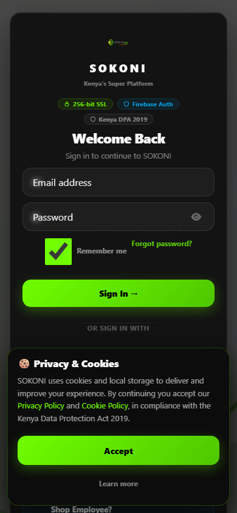

# RC1 Run — production-20260724-0917

- Backend: `production(admin)`
- Started: 2026-07-24T06:18:11.786Z
- Privileged claims: refused
- Summary: **8 pass · 0 fail · 5 blocked**

## Release Candidate Coverage

| Suite | Result |
|---|---|
| RC-01 Seller Journey | PASS (Partial) |
| RC-04 Inventory Journey | PASS (Partial) |

```
PASS:    8
FAIL:    0
BLOCKED: 5
```

**Untested capabilities:**

- Seller dashboard rendering
- Inventory mutation
- Inventory decrement
- Inventory consistency
- Realtime/offline sync

## RC-01 — Seller Journey  →  PARTIAL

- ✓ **Seed seller identity (+ seller claim actually applied)** — PASS: uid=oXrgbq2oBwadJSfsk0NypDCAXVT2, claims={"seller":true}
    - `identity`: {"type":"identity","role":"seller","uid":"oXrgbq2oBwadJSfsk0NypDCAXVT2","claims":{"seller":true}}
- ✓ **Create shop document** — PASS
    - `firestore`: {"type":"firestore","path":"shops/rc-beta-shop","doc":{"_rcSeed":true,"tier":"premium","name":"RC Beta Shop","_rcRun":"rc1","handle":"rc-beta-shop"}}
- ✓ **Upload product** — PASS
    - `firestore`: {"type":"firestore","path":"products/rc-prod-basic","doc":{"searchableTerms":["rc","test","basic","electronics"],"_rcSeed":true,"ownerRole":"seller","price":100
- ✓ **Edit product (price persists AND search contract survives)** — PASS: price=111100, 4 terms intact
    - `assertion`: {"type":"assertion","afterEdit":{"price":111100,"terms":4,"status":"active","isVisible":true}}
- ✓ **Search reflects the product (searchableTerms present)** — PASS
- ✓ **Delete product = archive (soft-delete contract)** — PASS
    - `assertion`: {"type":"assertion","afterArchive":{"status":"archived","isVisible":false}}
- ✓ **Search reflects the archive (datastore ↔ search consistency)** — PASS: archived product excluded from active results
    - `assertion`: {"type":"assertion","archivedExcludedFromActiveQuery":true,"activeIds":[]}
- ⊘ **Seller dashboard renders (UI)** — BLOCKED: seller session injection into the browser is the next backend capability
    - 

## RC-04 — Inventory Journey  →  PARTIAL

- ✓ **Seed probe product at stock 10** — PASS
    - `firestore`: {"type":"firestore","path":"products/rc-stock-10","stock":10}
- ⊘ **Place order for qty 2 (decrement path)** — BLOCKED: authoritative stock decrement runs in a Cloud Function — needs functions backend to certify 10→8
- ⊘ **Stock is now 8** — BLOCKED: stock still 10 — decrement function not exercised here
- ⊘ **Search + seller view agree on 8** — BLOCKED: stock=10; gated on decrement step
- ⊘ **Realtime + offline cache reflect change** — BLOCKED: realtime listener + IndexedDB offline assertion is a later capability
