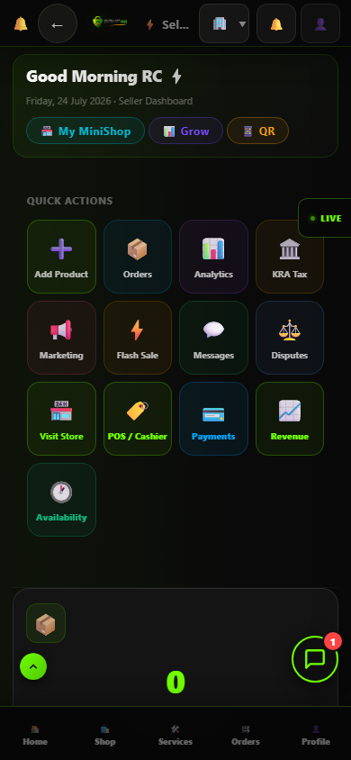

# RC1 Run — production-rc01-final

- Backend: `production(admin)`
- Started: 2026-07-24T06:36:09.586Z
- Privileged claims: refused
- Summary: **9 pass · 0 fail · 0 blocked**

## Release Candidate Coverage

| Suite | Result |
|---|---|
| RC-01 Seller Journey | PASS |

```
PASS:    9
FAIL:    0
BLOCKED: 0
```

## RC-01 — Seller Journey  →  PASS

- ✓ **Seed seller identity (+ seller claim actually applied)** — PASS: uid=oXrgbq2oBwadJSfsk0NypDCAXVT2, claims={"seller":true}
    - `identity`: {"type":"identity","role":"seller","uid":"oXrgbq2oBwadJSfsk0NypDCAXVT2","claims":{"seller":true}}
- ✓ **Create shop document** — PASS
    - `firestore`: {"type":"firestore","path":"shops/rc-beta-shop","doc":{"_rcSeed":true,"tier":"premium","name":"RC Beta Shop","_rcRun":"rc1","handle":"rc-beta-shop"}}
- ✓ **Upload product** — PASS
    - `firestore`: {"type":"firestore","path":"products/rc-prod-basic","doc":{"searchableTerms":["rc","test","basic","electronics"],"_rcSeed":true,"ownerRole":"seller","price":100
- ✓ **Edit product (price persists AND search contract survives)** — PASS: price=111100, 4 terms intact
    - `assertion`: {"type":"assertion","afterEdit":{"price":111100,"terms":4,"status":"active","isVisible":true}}
- ✓ **Search reflects the product (searchableTerms present)** — PASS
- ✓ **Delete product = archive (soft-delete contract)** — PASS
    - `assertion`: {"type":"assertion","afterArchive":{"status":"archived","isVisible":false}}
- ✓ **Search reflects the archive (datastore ↔ search consistency)** — PASS: archived product excluded from active results
    - `assertion`: {"type":"assertion","archivedExcludedFromActiveQuery":true,"activeIds":[]}
- ✓ **Seller signs in through the real login path (browser)** — PASS: uid=oXrgbq2oBwadJSfsk0NypDCAXVT2, seller claim present in ID token
    - `assertion`: {"type":"assertion","signedInUid":"oXrgbq2oBwadJSfsk0NypDCAXVT2","claims":{"name":"RC Seller","seller":true,"iss":"https://securetoken.google.com/sokoni-aeb26",
- ✓ **Seller dashboard renders for the signed-in seller** — PASS: rendered at /seller
    - 
    - `assertion`: {"type":"assertion","gated":false,"landed":"/seller","bodyLen":241700,"errors":0}
