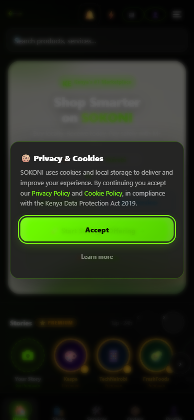
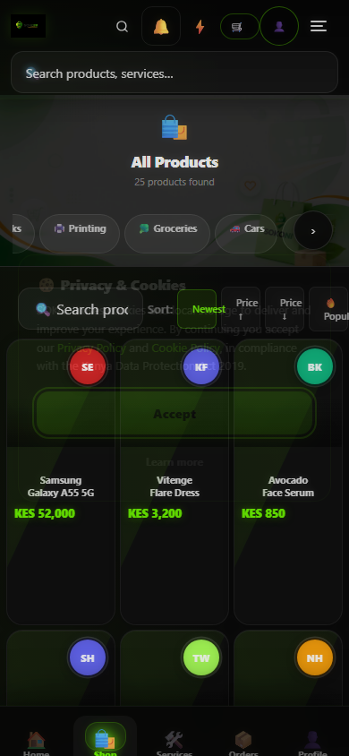
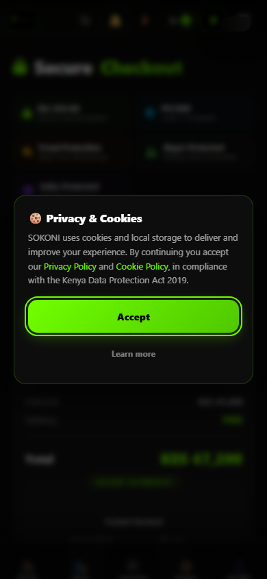

# RC1 Run — rc1-static-first

- Backend: `static(ui-only)`
- Started: 2026-07-24T05:28:57.031Z
- Privileged claims: refused
- Summary: **10 pass · 0 fail · 20 blocked**

## RC-01 — Seller Journey  →  BLOCKED

- ⊘ **Seed seller identity (+ premium claim)** — BLOCKED: static backend has no auth — run against emulator or production
- ⊘ **Create shop document** — BLOCKED: static backend cannot write Firestore
- ⊘ **Upload product** — BLOCKED: static backend cannot write Firestore
- ⊘ **Edit product (price change persists)** — BLOCKED: static backend cannot write Firestore
- ⊘ **Search reflects the product (searchableTerms present)** — BLOCKED: static backend cannot read Firestore
- ⊘ **Delete product = archive (soft-delete contract)** — BLOCKED: static backend cannot write Firestore
- ⊘ **Seller dashboard renders (UI)** — BLOCKED: seller session injection into the browser is the next backend capability
    - 

## RC-02 — Buyer Journey  →  PARTIAL

- ✓ **Home renders a product grid** — PASS: 106 card-like nodes
    - 
- ✓ **Category page renders** — PASS
    - 
- ✓ **Checkout math: subtotal = Σ price×qty** — PASS: subtotal KES 47,200 = qty-correct
    - 
    - `assertion`: {"type":"assertion","expected":47200,"shown":"KES 47,200"}
- ⊘ **Order history persists (authenticated)** — BLOCKED: static backend has no auth — run against emulator or production

## RC-03 — Payment → Subscription Journey  →  BLOCKED

- ⊘ **Payment initiated (STK push accepted)** — BLOCKED: needs live INTASEND secrets — run on staging with secrets, not locally (createCheckoutSession + IntaSend)
- ⊘ **Webhook accepted (HMAC challenge verified)** — BLOCKED: needs INTASEND_WEBHOOK_CHALLENGE to sign a valid webhook
- ⊘ **Payment state → COMPLETE** — BLOCKED: depends on webhook step, which needs secrets
- ⊘ **Subscription activated** — BLOCKED: gated on payment COMPLETE (secrets)
- ⊘ **Entitlement updated + UI reflects plan** — BLOCKED: gated on subscription activation (secrets)

## RC-04 — Inventory Journey  →  BLOCKED

- ⊘ **Seed probe product at stock 10** — BLOCKED: static backend cannot write Firestore
- ⊘ **Place order for qty 2 (decrement path)** — BLOCKED: static backend cannot write Firestore
- ⊘ **Stock is now 8** — BLOCKED: static backend cannot read Firestore
- ⊘ **Search + seller view agree on 8** — BLOCKED: static backend cannot read Firestore
- ⊘ **Realtime + offline cache reflect change** — BLOCKED: realtime listener + IndexedDB offline assertion is a later capability

## RC-05 — Search Journey  →  PARTIAL

- ✓ **Search page loads and accepts a query** — PASS
    - 
- ✓ **Input font ≥16px (no iOS zoom on the search field)** — PASS: 16px
    - `assertion`: {"type":"assertion","searchInputFontPx":16}
- ✓ **Warm-cache path present (localStorage)** — PASS: cache keys present
- ⊘ **Typo + bilingual (kiatu/viatu) resolve** — BLOCKED: synonym/typo resolution needs seeded catalog on a data backend
- ⊘ **Deleted product disappears from results** — BLOCKED: static backend cannot read Firestore

## RC-06 — PWA Journey  →  PASS

- ✓ **Manifest linked and valid** — PASS: SOKONI — Kenya's Global Marketplace, 5 icons
    - `assertion`: {"type":"assertion","name":"SOKONI — Kenya's Global Marketplace","icons":5}
- ✓ **Service worker registers** — PASS: none
    - `assertion`: {"type":"assertion","serviceWorker":"none"}
- ✓ **Offline fallback page renders** — PASS
    - 
- ✓ **Service-worker file is served and versioned** — PASS: /service-worker.js v=sokoni-20260723-app-shell-v100
    - `assertion`: {"type":"assertion","path":"/service-worker.js","bytes":49332,"version":"sokoni-20260723-app-shell-v100"}
