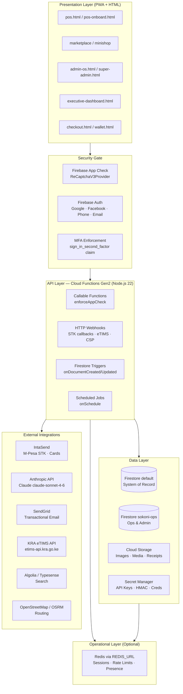
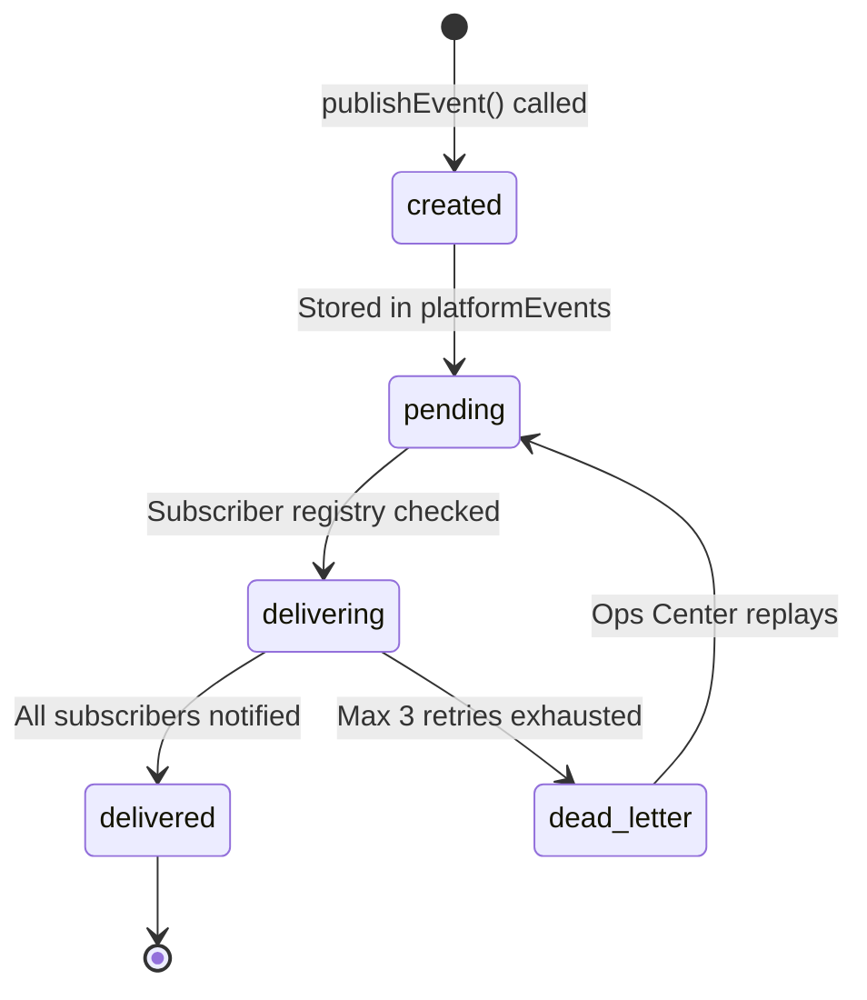
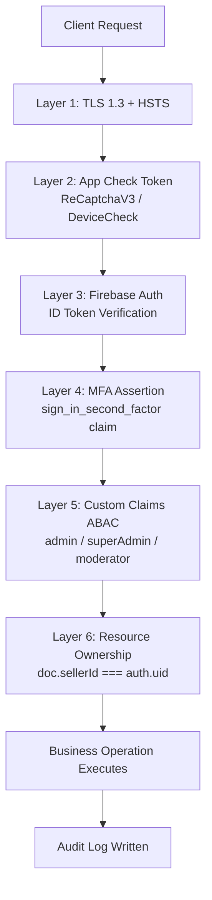
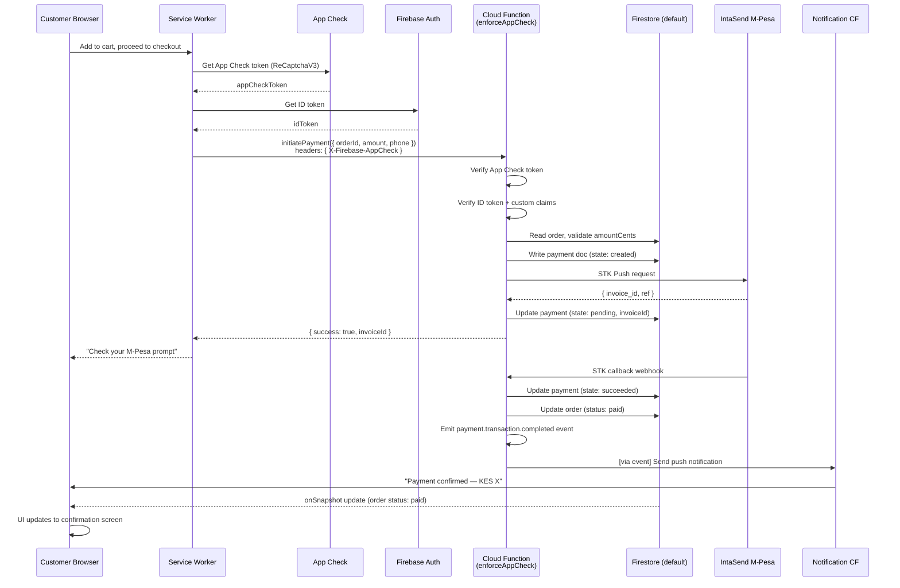
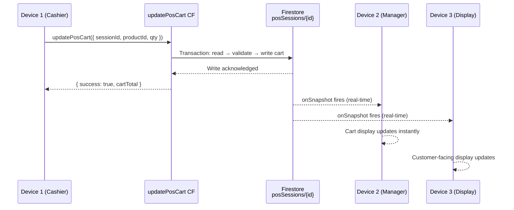
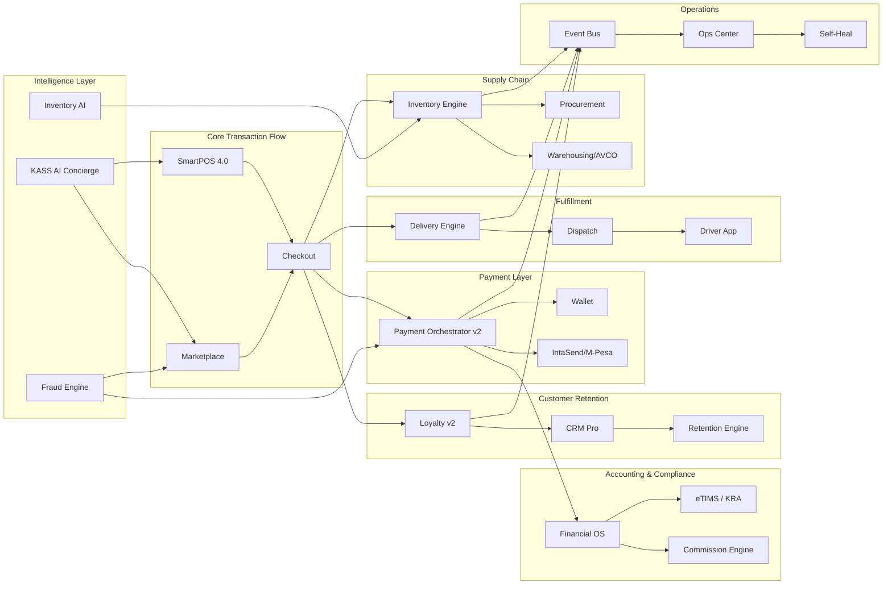

# SOKONI Commerce OS — Volume 1: Vision & Enterprise Architecture

**Version:** 1.0
**Date:** 2026-06-29
**Status:** Production
**Project:** `sokoni-aeb26`
**Author:** SOKONI Engineering Team

---

## Table of Contents

1. [Executive Summary](#1-executive-summary)
2. [Vision & Mission](#2-vision--mission)
3. [Commerce OS Philosophy](#3-commerce-os-philosophy)
4. [Business Domains](#4-business-domains)
5. [System Architecture](#5-system-architecture)
6. [Cloud Architecture](#6-cloud-architecture)
7. [Multi-Tenant Architecture](#7-multi-tenant-architecture)
8. [Event-Driven Architecture](#8-event-driven-architecture)
9. [Firestore Structure](#9-firestore-structure)
10. [Cloud Functions Architecture](#10-cloud-functions-architecture)
11. [Security Architecture](#11-security-architecture)
12. [High Availability](#12-high-availability)
13. [Scalability](#13-scalability)
14. [Data Flow](#14-data-flow)
15. [Module Relationships](#15-module-relationships)
16. [Disaster Recovery](#16-disaster-recovery)
17. [Cost Optimization](#17-cost-optimization)
18. [Performance Targets](#18-performance-targets)
19. [Future Expansion](#19-future-expansion)
20. [Cross-References](#20-cross-references)

---

## 1. Executive Summary

SOKONI is Kenya's premier cloud-native super platform — a unified digital commerce operating system purpose-built for the Kenyan market and designed to expand across East Africa. Built entirely on Google Firebase and Google Cloud infrastructure, SOKONI eliminates the fragmentation that forces Kenyan businesses to operate across multiple disconnected systems. A street-food vendor, a supermarket chain, a professional services firm, and a real-estate agency can all operate through one coherent platform with shared identity, shared payments, shared logistics, and shared intelligence.

The Commerce OS architecture — the engineering spine of SOKONI — is a collection of 700+ Cloud Functions organized into 18 tightly defined business domains, all communicating through a Firestore-backed event bus. Every module follows the same foundational contract: accept an App Check token, validate the caller's identity and custom claims, execute the business operation atomically, emit a typed platform event, and return a structured response. This design makes each module independently deployable, independently testable, and independently auditable.

SOKONI's core commercial proposition is "Unbox → Connect → Sign In → Start Selling" — a merchant should be generating revenue within minutes of onboarding. Every architectural decision is measured against this target. SmartPOS boots in under five seconds. M-Pesa STK push initiates in under three seconds. Marketplace listings go live in real time. The platform then grows with the merchant: from a single till, to a multi-branch chain, to a nationally recognized brand with AI-powered loyalty programs, automated payroll, KRA eTIMS compliance, and real-time business intelligence. SOKONI is not a point-of-sale application with a marketplace bolted on. It is a complete Commerce Operating System.

---

## 2. Vision & Mission

### Long-Term Vision

SOKONI's long-term vision is to become the foundational commerce layer for East Africa — the platform through which people discover products, access services, hire professionals, book properties, coordinate logistics, receive healthcare guidance, and manage their finances. By 2030, SOKONI aims to serve millions of active users across Kenya, Tanzania, Uganda, and Rwanda, processing billions of shillings in transactions monthly, and providing livelihoods to hundreds of thousands of merchants, drivers, and service providers.

The platform is designed so that every citizen — regardless of technical sophistication — can participate in the digital economy. A hawker using a feature phone and USSD, a boutique owner with a tablet POS, a manufacturer managing a nationwide distribution network, and a developer building on the SOKONI API are all first-class citizens of the same ecosystem.

### Mission Statement

**To build an enterprise-grade, fair, and inclusive commerce operating system that empowers every Kenyan business and individual to thrive in the digital economy.**

### Core Values

| Value | Meaning |
|-------|---------|
| **Fairness** | Driver earnings, merchant commissions, and platform fees are transparent and equitable. Drivers are not exploited. |
| **Reliability** | The platform never loses a transaction. Every payment, every order, every event is durable and auditable. |
| **Inclusivity** | Every feature works on low-bandwidth 4G connections, responsive mobile layouts, and USSD fallback. |
| **Security** | Every user's data is protected to financial-grade standards. Zero-trust is not a configuration — it is the architecture. |
| **Intelligence** | AI is embedded in operations, not bolted on. From KASS the AI concierge to inventory forecasting to fraud detection, intelligence is built in. |

### "Unbox → Connect → Sign In → Start Selling" Philosophy

The guiding product principle for merchant onboarding is zero time-to-value. A merchant who opens the onboarding wizard (`pos-onboard.html`) should be selling within minutes:

1. **Unbox** — Plug in your hardware. The Universal Terminal Driver (`pos-terminal-driver.js`) detects and configures any of eleven supported terminal vendors via WebUSB, Bluetooth, network, or software-only mode.
2. **Connect** — Register your business. The hub registration engine (`hub-register.js`) accepts 103 business categories, verifies the merchant's KYC details, and creates the tenant identity in Firestore.
3. **Sign In** — Firebase Authentication provides Google, Facebook, phone, and email login with MFA enforcement for admin roles. Custom claims (`admin`, `superAdmin`, `moderator`) are provisioned instantly.
4. **Start Selling** — The POS session opens, inventory syncs, payment terminals are linked, and the merchant appears in the marketplace. Every subsequent feature — loyalty, analytics, eTIMS, payroll — activates with a single toggle.

---

## 3. Commerce OS Philosophy

### Why a Unified OS Rather Than Multiple Vendors

A typical Kenyan SME today pays separately for a POS system, an inventory tool, an accounting package, a customer loyalty program, a delivery coordination service, and an e-commerce storefront. Each system holds a fragment of the truth, synchronisation is manual and error-prone, and the business owner spends more time reconciling data than running the business.

SOKONI's Commerce OS philosophy rejects this model completely. Every capability shares the same identity layer (Firebase Auth + custom claims), the same data store (Firestore), the same event bus (`platformEvents`), the same payment rail (IntaSend / M-Pesa), and the same AI layer (Claude via Anthropic API). There is one source of truth per business object. An inventory depletion event fired by the POS is the same event that triggers a reorder workflow, updates the marketplace listing, adjusts the AI sales forecast, and posts the accounting entry — automatically, without human intervention.

### Plug-and-Play Design Principles

Each of the 18 business domains is an independently deployable module:

- **Isolation**: Each module's Cloud Functions are in a dedicated file (e.g., `functions/pos-session.js`, `functions/finos-router.js`, `functions/commission.js`). No module imports another module's internal functions.
- **Event contracts**: Modules communicate exclusively through typed platform events. Adding a new subscriber never modifies the publisher.
- **Feature flags**: The `feature-flags.js` module gates every new capability. New features roll out to 0 % of users, then 5 %, then 100 %, with instant rollback capability.
- **Registry pattern**: The `platform-registry.js` maintains 33+ capability keys. Any module can announce its capabilities at startup. Any consumer discovers capabilities without hardcoded dependencies.

### Zero-Configuration Targets

| Target | Implementation |
|--------|---------------|
| Hardware detection | `pos-terminal-driver.js` auto-discovers via WebUSB / network scan |
| Printer detection | `sokoni-universal-printer.js` tries BT → USB → Serial → Network → Browser |
| Tax configuration | eTIMS credentials auto-applied from Secret Manager on first sale |
| Analytics | Every CF emits structured JSON logs; dashboards auto-populate |
| Loyalty enrolment | Customers auto-enrolled on first purchase, SKN-XXXX card generated |

---

## 4. Business Domains

SOKONI Commerce OS is organized into 18 first-class business domains. Each domain maps to one or more Cloud Function files and one or more Firestore collection namespaces.

| # | Domain | Description | Key CF Files |
|---|--------|-------------|-------------|
| 1 | **POS** | SmartPOS 4.0 — multi-device sessions, offline-first, 11 terminal vendors | `pos-session.js`, `pos-retail.js`, `pos-accounting.js`, `pos-inventory-pro.js`, `pos-crm-pro.js`, `pos-staff-ops.js`, `pos-hq.js`, `pos-ai-assistant.js`, `pos-integrations.js`, `pos-qr.js`, `pos-zero-friction.js` |
| 2 | **Payments** | Payment Orchestrator v2 — FSM, IntaSend, M-Pesa STK, wallet, QR | `payment-orchestrator.js`, `wallet.js`, `finos-router.js` |
| 3 | **Accounting** | Double-entry ledger, WHT, VAT, reconciliation, KRA eTIMS | `pos-accounting.js`, `finos-utils.js`, `hub-etims.js`, `ecc.js` |
| 4 | **Inventory** | AVCO costing, demand forecasting, fraud, import, recall, workflows | `inventory-ai.js`, `inventory-pricing.js`, `inventory-fraud.js`, `inventory-health.js`, `inventory-import.js`, `inventory-recall.js`, `inventory-simulate.js`, `inventory-workflows.js`, `inventory-webhooks.js` |
| 5 | **Marketplace** | Multi-vendor catalogue, MiniShop, B2B wholesale, search | `minishop.js`, `minishop-campaigns.js`, `reviews.js`, `feedback.js` |
| 6 | **Loyalty** | Universal Loyalty v2 — tiers, QR cards, HMAC offline sync, AI insights | `sub-billing.js`, `commission.js`, `referral.js` |
| 7 | **Delivery** | Logistics, dispatch, driver management, GPS tracking, routing | `sokoni-dispatch.js`, `sokoni-logistics.js`, `navigation.js` |
| 8 | **AI** | KASS concierge, Creative Studio, Workflow Automation Platform | `wap.js`, `media-engine.js`, `ai-subscriptions.js`, `sasos-brain.js`, `sasos-core.js`, `sasos-enterprise.js` |
| 9 | **CRM** | Merchant success, retention engine, seller quality, customer insights | `merchant-success.js`, `retention.js`, `seller-quality.js`, `marketplace-quality.js` |
| 10 | **HR** | Kenya Payroll (PAYE/NHIF/NSSF), staff ops, manager authorization | `pos-staff-ops.js`, `procurement.js` |
| 11 | **Foundation** | Impact giving, 3-tier disbursements, separate ledger | `impact.js` |
| 12 | **Analytics** | Business metrics, product analytics, conversion, scheduled reports | `business-metrics.js`, `product-analytics.js`, `conversion-analytics.js`, `scheduled-reports.js`, `search-insights.js` |
| 13 | **Operations** | Ops Center, self-heal, system health, post-launch monitor | `operations-center.js`, `self-heal.js`, `system-health.js`, `platform-health.js`, `ops-tools.js`, `post-launch-monitor.js` |
| 14 | **APIs** | Search (Algolia + Typesense), Email (SendGrid), Event Hub, Platform Registry | `algolia-sync.js`, `typesense-sync.js`, `platform-registry.js`, `platform-events.js`, `email-service.js`, `email-triggers.js` |
| 15 | **Testing** | Release readiness, chaos engineering, smoke tests | `release-readiness.js` |
| 16 | **Certification** | SASOS billing, usage, fraud scoring, enterprise tier | `sasos-billing.js`, `sasos-usage.js`, `sasos-fraud.js`, `sasos-enterprise.js` |
| 17 | **Security** | Zero-trust, fraud engine, incident response, audit, identity | `security-zero-trust.js`, `security-fraud-engine.js`, `security-incident-response.js`, `security-audit.js`, `security-ai.js`, `trust-safety.js` |
| 18 | **Identity** | Auth, MFA, custom claims, ABAC, passkeys, TOTP | `security-identity.js`, `facebook-data-deletion.js`, `super-admin.js` |

Additional vertical hubs extend the platform: `b2b-wholesale.js`, `digital-hub.js`, `entertainment-hub.js`, `healthcare-hub.js`, `legal-hub.js`, `property-hub.js`, `vehicle-hub.js`, `education.js`, `ade.js` (Automotive & Driver Experience).

---

## 5. System Architecture

### Layered Architecture Overview



### Multi-Tenant Architecture Explanation

Every Firestore document scoped to a merchant carries a `merchantId` field (or `sellerId` in the marketplace context). Cloud Functions validate this field against the caller's Firebase Auth UID and custom claims before performing any read or write. A merchant can never read or modify another merchant's records regardless of client-side manipulation, because all enforcement happens inside Cloud Functions using the Firebase Admin SDK.

For franchise and multi-branch scenarios, AVCO inventory data is stored under `tenants/{tenantId}/inventory/{productId}` and branch-level data under `sellers/{sellerId}/branches/{branchId}`. The `pos-hq.js` module aggregates across all branches and surfaces consolidated reporting to the HQ operator.

---

## 6. Cloud Architecture

### Firebase Project

**Project ID:** `sokoni-aeb26`
**Hosting Site:** `sokoni-aeb26` (served at `mysokoni.co.ke`)
**Runtime:** Node.js 22

### Firestore Databases

SOKONI operates two Firestore databases to separate concerns and apply different security postures:

| Database | ID | Purpose | Rules File |
|----------|----|---------|------------|
| Primary | `(default)` | All business data: orders, payments, products, users, events | `firestore.rules` |
| Operations | `sokoni-ops` | Admin alerts, self-heal log, ops metrics, sensitive audit data | `firestore.rules.sokoni-ops` |

The `sokoni-ops` database has stricter rules — only Cloud Functions (Admin SDK bypass) and verified superAdmin users can read from it. This prevents any client-side data leakage of operational intelligence.

### Cloud Functions Configuration

| Parameter | Value |
|-----------|-------|
| Runtime | Node.js 22 |
| Concurrency | 80 requests per instance |
| Min instances | 0 (cost-optimized) |
| Max instances | 1,000 |
| Memory | 512 MiB (default) |
| Timeout | 60 seconds (default) |
| Region | `us-central1` (primary) |
| Generation | Gen2 (all functions) |

Memory and timeout overrides are applied at the individual CF level for long-running operations:
- Payment sweeps and reconciliation: 1 GiB / 300s
- AI inference (KASS, Creative Studio): 1 GiB / 120s
- Bulk inventory import: 2 GiB / 540s

### Firebase Hosting

Hosting is configured with `cleanUrls: true` and `trailingSlash: false`. Key URL rewrites include:

| Source Pattern | Destination |
|----------------|------------|
| `/api/chat` | `sokoniChat` CF (KASS AI concierge) |
| `/api/facebook/data-deletion` | `facebookDataDeletion` CF |
| `/shop/**` | `minishop.html` |
| `/@**` | `minishop.html` (vanity handle routing) |
| `/card/**` | `minishop-status.html` |
| `/pay/**` | `pay.html` |

### Security Headers

Every response carries a full production security header suite:

| Header | Value |
|--------|-------|
| `Content-Security-Policy` | Full CSP with explicit allowlist; reports to `cspReportCollect` CF |
| `Strict-Transport-Security` | `max-age=63072000; includeSubDomains; preload` |
| `X-Frame-Options` | `SAMEORIGIN` |
| `X-Content-Type-Options` | `nosniff` |
| `Permissions-Policy` | Minimal permissions; gyroscope/magnetometer/accelerometer denied |
| `Cross-Origin-Opener-Policy` | `same-origin-allow-popups` |
| `Cross-Origin-Embedder-Policy` | `require-corp` |
| `Referrer-Policy` | `strict-origin-when-cross-origin` |

HTML pages: `no-cache, no-store` (never stale). JS/CSS: `max-age=604800` with `stale-while-revalidate`. Images/fonts: `max-age=2592000`. Service worker: `no-store` (also sets `CDN-Cache-Control: no-store` and `Cloudflare-CDN-Cache-Control: no-store` to prevent CDN caching issues).

### Secret Manager

All secrets are stored in Google Secret Manager and accessed via `defineSecret()` in Cloud Functions. Secrets are never embedded in source code or environment files.

| Secret | Purpose |
|--------|---------|
| `ANTHROPIC_API_KEY` | Claude AI inference (KASS, POS AI, inventory AI) |
| `INTASEND_PRIVATE_KEY` | IntaSend payment SDK — M-Pesa STK + card processing |
| `AT_API_KEY` | Africa's Talking SMS/USSD gateway |
| `AT_USERNAME` | Africa's Talking account |
| `ALGOLIA_ADMIN_KEY` | Algolia search index administration |
| `SOKONI_HMAC_KEY` | Platform-wide HMAC signing (QR codes, webhooks) |
| `SENDGRID_API_KEY` | Transactional email (53 templates, 26 trigger CFs) |
| `REDIS_URL` | Redis connection string (optional — degrades gracefully) |
| `LOYALTY_HMAC_SECRET` | HMAC for offline loyalty card verification |
| `PAYMENT_HMAC_SECRET` | Payment idempotency seal |
| `PAYROLL_ENCRYPTION_KEY` | AES-256-GCM encryption for payroll data |

---

## 7. Multi-Tenant Architecture

### Scoping Strategy

Multi-tenancy in SOKONI is implemented through document-level field scoping rather than database-level isolation. This allows cross-tenant queries (e.g., marketplace search) while maintaining strict data access control at the CF layer.

| Scope Level | Field | Example |
|-------------|-------|---------|
| Seller/Merchant | `sellerId` | Products, orders, sessions, inventory |
| User | `uid` / `userId` | Carts, wishlist, notifications, reviews |
| Driver | `driverId` | Rides, packages, earnings, ratings |
| Provider | `providerId` | Bookings, availability slots, services |
| Branch | `branchId` | Branch-level sales, stock, staff |
| Tenant | `tenantId` | AVCO inventory under `tenants/{tenantId}` |

### Security Enforcement

```
Client Request
    │
    ▼
App Check Token Validation (CF middleware)
    │
    ▼
Firebase Auth Token Verification
    │
    ▼
Custom Claims Check (admin / superAdmin / moderator)
    │
    ▼
Resource-Level Ownership Check (doc.sellerId === auth.uid)
    │
    ▼
Business Operation Executes (Admin SDK, bypasses Firestore rules)
```

No Cloud Function executes a business operation until all four layers above have passed. This means that even if Firestore security rules were misconfigured, the CF layer would prevent unauthorized access.

### Branch-Level Isolation

For multi-branch merchants (`pos-hq.js`):

- Each branch has its own POS device registry under `sellers/{sellerId}/devices/{deviceId}`
- Branch stock is isolated under `sellers/{sellerId}/branches/{branchId}/inventory`
- Branch sales report to `sellers/{sellerId}/branchSales/{date}` daily
- HQ aggregates all branches in real time; branch managers see only their branch

---

## 8. Event-Driven Architecture

### Platform Event Bus

All inter-module communication happens through typed, durable platform events stored in `platformEvents/{eventId}`. No module calls another module's Cloud Functions directly. This guarantees:

- **Loose coupling**: Adding a new module never requires changes to existing modules
- **Audit trail**: Every business action leaves a permanent event record
- **Replay capability**: Dead-letter events can be replayed from the `sokoni-ops` database
- **Fan-out**: One event can trigger N subscribers in parallel

**Source file:** `functions/platform-events.js`

### Event Lifecycle



### Event Naming Convention

All events follow the convention `domain.noun.verb` (lowercase, past tense):

```
order.order.created
order.order.completed
payment.transaction.completed
payment.transaction.failed
pos.session.opened
pos.cart.updated
pos.sale.completed
delivery.rider.assigned
delivery.package.delivered
inventory.stock.depleted
inventory.stock.low
foundation.donation.received
loyalty.points.credited
loyalty.tier.upgraded
```

### Canonical Event Triggers

| Event | Emitted By | Primary Subscribers |
|-------|------------|---------------------|
| `order.order.created` | Checkout CF | Inventory engine, notification engine, commission engine |
| `order.order.completed` | Delivery CF | Loyalty engine, accounting, eTIMS |
| `payment.transaction.completed` | Payment Orchestrator | Order engine, wallet, seller dashboard |
| `payment.transaction.failed` | Payment Orchestrator | Notification engine, fraud engine |
| `pos.sale.completed` | `pos-retail.js` | Inventory sync, eTIMS, accounting |
| `inventory.stock.depleted` | Inventory health CF | Procurement trigger, merchant notification |
| `delivery.rider.assigned` | `sokoni-dispatch.js` | Customer notification, GPS tracking |

### Scheduled Functions

| Function | Schedule | Purpose |
|----------|----------|---------|
| `paymentTimeoutSweep` | Every 5 minutes | Auto-fail payments stuck >30 minutes |
| `snapshotPlatformMetrics` | Every 5 minutes | Record ops metrics; auto-replay >100 dead events |
| `posSessionCleanup` | Every 6 hours | Close POS sessions idle >24 hours |
| `eventBusCleanup` | Daily | Delete delivered events >30d, dead >90d |
| `scheduledDailyOpsReport` | Daily 06:00 EAT | Generate and email daily ops digest |
| `recordHealthSnapshot` | Every 15 minutes | Write system health to `sokoni-ops` |

---

## 9. Firestore Structure

### Primary Database — `(default)` — Key Collections

| Collection | Purpose | Key Fields |
|-----------|---------|------------|
| `orders` | All marketplace and POS orders | `uid`, `sellerId`, `status`, `createdAt`, `amountCents` |
| `payments` | Payment lifecycle via Orchestrator v2 | `orderId`, `state`, `provider`, `idempotencyKey`, `history[]` |
| `products` | Merchant product catalogue | `sellerId`, `category`, `price`, `stock`, `status` |
| `sellers` | Seller / merchant profiles | `uid`, `status`, `tier`, `verificationStatus` |
| `users` | Customer profiles | `uid`, `phone`, `email`, `loyaltyTier`, `referralCode` |
| `platformEvents` | Event bus log | `type`, `payload`, `status`, `correlationId`, `attempts` |
| `eventSubscribers` | Event bus subscriber registry | `subscriberId`, `eventTypes[]`, `endpoint` |
| `posSessions` | SmartPOS multi-device sessions | `merchantId`, `devices{}`, `cart{}`, `memberUids[]`, `status` |
| `notifications` | Push/in-app notifications | `targetUid`, `type`, `priority`, `read`, `createdAt` |
| `conversations` | Business messaging threads | `participants[]`, `lastAt`, `type` |
| `reviews` | Product and seller reviews | `productId`, `sellerId`, `rating`, `uid`, `verified` |
| `auditLogs` | Immutable security audit trail | `uid`, `action`, `sellerUid`, `ts`, `ip` |
| `disputes` | Order and payment disputes | `orderId`, `status`, `createdAt`, `resolution` |
| `bookings` | Service and venue bookings | `providerId`, `slotId`, `status`, `createdAt` |
| `providers` | Service provider profiles | `status`, `category`, `location`, `rating` |
| `rides` | Ride-hailing journeys | `uid`, `driverId`, `status`, `fare` |
| `rideRequests` | Ride matching queue | `uid`, `driverId`, `assignedDriverId`, `status` |
| `rideDrivers` | Driver availability registry | `isOnline`, `location`, `updatedAt` |
| `driverLocations` | Real-time GPS positions | `driverId`, `lat`, `lng`, `updatedAt` |
| `driverRatings` | Driver rating records | `driverId`, `rating`, `createdAt` |
| `packageRequests` | Courier delivery requests | `uid`, `sellerUid`, `assignedDriverId`, `status` |
| `workflowInstances` | WAP workflow execution log | `definitionId`, `status`, `metadata.startedAt` |
| `workflowApprovals` | Manager approval queue | `status`, `requestedAt` |
| `applications` | Seller/provider applications | `status`, `type`, `createdAt` |
| `referrals` | Referral tracking | `referrerUid`, `refereeUid`, `createdAt`, `status` |
| `communityPosts` | Community feed | `type`, `status`, `timestamp` |
| `opsMetrics` | 5-minute system snapshots | `orders_active`, `payments_today`, `pos_open_sessions` |
| `entArtists` | Entertainment hub artists | `type`, `city`, `genre` |
| `services` | Service listings | `category`, `providerId`, `rating` |

### Operations Database — `sokoni-ops` — Collections

| Collection | Purpose |
|-----------|---------|
| `adminAlerts` | System and security alerts for ops team |
| `selfHealLog` | Immutable log of all self-healing actions taken |
| `opsMetrics` | High-frequency ops metrics (write-heavy, isolated from business DB) |
| `securityEvents` | Security incident records (ABAC violations, rate limit triggers) |
| `auditTrail` | Admin action audit trail (superAdmin only read) |

### Subcollection Patterns

| Parent Collection | Subcollection | Purpose |
|------------------|--------------|---------|
| `sellers/{sellerId}` | `branches/{branchId}` | Branch-level data isolation |
| `sellers/{sellerId}` | `devices/{deviceId}` | POS device registry |
| `sellers/{sellerId}` | `branchSales/{date}` | Daily branch sales aggregates |
| `tenants/{tenantId}` | `inventory/{productId}` | AVCO-costed inventory per tenant |
| `orders/{orderId}` | `items/{itemId}` | Order line items |
| `posSessions/{sessionId}` | `transactions/{txId}` | POS session transaction log |

### Index Strategy

The platform maintains a precisely managed index budget (targeting 197+ composite indexes across the `(default)` database). Index governance rules:

- Every new collection requires a documented index plan before deployment
- Cross-collection collection-group queries use `COLLECTION_GROUP` scope
- High-cardinality filter fields are always the leading index field
- `createdAt DESCENDING` is the universal secondary sort field for time-series queries

---

## 10. Cloud Functions Architecture

### Scale and Organisation

SOKONI operates 700+ Cloud Functions across 158 source files in the `functions/` directory. All functions are Firebase Gen2, running on Node.js 22 with the `firebase-functions/v2` SDK.

### Module File Map

```
functions/
├── index.js                    # Entry point; KASS AI, auth management, MFA
├── pos-session.js              # POS session create/join/close (multi-device)
├── pos-retail.js               # POS sale processing, cart, receipt
├── pos-accounting.js           # Daily close, P&L, cash drawer
├── pos-inventory-pro.js        # POS-linked inventory sync
├── pos-crm-pro.js              # POS-linked CRM (loyalty lookup at till)
├── pos-staff-ops.js            # Staff clock-in/out, PIN, payroll inputs
├── pos-hq.js                   # Multi-branch aggregation, HQ dashboard
├── pos-ai-assistant.js         # AI suggestions at till (Claude Haiku)
├── pos-integrations.js         # Third-party POS integrations
├── pos-qr.js                   # POS payment QR generation + verification
├── pos-zero-friction.js        # One-tap checkout, quick-sale mode
├── payment-orchestrator.js     # Payment FSM, idempotency, provider routing
├── wallet.js                   # Internal wallet: top-up, deduct, transfer
├── finos-router.js             # Financial OS routing + orchestration
├── finos-utils.js              # Double-entry ledger utilities
├── hub-etims.js                # KRA eTIMS filing for all hub types
├── ecc.js                      # eTIMS credential management (AES-256-GCM)
├── inventory-ai.js             # Demand forecasting (Claude)
├── inventory-pricing.js        # Dynamic pricing engine
├── inventory-fraud.js          # Stock manipulation detection
├── inventory-health.js         # Reorder triggers, depletion alerts
├── inventory-import.js         # Bulk CSV/XLSX import
├── inventory-recall.js         # Product recall workflows
├── inventory-simulate.js       # What-if inventory simulations
├── inventory-workflows.js      # Automated reorder workflows
├── inventory-webhooks.js       # Supplier webhook receivers
├── commission.js               # 6-model commission engine
├── sub-billing.js              # Subscription lifecycle (TRIALING→GRACE→EXPIRED)
├── referral.js                 # Referral code generation and reward triggering
├── reviews.js                  # Review submission, moderation, aggregation
├── disputes.js                 # Order/payment dispute workflow
├── trust-safety.js             # Content moderation, seller bans, appeals
├── security-zero-trust.js      # Zero-trust policy enforcement
├── security-fraud-engine.js    # Real-time fraud scoring
├── security-incident-response.js # Incident classification and escalation
├── security-audit.js           # ABAC audit log writer
├── security-ai.js              # AI-powered anomaly detection
├── security-identity.js        # ABAC, TOTP, passkeys, claim management
├── operations-center.js        # Ops dashboard data APIs
├── self-heal.js                # Scheduled self-healing routines
├── system-health.js            # System health snapshot CFs
├── platform-health.js          # Cross-module health aggregation
├── platform-events.js          # Event bus: publish, subscribe, fan-out
├── platform-registry.js        # Capability registry (33+ keys)
├── algolia-sync.js             # Real-time Algolia index sync
├── typesense-sync.js           # Typesense fallback sync
├── email-service.js            # SendGrid transactional email
├── email-triggers.js           # Firestore-triggered email sends
├── sokoni-dispatch.js          # Delivery dispatch and rider assignment
├── sokoni-logistics.js         # Logistics pricing and tracking
├── navigation.js               # GPS routing (OSRM integration)
├── wap.js                      # Workflow Automation Platform
├── impact.js                   # Foundation / CSR disbursements
├── messages.js                 # Business messaging (transaction-gated)
├── merchant-success.js         # Merchant growth coaching (AI)
├── seller-quality.js           # Seller rating and quality gates
├── retention.js                # Customer retention engine
├── business-metrics.js         # KPI aggregation
├── product-analytics.js        # Product-level analytics
├── scheduled-reports.js        # Automated report generation
├── release-readiness.js        # Pre-release checklist automation
├── redis-layer.js              # Redis SDK wrapper (11 services)
├── redis-service.js            # Redis connection management
└── ... (+ hub-specific files)
```

### enforceAppCheck Pattern

Every callable Cloud Function follows the same App Check enforcement pattern:

```javascript
exports.myFunction = onCall(
  { enforceAppCheck: true, secrets: [RELEVANT_SECRET] },
  async (request) => {
    // App Check is already validated by Firebase before this runs
    const { auth, data } = request;
    if (!auth?.uid) throw new HttpsError("unauthenticated", "Login required.");
    // ... business logic
  }
);
```

HTTP endpoint functions (webhooks, payment callbacks) use manual App Check token verification where the calling party is a trusted external service rather than a Firebase client.

### Naming Conventions

| Pattern | Example | Usage |
|---------|---------|-------|
| `verb + Noun` | `createPosSession`, `updatePosCart` | Callable functions |
| `on + Entity + Event` | `onOrderCreated`, `onPaymentUpdated` | Firestore triggers |
| `scheduled + Description` | `scheduledDailyOpsReport` | Scheduled functions |
| `noun + Verb` | `cspReportCollect` | HTTP endpoint receivers |

---

## 11. Security Architecture

### Defence-in-Depth Stack

SOKONI implements a six-layer security model. Every request must pass all applicable layers before any data is touched.



### App Check

All Cloud Functions are deployed with `enforceAppCheck: true`. Firebase App Check uses ReCaptchaV3 on web (configured in `sokoni-appcheck.js` with `ReCaptchaV3Provider`). This prevents automated abuse of Cloud Functions from non-app clients.

### Custom Claims ABAC

Custom claims are set via `grantAdminClaim` / `revokeAdminClaim` functions in `index.js` and `security-identity.js`. MFA is required before any claim mutation.

| Claim | Holder | Access |
|-------|--------|--------|
| `admin: true` | Platform admins | Full read/write across all merchant data |
| `superAdmin: true` | Founders | Full platform + claim management |
| `moderator: true` | Trust & safety team | Content moderation, seller suspension |
| No claim | Regular user | Own data only |

### Rate Limiting

Rate limiting is implemented at two levels:

1. **Redis-backed** (preferred): `RateLimitService` in `redis-layer.js` maintains sliding window counters per UID + IP combination. Resets automatically. Zero Firestore cost.
2. **Firestore fallback**: When Redis is unavailable, rate limit counters fall back to `rateLimits/{uid}` documents in Firestore, checked and incremented atomically.

Payment endpoints carry stricter rate limits: 10 STK push attempts per user per hour, enforced by dual UID+IP rate limit window.

### HMAC Seals

Sensitive operations (QR codes, webhook payloads, loyalty card sync) carry HMAC-SHA256 seals generated from `SOKONI_HMAC_KEY` or operation-specific secrets:

| Operation | Secret | Algorithm |
|-----------|--------|-----------|
| POS payment QR | `QR_SIGNING_SECRET` | HMAC-SHA256 |
| Loyalty offline sync | `LOYALTY_HMAC_SECRET` | HMAC-SHA256 |
| Payment idempotency | `PAYMENT_HMAC_SECRET` | HMAC-SHA256 |
| Webhook verification | `SOKONI_HMAC_KEY` | HMAC-SHA256 |

### AES-256-GCM Encryption

Payroll data and KRA eTIMS credentials are encrypted at rest using AES-256-GCM before being written to Firestore:

- `PAYROLL_ENCRYPTION_KEY` encrypts all PAYE/NHIF/NSSF computation inputs
- eTIMS credentials encrypted via `ecc.js` (eTIMS Credential Controller) before storage under `etims_credentials/{merchantId}`

### Content Security Policy

The `Content-Security-Policy` header restricts all executable content to an explicit allowlist. The CSP violation endpoint (`cspReportCollect` CF) collects and logs all violations to `sokoni-ops` for analysis. A report-only shadow policy is also deployed for testing stricter future rules.

---

## 12. High Availability

### Firebase SLA

Google Firebase provides a 99.95% uptime SLA for Firestore, Cloud Functions, and Firebase Hosting. This translates to a maximum of 4.38 hours downtime per year under normal operation.

### Multi-Region Considerations

The current deployment uses:

- **Cloud Functions**: `us-central1` (primary region)
- **Firestore**: Regional database (configurable to multi-region `nam5` for 99.999% SLA)
- **Firebase Hosting**: Global CDN via Cloudflare, automatic edge caching

For Kenya-optimised latency, `africa-south1` (Johannesburg) is the target region for a future deployment update. Traffic from Nairobi to `us-central1` currently averages 180-220ms RTT; `africa-south1` would reduce this to ~40ms.

### Offline-First Design

SmartPOS operates fully offline using IndexedDB as the primary data store during connectivity loss:

- Cart operations: IndexedDB only
- Receipt printing: IndexedDB queue
- Customer lookup: Pre-fetched to IndexedDB at session start
- Sync on reconnect: `pos-sync.js` flushes the IndexedDB queue to Firestore, with conflict resolution favouring server state for financial records

KASS (the AI concierge) shows a connectivity status indicator and queues unanswered queries for replay when 3 consecutive failures are detected.

### Self-Healing Engine

The Operations Center (`operations-center.js`) and `self-heal.js` implement automated recovery for known failure modes:

| Failure Mode | Detection | Auto-Recovery |
|-------------|-----------|--------------|
| Stuck payments (>30 min in `pending`) | `paymentTimeoutSweep` every 5m | Auto-transition to `failed`; notify merchant |
| Dead-letter events (>100 accumulated) | `snapshotPlatformMetrics` every 5m | Auto-replay all dead events |
| Stale POS sessions (idle >24h) | `posSessionCleanup` every 6h | Force close; notify connected devices |
| Redis unavailability | Every service call checks connection | Automatic fallback to Firestore; `{ fallback: true }` returned |
| CSP violations (spike) | `cspReportCollect` aggregation | Alert written to `adminAlerts` in `sokoni-ops` |

All self-healing actions are written to `selfHealLog` in `sokoni-ops` with full context (actor: `SYSTEM`, timestamp, affected records) for post-incident review.

---

## 13. Scalability

### Single Shop to National Chain

SOKONI's data model is designed to support the full growth journey of a merchant without schema migrations:

| Stage | Configuration | Scale |
|-------|--------------|-------|
| Solo hawker | Single POS device, no staff | 1 device, 1 `posSessions` document |
| Small shop | 1-3 devices, owner as manager | Same schema, `devices{}` map grows |
| Multi-till retail | Staff management, daily close | `pos-staff-ops.js` activates, branch schema |
| Multi-branch chain | HQ dashboard, centralized inventory | `pos-hq.js` aggregates `branchSales` subcollections |
| National franchise | AVCO costing, separate tenant | `tenants/{tenantId}` subtree, consolidated analytics |

### Firestore Horizontal Scaling

Firestore automatically shards at approximately 1 write per second per document. SOKONI avoids this limit by:

- Using collection-level aggregation (never updating a single "counter" document on every order)
- Writing to user/seller-specific documents (natural sharding by `uid`/`sellerId`)
- Using Cloud Functions to batch-aggregate metrics into time-bucketed documents (hourly, daily)
- Deferring non-critical aggregation to scheduled functions (`scheduledDailyOpsReport`)

### Cloud Function Auto-Scaling

Cloud Functions Gen2 scales from 0 to 1,000 instances per function automatically. The `concurrency: 80` setting means each instance handles up to 80 simultaneous requests, so the platform can handle 80,000 simultaneous CF requests before hitting the instance cap. For most Kenyan traffic patterns, peak load is expected to hit 5,000-10,000 concurrent requests.

### Index Budget Management

Firestore's 200-index limit per database is actively managed. The platform currently uses 197 composite indexes in the `(default)` database. Governance rules:

- New collections require a documented index plan before deployment
- Indexes for Phase 2 search candidates (high-cardinality full-text) are delegated to Algolia/Typesense
- Index rationalization review runs quarterly

---

## 14. Data Flow

### Standard Customer Purchase Flow



### POS Real-Time Cart Sync Flow



---

## 15. Module Relationships



---

## 16. Disaster Recovery

### Recovery Point Objective (RPO) and Recovery Time Objective (RTO)

| Scenario | RPO | RTO | Mechanism |
|----------|-----|-----|-----------|
| Firestore document corruption | < 1 minute | < 30 minutes | PITR (Point-in-Time Recovery) enabled |
| CF deployment failure | 0 | < 5 minutes | Firebase Hosting serves cached static; CFs can be rolled back per-function |
| Redis failure | 0 | 0 (automatic) | All Redis services degrade to Firestore fallback with `{ fallback: true }` |
| Hosting CDN failure | 0 | < 1 minute | Firebase Hosting CDN is multi-region |
| IntaSend / M-Pesa outage | 0 | Dependent on provider | Payment Orchestrator returns `failed` state; wallet fallback available |
| Secret Manager access failure | 0 | < 10 minutes | CFs with unavailable secrets will fail cold; secret caching via `defineSecret()` per warm instance |

### Point-in-Time Recovery (PITR)

PITR is enabled on the Firestore `(default)` database with a 7-day recovery window. This allows restoring any collection to any point within the past 7 days in the event of accidental deletion or data corruption. The `sokoni-ops` database also has PITR enabled.

### Chaos Engineering

The `release-readiness.js` module includes chaos testing automation:

- **Weekly chaos runs**: Simulate stuck payment events, inventory depletion cascades, and POS session orphaning
- **Chaos scenarios**: Network latency injection, Firestore write failures, Redis outage simulation
- **Pass criteria**: System must recover to a consistent state within the RTO targets above
- **Results**: Written to `chaosTestResults/{runId}` in `sokoni-ops`

### Backup Strategy

| Data | Backup Method | Frequency | Retention |
|------|--------------|-----------|-----------|
| Firestore (default) | PITR + Cloud Backup | Continuous / Daily export | 7 days PITR, 30 days export |
| Firestore sokoni-ops | PITR | Continuous | 7 days |
| Cloud Storage (media) | Google Cloud Storage versioning | On write | 30 days for deleted objects |
| Secret Manager | GCP-managed replication | Automatic | Multi-region |
| Firestore indexes config | Git repository | On commit | Indefinite |

---

## 17. Cost Optimization

### Firebase Blaze Plan (Pay-as-You-Go)

The platform operates on Firebase Blaze plan. Free tier allotments cover development and light staging traffic; production workloads are billed on usage.

Key cost drivers and mitigations:

| Cost Driver | Mitigation |
|-------------|-----------|
| Firestore reads | Redis caching via `CacheService` (search results, AI responses, computed aggregates cached up to 5 minutes) |
| CF invocations | Event bus batching; scheduled aggregation replaces per-request reads |
| Cloud Storage egress | Firebase Hosting serves static assets; Storage is for user-uploaded media only |
| Algolia operations | `algolia-reconcile.js` deduplicates writes; bulk indexing on bulk imports |
| Anthropic API calls | Claude Haiku used for high-frequency tasks (loyalty insights, POS suggestions); Sonnet reserved for complex reasoning |

### Firestore Read Optimization

| Technique | Implementation |
|-----------|---------------|
| Projection queries | Only `fieldPath` fields used by the UI are fetched; PII fields excluded from list queries |
| Pagination | All list endpoints paginate with `startAfter(lastDoc)` and `limit(20)` |
| Aggregation queries | `count()` and `sum()` aggregations used instead of fetching all documents |
| `onSnapshot` scope | POS sessions listen only to the single session document, not the entire collection |
| Compound indexes | Composite indexes prevent collection scans on filtered+sorted queries |

### Index Cost Management

Each composite index adds a small ongoing storage cost. The 200-index cap also forces architectural discipline:

- Phase 2 full-text search candidates are routed to Algolia (zero Firestore index cost)
- Redundant indexes are quarterly reviewed and dropped
- `firestore.indexes.sokoni-ops.json` maintains a separate, minimal index set for the ops database

---

## 18. Performance Targets

### System-Wide Targets

| Metric | Target | Measurement Point |
|--------|--------|------------------|
| `bootstrapDevice` CF (POS cold start) | < 5 seconds | CF execution time from first call |
| `deviceHeartbeat` CF (POS keepalive) | < 200ms | CF execution time on warm instance |
| `initiatePayment` CF (STK push) | < 3 seconds | Time from CF entry to IntaSend response |
| `updatePosCart` CF | < 150ms | CF execution time |
| POS cart sync to all devices | < 100ms | Firestore `onSnapshot` propagation |
| Marketplace page load (4G, cached SW) | < 2 seconds | Lighthouse TTI |
| Marketplace page load (first visit) | < 4 seconds | Lighthouse TTI |
| `sokoniChat` (KASS, simple query) | < 2 seconds | CF execution, Claude Haiku |
| `sokoniChat` (KASS, complex query) | < 8 seconds | CF execution, Claude Sonnet |
| Firestore document read (warm) | < 50ms | Admin SDK `get()` |
| Gen2 CF cold start | < 500ms | Measured from Cloudflare edge |

### Cache and Asset Targets

| Asset Type | Cache Duration | Header |
|-----------|----------------|--------|
| HTML pages | No cache | `no-cache, no-store, must-revalidate` |
| JS / CSS | 7 days + revalidate | `max-age=604800, stale-while-revalidate=86400` |
| Images / fonts | 30 days | `max-age=2592000` |
| Service worker | No cache | `no-store` + CDN bypass headers |
| Payment/auth pages | No cache, private | `no-store, private` |

### Progressive Web App Targets

- Service worker version: `sw-v301` (incremented on every deploy)
- Offline capability: Core POS and catalogue browsing work fully offline
- Install prompt: PWA manifest served with `max-age=86400`
- Push notifications: Firebase Cloud Messaging (FCM) registered in service worker

---

## 19. Future Expansion

### Multi-Country Rollout

The platform architecture supports multi-country expansion without codebase changes. Required additions per new country:

| Component | Change Required |
|-----------|----------------|
| Payment rails | Add country-specific IntaSend node or direct mobile money integration |
| Tax compliance | Add country-specific tax engine (analogous to `hub-etims.js`) |
| Currency | `amountCents` is currency-agnostic; add `currency` field to payment documents |
| Phone format | Update phone validation regex per country (already parameterized) |
| Language | i18n string table per language code (Swahili already supported in KASS) |

**Target markets:** Tanzania (TZS), Uganda (UGX), Rwanda (RWF) — planned for 2027.

### Additional Payment Rails

| Rail | Status | Target |
|------|--------|--------|
| M-Pesa Kenya (IntaSend) | Live | — |
| Card (IntaSend) | Live | — |
| Internal wallet | Live | — |
| Airtel Money | Planned | 2026 Q4 |
| Equity Bank EazzyPay | Planned | 2027 Q1 |
| M-Pesa Tanzania | Planned (multi-country) | 2027 |
| Bank transfer (RTGS) | Stub in Orchestrator | 2027 |

### B2B Network

`functions/b2b-wholesale.js` (12 CFs) provides the foundation for a business-to-business wholesale marketplace. Planned expansions:

- Supplier onboarding portal with KYC and credit scoring
- Bulk order management with AVCO costing integration
- Invoice factoring and B2B BNPL (Buy Now Pay Later)
- Electronic invoicing via KRA eTIMS B2B flag

### White-Label Platform

The `sasos-*.js` module family (SokonI As A Service OS) implements the white-label tier:

- `sasos-core.js`: Tenant provisioning and isolation
- `sasos-billing.js`: White-label billing and usage metering
- `sasos-enterprise.js`: Enterprise features (custom domains, branded POS, dedicated instances)
- `sasos-brain.js`: AI model customization per tenant
- `sasos-fraud.js`: Per-tenant fraud model tuning

White-label partners get their own Firebase Hosting site, branded PWA, and isolated Firestore namespace while sharing the underlying Cloud Function infrastructure.

### Planned Capabilities

| Feature | Module | Target |
|---------|--------|--------|
| USSD interface (feature phone) | `ussd-gateway.js` (planned) | 2027 Q1 |
| Biometric payments (fingerprint at POS) | `pos-biometric.js` (planned) | 2027 Q1 |
| Credit scoring | `credit-engine.js` (planned) | 2027 Q2 |
| Savings and investment products | `sokoni-save.js` (planned) | 2027 Q3 |
| Health insurance micro-products | `healthcare-hub.js` extension | 2027 Q2 |
| Digital driving licence (NTSA integration) | `ade.js` extension | 2026 Q4 |

---

## 20. Cross-References

This volume is part of the SOKONI Commerce OS Documentation Suite. Related volumes:

| Volume | Topic | Link |
|--------|-------|------|
| Volume 2 | Identity, Authentication & Zero-Trust Security | [[vol-02-identity-security]] |
| Volume 3 | SmartPOS 4.0 — Enterprise Point of Sale | [[vol-03-pos-enterprise]] |
| Volume 4 | Payment Orchestrator v2 & Financial OS | [[vol-04-payments]] |
| Volume 5 | Inventory Engine & Supply Chain | [[vol-05-inventory]] |
| Volume 6 | Marketplace, MiniShop & Search | [[vol-06-marketplace]] |
| Volume 7 | Universal Loyalty & CRM | [[vol-07-loyalty-crm]] |
| Volume 8 | Delivery, Dispatch & Driver Platform | [[vol-08-delivery]] |
| Volume 9 | AI Capabilities — KASS, Creative Studio & WAP | [[vol-09-ai]] |
| Volume 10 | Analytics, Operations & Self-Healing | [[vol-10-analytics-ops]] |
| Volume 11 | HR, Payroll & Commerce Compliance (eTIMS) | [[vol-11-hr-compliance]] |
| Volume 12 | SASOS — White-Label & B2B Wholesale | [[vol-12-sasos-b2b]] |

### Related Existing Documentation

- [[ARCHITECTURE]] — Enterprise Architecture v2.0 (technical reference)
- [[Payments]] — M-Pesa and IntaSend integration details
- [[SmartPOS]] — Full POS feature documentation
- [[Security]] — Firestore security rules and access control matrix
- [[Events]] — Platform event types and subscriber registry
- [[Deployment]] — Firebase deploy procedures and release runbook
- [[Redis]] — Redis layer setup and graceful fallback behaviour
- [[CHANGELOG]] — Version history and change log

---

*This document is part of the SOKONI Commerce OS Documentation Suite maintained in the `/docs` Obsidian vault. Every architecture change must be reflected here within one sprint of deployment. Last updated: 2026-06-29.*
