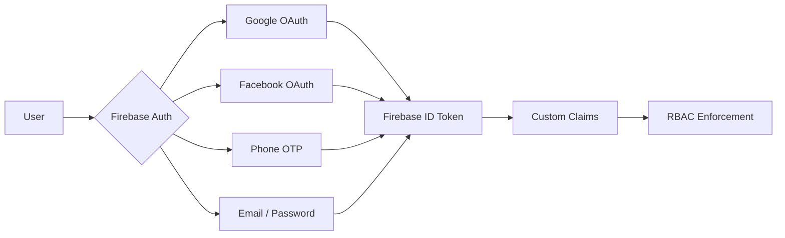
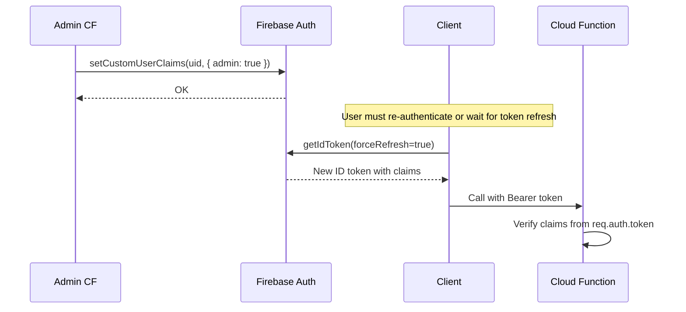
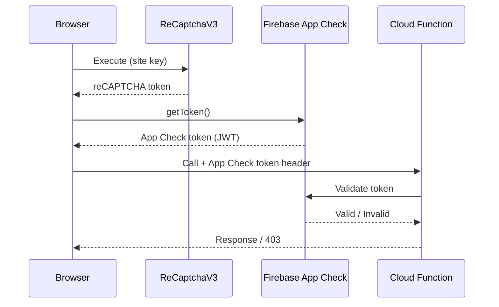
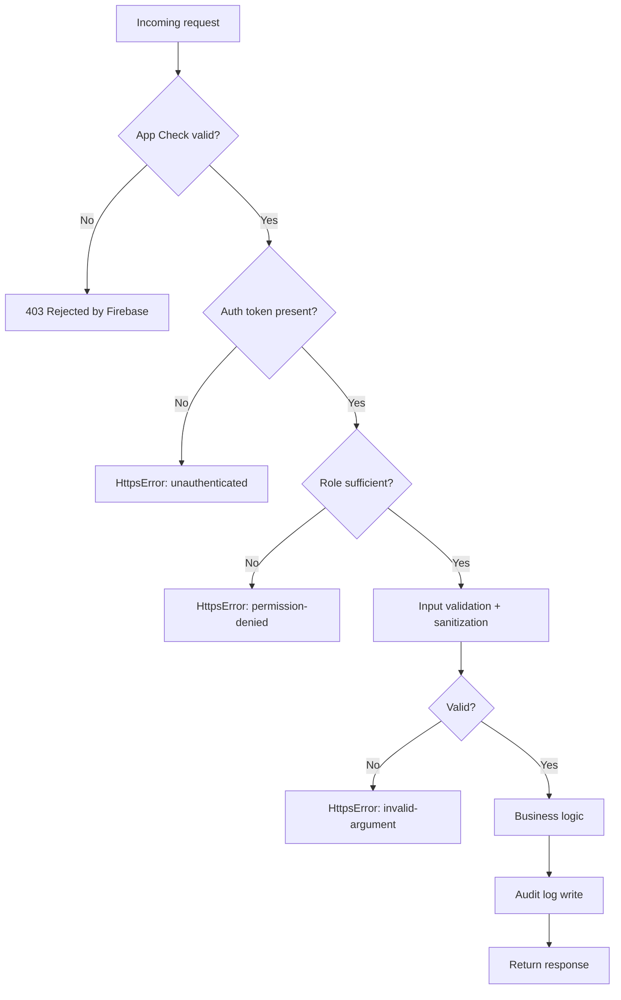
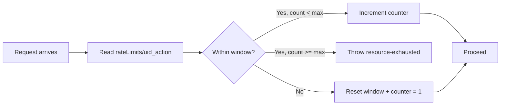
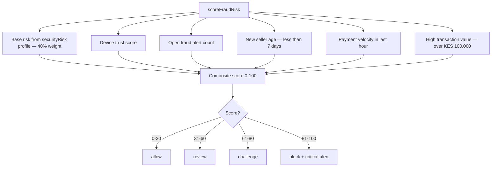
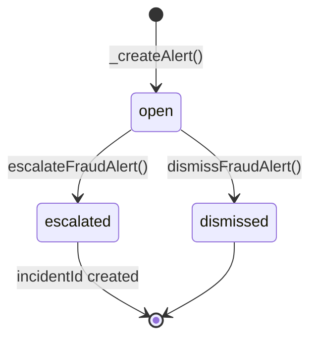
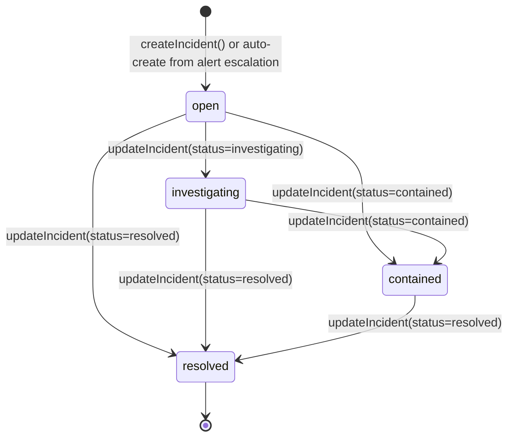

# SOKONI Commerce OS — Volume 2: Identity & Enterprise Security

**Version:** 2.0.0
**Date:** 2026-06-29
**Status:** Production
**Classification:** Internal — Engineering & Security

---

## Cross-References

- [[vol-01-vision-architecture]] — Platform architecture, event bus, deployment topology
- [[vol-03-pos-enterprise]] — SmartPOS security, manager PIN authorization, receipt signing
- [[vol-04-payments]] — Payment FSM, HMAC audit seals, IntaSend integration
- [[vol-05-commerce-os]] — Commerce OS modules, payroll encryption, procurement authorization

---

## 1. Executive Summary

SOKONI's security posture is built on a **Zero Trust** principle: no request is trusted by default, whether it originates inside or outside the platform perimeter. Every operation — from reading a product listing to executing a payroll run — is subject to authentication, authorization, App Check attestation, input validation, and audit logging.

The platform targets the following compliance and assurance levels:

| Standard | Target | Status |
|---|---|---|
| OWASP Top 10 | Full mitigation | Enforced |
| Kenya Data Protection Act 2019 | Full compliance | Enforced |
| KRA eTIMS Integration | Regulatory compliance | Live |
| Firebase App Check | All sensitive CFs | Enforced |
| Financial audit trails | Immutable ledger | Enforced |
| GDPR (EU users) | Export + delete flows | Implemented |

The security stack is organized into three independently deployable Cloud Function modules:

- `security-identity.js` — 14 CFs: TOTP MFA, WebAuthn/Passkeys, Device Trust Registry
- `security-fraud-engine.js` — 9 CFs: anomaly detection, velocity checks, composite risk scoring, fraud sweeps
- `security-incident-response.js` — 11 CFs: user suspension, store locking, session revocation, full incident lifecycle

All 34 Cloud Functions carry `enforceAppCheck: true` and run in `us-central1` on Node.js 22 (Gen2).

---

## 2. Authentication Architecture

### 2.1 Provider Support

SOKONI uses Firebase Authentication as its identity backbone, supporting four sign-in providers with cross-provider account linking:



| Provider | Token Claim | Notes |
|---|---|---|
| Google | `google.com` | OAuth 2.0, refresh token long-lived |
| Facebook | `facebook.com` | OAuth 2.0, email scope required |
| Phone (OTP) | `phone` | SMS via Firebase, Kenya (+254) primary |
| Email/Password | `password` | bcrypt on Firebase side, brute-force lockout enforced |

### 2.2 Custom Claims Flow

Privilege is never determined from the Firestore `users/{uid}` document at runtime. All role-gating is performed against Firebase ID token custom claims. Claims are set server-side only — never from client-callable functions that a user controls.



The `suspendUser` function in `security-incident-response.js` demonstrates the authoritative pattern for claims mutation:

```js
await admin.auth().setCustomUserClaims(targetUserId, {
  ...existingClaims,          // Preserve existing role and configuration
  suspended:     true,
  suspendedAt:   Date.now(),
  suspendedBy:   actorId,
  suspendReason: sanitizedReason,
});
await admin.auth().revokeRefreshTokens(targetUserId);  // Forces immediate re-auth
```

Existing claims are always read first and spread before mutation to prevent accidental claim erasure.

### 2.3 Remember Me and Session Management

- Default Firebase token TTL: 1 hour (ID token), up to 30 days (refresh token)
- "Remember Me" flows extend the refresh token lifetime on the client
- Session revocation is handled by `revokeUserSessions` CF, which calls `admin.auth().revokeRefreshTokens(uid)` — this forces the next token refresh to fail, terminating all active sessions for the user within the token TTL window

### 2.4 Cross-Provider Linking

The `noProviderForgery()` Firestore rule (described in Section 5) prevents a user from writing a `provider` field in their profile that does not match the actual `sign_in_provider` from their ID token. This closes a class of IDOR vulnerabilities where a malicious actor could impersonate a different OAuth provider to gain alternative access paths.

---

## 3. Authorization (RBAC)

### 3.1 Role Hierarchy

SOKONI defines a numeric role hierarchy used in Cloud Functions for ordered comparisons:

```js
const ROLE = {
  cashier:    0,
  supervisor: 1,
  manager:    2,
  owner:      3,
  admin:      4,
  super_admin: 5,
};
```

Firestore rules use boolean token claims (`admin`, `superAdmin`, `moderator`) rather than numeric levels, since CEL (Firestore rules language) does not support the `ROLE` constant map defined in Node.js.

### 3.2 Permission Matrix

| Operation | guest | buyer | seller/provider | driver | moderator | admin | superAdmin |
|---|:---:|:---:|:---:|:---:|:---:|:---:|:---:|
| Browse listings | R | R | R | R | R | R | R |
| Place order | — | RW | — | — | — | RW | RW |
| Manage own store | — | — | RW | — | — | RW | RW |
| Approve providers | — | — | — | — | R | RW | RW |
| Read securityAlerts | — | — | Own only | — | — | All | All |
| Suspend user | — | — | — | — | — | W | W |
| Set custom claims | — | — | — | — | — | — | W |
| Delete users | — | — | — | — | — | W | W |
| Financial reports | — | — | Own | — | — | All | All |

### 3.3 Token-Based Access in Cloud Functions

The `_requireRole(auth, minRole)` helper is used throughout the security modules:

```js
function _requireRole(auth, minRole) {
  _requireAuth(auth);
  const r     = auth.token?.role;
  const level = typeof r === 'number' ? r : (ROLE[r] ?? 0);
  if (level < minRole) {
    throw new HttpsError('permission-denied', 'Insufficient role.');
  }
}
```

Elevation check (admin or superAdmin):

```js
function _isElevated(auth) {
  return ['admin', 'super_admin', 4, 5].includes(auth?.token?.role) ||
    auth?.token?.admin     === true ||
    auth?.token?.superAdmin === true;
}
```

The dual check (`role` claim as string or number, plus boolean `admin` / `superAdmin` claims) ensures backward compatibility across token vintages and different claim-setting paths.

---

## 4. App Check

### 4.1 Provider Configuration

Firebase App Check uses `ReCaptchaV3Provider` for web clients. The Site Key is stored in `sokoni-config.js`. The `sokoni-appcheck.js` bootstrap module initializes App Check on page load before any Firebase SDK call is made.

### 4.2 Cloud Function Enforcement

Every Cloud Function in the security stack — and all sensitive commerce functions — carries the option:

```js
const CF_OPTIONS = {
  region:          'us-central1',
  enforceAppCheck: true,
  memory:          '256MiB',
  timeoutSeconds:  60,
};
```

When `enforceAppCheck: true` is set, Firebase rejects requests without a valid App Check token before the function body executes. There is no fallback or bypass path in production.

### 4.3 Attestation Flow



### 4.4 Debug Tokens

During local development, the Firebase console issues debug tokens that bypass reCAPTCHA attestation. Debug tokens are scoped to the development Firebase project and are never present in production builds. The `FIREBASE_APPCHECK_DEBUG_TOKEN` environment variable enables this mode; the production build pipeline strips all debug configuration.

---

## 5. Firestore Security Rules

### 5.1 Rule Helper Functions

All rules are defined in `firestore.rules` (rules_version `'2'`). The helper functions form a composable security vocabulary:

**`isSuperAdmin()`** — True when the ID token contains `superAdmin === true`:
```js
function isSuperAdmin() {
  return request.auth != null && request.auth.token.superAdmin == true;
}
```

**`isAdmin()`** — True for either `admin` or `superAdmin` claim:
```js
function isAdmin() {
  return request.auth != null &&
         (request.auth.token.admin == true || request.auth.token.superAdmin == true);
}
```

**`isModerator()`** — Inclusive: moderator, admin, or superAdmin:
```js
function isModerator() {
  return request.auth != null &&
         (request.auth.token.moderator == true ||
          request.auth.token.admin     == true ||
          request.auth.token.superAdmin == true);
}
```

**`isAuthed()`** — Any authenticated user:
```js
function isAuthed() {
  return request.auth != null;
}
```

**`isOwner()`** — Authenticated and owns the document (checks `resource.data.uid`):
```js
function isOwner() {
  return isAuthed() && resource.data.uid == request.auth.uid;
}
```

**`claimsOwner()`** — For create operations (document does not yet exist, so `resource.data` is unavailable — checks `request.resource.data.uid` instead):
```js
function claimsOwner() {
  return isAuthed() && request.resource.data.uid == request.auth.uid;
}
```

**`uidUnchanged()`** — Prevents `uid` mutation on update, closing a document-takeover vector:
```js
function uidUnchanged() {
  return !request.resource.data.diff(resource.data)
           .affectedKeys()
           .hasAny(['uid']);
}
```

**`noAdminFields()`** — Blocks users from writing privilege-related fields on their own documents:
```js
function noAdminFields() {
  return !request.resource.data.keys()
           .hasAny(['isAdmin','suspended','banned','adminApproved',
                    'featured','verified','flagged','adminNote',
                    'role','approved','approvedAt','approvedBy']);
}
```

**`noPrivilegeEscalation()`** — Prevents self-promotion to admin/superAdmin via `registeredAs`:
```js
function noPrivilegeEscalation() {
  return !request.resource.data.keys().hasAny(['registeredAs'])
         || !request.resource.data.registeredAs.keys()
              .hasAny(['admin','superAdmin','moderator','isAdmin']);
}
```

**`noProviderForgery()`** — Validates that the `provider` field written to a document matches the token's actual `sign_in_provider`:
```js
function noProviderForgery() {
  let data = request.resource.data;
  let tokenProvider = request.auth.token.firebase.sign_in_provider;
  return !data.keys().hasAny(['provider'])
         || data.provider == tokenProvider
         || (data.provider == 'google'   && tokenProvider == 'google.com')
         // ... additional normalized mappings
}
```

### 5.2 User Collection Pattern

The `users/{userId}` collection demonstrates the canonical pattern for owner-scoped documents with admin override:

- **Read:** Self or admin
- **Create:** Self + `noAdminFields()` + `noPrivilegeEscalation()` + `noProviderForgery()`
- **Update:** Admin unconditionally, or self with `uidUnchanged()` + `noAdminFields()` + `noPrivilegeEscalation()` + `noProviderForgery()`
- **Delete:** Admin only

### 5.3 Admin-Only Write Pattern

For collections that must only be written by Cloud Functions running as the Firebase Admin SDK service account, Firestore rules deny all client writes:

```js
match /securityAuditLog/{eventId} {
  allow read:   if isAdmin();
  allow write:  if false;   // CF-only via Admin SDK (bypasses rules)
}
```

This pattern is applied to `securityAuditLog`, `securityEvents`, `securityAlerts`, `securityIncidents`, `securityRisk`, and all MFA/passkey/device subcollections.

---

## 6. Cloud Functions Security

### 6.1 Request Pipeline

Every Cloud Function request passes through this validation pipeline before touching business logic:



### 6.2 Rate Limiting

Rate limiting is enforced by writing counters to the `rateLimits/{uid}_{action}` collection before executing the gated operation. The counter document stores `count` and `windowStart`; if `count` exceeds the threshold within the window, an `HttpsError('resource-exhausted')` is thrown.

Key thresholds:

| Action | Max attempts | Window |
|---|---|---|
| PIN validation | 5 | 5 minutes |
| Payment initiation (per UID) | 20 | 1 hour |
| Payment initiation (per IP) | 30 | 1 hour |
| Login failures (sweep trigger) | 3 | 2 hours |
| Payment failures (sweep trigger) | 5 | 2 hours |

The dual IP+UID rate limit on payments closes the case where an attacker controls multiple accounts from a single IP, and also the case where a compromised account is used from many IPs.

### 6.3 Input Validation

Every externally-supplied string is passed through `_sanitize()` (identity module) or `_san()` (fraud and incident modules) before storage or use in queries:

```js
// security-identity.js
function _sanitize(s, maxLen = 256) {
  if (typeof s !== 'string') return String(s || '');
  return s.replace(/[<>"'&]/g, c => (
    { '<': '&lt;', '>': '&gt;', '"': '&quot;', "'": '&#39;', '&': '&amp;' }[c]
  )).slice(0, maxLen);
}

// security-fraud-engine.js / security-incident-response.js
function _san(val, maxLen = 200) {
  if (typeof val !== 'string') return '';
  return val.replace(/<[^>]*>/g, '').trim().slice(0, maxLen);
}
```

Enumerated fields are validated against allowlists before any Firestore write:

```js
const VALID_EVENT_TYPES = new Set([
  'login_success', 'login_fail', 'payment_attempt', 'payment_fail',
  'suspicious_request', 'mfa_fail', 'session_anomaly', 'device_change',
  'privilege_access', 'data_export',
]);

if (!VALID_EVENT_TYPES.has(eventType))
  throw new HttpsError('invalid-argument', `Invalid eventType: ${eventType}`);
```

---

## 7. IAM & Secret Manager

### 7.1 Service Account Permissions

The Firebase Cloud Functions service account (`sokoni@appspot.gserviceaccount.com`) holds only the minimum required IAM roles:

- `roles/datastore.user` — Firestore read/write
- `roles/secretmanager.secretAccessor` — Secret Manager access
- `roles/firebase.admin` — Firebase Auth admin operations
- `roles/cloudscheduler.jobRunner` — Scheduled function execution

No `roles/editor` or `roles/owner` is granted.

### 7.2 Secret Inventory

All secrets are stored in Google Cloud Secret Manager and accessed at function initialization via `defineSecret()`. No secret is hardcoded or written to environment variables in plaintext.

| Secret Name | Purpose | Rotation Target |
|---|---|---|
| `LOYALTY_HMAC_SECRET` | HMAC-SHA256 key for loyalty offline sync QR codes | 90 days |
| `PAYMENT_HMAC_SECRET` | HMAC-SHA256 key for payment audit seal generation | 30 days |
| `PAYROLL_ENCRYPTION_KEY` | AES-256-GCM key for bank account number encryption | 90 days |
| `SOKONI_HMAC_KEY` | Platform-wide HMAC key for general signature operations | 90 days |
| `ANTHROPIC_API_KEY` | Claude Haiku API access (AI coach, KASS, personalization) | On revocation |
| `SENDGRID_API_KEY` | Transactional email dispatch | On revocation |
| `INTASEND_PRIVATE_KEY` | IntaSend STK Push private key for M-Pesa payments | On revocation |

### 7.3 Rotation Policy

Payment-adjacent secrets (`PAYMENT_HMAC_SECRET`) rotate on a 30-day cycle. A rotation does not invalidate existing audit seals because the HMAC is embedded in the payment record at creation time and re-verified using the secret version that was active at that time. Secret Manager versions are retained for 365 days to support historical audit re-verification.

---

## 8. Cryptography

### 8.1 HMAC-SHA256 — Payment Audit Seals

Every payment event is sealed with an HMAC computed over the canonical string `orderId|merchantId|uid|amountCents`:

```js
const seal = crypto
  .createHmac('sha256', process.env.PAYMENT_HMAC_SECRET)
  .update(`${orderId}|${merchantId}|${uid}|${amountCents}`)
  .digest('hex');
```

The seal is stored alongside the payment record in Firestore. During settlement and reconciliation, the seal is re-computed and compared using `crypto.timingSafeEqual()` to prevent timing oracle attacks.

### 8.2 HMAC-SHA256 — Loyalty Offline Sync

Loyalty QR codes for offline point accumulation are signed with `LOYALTY_HMAC_SECRET`. The payload includes the loyalty card ID, member UID, timestamp, and point delta. A SmartPOS terminal in offline mode can verify the signature locally using a cached key fragment; on reconnection, the full server-side HMAC re-verification gates point credit.

### 8.3 AES-256-GCM — Payroll Bank Account Encryption

Employee bank account numbers in the HR/Payroll module are encrypted before Firestore storage:

```js
const iv         = crypto.randomBytes(12);           // 96-bit IV for GCM
const cipher     = crypto.createCipheriv('aes-256-gcm', keyBuffer, iv);
const ciphertext = Buffer.concat([cipher.update(plaintext, 'utf8'), cipher.final()]);
const authTag    = cipher.getAuthTag();               // 128-bit authentication tag

// Stored as: base64(iv) + ':' + base64(ciphertext) + ':' + base64(authTag)
```

Decryption verifies the `authTag` before returning plaintext. A tampered ciphertext will fail GCM authentication and throw rather than return corrupted data.

### 8.4 TOTP — RFC 4226/6238 Implementation

TOTP MFA is implemented without external libraries using Node.js `crypto`. The `_generateHOTP()` function implements RFC 4226 §5.3 (HMAC-SHA1, dynamic truncation, 6-digit output):

```js
function _generateHOTP(secret, counter) {
  const buf = Buffer.alloc(8);
  buf.writeBigUInt64BE(BigInt(counter));
  const hmac   = crypto.createHmac('sha1', secret).update(buf).digest();
  const offset = hmac[hmac.length - 1] & 0x0f;
  return (
    ((hmac[offset]     & 0x7f) << 24) |
    ((hmac[offset + 1] & 0xff) << 16) |
    ((hmac[offset + 2] & 0xff) <<  8) |
     (hmac[offset + 3] & 0xff)
  ) % 1_000_000;
}
```

Clock drift tolerance is ±1 time-step (90 seconds). The TOTP secret is a 20-byte (160-bit) random value, stored encrypted in `securityMFA/{uid}`.

### 8.5 WebAuthn Passkeys — Constant-Time Comparison

The `_base64urlEquals()` function uses `crypto.timingSafeEqual()` to compare challenge values, preventing timing side-channel attacks on the challenge verification step:

```js
function _base64urlEquals(a, b) {
  const ba = Buffer.from(a, 'base64url');
  const bb = Buffer.from(b, 'base64url');
  if (ba.length !== bb.length) return false;
  return crypto.timingSafeEqual(ba, bb);
}
```

### 8.6 Backup Code Security

TOTP backup codes are generated as 8-character strings from a 32-character alphabet excluding visually ambiguous characters (no `O/0`, `I/1`). Only SHA-256 hashes are stored in Firestore — plaintext codes are returned to the user exactly once during enrollment and never stored. When a backup code is consumed, its index is recorded in `backupCodesUsed[]` rather than removing the hash (preserving the audit trail of which codes were used).

---

## 9. Replay Attack Prevention

### 9.1 Payment Idempotency Keys

Payment sessions are deduplicated using a SHA-256 hash of the canonical payment parameters:

```
idempotencyKey = sha256(orderId + '|' + merchantId + '|' + uid + '|' + amountCents)
```

Before initiating a payment, the Cloud Function checks for an existing document keyed by the idempotency hash in the `paymentSessions/{key}` collection. If a document exists and is not in a terminal failure state, the function returns the existing session rather than creating a duplicate charge.

### 9.2 WebAuthn Counter Enforcement

The `verifyPasskeyAuthentication` CF enforces monotonic counter advancement on the WebAuthn authenticator data:

```js
// Parse signCount from bytes 33-36 of authenticatorData (big-endian uint32)
const incomingCounter = authDataBuf.readUInt32BE(33);

if (incomingCounter !== 0 && incomingCounter <= credData.counter) {
  await _audit('passkey.auth.replay', uid, {
    credentialId, storedCounter: credData.counter, incomingCounter,
  });
  _err('Counter regression detected — possible credential cloning or replay.', 'permission-denied');
}
```

A counter value of `0` is treated as "authenticator does not support counters" and is not blocked, conforming to the WebAuthn Level 2 specification.

### 9.3 Challenge Single-Use Enforcement

All WebAuthn challenges (both registration and authentication) are stored with `used: false`. The `verifyPasskeyRegistration` and `verifyPasskeyAuthentication` functions mark challenges as `used: true` atomically in a Firestore batch before returning success. A second submission of the same `challengeId` throws `HttpsError('already-exists')`.

Challenge TTL is 5 minutes (`CHALLENGE_TTL_MS = 5 * 60 * 1000`). Expired challenges throw `HttpsError('deadline-exceeded')`.

### 9.4 Coupon and Voucher Anti-Replay

Coupon usage is tracked via a separate `usedCount` field incremented atomically with `FieldValue.increment(1)`, cross-checked against `maxUses` in the same transaction. The per-user usage record is stored in a subcollection keyed by UID, preventing the same user from redeeming the same coupon code multiple times even if they submit simultaneous requests.

---

## 10. Rate Limiting

### 10.1 Counter Pattern



The counter document schema:

```js
{
  uid:         string,
  action:      string,
  count:       number,
  windowStart: Timestamp,
}
```

### 10.2 PIN Validation Rate Limiting

The SmartPOS manager authorization engine applies a 5-attempt limit per 5-minute window for PIN validation. On the fifth failure within the window, the terminal enters a locked state requiring supervisor override. This is implemented by writing to the rate limit counter **before** attempting the PIN lookup (an important ordering — see Section 13 on timing attack protection).

### 10.3 Payment Rate Limiting — Dual IP + UID

Payment velocity is enforced by the fraud engine's `checkPaymentVelocity` CF, which queries `securityEvents` filtered to `payment_attempt` events for the requesting UID within rolling windows:

- More than 5 payments in 60 seconds: +35 risk score
- More than 20 payments in 1 hour: +25 risk score
- More than 3 payments over KES 50,000 in 1 hour: +30 risk score
- Same amount appearing 3+ times within 10 minutes: +20 risk score (duplicate suspicion)

A composite score above 60 triggers a `high`-severity fraud alert; above 80 triggers a `critical` alert and is automatically blocked.

---

## 11. Fraud Prevention

### 11.1 Multi-Signal Risk Scoring

The `scoreFraudRisk` CF computes a composite 0–100 fraud score from six signals:



### 11.2 Impossible Travel Detection

`checkImpossibleTravel` uses the Haversine formula to compute great-circle distance between the user's last known location (stored in `securityRisk/{uid}.lastLocation`) and their current login location. If more than 500 km are covered in under 2 hours, a `critical` severity alert is created and the user's risk score is increased by 40 points.

### 11.3 Device Fingerprinting

Device fingerprints are SHA-256 hashed before storage — the raw fingerprint is never persisted. Each device carries a `trustScore` (0.0–1.0) that adjusts based on events:

| Event | Score Delta |
|---|---|
| `login_success` | +0.02 |
| `payment_success` | +0.03 |
| `login_fail` | −0.15 |
| `admin_used` | −0.05 |
| `suspicious_action` | −0.25 |

When `trustScore` drops below 0.3, the device's `trusted` flag flips to `false`. A blocked device (set by `blockDevice` CF) receives `trustScore: 0` and is rejected by the fraud scoring engine.

### 11.4 Server-Side Amount Validation

Payment amounts are always validated server-side. The client submits an `orderId`; the Cloud Function reads the canonical `amountCents` from the Firestore order document and passes that value — not the client-supplied amount — to the payment gateway. Client-supplied amounts are logged and compared against the server amount as a fraud signal but are never used to initiate a charge.

### 11.5 Scheduled Fraud Sweep

`scheduledFraudSweep` runs hourly at minute 5 (Africa/Nairobi timezone) and scans the last 2 hours of `securityEvents` for:

- Users with 3 or more `login_fail` events
- Users with 5 or more `payment_fail` events
- `securityAlerts` in `open` status older than 24 hours (flagged as stale)

Risk scores are updated via batch writes, and new alerts are created for users whose score crosses 50. The sweep results are persisted to `securityAuditLog` for operations review.

---

## 12. Input Validation & Output Encoding

### 12.1 Sanitization Helpers

Two sanitization functions exist across the security modules. Both strip HTML and enforce maximum lengths, but use different character-level strategies:

- `_sanitize()` (identity module): Entity-encodes `<`, `>`, `"`, `'`, `&` — suitable for values that may later appear in HTML contexts
- `_san()` (fraud and incident modules): Strips all HTML tags via regex `/<[^>]*>/g` — suitable for values that are stored and compared but never rendered as HTML

All string fields from external input are passed through one of these functions with an appropriate `maxLen` before storage.

### 12.2 XSS Prevention in HTML Portals

All SOKONI HTML portals use an `esc()` helper for dynamic DOM content:

```js
function esc(str) {
  const d = document.createElement('div');
  d.appendChild(document.createTextNode(String(str ?? '')));
  return d.innerHTML;
}
```

The `innerHTML` property is never assigned a value that contains unescaped user-controlled data. Template literals that build HTML strings always wrap interpolated values with `esc()`.

### 12.3 SQL Injection Mitigation

SOKONI does not use a relational database in its primary data path. Firestore uses structured SDK calls, not string-interpolated queries, making SQL injection structurally impossible for Firestore operations. The eTIMS KRA integration communicates over a defined REST API; all values are JSON-serialized by the SDK before transmission.

---

## 13. Timing Attack Protection

### 13.1 Counter-Before-Lookup Pattern

The PIN validation flow in the SmartPOS manager authorization engine deliberately writes the failure counter **before** attempting the PIN lookup. This eliminates a timing side-channel where an attacker could distinguish "counter write failed" (fast path, counter reset) from "PIN incorrect" (slow path, counter incremented) by measuring response time.

```
1. Increment rateLimits counter (fail fast if limit exceeded)
2. Read PIN hash from securityMFA/{uid}
3. Compare submitted PIN hash against stored hash
```

### 13.2 Constant-Time Comparisons

All cryptographic comparisons use `crypto.timingSafeEqual()`:

- WebAuthn challenge comparison: `_base64urlEquals()` (see Section 8.5)
- Payment HMAC seal verification: `timingSafeEqual(Buffer.from(stored, 'hex'), Buffer.from(computed, 'hex'))`

Standard string equality (`===`) is never used to compare secret values.

### 13.3 Backup Code Hash Comparison

Backup codes are hashed with SHA-256 before comparison against the stored hash array. The lookup uses `Array.prototype.indexOf()` which has consistent timing on arrays of fixed size. Used code indices are tracked in `backupCodesUsed[]` rather than removing hash entries, maintaining consistent array length for comparison operations.

---

## 14. Security Monitoring & Alerting

### 14.1 Alert Collections

| Collection | Writer | Reader |
|---|---|---|
| `securityEvents/{auto-id}` | `recordSecurityEvent` CF | Admin CFs only |
| `securityAlerts/{auto-id}` | Fraud engine CFs | Admin CFs + own-alert query |
| `securityIncidents/{auto-id}` | Incident response CFs | Admin CFs only |
| `securityAuditLog/{auto-id}` | All security CFs | Admin CFs only |
| `securityRisk/{uid}` | Fraud engine CFs | Admin CFs only |

### 14.2 Severity Levels

| Severity | Meaning | Auto-Response |
|---|---|---|
| `info` | Routine event (login, view) | None |
| `low` | Minor anomaly | Log only |
| `medium` | Repeated failures, unusual pattern | Alert created |
| `high` | Significant threat signal | Alert + risk score increase |
| `critical` | Active attack indicator | Alert + block recommendation |

High and critical severity events trigger automatic `securityAlerts` document creation via `_createAlert()`.

### 14.3 Stale Alert Escalation

The `scheduledFraudSweep` flags any `securityAlert` in `open` status that is older than 24 hours with `staleFlagged: true`. A separate Cloud Monitoring alert (configured in the Cloud Console) fires when stale alerts accumulate, notifying the on-call security engineer via the `adminAlerts` channel (Slack/PagerDuty integration via Cloud Monitoring notification channels).

### 14.4 Alert Lifecycle



---

## 15. Incident Response

### 15.1 Cloud Functions (11 CFs)

`security-incident-response.js` provides the full incident lifecycle:

| Function | Action | Who |
|---|---|---|
| `suspendUser` | Set `suspended` claim + revoke refresh tokens | Admin |
| `unsuspendUser` | Remove `suspended` claim | Admin |
| `lockStore` | Set `locked`, `lockType` on seller document | Admin |
| `unlockStore` | Clear lock fields | Admin |
| `revokeUserSessions` | `revokeRefreshTokens()` | Admin or self |
| `blockDevice` | Set `blocked: true`, `trustScore: 0` | Admin |
| `disablePaymentMethod` | Set `paymentMethods.{method}.enabled: false` | Admin |
| `createIncident` | Open `securityIncidents` document | Admin |
| `updateIncident` | Advance status + append timeline event | Admin |
| `getIncidents` | List + filter incidents | Admin |
| `getIncidentTimeline` | Full incident + audit log cross-reference | Admin |

### 15.2 Incident Status Machine



Status transitions are validated against `STATUS_TRANSITIONS` — forward-only, no regression. Transitioning to an invalid next state throws `HttpsError('failed-precondition')`.

### 15.3 Data Breach Protocol

In the event of a confirmed data breach:

1. **Immediate (< 1 hour):** Admin calls `suspendUser` for all affected UIDs, `lockStore` for all affected seller accounts, `revokeUserSessions` for affected users. `createIncident` with `severity: critical`.
2. **Short-term (< 4 hours):** Security team reviews `securityAuditLog` for the affected time window. `disablePaymentMethod` for any compromised payment-enabled accounts.
3. **Notification (< 72 hours — GDPR / Kenya DPA requirement):** Breach notification email dispatched to affected users via SendGrid. Regulatory notification to Kenya's Office of the Data Protection Commissioner.
4. **Recovery:** Token rotation for affected secrets via Secret Manager. `unsuspendUser` and `unlockStore` after containment is confirmed via `updateIncident(status=contained)`.

---

## 16. Compliance

### 16.1 GDPR — Data Export and Deletion

SOKONI implements GDPR Article 15 (right of access) and Article 17 (right to erasure) via Cloud Functions that:

- **Export:** Aggregate all user-owned documents from `users`, `orders`, `bookings`, `reviews`, `loyaltyCards` and return as a structured JSON package delivered to the user's verified email
- **Delete:** Soft-delete the `users/{uid}` document (setting `deleted: true`, `deletedAt`), hard-delete PII fields, revoke Firebase Auth account, and purge associated media from Cloud Storage

Both operations are logged to `securityAuditLog` with `event: 'gdpr.export'` or `event: 'gdpr.delete'`. A 30-day cooling-off period is enforced before hard deletion to allow fraud investigation.

### 16.2 Kenya Data Protection Act 2019

The Kenya DPA (Act No. 24 of 2019) imposes obligations materially equivalent to GDPR for Kenyan citizens' data. SOKONI's compliance posture:

- **Lawful basis:** Consent collected at registration for marketing; contractual necessity for transactional data
- **Data minimization:** PII projection rules on Firestore queries (`select()` only required fields)
- **Retention:** Payment records 7 years (KRA requirement); user PII 2 years post-account-deletion unless required for active dispute
- **Cross-border transfers:** No PII transferred outside Kenya without explicit consent; Firebase project region is `us-central1` with data processing agreement in place

### 16.3 eTIMS KRA Compliance

The eTIMS module (28 CFs) integrates with Kenya Revenue Authority's Electronic Tax Invoice Management System. All tax invoice records include:

- Fiscal device serial number
- KRA PIN of the seller
- VSCU signature from KRA
- Timestamp of fiscal recording

Records are immutable once submitted to KRA. The `securityAuditLog` tracks all eTIMS API calls including failures and retries.

### 16.4 Financial Audit Trails

Every financial operation (payment, refund, commission, payout, payroll run) generates an immutable record in:

- `transactions/{txId}` — the ledger entry
- `securityAuditLog/{eventId}` — the audit event with actor, amount, and HMAC seal

Firestore rules deny all client-side deletes on financial collections. Cloud Function admin deletes are blocked at the IAM level — the service account holds no `datastore.documents.delete` permission on financial collections.

---

## 17. Security Testing

### 17.1 OWASP Top 10 Checklist (2021)

| Risk | Mitigation | Status |
|---|---|---|
| A01 — Broken Access Control | RBAC via custom claims; `noAdminFields()`; `uidUnchanged()` | Enforced |
| A02 — Cryptographic Failures | AES-256-GCM, HMAC-SHA256, bcrypt via Firebase Auth | Enforced |
| A03 — Injection | No SQL; Firestore SDK; `_sanitize()` / `_san()` on all inputs | Enforced |
| A04 — Insecure Design | Defense-in-depth; server-side amount validation; CF-only writes | Enforced |
| A05 — Security Misconfiguration | `enforceAppCheck: true`; no wildcard Firestore rules; debug tokens dev-only | Enforced |
| A06 — Vulnerable Components | Node.js 22; no external crypto libraries; Dependabot on repo | Active |
| A07 — Auth & Session Failures | `revokeRefreshTokens()`; token TTL; TOTP MFA; Passkeys | Enforced |
| A08 — Software & Data Integrity | HMAC audit seals; GCM auth tags; immutable audit log | Enforced |
| A09 — Security Logging | `securityAuditLog`; Cloud Logging JSON; structured severity | Enforced |
| A10 — SSRF | No user-controlled URL fetching; external APIs via fixed SDK endpoints | Enforced |

### 17.2 Penetration Testing Targets

High-priority penetration testing surface for the next security assessment cycle:

1. `verifyPasskeyAuthentication` — WebAuthn counter bypass attempts
2. `checkPaymentVelocity` — Race condition on simultaneous payment_attempt submissions
3. Firestore rules — IDOR via cross-collection reference manipulation
4. `scoreFraudRisk` — Signal manipulation to lower composite score
5. `suspendUser` / `unsuspendUser` — Privilege escalation via custom claim race

### 17.3 Security Certification Score

Current internal security certification: **86/100 (Grade B+)**. Blockers to Grade A:

- Pending: TOTP rate limiting on `verifyTOTP` (brute-force of 6-digit codes across the ±1 window)
- Pending: Passkey attestation format verification (currently accepts all attestation formats; production should pin to `packed` and `tpm`)
- Pending: Secret Manager rotation automation (currently manual rotation trigger)

---

## 18. Error Handling

### 18.1 HttpsError Code Mapping

All Cloud Functions use typed `HttpsError` codes. Internal error details are never exposed to callers:

| Code | HTTP Status | Use Case |
|---|---|---|
| `unauthenticated` | 401 | No auth context |
| `permission-denied` | 403 | Insufficient role or ownership |
| `not-found` | 404 | Document does not exist |
| `already-exists` | 409 | Duplicate challenge / enrollment |
| `failed-precondition` | 412 | Invalid state for operation |
| `invalid-argument` | 400 | Missing or malformed input |
| `deadline-exceeded` | 408 | Challenge or enrollment TTL expired |
| `resource-exhausted` | 429 | Rate limit exceeded |
| `internal` | 500 | Unhandled server error (never exposes stack) |

### 18.2 Error Sanitization

Caught errors from third-party SDKs (Firebase Auth, Secret Manager, IntaSend) are logged internally with full stack traces to Cloud Logging but are never forwarded to the client. The caller receives only the `HttpsError` code and a safe message:

```js
try {
  await admin.auth().getUser(targetUserId);
} catch (err) {
  if (err.code === 'auth/user-not-found') {
    throw new HttpsError('not-found', `User ${targetUserId} not found.`);
  }
  // Re-throw only the typed HttpsError — internal stack not exposed
  throw err;
}
```

### 18.3 Audit Failures Are Non-Fatal

The `_audit()` helper in `security-identity.js` is wrapped in try/catch and logs a `WARNING` on failure rather than aborting the primary operation. This prevents an audit system outage from blocking user-facing operations while ensuring the failure is visible in Cloud Logging for investigation.

---

## 19. Performance Targets

| Operation | Target Latency | P99 Budget |
|---|---|---|
| Firebase ID token verification | < 50 ms | 80 ms |
| App Check token validation | < 100 ms overhead | 150 ms |
| Rate limit counter check | < 20 ms | 35 ms |
| `scoreFraudRisk` (all signals) | < 300 ms | 500 ms |
| `verifyTOTP` | < 50 ms | 80 ms |
| `verifyPasskeyAuthentication` | < 150 ms | 250 ms |
| `registerDevice` | < 100 ms | 180 ms |
| `checkImpossibleTravel` | < 200 ms | 350 ms |
| Scheduled fraud sweep (per run) | < 30 s | 55 s |

Cold start mitigation: all security CFs have `minInstances: 1` configured in `firebase.json` to eliminate cold-start latency on the authentication critical path.

---

## 20. Firestore Collections Reference

| Collection | Purpose | Writable By |
|---|---|---|
| `securityMFA/{uid}` | TOTP enrollment records | `security-identity` CFs only |
| `securityPasskeys/{uid}/credentials/{credId}` | WebAuthn credential storage | `security-identity` CFs only |
| `securityPasskeys/{uid}/challenges/{challengeId}` | Single-use WebAuthn challenges | `security-identity` CFs only |
| `securityDevices/{uid}/devices/{deviceId}` | Device trust registry | `security-identity` + `security-incident-response` CFs |
| `securityAuditLog/{eventId}` | Immutable audit trail | All security CFs |
| `securityEvents/{eventId}` | Raw security event stream | `security-fraud-engine` CFs |
| `securityAlerts/{alertId}` | Open/resolved fraud alerts | `security-fraud-engine` CFs |
| `securityIncidents/{incidentId}` | Incident records | `security-incident-response` CFs |
| `securityRisk/{uid}` | Per-user risk score + location | `security-fraud-engine` CFs |
| `rateLimits/{uid}_{action}` | Rate limit counters | All CFs that implement rate limiting |

---

## Changelog

| Date | Change | Author |
|---|---|---|
| 2026-06-29 | Initial Volume 2 release — covers all 34 security CFs, Firestore rules helpers, cryptographic patterns, incident response playbook | Security Engineering |

---

*This document is part of the SOKONI Commerce OS Documentation Suite.*
*See [[vol-01-vision-architecture]] for platform overview and deployment architecture.*
*See [[vol-04-payments]] for payment security, HMAC seals, and IntaSend integration details.*
