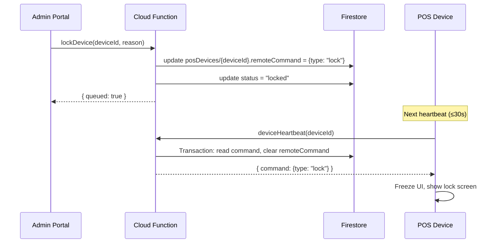
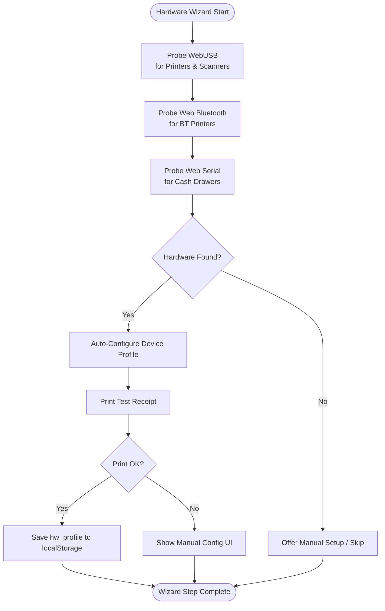
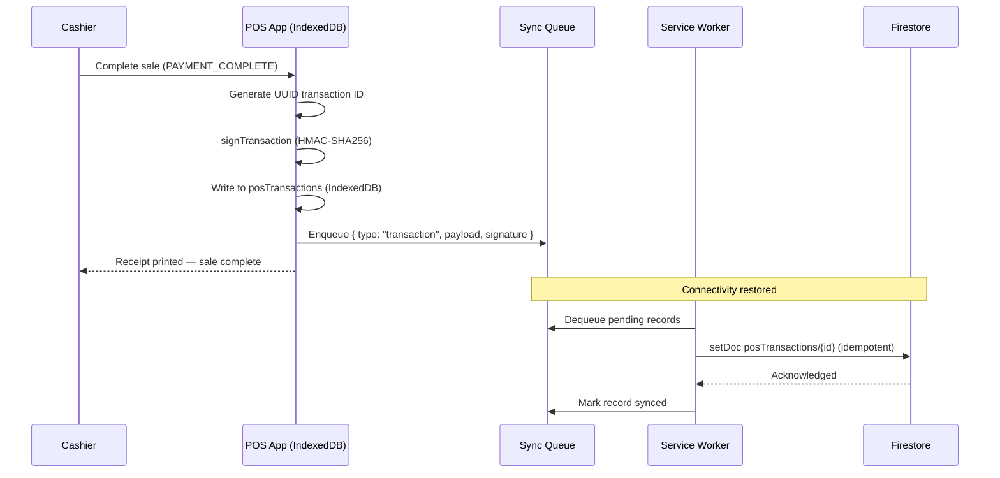
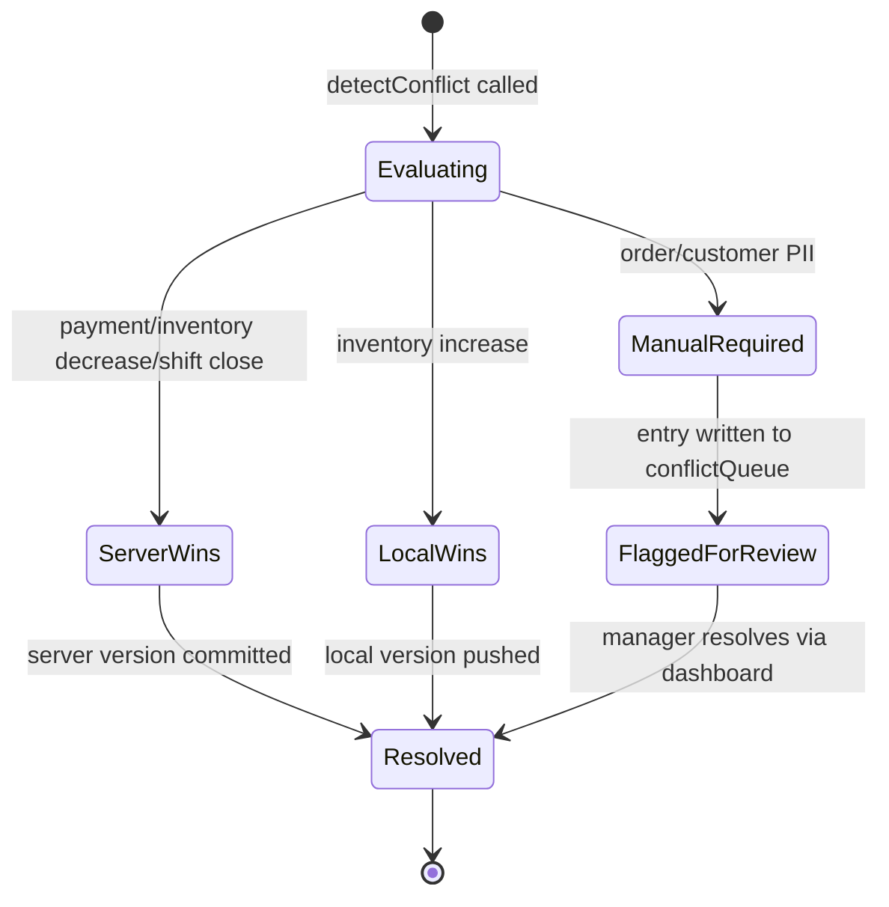
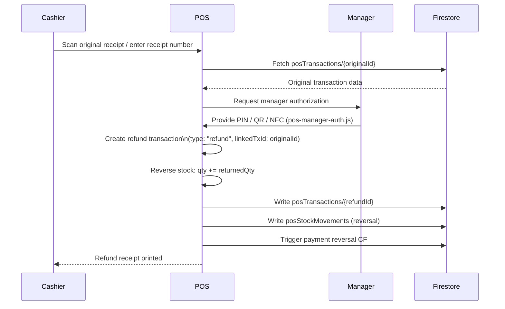
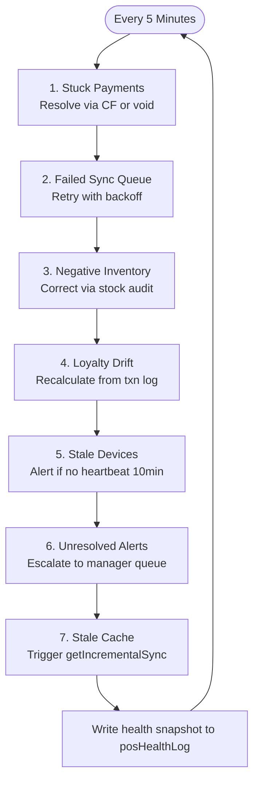
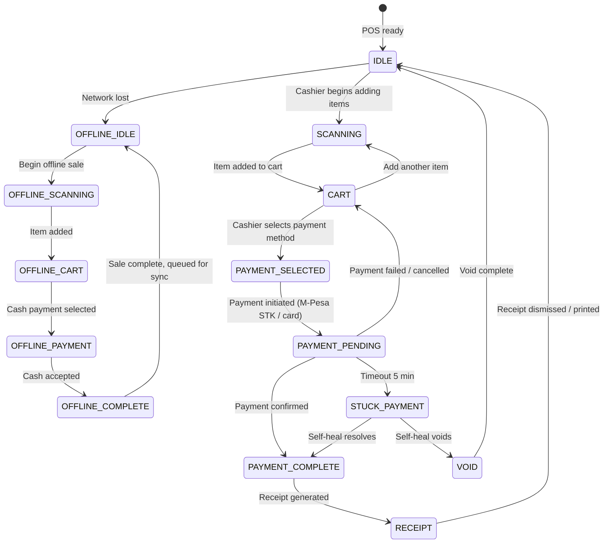

# SOKONI Commerce OS — Volume 3: Plug-and-Play Enterprise POS

> **Series:** SOKONI Commerce OS Documentation Suite
> **Volume:** 03 of 12
> **Status:** Production
> **Last Updated:** 2026-06-29
> **Authors:** SOKONI Engineering Team

---

## Related Documents

- [[vol-01-vision-architecture]] — Platform vision, system topology, and architectural principles
- [[vol-02-identity-security]] — Firebase Auth, App Check, ABAC, and Zero Trust model
- [[vol-04-payments]] — Payment FSM, M-Pesa STK, IntaSend, and payment integrity
- [[vol-08-loyalty-platform]] — Universal Loyalty v2.0, SKN-XXXX QR cards, and HMAC offline sync

---

## 1. Executive Summary

SOKONI SmartPOS is designed around a single promise: **Unbox → Connect → Sign In → Start Selling in under five minutes, with zero IT involvement.**

Every enterprise POS deployment traditionally requires a network engineer to configure the terminal, an IT administrator to load product data, and a systems integrator to wire payment terminals. SOKONI eliminates all three dependencies. The entire provisioning sequence — device identity, product catalogue, staff roster, tax configuration, payment methods, loyalty rules, and feature flags — arrives in a single network round-trip via the `bootstrapDevice` Cloud Function. From the moment a cashier enters their PIN, the device is fully operational.

This volume covers the complete engineering implementation: the zero-touch setup wizard in `pos-setup.html`, automatic business provisioning via `business-bootstrap.js`, offline-first transaction integrity via `pos-sync.js`, device lifecycle management via `device-manager.js`, hardware auto-detection via `pos-hardware-wizard.js`, cryptographic transaction signing, conflict resolution, receipt generation, manager authorization, self-healing automation, and background update mechanics.

The architecture supports any SOKONI business — a single-outlet cafe, a multi-branch supermarket chain, or a hotel with a dozen service points — without configuration change.

---

## 2. Zero-Touch Setup Flow

The POS setup wizard is delivered by `pos-setup.html`, a self-contained single-page application rendered before the main POS shell. It presents a 7-step guided experience that walks a brand-new cashier from power-on to first sale.


### Step 1 — Welcome

The welcome screen displays the SOKONI logo, the tagline "Enterprise POS for Growing Kenyan Businesses", and a single primary call-to-action button. The design system from `pos-setup.html` uses CSS custom properties (`--sk-primary: #7C3AED`, `--sk-surface: #1a1a2e`, `--sk-green: #10B981`) to produce a dark, high-contrast interface optimised for bright retail environments. The wizard detects whether the device has been registered previously via a `localStorage` lookup of `posDeviceId`; returning devices skip directly to Step 3.

### Step 2 — Network Check

The wizard performs three sequential checks: DNS resolution, Firebase Hosting reachability, and Cloud Functions latency. A green/amber/red indicator communicates each result. If all checks pass, the wizard advances automatically after 2 seconds. If Firebase Functions are unreachable, the wizard offers an offline mode path, informing the cashier that setup requires internet connectivity but that sales can proceed offline once setup is complete.

### Step 3 — Sign In

Firebase Authentication is initialised using the `firebase-auth-compat.js` compat SDK loaded at the top of `pos-setup.html`. The sign-in screen supports Google Sign-In (primary for owner/manager flows) and Email/Password for cashier-specific accounts. Firebase App Check (`enforceAppCheck: true` is set on every Cloud Function in `business-bootstrap.js` and `device-manager.js`) validates the client before any server call is accepted.

### Step 4 — Select Business

After successful authentication, the wizard calls `getBusinessConfig` (CF 4 in `business-bootstrap.js`). This lightweight pre-branch call returns the merchant's business profile — name, logo, KRA PIN, and currency — along with a list of active branches. The cashier sees a visual business card per merchant they have access to (based on `posStaff` membership or `businesses.ownerId`) and taps to select.

### Step 5 — Select Branch

The branch list returned by `getBusinessConfig` is displayed as a vertically scrolling card list, each card showing the branch name and address from the `branches` Firestore collection. Multi-branch merchants with dozens of locations support type-ahead search. Single-branch merchants skip this step automatically.

### Step 6 — Provisioning

With `merchantId` and `branchId` confirmed, the wizard:

1. Generates a UUID v4 device identifier via `crypto.randomUUID()` and persists it to `localStorage` as `posDeviceId`.
2. Calls `registerDevice` (CF 1 in `device-manager.js`) with device metadata: `deviceId`, `merchantId`, `branchId`, `deviceName`, `deviceType`, `platform`, `osVersion`, `appVersion`, and `screenResolution`.
3. Calls `bootstrapDevice` (CF 1 in `business-bootstrap.js`) with `forceRefresh: false` to receive the full provisioning bundle from cache if available, or from 14 parallel Firestore reads if cache has expired.
4. Writes the bundle to IndexedDB for offline use.
5. Runs hardware detection (Section 7).

A progress bar with contextual labels ("Loading products…", "Loading staff…", "Configuring payments…") provides feedback throughout.

### Step 7 — Ready to Sell

A full-screen confirmation displays the business name, branch name, and the count of products loaded. A "Start Selling" button transitions the browser to `pos.html`. The wizard writes a `registeredAt` timestamp and device metadata to `posDevices/{deviceId}` in Firestore, making the device visible in the Remote Device Management dashboard immediately.

**UX Notes:** The entire wizard is keyboard-navigable for accessibility. All form inputs enforce `font-size: 16px` minimum to prevent iOS auto-zoom. The `overflow: hidden` body styling prevents scroll jank on touch devices during step transitions.

---

## 3. Automatic Business Provisioning (`bootstrapDevice`)

### Architecture

The `bootstrapDevice` Cloud Function is the cornerstone of the zero-touch setup experience. It executes in the `us-central1` region on Node.js 22, with `enforceAppCheck: true`, a 30-second timeout, and 512 MiB of memory allocated to handle large product catalogues.

### 14 Parallel Firestore Reads

The internal `_buildBundle` function launches **14 concurrent Firestore reads** using a single `Promise.all` call, eliminating serial round-trip latency:

| # | Collection / Document | Data Retrieved |
|---|---|---|
| 1 | `businesses/{merchantId}` | Business profile, KRA PIN, address |
| 2 | `branches/{branchId}` | Branch name, address, phone |
| 3 | `posProducts` (query) | Active products — up to 500 records |
| 4 | `categories` (query) | All merchant categories |
| 5 | `posStaff` (query) | Active staff for the branch |
| 6 | `posRoles` (query) | Permission role definitions |
| 7 | `taxConfig/{merchantId}` | VAT rate, eTIMS enablement |
| 8 | `paymentMethods` (query) | Enabled payment methods |
| 9 | `loyaltyMerchantConfigs/{merchantId}` | Points rate, tiers, cashback |
| 10 | `posDiscounts` (query) | Active, non-expired discounts |
| 11 | `receiptConfig/{merchantId}` | Header, footer, branding, printer type |
| 12 | `featureFlags/{merchantId}` | Toggle map for all platform features |
| 13 | `subscriptions` (query) | Current active/trialing subscription |
| 14 | `procSuppliers` (query) | Active suppliers — up to 50 records |

### 5-Minute TTL Cache

The assembled bundle is written to `bootstrapCache/{merchantId}_{branchId}` in a fire-and-forget pattern (`.catch` is handled but the response is not blocked). On subsequent calls within the 5-minute TTL window (`CACHE_TTL_MS = 5 * 60 * 1000`), the function serves the cached bundle in a single Firestore read, reducing cold provisioning time of several seconds to under 100 milliseconds.

Cache invalidation is handled by `invalidateBootstrapCache` (CF 3), which can target a single branch or all branches for a merchant. Only the merchant owner or a platform administrator may call this function.

### Bundle Contents

The complete bundle returned to the device includes:

```
{
  version        — schema version (currently 1)
  syncToken      — "{merchantId}_{branchId}_{timestamp}" — used by getIncrementalSync
  business       — name, logo, address, phone, email, currency ("KES"), kraPin, businessType
  branch         — id, name, address, phone, timezone ("Africa/Nairobi")
  products[]     — id, name, sku, barcode, price, cost, categoryId, vatRate, trackInventory,
                   qty, reorderPoint, image
  categories[]   — id, name, parentId, icon
  employees[]    — id, name, pin (SHA-256 hash), role, permissions[], photo
  roles[]        — id, name, permissions[]
  tax            — vatEnabled, vatRate (0.16), etimsEnabled, kraPin
  paymentMethods — ["cash", "mpesa", …]
  loyalty        — enabled, pointsPerShilling, tiers[], cashbackRate, hmacKey: null
  discounts[]    — id, name, type, value, minOrder, validUntil, code
  receipt        — header, footer, logo, showLoyaltyPoints, showVAT, printerType
  featureFlags   — inventory, loyalty, delivery, marketplace, etims, aiAssistant
  subscription   — plan, status, expiresAt
  suppliers[]    — id, name, phone
  builtAt        — ISO timestamp
  ttlSeconds     — 300
  _buildMs       — server-side build duration for performance monitoring
}
```

### Security: Secrets Never Leave the Server

The `_buildBundle` function strips all sensitive material before returning the bundle. Employee PIN hashes are included (to allow local PIN comparison without server round-trips for each cashier login), but plaintext PINs are never stored. The loyalty `hmacKey` is explicitly set to `null` in the response — HMAC signing of loyalty transactions is always performed server-side. Password fields, webhook secrets, and API keys are never included.

---

## 4. Incremental Sync (`getIncrementalSync`)

Full bootstrap is called once per shift start. During an active shift, the POS calls `getIncrementalSync` (CF 2 in `business-bootstrap.js`) at configurable intervals to receive only the records that have changed since the last known `syncToken`.

### Delta Queries

The function accepts `merchantId`, `branchId`, and a `since` ISO timestamp, then runs four parallel Firestore queries filtered by `updatedAt > sinceDate`:

- `posProducts` — updated active products (limit 200)
- `posStaff` — updated active staff for the branch (limit 100)
- `posDiscounts` — updated active discounts with expiry filter applied client-side (limit 100)
- `featureFlags/{merchantId}` — current feature flag document (always re-fetched, no `updatedAt` filter)

### IndexedDB Merge with Tombstone Support

On the client side, `pos-sync.js` merges incoming delta records into the local IndexedDB store. The merge strategy is:

1. **Upsert by primary key** — if the record exists locally, it is overwritten; if not, it is inserted.
2. **Tombstone detection** — a record with `status: "deleted"` or `active: false` is removed from the local catalogue rather than retained with a deleted flag.
3. **SyncToken rotation** — after a successful merge, the device replaces its stored `syncToken` with the `newSyncToken` returned by the server (`"{merchantId}_{branchId}_{Date.now()}"`) for use in the next incremental call.

This design ensures the local catalogue stays current with zero full re-downloads, while remaining fully offline-capable between sync windows.

---

## 5. Device Registration & Management

### `posDevices` Collection Schema

Every SOKONI POS device is represented by a document in `posDevices/{deviceId}`. The document schema is:

```
posDevices/{deviceId}
  deviceId          — UUID v4 (generated by client via crypto.randomUUID())
  merchantId        — owning merchant
  branchId          — assigned branch
  cashierId         — Firebase UID of the currently signed-in user
  deviceName        — human-readable label (e.g. "Counter 1")
  deviceType        — pos_terminal | mobile_pos | kiosk | tablet
  platform          — web | android | ios | windows | linux
  osVersion         — OS version string
  appVersion        — SOKONI app version string
  screenResolution  — e.g. "1920x1080"
  status            — active | locked | suspended | decommissioned
  lastSeenAt        — server timestamp, updated on every heartbeat
  lastSyncAt        — server timestamp, updated on successful data sync
  batteryLevel      — 0–100 (null for desktop)
  connectivity      — "wifi" | "ethernet" | "4g" | "offline"
  ipAddress         — last known IP (null by default)
  registeredAt      — server timestamp, set only on first registration
  remoteCommand     — null | { type, issuedAt, issuedBy, payload }
  decommissionedAt  — server timestamp (set when decommissioned)
```

### UUID Generation

Device identifiers are generated using the Web Crypto API's `crypto.randomUUID()` on the client and stored in `localStorage`. The `registerDevice` Cloud Function validates that the submitted `deviceId` matches the UUID v4 regex (`/^[0-9a-f]{8}-[0-9a-f]{4}-4[0-9a-f]{3}-[89ab][0-9a-f]{3}-[0-9a-f]{12}$/i`) before accepting registration. A decommissioned device ID is permanently blocked from re-registration.

### Heartbeat — 30-Second Keepalive

Active devices call `deviceHeartbeat` (CF 2 in `device-manager.js`) every 30 seconds. The heartbeat function uses `OPT_HEARTBEAT` options — notably, App Check is intentionally omitted to minimise latency on this high-frequency call, while Firebase Authentication is still required. The heartbeat:

1. Runs a Firestore transaction to atomically read the device document and clear any pending `remoteCommand`.
2. Updates `lastSeenAt`, `appVersion`, `batteryLevel`, `connectivity`, and `cashierId`.
3. Returns the pending command (if any) to the device for immediate execution.

Devices not seen for more than 5 minutes (`OFFLINE_AFTER = 5 * 60 * 1000`) are reported as `offline` in the `getDeviceList` response.

---

## 6. Remote Device Management

The `device-manager.js` module provides full server-side control of every registered POS device. All administrative commands are queued in the device document's `remoteCommand` field and delivered on the device's next heartbeat, eliminating the need for a persistent WebSocket connection.



### Available Remote Commands

| Function | Command Type | Effect on Device |
|---|---|---|
| `lockDevice` | `lock` | Freezes UI; displays lock reason message |
| `unlockDevice` | _(clears command)_ | Restores `status: active`, re-enables UI |
| `remoteLogout` | `logout` | Clears cashier session; returns to PIN screen |
| `remoteUpdate` | `update` | Triggers service worker update to `targetVersion` |
| `decommissionDevice` | `wipe` | Clears all local data, IndexedDB, localStorage; logs out |

All command-issuing functions write an immutable audit entry to `deviceAuditLog/{deviceId}_{timestamp}_{randomHex}` via `_writeAuditLog`. These audit entries are non-blocking (fire-and-forget with error capture) and include `deviceId`, `type`, `by` (issuer UID), and `at` (server timestamp).

### `cleanupStaleDevices` — Scheduled at 04:00 UTC

The `cleanupStaleDevices` function runs on a cron schedule (`'0 4 * * *'`, which is 07:00 EAT) and queries `posDevices` for any device with `status: active` and `lastSeenAt < 30 days ago`. Stale devices are batch-updated to `status: suspended` — not decommissioned, preserving the merchant's ability to reinstate. A single `adminAlerts` document is written summarising the count and device IDs affected.

---

## 7. Hardware Auto-Detection

The `pos-hardware-wizard.js` module runs during Step 6 of the setup wizard and probes for connected hardware using modern browser APIs, eliminating manual configuration.



### Detection Strategies

**USB Printers and Barcode Scanners (WebUSB):** The wizard calls `navigator.usb.requestDevice()` with vendor filter arrays covering common thermal printer vendors (Epson, Star, Citizen, Bixolon). Once granted, the device profile is read from the USB descriptor to determine paper width (58 mm or 80 mm) and ESC/POS command set support. Barcode scanners are detected as HID devices via `navigator.hid.requestDevice()`.

**Bluetooth Printers (Web Bluetooth):** `navigator.bluetooth.requestDevice()` scans for devices advertising the standard printer service UUID. Once paired, the GATT characteristic for write operations is cached in the hardware profile.

**Cash Drawers (Web Serial):** Cash drawers typically connect via RS-232 serial or through a printer pass-through. The wizard uses `navigator.serial.requestPort()` to enumerate serial devices and sends a standard cash drawer kick pulse to confirm connectivity.

### Auto-Configure on Detection

Successful hardware detection updates the `receiptConfig` bundle (sourced from `receiptConfig/{merchantId}` in Firestore) with the detected `printerType` and stores a `hw_profile` object in `localStorage` containing connection handles, baud rates, and paper width. A test receipt is automatically printed — if printing succeeds, setup continues; if it fails, the wizard presents a manual configuration panel.

---

## 8. Offline POS Operation

SOKONI POS is fully offline-capable. Every sale, stock movement, shift record, and cash float change is written to IndexedDB first and synced to Firestore when connectivity is restored. No transaction is ever lost.

### IndexedDB Dual-Layer Storage

The `pos-sync.js` sync engine maintains a dual-layer data model:

- **Local Store (IndexedDB):** The live operational database. All POS reads during a sale come from here — zero network latency for product lookup, stock check, and price calculation.
- **Sync Queue (IndexedDB `sync_queue` store):** An append-only queue of outbound records waiting for Firestore confirmation.

The `ROUTES` map in `pos-sync.js` defines the Firestore target collection and merge strategy for each queue entry type:

| Queue Type | Firestore Collection | Merge Strategy |
|---|---|---|
| `transaction` | `posTransactions` | Full document (no merge) |
| `product_update` | `posProducts` | Partial merge |
| `stock_movement` | `posStockMovements` | Full document |
| `customer` | `posCustomers` | Partial merge |
| `shift` | `posShifts` | Partial merge |
| `cash_float` | `posCashFloats` | Partial merge |
| `void` | `posVoids` | Full document |

### Offline Sale Flow



### Guaranteed Delivery

The sync engine uses exponential backoff retry with circuit breaker integration. An individual sync attempt that fails does not block subsequent items in the queue. Items are retried up to a configurable limit before being flagged for manual review in the operator dashboard.

---

## 9. Transaction Digital Signatures

Every transaction recorded offline is cryptographically signed to detect tampering before server ingestion.

### `signTransaction` Helper

```javascript
// Conceptual implementation — SubtleCrypto HMAC-SHA256
async function signTransaction(tx, deviceId) {
  const payload = `${tx.id}|${deviceId}|${tx.amountCents}|${tx.timestamp}|${tx.itemCount}`;
  const key     = await crypto.subtle.importKey(
    'raw',
    new TextEncoder().encode(deviceId),
    { name: 'HMAC', hash: 'SHA-256' },
    false,
    ['sign']
  );
  const sig     = await crypto.subtle.sign('HMAC', key, new TextEncoder().encode(payload));
  return Array.from(new Uint8Array(sig)).map(b => b.toString(16).padStart(2, '0')).join('');
}
```

### Signature Payload

The HMAC is computed over the concatenated string:

```
{transactionId}|{deviceId}|{amountCents}|{timestamp}|{itemCount}
```

The `deviceId` stored in `localStorage` serves as the HMAC key. This means signatures are device-bound — a transaction cannot be replayed from a different device without producing a verification failure on the server. The hex signature is stored in the `posTransactions` document as `deviceSignature` and validated during server-side ingestion.

---

## 10. Conflict Resolution

When the sync engine pushes an offline record to Firestore, it first reads the server copy and evaluates conflicts via `detectConflict(localDoc, serverDoc, docType)`.

### Conflict Resolution Matrix

| Document Type | Conflict Condition | Resolution Strategy |
|---|---|---|
| `payments` | Server and local both show `status: completed` | `server_wins` — server payment state is authoritative |
| `orders` | Server modified after local | `manual_required` — flagged for manager review |
| `inventory` | Server quantity decreased (stock sold elsewhere) | `server_wins` — prevents negative inventory |
| `inventory` | Server quantity increased (restock received) | `local_wins` — local sale deducted from restocked quantity |
| `customer` | PII fields differ (name, phone, email) | `manual_required` — never auto-overwrite customer identity |
| `shift` | Server shift already closed | `server_wins` — shift close is terminal |
| `discounts` | Server discount expired | `server_wins` — removes expired discount from local store |

### Conflict States



`manual_required` conflicts are written to a `conflictQueue` collection and surfaced in the operator dashboard with both the local and server versions side-by-side. An unresolved conflict does not block other sync queue items.

---

## 11. Receipt Engine

The receipt engine is implemented in `pos-receipt-engine.js`. It supports thermal printing via ESC/POS command sequences and digital receipts delivered via email or WhatsApp.

### ESC/POS Formatting

The engine generates binary ESC/POS streams suitable for 58 mm and 80 mm thermal printers. Key formatting commands include:

- `ESC @` — printer initialise
- `ESC a n` — horizontal justification (centre for logo/totals, left for line items)
- `ESC E n` — bold on/off for section headers
- `GS V` — paper cut at receipt end

### Receipt Structure

```
[MERCHANT LOGO — centred, if available]
[Business Name — bold, centred]
[Branch Address + Phone]
─────────────────────────────────────
Receipt #: {txId}
Date: {date}  Time: {time}
Cashier: {employeeName}
─────────────────────────────────────
[ITEM LINES]
Product Name              Qty    Price
─────────────────────────────────────
Subtotal:              KES {subtotal}
VAT (16%):             KES {vat}
Discount:             -KES {discount}
─────────────────────────────────────
TOTAL:                 KES {total}
─────────────────────────────────────
Payment: M-Pesa
Ref: {mpesaRef}
─────────────────────────────────────
Loyalty Points Earned: +{points}
Your Balance: {balance} pts
─────────────────────────────────────
[RECEIPT FOOTER — from receiptConfig]
[QR CODE — digital receipt link]
```

### VAT Breakdown

The engine reads `taxConfig.vatRate` (default 0.16) from the bootstrap bundle and computes VAT using the inclusive method: `vatAmount = total - (total / (1 + vatRate))`. When `taxConfig.etimsEnabled` is true, the receipt also prints the eTIMS invoice number and KRA PIN in the prescribed format for compliance.

### Loyalty Points Display

Points earned in the current transaction are computed locally from the `loyalty.pointsPerShilling` rate in the bundle and displayed on the receipt. The actual loyalty ledger write happens server-side via the loyalty Cloud Functions — the receipt display is an estimate for immediate cashier feedback, marked as "pending confirmation" if the device is offline.

---

## 12. Returns and Refunds

Returns require manager-level authorisation and are processed as a reverse transaction referencing the original receipt number.

### Refund Flow



### Stock Reversal

Returned items are written to `posStockMovements` with `movementType: "return"` and a positive quantity delta. This feeds back into the FEFO (First Expiry, First Out) inventory engine for perishable stock management. The refund transaction document stores `linkedTxId` pointing to the original sale, enabling full audit trail reconstruction.

---

## 13. Manager Authorization

Manager-level operations are gated by `pos-manager-auth.js`, which implements a multi-modal authorization system.

### Authorization Methods

| Method | Mechanism | Use Case |
|---|---|---|
| PIN | SHA-256 hash compared locally against bootstrap bundle | Standard day-to-day overrides |
| QR | Time-based QR code scanned from manager's phone | Manager not physically present |
| NFC | NFC tag read from manager card | Fast tap-to-authorize in busy environments |
| Mobile Approval | Push notification to manager's phone | Remote authorization |
| Biometric | WebAuthn / device biometric prompt | High-security environments |

### 8 Guarded Operations

The following POS actions always require manager authorization:

1. Discount > 20% (or any amount discount above configured threshold)
2. Void of completed transaction
3. Return / refund
4. Cash drawer opening without sale
5. Price override on a line item
6. End-of-shift cash reconciliation override
7. Manual stock adjustment
8. Access to manager dashboard / reports

### Immutable Audit Log

Every manager authorization event writes an immutable record to `posManagerAuthLog` with `operation`, `authorizedBy` (manager UID), `authorizedAt`, `deviceId`, `transactionId` (if applicable), and `method`. This collection is append-only — no Cloud Function or Firestore rule permits deletion or update of existing entries.

---

## 14. Self-Healing POS

The POS shell runs a background health monitor that executes 7 automated checks every 5 minutes, resolving common failure modes without cashier involvement.



### Check Details

**Stuck Payments:** Any transaction in `posTransactions` (local IndexedDB) with `status: payment_pending` older than 5 minutes triggers a server query to confirm final M-Pesa or card payment status. If the server confirms payment, the transaction is updated to `completed` and a receipt is printed. If the server shows no payment, the transaction is voided.

**Failed Sync Queue:** Items in the sync queue with `retryCount >= 3` and no successful push within 10 minutes are escalated to a `posAlerts` entry visible to the manager. Items with `retryCount < 3` are retried with exponential backoff (2^retryCount seconds).

**Negative Inventory:** Any product in the local `posProducts` store with `qty < 0` triggers a server fetch to obtain the true stock level. This prevents cashiers from continuing to sell out-of-stock items that may have been partially sold on another terminal.

**Loyalty Drift:** The locally computed loyalty balance is compared against the server balance from `loyaltyMerchantConfigs`. A drift greater than 10% triggers a full recalculation from the transaction log.

**Stale Cache:** If the last incremental sync was more than 10 minutes ago, `getIncrementalSync` is called proactively, ensuring price changes and discount expirations propagate quickly across all active terminals.

---

## 15. Background Updates

SOKONI POS updates are delivered via the service worker, never requiring a browser reload during an active shift.

### Update Delivery via Remote Command

When `remoteUpdate` is called by an administrator with a `targetVersion`, the device receives `{ type: "update", payload: { targetVersion } }` on its next heartbeat. The POS shell:

1. **Checks version compatibility** — compares `targetVersion` against a compatibility manifest fetched from Firebase Hosting. If the target version is incompatible with the current Firestore schema version, the update is deferred and an alert is raised.
2. **Waits for sale completion** — if the POS is mid-transaction (state: `PAYMENT_PENDING` or `SCANNING`), the update is queued until the POS returns to `IDLE`.
3. **Triggers service worker update** — calls `navigator.serviceWorker.getRegistration().then(reg => reg.update())`.
4. **Activates the new worker** — on `controllerchange`, the shell refreshes silently.
5. **Rollback on failure** — if the new service worker fails to install within 60 seconds, the previous cached version remains active and an error is written to `posAlerts`.

### Never Interrupt Active Sale

The update mechanism respects the [[vol-03-pos-enterprise#17-pos-state-machine|POS State Machine]] — the `triggerUpdate` function checks `posState !== 'IDLE'` before proceeding. If the device is busy, the update intent is stored in `localStorage` as `pendingUpdate: targetVersion` and applied when the POS next returns to `IDLE`.

---

## 16. Cashier Permissions

### `validateDeviceAccess` — Server-Side PIN Authentication

The `validateDeviceAccess` Cloud Function (CF 5 in `business-bootstrap.js`) provides server-side PIN verification as an alternative or complement to the local PIN comparison from the bootstrap bundle.

### PIN Security

- PINs are stored in `posStaff` documents as SHA-256 hashes (`pinHash` field).
- The `_sha256` helper in `business-bootstrap.js` uses Node.js `crypto.createHash('sha256')`.
- PINs are never logged, never returned in API responses, and never transmitted in plaintext.
- The bootstrap bundle includes `pinHash` (the hash, not the PIN) to allow local offline authentication without a server round-trip.

### Rate Limiting — 5 Attempts per 5 Minutes

`validateDeviceAccess` enforces rate limiting via the `rateLimits/{uid}_pin` document. The rate limit counter is incremented **before** the PIN is checked to prevent timing-based attacks. If `attempts >= 5` within a 5-minute `windowStart` window, the function throws `resource-exhausted` and the device shows a lockout screen. A successful PIN attempt resets the counter to zero.

### Role-Based UI

The `role` and `permissions[]` array from the employee record in the bootstrap bundle drives which UI elements are visible or active:

- `cashier` — sale creation, payment collection, cash drawer, receipt print
- `supervisor` — all cashier operations plus discounts, voids, and reports
- `manager` — all supervisor operations plus refunds, stock adjustments, and staff management
- `owner` — all operations, unrestricted

---

## 17. POS State Machine

The POS application operates as a formal state machine to ensure transactional integrity and prevent inconsistent UI states.



### State Persistence

The current POS state is persisted to `sessionStorage` on every transition. If the browser crashes mid-transaction, the POS recovers to the last known state on reload and prompts the cashier to confirm or void the interrupted transaction.

---

## 18. Security Considerations

| Concern | Mitigation |
|---|---|
| PIN interception | PINs never sent in plaintext. `validateDeviceAccess` accepts only the raw PIN and computes SHA-256 server-side before comparison. Local auth uses only the `pinHash` from the bootstrap bundle. |
| Device spoofing | `deviceId` stored in `localStorage` only. Server validates UUID v4 format. Decommissioned device IDs are permanently blocked. |
| Bootstrap bundle secrets | `_buildBundle` explicitly sets `loyalty.hmacKey = null`. Employee passwords are never written to `posStaff`. The bundle is XSS-sanitised via `_san()` on every string field. |
| Replay attacks | Each transaction carries a UUID, `timestamp`, and device-bound HMAC signature. The server deduplicates by `transactionId` using idempotent `setDoc`. |
| Rate limiting | `rateLimits/{uid}_pin` enforces 5 attempts per 5-minute window server-side via Cloud Function, not client-side. |
| Stale cache exploitation | Cache TTL is 5 minutes. `invalidateBootstrapCache` is gated to owner/admin only. Product prices are re-validated server-side on transaction submission. |
| Wipe persistence | Decommissioned devices permanently receive `{ type: "wipe" }` on every heartbeat — even if the device re-registers, the `decommissioned` status check in `registerDevice` blocks re-provisioning. |
| App Check enforcement | All Cloud Functions in `business-bootstrap.js` and `device-manager.js` use `enforceAppCheck: true`. Only `deviceHeartbeat` omits App Check to reduce per-heartbeat latency, while still requiring Firebase Authentication. |

---

## 19. Performance Targets

| Operation | Target | Achieved By |
|---|---|---|
| `bootstrapDevice` cold (14 reads) | < 5 seconds | `Promise.all` parallel reads; 512 MiB memory allocation |
| `bootstrapDevice` cached | < 100 ms | Single `bootstrapCache` document read |
| `deviceHeartbeat` | < 200 ms | `OPT_HEARTBEAT` with 128 MiB; App Check omitted |
| Offline sale end-to-end | < 100 ms | All reads/writes from IndexedDB; zero network dependency |
| Receipt print (thermal) | < 2 seconds | Pre-formatted ESC/POS stream; USB/BT direct write |
| `getIncrementalSync` | < 1 second | 4 parallel queries; limited to 200/100/100 records |
| IndexedDB product lookup | < 5 ms | Indexed by `barcode` and `sku`; in-memory cache for hot items |
| POS state transition | < 16 ms | Pure JS state machine; no async operations in critical path |

---

## 20. Cross-References

- [[vol-01-vision-architecture]] — Event Bus architecture, platform topology, and regional deployment strategy
- [[vol-02-identity-security]] — Firebase Authentication setup, App Check provider configuration, ABAC role definitions
- [[vol-04-payments]] — Payment FSM, M-Pesa STK push via IntaSend, payment integrity rules, and escrow flows
- [[vol-08-loyalty-platform]] — SKN-XXXX QR loyalty cards, HMAC offline sync, tier management, and cashback engine
- [[SmartPOS]] — SmartPOS product overview and feature matrix
- [[eTIMS]] — KRA eTIMS integration for VAT-compliant receipts and invoice submission
- [[Offline Architecture]] — IndexedDB schema, sync queue design, and circuit breaker patterns
- [[Receipt Engine]] — Full ESC/POS command reference and digital receipt delivery
- [[Device Fleet Management]] — Bulk device operations, firmware rollouts, and compliance reporting

---

## Appendix A — Cloud Function Reference

| Function | File | CF # | Purpose |
|---|---|---|---|
| `bootstrapDevice` | `business-bootstrap.js` | CF 1 | Full provisioning bundle, cache-first |
| `getIncrementalSync` | `business-bootstrap.js` | CF 2 | Delta sync since last `syncToken` |
| `invalidateBootstrapCache` | `business-bootstrap.js` | CF 3 | Bust cache for merchant/branch |
| `getBusinessConfig` | `business-bootstrap.js` | CF 4 | Lightweight pre-branch profile + branch list |
| `validateDeviceAccess` | `business-bootstrap.js` | CF 5 | Server-side PIN auth with rate limiting |
| `registerDevice` | `device-manager.js` | CF 1 | Provision new or re-register device |
| `deviceHeartbeat` | `device-manager.js` | CF 2 | 30s keepalive + remote command delivery |
| `lockDevice` | `device-manager.js` | CF 3 | Queue lock command |
| `unlockDevice` | `device-manager.js` | CF 4 | Restore device to active |
| `remoteLogout` | `device-manager.js` | CF 5 | Clear cashier session |
| `remoteUpdate` | `device-manager.js` | CF 6 | Trigger service worker update |
| `decommissionDevice` | `device-manager.js` | CF 7 | Retire device permanently + wipe |
| `getDeviceList` | `device-manager.js` | CF 8 | List devices with online status |
| `cleanupStaleDevices` | `device-manager.js` | CF 9 | Scheduled: suspend 30-day inactive |

---

## Appendix B — Firestore Collections

| Collection | Key Purpose | Managed By |
|---|---|---|
| `posDevices/{deviceId}` | Device registry, heartbeat, remote commands | `device-manager.js` |
| `deviceAuditLog/{id}` | Immutable device command audit trail | `device-manager.js` |
| `bootstrapCache/{merchantId}_{branchId}` | 5-minute provisioning bundle cache | `business-bootstrap.js` |
| `posProducts` | Product catalogue with inventory | `business-bootstrap.js`, sync engine |
| `posStaff` | Staff roster with `pinHash`, permissions | `business-bootstrap.js` |
| `posRoles` | Permission role definitions | `business-bootstrap.js` |
| `posTransactions` | All sales records | `pos-sync.js` |
| `posStockMovements` | Inventory movement audit | `pos-sync.js` |
| `posShifts` | Shift open/close records | `pos-sync.js` |
| `posCashFloats` | Cash drawer float records | `pos-sync.js` |
| `posVoids` | Voided transaction records | `pos-sync.js` |
| `posCustomers` | Customer records for loyalty | `pos-sync.js` |
| `posDiscounts` | Active discount definitions | `business-bootstrap.js` |
| `taxConfig/{merchantId}` | VAT and eTIMS configuration | `business-bootstrap.js` |
| `receiptConfig/{merchantId}` | Receipt branding and format | `business-bootstrap.js` |
| `featureFlags/{merchantId}` | Feature toggle map | `business-bootstrap.js` |
| `loyaltyMerchantConfigs/{merchantId}` | Loyalty programme rules | `business-bootstrap.js` |
| `rateLimits/{uid}_pin` | PIN attempt rate limiting | `business-bootstrap.js` |
| `adminAlerts` | Platform and merchant alerts | `device-manager.js` |
| `conflictQueue` | Offline sync conflicts pending review | Sync engine |

---

*SOKONI Commerce OS Documentation Suite — Volume 3 of 12*
*Classification: Internal Engineering Reference*
*Next Review: 2026-09-29*
