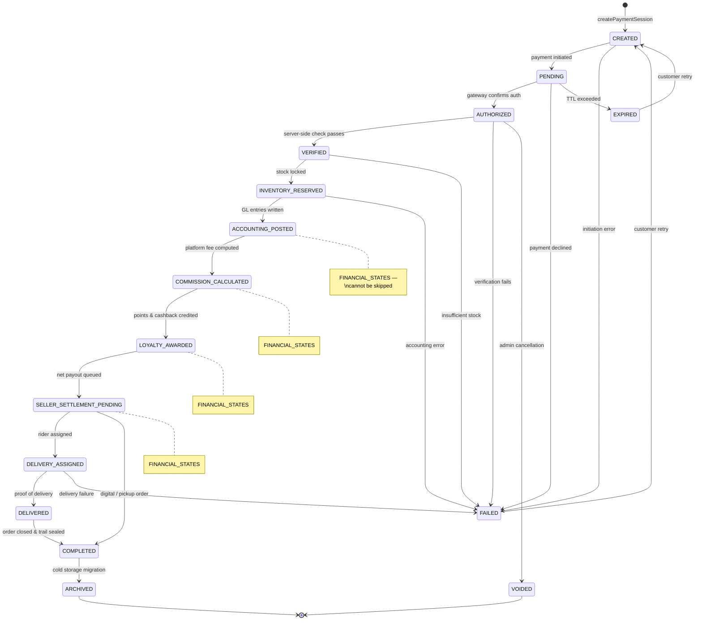
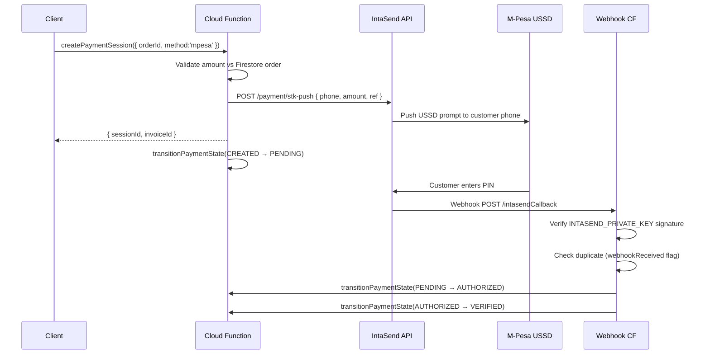
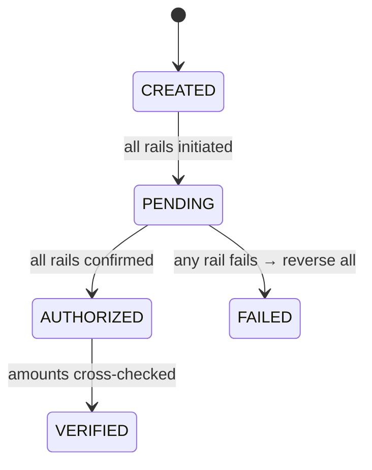

# SOKONI Commerce OS — Volume 4: Enterprise Payments

**Document ID:** vol-04-payments  
**Version:** 1.0  
**Date:** 2026-06-29  
**Status:** Production  
**Classification:** Internal — Engineering & Finance

---

## Related Volumes

- [[vol-01-vision-architecture]] — Platform philosophy and system design
- [[vol-03-pos-enterprise]] — SmartPOS and point-of-sale integration
- [[vol-05-accounting]] — Double-entry ledger and financial reporting
- [[vol-08-loyalty-platform]] — Loyalty points and cashback mechanics

---

## 1. Executive Summary

The SOKONI payment system is the financial backbone of every commercial transaction on the platform. It is designed around a single overriding principle: **integrity first, speed second**. No payment may advance without server-side validation. No financial state may be skipped. No audit trail may be erased.

Every payment on SOKONI is:

- **Idempotent** — retrying the same request always produces the same result; a deterministic session ID derived from order, merchant, user, and amount prevents duplicate charges.
- **Audited** — every state change is written to Firestore with a timestamp, actor, and reason; at completion the full trail is sealed with an HMAC-SHA256 signature stored in `paymentAuditSeals/{sessionId}`.
- **Reconciled** — a scheduled Cloud Function (`runDailyReconciliation`) sweeps all settled orders at 1:30 AM UTC every night, matching Firestore records against gateway data and flagging any discrepancy to `unmatchedPayments/{paymentRef}`.
- **Isolated** — the client never writes to `paymentSessions`; only Cloud Functions transition state; Firestore Security Rules enforce this boundary absolutely.

The architecture supports eight payment rails: Cash, M-Pesa (via IntaSend STK push), Card, Wallet, Gift Card, Store Credit, Split, and Mixed. The multi-rail design means a customer can pay part by wallet, part by M-Pesa, and redeem a gift card — all in one atomic transaction where all rails succeed or all fail together.

All monetary values are stored and computed as **KES integer cents** to eliminate floating-point rounding errors. No monetary arithmetic uses JavaScript `number` floating-point in financial positions.

---

## 2. Payment Architecture

### 2.1 Design Principles

| Principle | Implementation |
|-----------|----------------|
| Server-side amount validation | Cloud Functions read the order total from Firestore; client-supplied amount is compared and rejected if it differs |
| Atomic state changes | Every `transitionPaymentState` call uses Firestore `runTransaction` |
| Rail agnosticism | The FSM treats every payment method identically; rail-specific logic lives in separate modules |
| Defense in depth | App Check + Firebase Auth + custom claims + Firestore rules + CF-level validation |
| Zero trust | No field from the client is trusted without server verification |

### 2.2 Supported Payment Rails

```
┌───────────────────────────────────────────────────────────┐
│                    SOKONI Payment Rails                    │
├──────────────┬────────────────────────────────────────────┤
│ Rail         │ Description                                 │
├──────────────┼────────────────────────────────────────────┤
│ mpesa        │ M-Pesa STK push via IntaSend SDK            │
│ card         │ Debit/credit card via IntaSend card gateway │
│ wallet       │ SOKONI in-app wallet balance                │
│ cash         │ In-person cash (SmartPOS / delivery COD)    │
│ bank         │ Direct bank transfer / RTGS                 │
│ mixed        │ Combination of two or more rails            │
│ gift_card    │ Pre-loaded gift card with balance tracking  │
│ store_credit │ Merchant-issued credit from refund/promo    │
└──────────────┴────────────────────────────────────────────┘
```

`VALID_PAYMENT_METHODS` in `payment-state-machine.js` is the authoritative set: `['mpesa', 'card', 'wallet', 'cash', 'bank', 'mixed']`. Gift card and store credit are sub-rails under `mixed`.

### 2.3 System Components

```
Client (Browser / App)
       │  onCall (App Check + Auth enforced)
       ▼
┌─────────────────────────────────────────────────────────┐
│               payment-state-machine.js                  │
│  createPaymentSession · transitionPaymentState          │
│  getPaymentState · recoverPaymentSession                │
│  getStuckSessions · reconcilePaymentSessions            │
│  sealPaymentAuditTrail                                  │
└────────────────────┬────────────────────────────────────┘
                     │ Firestore runTransaction
                     ▼
          paymentSessions/{sessionId}
                     │
          ┌──────────┴──────────┐
          ▼                     ▼
paymentAuditSeals/    paymentRecoveryLog/
   {sessionId}          {sessionId}_{attempt}
```

```
Scheduler (1:30 AM UTC)
       │
       ▼
┌─────────────────────────────────────────────────────────┐
│             payment-reconciliation.js                   │
│  runDailyReconciliation · getReconciliationReport       │
│  flagUnmatchedPayment · resolveUnmatchedPayment         │
│  getMpesaReconciliationSummary                          │
│  triggerManualReconciliation                            │
└────────────────────┬────────────────────────────────────┘
                     │
          ┌──────────┴──────────┐
          ▼                     ▼
reconciliationReports/  unmatchedPayments/
   {YYYY-MM-DD}            {paymentRef}
```

---

## 3. Payment State Machine (12 States)

The FSM is the contractual guarantee that every payment follows a deterministic, auditable path. It is defined in `functions/payment-state-machine.js` and enforced exclusively by Cloud Functions.

### 3.1 State Diagram



### 3.2 VALID_TRANSITIONS Map

The following table is a direct transcription of the `VALID_TRANSITIONS` constant in `payment-state-machine.js`. Any attempt to transition outside these pairs causes a `failed-precondition` error.

| From State | Allowed Next States |
|---|---|
| `CREATED` | `PENDING`, `FAILED` |
| `PENDING` | `AUTHORIZED`, `FAILED`, `EXPIRED` |
| `AUTHORIZED` | `VERIFIED`, `FAILED`, `VOIDED` |
| `VERIFIED` | `INVENTORY_RESERVED`, `FAILED` |
| `INVENTORY_RESERVED` | `ACCOUNTING_POSTED`, `FAILED` |
| `ACCOUNTING_POSTED` | `COMMISSION_CALCULATED` |
| `COMMISSION_CALCULATED` | `LOYALTY_AWARDED` |
| `LOYALTY_AWARDED` | `SELLER_SETTLEMENT_PENDING` |
| `SELLER_SETTLEMENT_PENDING` | `DELIVERY_ASSIGNED`, `COMPLETED` |
| `DELIVERY_ASSIGNED` | `DELIVERED`, `FAILED` |
| `DELIVERED` | `COMPLETED` |
| `COMPLETED` | `ARCHIVED` |
| `ARCHIVED` | _(none — terminal)_ |
| `FAILED` | `CREATED` _(retry)_ |
| `EXPIRED` | `CREATED` _(retry)_ |
| `VOIDED` | _(none — irrecoverable)_ |

### 3.3 FINANCIAL_STATES — Cannot Be Skipped

The following six states constitute the `FINANCIAL_STATES` set. The state machine enforces that any forward transition that would bypass one of these states is rejected. This ensures every payment is fully accounted for before reaching settlement.

```
VERIFIED
INVENTORY_RESERVED
ACCOUNTING_POSTED
COMMISSION_CALCULATED
LOYALTY_AWARDED
SELLER_SETTLEMENT_PENDING
```

Attempting to jump from `AUTHORIZED` directly to `SELLER_SETTLEMENT_PENDING`, for example, throws a `failed-precondition` error because `VERIFIED`, `INVENTORY_RESERVED`, `ACCOUNTING_POSTED`, `COMMISSION_CALCULATED`, and `LOYALTY_AWARDED` would all be skipped.

### 3.4 Terminal States

```
COMPLETED  — order fully processed; audit trail sealed
ARCHIVED   — moved to cold storage; no further transitions
VOIDED     — irrecoverable cancellation by admin; no retry
```

`FAILED` and `EXPIRED` are not truly terminal: both may transition back to `CREATED` to allow a customer retry.

---

## 4. Payment Session

### 4.1 Collection Schema

**Collection:** `paymentSessions/{sessionId}`

| Field | Type | Description |
|---|---|---|
| `sessionId` | string | Deterministic SHA-256 hash (see 4.2) |
| `orderId` | string | Parent order reference |
| `merchantId` | string | Merchant who owns the order |
| `uid` | string | Authenticated buyer UID |
| `amountCents` | integer | Total charge in KES cents (server-set) |
| `paymentMethod` | string | One of `VALID_PAYMENT_METHODS` |
| `state` | string | Current FSM state |
| `rails` | map[] | Per-rail breakdown for `mixed` payments |
| `createdAt` | Timestamp | Session creation time |
| `updatedAt` | Timestamp | Last state change |
| `expiresAt` | Timestamp | Session TTL (typically 30 minutes) |
| `transitionLog` | map[] | Ordered list of every state change |
| `gatewayRef` | string | IntaSend invoice/payment reference |
| `webhookReceived` | boolean | Whether gateway callback arrived |
| `idempotencyKey` | string | Matches `sessionId` for dedup |

### 4.2 Deterministic Session ID

The session ID is a SHA-256 hex digest of the pipe-delimited tuple `orderId|merchantId|uid|amountCents`. This construction guarantees that:

- The same customer retrying the same order always resolves to the same session document.
- Any mutation of the order, merchant, user, or amount produces a completely different session ID, preventing cross-session collisions.
- No sequential or guessable identifiers are exposed to clients.

```js
// from payment-state-machine.js (line 150+)
const sessionId = crypto
  .createHash('sha256')
  .update(`${orderId}|${merchantId}|${uid}|${amountCents}`)
  .digest('hex');
```

### 4.3 Idempotent createPaymentSession

`createPaymentSession` is the entry point for all payment flows. If a session document already exists for the computed `sessionId`, the function returns the existing session without creating a duplicate. This means:

- Network retries are safe.
- Double-taps on "Pay" buttons are absorbed.
- The gateway is never charged twice for the same intent.

New sessions are written with `state: 'CREATED'` and an `expiresAt` 30 minutes in the future. The Firestore Security Rules permit only Cloud Functions to create or modify documents in `paymentSessions`.

---

## 5. State Transitions

### 5.1 transitionPaymentState Cloud Function

This is the single, canonical function for advancing the FSM. It is exported from `payment-state-machine.js` and deployed with `enforceAppCheck: true`.

**Flow:**

```
Client calls transitionPaymentState({ sessionId, toState, reason, meta })
  │
  ├── assertAuth(req)        — must be authenticated
  ├── validate inputs        — sessionId, toState must be non-empty strings
  │
  └── db.runTransaction(async tx => {
        const session = tx.get(paymentSessions/{sessionId})
        if (!session.exists) → throw not-found
        const current = session.data().state
        const allowed = VALID_TRANSITIONS[current]
        if (!allowed.includes(toState)) → throw failed-precondition
        tx.update(session.ref, {
          state: toState,
          updatedAt: F.serverTimestamp(),
          transitionLog: F.arrayUnion({
            from: current, to: toState,
            at: new Date().toISOString(),
            actor: req.auth.uid,
            reason, meta
          })
        })
      })
```

### 5.2 Audit Trail on Every Transition

`transitionLog` is an append-only array field. Each entry records:

- `from` — the state being left
- `to` — the new state
- `at` — ISO timestamp
- `actor` — UID of the authenticated caller (or `'system'` for scheduled functions)
- `reason` — human-readable reason string
- `meta` — optional structured metadata (gateway ref, stock quantities, etc.)

Because `F.arrayUnion` is used, concurrent updates cannot overwrite each other; each transition appends atomically.

### 5.3 Error Responses

| Condition | Error Code | Message |
|---|---|---|
| Not authenticated | `unauthenticated` | Authentication required. |
| Session not found | `not-found` | Payment session not found. |
| Invalid transition | `failed-precondition` | Transition from X to Y is not permitted. |
| Session expired | `failed-precondition` | Session has expired. |
| System error | `internal` | _(sanitized; detail in audit log)_ |

---

## 6. M-Pesa / IntaSend Integration

### 6.1 STK Push Flow



### 6.2 Webhook Verification

Every incoming webhook from IntaSend is verified using the `INTASEND_PRIVATE_KEY` secret from Secret Manager. The verification logic:

1. Read the `X-IntaSend-Signature` header from the request.
2. Compute HMAC-SHA256 of the raw request body using `INTASEND_PRIVATE_KEY`.
3. Compare signatures using `crypto.timingSafeEqual` to prevent timing attacks.
4. Reject any request where signatures do not match with a `403` response and an audit log entry.

### 6.3 Duplicate Callback Prevention

IntaSend may deliver the same webhook event more than once. The `webhookReceived` boolean field on the session document is set in the same `runTransaction` that transitions state. If the field is already `true` when the webhook arrives, the handler returns `200 OK` immediately without re-processing (idempotent webhook handling).

### 6.4 Sandbox vs Live

The IntaSend SDK is initialised with the `isTest` flag derived from `process.env.INTASEND_ENV`. In the Cloud Functions environment, `INTASEND_ENV=live` is set in `functions/.env` for production and `INTASEND_ENV=sandbox` for the staging project. The `INTASEND_API_KEY` secret in Secret Manager carries environment-appropriate credentials.

---

## 7. Wallet Payments

Wallet payments are processed entirely within Firestore with no external gateway call.

**Flow:**

1. Client calls `createPaymentSession({ method: 'wallet', orderId })`.
2. CF reads the buyer's wallet balance from `wallets/{uid}`.
3. If `balance < amountCents`, throw `failed-precondition: Insufficient wallet balance.`
4. Within a single `runTransaction`:
   - Debit wallet: `wallets/{uid}.balance -= amountCents`
   - Write accounting entry: `paymentLedger/{entryId}` (debit wallet, credit escrow)
   - Transition session: `CREATED → PENDING → AUTHORIZED → VERIFIED`
5. The session then continues the FSM through inventory reservation and beyond.

Wallet balance is **never read from the client**. The server is the sole source of truth. Any attempt to pass a `balance` field from the client is silently discarded.

---

## 8. Gift Card Payments

Gift cards are represented as documents in `giftCards/{cardCode}` with fields `balanceCents`, `issuedTo` (optional), and `expiresAt`.

**Redemption flow:**

1. Client provides `giftCardCode` alongside the order.
2. CF validates the code: must exist, not expired, balance > 0.
3. If gift card balance >= order total: full redemption; card balance reduced to 0.
4. If gift card balance < order total: partial redemption.
   - The remainder is settled via a secondary rail (M-Pesa, wallet, etc.).
   - If no secondary rail covers the gap, a store credit of the difference is issued to the buyer's account.
5. All balance changes occur inside a `runTransaction` with the session state transition to prevent race conditions on shared gift card codes.

---

## 9. Split Payments

Split payments allow a customer to combine any two or more rails to cover a single order total. The defining constraints are:

- `sum(rails[].amountCents)` must equal the session `amountCents` (validated server-side; rejected otherwise).
- All rails are processed atomically: if any single rail fails (e.g., wallet insufficient, M-Pesa declined), the entire session transitions to `FAILED` and all partial charges are reversed.
- Each rail is tracked as an element of the `rails` array on the session document, each carrying `{ method, amountCents, status, ref }`.

**Mixed session state progression:**



The reversal logic on partial failure writes a `reversal` entry to `paymentLedger` for each rail that had already settled, ensuring the ledger remains balanced.

---

## 10. Payment Audit and HMAC Seals

### 10.1 sealPaymentAuditTrail Cloud Function

When a payment reaches `COMPLETED`, the `sealPaymentAuditTrail` CF is triggered (either directly or via a Firestore `onDocumentUpdated` trigger on `paymentSessions`).

**Steps:**

1. Read the full session document including the entire `transitionLog`.
2. Serialise the log to a canonical JSON string (keys sorted, no whitespace).
3. Compute `HMAC-SHA256(canonicalJSON, PAYMENT_HMAC_SECRET)` — the secret is resolved from Secret Manager at runtime via `defineSecret('PAYMENT_HMAC_SECRET')`.
4. Transition the session from `COMPLETED` to `ARCHIVED`.
5. Write to `paymentAuditSeals/{sessionId}`:

```js
{
  sessionId,
  sealedAt: F.serverTimestamp(),
  algorithm: 'hmac-sha256',
  seal: '<hex digest>',
  logLength: transitionLog.length,
  archivedBy: 'system'
}
```

### 10.2 Seal Verification

To verify a seal (e.g., during an audit), an admin calls the verification endpoint which:

1. Reads `paymentSessions/{sessionId}` and `paymentAuditSeals/{sessionId}`.
2. Re-computes the HMAC from the stored `transitionLog`.
3. Compares with `crypto.timingSafeEqual` against the stored seal.
4. Returns `{ valid: true/false, verifiedAt }`.

A broken seal indicates tampering with the Firestore document after archival, which is an immediate security incident trigger.

---

## 11. Daily Reconciliation

### 11.1 runDailyReconciliation

**Schedule:** `1:30 AM UTC` (4:30 AM EAT) — defined in `payment-reconciliation.js` via `onSchedule`.

This function sweeps all orders with `status` in `SETTLED_STATUSES` (`completed`, `confirmed`) that were updated since the previous reconciliation run.

**Algorithm:**

```
For each settled order (paginated, 500 per page):
  1. Read order.paymentRef (IntaSend invoice ID)
  2. Read order.amountCents
  3. Look up paymentSessions where gatewayRef == paymentRef
  4. Compare session.amountCents vs order.amountCents
  5. If mismatch → write to unmatchedPayments/{paymentRef}
                 → write to adminAlerts/{id}
  6. If matched  → write matched: true to reconciliationReports/{date}.matched[]

Write summary to reconciliationReports/{YYYY-MM-DD}:
  { date, totalOrders, totalAmountCents, matched, unmatched, runAt }
```

Pagination prevents the function from timing out on days with large transaction volumes. The 500-document page size is chosen to remain well within the Firestore transaction size limits.

### 11.2 getReconciliationReport

Admin-only callable CF (`assertAdmin` enforced). Accepts a `date` string in `YYYY-MM-DD` format, validated by `parseDateRange` in `payment-reconciliation.js`. Returns the full `reconciliationReports/{date}` document.

### 11.3 flagUnmatchedPayment and resolveUnmatchedPayment

| CF | Actor | Action |
|---|---|---|
| `flagUnmatchedPayment` | Admin | Writes/updates `unmatchedPayments/{paymentRef}` with investigation notes |
| `resolveUnmatchedPayment` | Admin | Marks resolution as `matched`, `refunded`, or `written_off` (from `VALID_RESOLUTIONS`) |

Both functions write a full audit trail including the admin UID, timestamp, and resolution reason.

### 11.4 triggerManualReconciliation

An admin-callable CF that executes the same logic as `runDailyReconciliation` on demand for a specified date range. Used after incidents, data migrations, or when the scheduled run fails. Requires `superAdmin` claim.

### 11.5 getMpesaReconciliationSummary

Returns an M-Pesa specific summary for a given date: total STK pushes initiated, completed, failed, and the net KES amount settled. Useful for the finance team's daily M-Pesa float reconciliation with Safaricom's statement.

---

## 12. Session Recovery

### 12.1 recoverPaymentSession Cloud Function

Occasionally a client disconnects mid-flow (network drop after STK push, browser crash after card pre-auth). The `recoverPaymentSession` CF is an admin-only bypass mechanism.

**Preconditions:**

- Caller must have `admin` or `superAdmin` custom claim (`assertAdmin` enforced).
- The session must exist in `paymentSessions`.
- The session must not be in a `TERMINAL_STATES` member (`COMPLETED`, `ARCHIVED`, `VOIDED`).

**Steps:**

1. Read current session state and the full `transitionLog`.
2. Determine the correct recovery target state based on available evidence (gateway callback received, inventory check result, etc.).
3. Transition to the recovery state via `runTransaction`.
4. Write a `paymentRecoveryLog/{sessionId}_{attempt}` document recording the recovery details, the admin actor, and the justification.

Recovery actions are audit-logged with `{ type: 'ADMIN_RECOVERY', actor, sessionId, fromState, toState, reason }` and generate an `adminAlerts` entry for ops review.

### 12.2 getStuckSessions Cloud Function

Returns sessions that have remained in a non-terminal, non-`ARCHIVED` state beyond the `expiresAt` threshold. Used by the ops team during incident response and by the reconciliation engine to identify sessions that the scheduled sweep should flag.

---

## 13. Duplicate Prevention

SOKONI's payment system defends against duplicates at multiple layers:

| Layer | Mechanism |
|---|---|
| Session creation | Deterministic `sessionId = sha256(orderId|merchantId|uid|amountCents)` — same inputs always resolve to the same document |
| Webhook delivery | `webhookReceived` boolean set atomically in the same transaction that transitions state; subsequent callbacks return `200 OK` without re-processing |
| STK push | IntaSend's own idempotency key (set to `sessionId`) prevents duplicate pushes to the same phone |
| Coupon codes | `usedCount` is incremented only at `ACCOUNTING_POSTED` state (order confirmation), never at `applyCouponCode` time; prevents coupons being consumed by abandoned carts |
| Retry safety | `createPaymentSession` returns the existing session for duplicate calls; no new gateway charge is initiated |

---

## 14. Refunds and Chargebacks

### 14.1 Refund Flow

Refunds are treated as a reverse FSM traversal through the accounting layer:

```
1. Admin initiates refund → creates refund session linked to original sessionId
2. Reverse accounting entry: debit escrow, credit customer (paymentLedger)
3. Restore inventory: return reserved stock to available quantity
4. Reverse loyalty: deduct points/cashback awarded on the original order
5. Initiate gateway refund: IntaSend reverse transfer to original payment instrument
6. Notify customer: push + email with refund confirmation and timeline
7. Update seller settlement: if already paid out, raise deduction against next settlement batch
```

All refund steps are wrapped in a `runTransaction` where possible. For operations that span external systems (IntaSend refund API call), compensating transactions are written to `paymentLedger` to maintain ledger balance.

### 14.2 Chargeback Escalation

When a chargeback is received from the card network via IntaSend webhook:

1. Session is immediately transitioned to `VOIDED` (irrecoverable).
2. An `adminAlerts/{id}` document is created with `severity: 'critical'` and `type: 'chargeback'`.
3. The seller's `chargebackCount` metric is incremented.
4. If `chargebackCount` exceeds the policy threshold (currently 3 within 90 days), the seller account is flagged for review by the Trust & Safety engine.

---

## 15. Replay Attack Prevention

| Attack Vector | Defence |
|---|---|
| Webhook replay | `webhookReceived` flag + timestamp window validation; webhooks older than 5 minutes are rejected |
| Session reuse | Deterministic session ID tied to specific `amountCents`; any amount change creates a new session |
| Nonce tracking | Each IntaSend callback carries a unique `invoice_id`; processed IDs are recorded in `processedWebhooks/{invoiceId}` with a 24-hour TTL |
| Timestamp drift | Webhook `created_at` is compared to server time; requests with `|diff| > 300s` are rejected with a logged security event |
| Token theft | Session document is not readable by the client (Firestore rules restrict to CF writes only); the `sessionId` alone provides no privileged access |

---

## 16. Ledger Integrity

Every financial state change in the FSM writes a corresponding double-entry journal to `paymentLedger`. The double-entry constraint is enforced in the application layer:

```
ACCOUNTING_POSTED state:
  DR  accounts_receivable   amountCents
  CR  customer_payment      amountCents

COMMISSION_CALCULATED state:
  DR  customer_payment      commissionCents
  CR  platform_revenue      commissionCents

SELLER_SETTLEMENT_PENDING state:
  DR  customer_payment      sellerNetCents
  CR  seller_payable        sellerNetCents
```

The `paymentLedger` collection is append-only. No document is ever updated or deleted. The daily reconciliation verifies that for every `orderId`, total debits equal total credits. Any imbalance is flagged to `unmatchedPayments` and triggers an `adminAlert`.

See [[vol-05-accounting]] for the full double-entry ledger architecture, chart of accounts, and financial reporting pipeline.

---

## 17. Security

### 17.1 Server-Side Amount Validation

The single most important security control in the payment system. No amount value from the client is used in any financial computation. When `createPaymentSession` is called:

1. The CF reads `orders/{orderId}.totalAmountCents` directly from Firestore.
2. If the client passed an `amountCents` field, it is compared to the server value.
3. Any discrepancy causes an immediate rejection with error code `failed-precondition: Amount mismatch.` and an audit log entry flagged as a potential fraud signal.

### 17.2 Firestore Security Rules

```
// paymentSessions — no client reads or writes
match /paymentSessions/{sessionId} {
  allow read, write: if false; // CF-only via Admin SDK
}

// paymentAuditSeals — admin read only
match /paymentAuditSeals/{sessionId} {
  allow read: if request.auth.token.admin == true;
  allow write: if false; // CF-only
}
```

### 17.3 Secret Management

All cryptographic secrets are stored in Google Cloud Secret Manager and accessed via `defineSecret()` at Cloud Function runtime. They are never stored in environment variables, source code, or Firestore.

| Secret | Purpose |
|---|---|
| `PAYMENT_HMAC_SECRET` | Signs audit trail seals in `sealPaymentAuditTrail` |
| `INTASEND_API_KEY` | Authenticates IntaSend API calls |
| `INTASEND_PRIVATE_KEY` | Verifies incoming IntaSend webhook signatures |

### 17.4 App Check Enforcement

All CFs in `payment-state-machine.js` and `payment-reconciliation.js` are deployed with `enforceAppCheck: true` in the `OPT` constant. Unattestation requests are rejected at the Firebase infrastructure layer before any CF code runs.

---

## 18. Error Handling

### 18.1 Error Taxonomy

| Error | Code | Visible to Client | Details In |
|---|---|---|---|
| Invalid transition | `failed-precondition` | Yes (sanitized) | `transitionLog` |
| Amount mismatch | `failed-precondition` | Yes (sanitized) | Audit log |
| Session expired | `failed-precondition` | Yes | `transitionLog` |
| Session not found | `not-found` | Yes | — |
| Unauthenticated | `unauthenticated` | Yes | — |
| Permission denied | `permission-denied` | Yes | — |
| Gateway error | `unavailable` | Yes (sanitized) | Audit log + `adminAlerts` |
| Internal error | `internal` | No | Cloud Logging |

### 18.2 Graceful Degradation

- If IntaSend STK push fails: session moves to `FAILED`; customer is shown a retry option.
- If inventory reservation fails: session moves to `FAILED`; no charge is made; customer is shown stock-unavailable messaging.
- If `sealPaymentAuditTrail` fails: an `adminAlert` is created; the session remains in `COMPLETED` state for manual sealing; the order is not blocked.
- If `runDailyReconciliation` fails mid-run: the partial report is written with `partial: true`; `triggerManualReconciliation` can replay the run for the same date.

---

## 19. Performance Targets

| Operation | Target | Notes |
|---|---|---|
| `createPaymentSession` | < 500ms p95 | Firestore write + sessionId compute |
| STK push initiation (IntaSend) | < 2s p95 | Network call to IntaSend; retry on 5xx |
| Webhook processing | < 500ms p95 | Verify + transition + audit write |
| `transitionPaymentState` | < 300ms p95 | Single `runTransaction` |
| `runDailyReconciliation` (10k orders) | < 5 minutes | Paginated at 500 docs/page |
| `sealPaymentAuditTrail` | < 1s p95 | HMAC compute + 2 Firestore writes |
| `getPaymentState` | < 100ms p95 | No App Check; direct Firestore read |

Reconciliation uses pagination with 500 documents per page to avoid Cloud Function memory limits and stay within Firestore `getDocs` rate limits. For platforms with > 50k daily orders, the reconciliation schedule should be shifted to a dedicated Cloud Run job.

---

## 20. Collections Reference

| Collection | Purpose |
|---|---|
| `paymentSessions/{sessionId}` | Active and completed payment sessions |
| `paymentAuditSeals/{sessionId}` | HMAC seals for archived sessions |
| `paymentRecoveryLog/{sessionId}_{attempt}` | Admin recovery actions |
| `paymentReconciliation/{id}` | Internal reconciliation working data |
| `reconciliationReports/{YYYY-MM-DD}` | Daily reconciliation summaries |
| `unmatchedPayments/{paymentRef}` | Flagged discrepancies for investigation |
| `paymentLedger/{entryId}` | Double-entry journal (append-only) |
| `processedWebhooks/{invoiceId}` | Nonce tracking for replay prevention |
| `adminAlerts/{id}` | Ops alerts raised by payment CFs |
| `wallets/{uid}` | Customer wallet balances |
| `giftCards/{cardCode}` | Gift card balances |

---

## 21. Cloud Functions Reference

| Function | File | Trigger | Auth |
|---|---|---|---|
| `createPaymentSession` | `payment-state-machine.js` | `onCall` | Auth + AppCheck |
| `transitionPaymentState` | `payment-state-machine.js` | `onCall` | Auth + AppCheck |
| `getPaymentState` | `payment-state-machine.js` | `onCall` | Auth (no AppCheck) |
| `recoverPaymentSession` | `payment-state-machine.js` | `onCall` | Admin + AppCheck |
| `getStuckSessions` | `payment-state-machine.js` | `onCall` | Admin + AppCheck |
| `reconcilePaymentSessions` | `payment-state-machine.js` | `onSchedule` (1AM UTC) | System |
| `sealPaymentAuditTrail` | `payment-state-machine.js` | `onCall` / trigger | Admin + AppCheck |
| `runDailyReconciliation` | `payment-reconciliation.js` | `onSchedule` (1:30AM UTC) | System |
| `getReconciliationReport` | `payment-reconciliation.js` | `onCall` | Admin + AppCheck |
| `flagUnmatchedPayment` | `payment-reconciliation.js` | `onCall` | Admin + AppCheck |
| `resolveUnmatchedPayment` | `payment-reconciliation.js` | `onCall` | Admin + AppCheck |
| `getMpesaReconciliationSummary` | `payment-reconciliation.js` | `onCall` | Admin + AppCheck |
| `triggerManualReconciliation` | `payment-reconciliation.js` | `onCall` | SuperAdmin + AppCheck |

---

## 22. Deployment Requirements

Before deploying payment CFs:

1. Create `PAYMENT_HMAC_SECRET` in Secret Manager (minimum 32 bytes, random).
2. Create `INTASEND_API_KEY` in Secret Manager (from IntaSend dashboard).
3. Create `INTASEND_PRIVATE_KEY` in Secret Manager (from IntaSend dashboard — used for webhook verification).
4. Set `INTASEND_ENV=live` in `functions/.env` for production (default is `sandbox`).
5. Configure Firestore composite indexes for `paymentSessions` queries (filter by `uid` + orderBy `createdAt`).
6. Set App Check ReCaptcha V3 site key in `sokoni-config.js` (required for client-side App Check attestation).
7. Ensure the Cloud Functions service account has `roles/secretmanager.secretAccessor` on the three secrets above.

---

## 23. Cross-References

- [[vol-01-vision-architecture]] — Platform philosophy, event bus, and system topology
- [[vol-03-pos-enterprise]] — SmartPOS cash and card payment paths; receipt printing on payment completion
- [[vol-05-accounting]] — Full double-entry ledger, chart of accounts, GL journal entries per payment state
- [[vol-08-loyalty-platform]] — Points awarded at `LOYALTY_AWARDED` state; cashback calculation; tier upgrades triggered by order completion

---

*Document maintained by the SOKONI Engineering team. Update this volume whenever payment state definitions, CF names, collection schemas, or reconciliation schedules change.*
