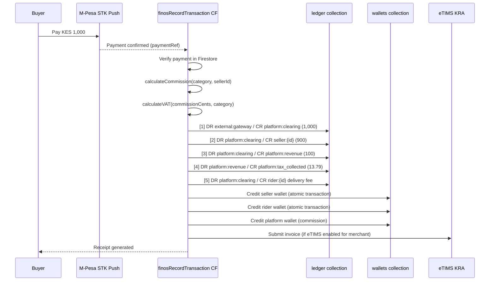
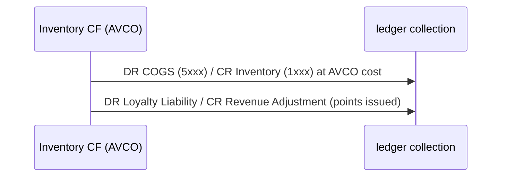
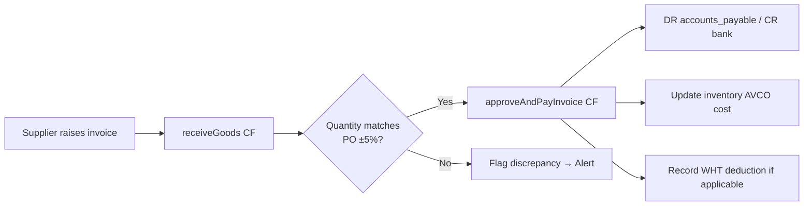
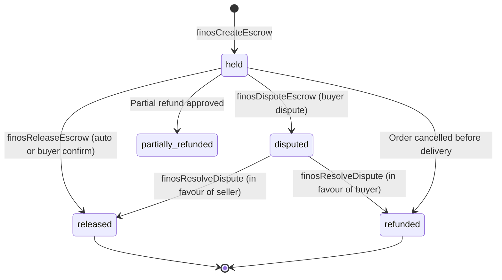

# SOKONI Commerce OS — Volume 5: Enterprise Accounting

> **Series:** SOKONI Commerce OS Documentation Suite
> **Volume:** 05 of 20
> **Status:** Production — FinOS v2.0 Live
> **Last Updated:** 2026-06-29
> **Related:** [[vol-04-payments]] | [[vol-06-inventory-warehousing]] | [[vol-12-hr-workforce]] | [[vol-01-vision-architecture]]

---

## 1. Executive Summary

SOKONI's Financial Operating System (FinOS) implements a **strict double-entry accounting ledger** in which every financial event — sale, commission deduction, VAT posting, rider payment, refund, or settlement — automatically generates balanced journal entries with no human intervention. The system is:

- **GAAP-aligned**: Revenue is recognised when earned (delivery completed), not when payment is received. Unearned revenue and escrow balances appear as liabilities until released.
- **Kenya-specific**: VAT at 16% is calculated and posted server-side. Withholding Tax (WHT) at 5% is deducted from seller payouts before disbursement. eTIMS invoice submission is integrated for KRA compliance under the Finance Act 2024/2025.
- **Atomic**: Every journal entry is written inside a Firestore `runTransaction` or `batch`. If any entry fails, none are committed. There are no partial posts.
- **Immutable**: The `ledger` collection is Cloud Function–write only. No client or admin dashboard can alter a committed entry. Reversals create new offsetting entries, never mutate originals.
- **Idempotent**: Every CF that writes to the ledger derives a SHA-256 idempotency key from its inputs. Duplicate invocations are detected and returned without re-posting.

All monetary values are stored as **KES integer cents** (1 KES = 100 units). This eliminates floating-point rounding errors that would cause ledger imbalances.

FinOS spans three Cloud Function files — `finos.js` (18 Gen2 CFs), `finos-router.js` (12 CFs, the Universal Transaction Router), and `finos-utils.js` (shared utilities) — backed by the `financial-os.html` 11-panel admin dashboard.

---

## 2. Chart of Accounts

### 2.1 Standard COA Structure

SOKONI follows a numeric Chart of Accounts aligned to standard retail accounting practice:

| Range | Class | Examples |
|---|---|---|
| **1xxx** | Assets | Cash, Inventory, Accounts Receivable, Prepayments |
| **2xxx** | Liabilities | Accounts Payable, VAT Payable, Wallet Liability, Loyalty Liability, Escrow Held |
| **3xxx** | Equity | Retained Earnings, Merchant Contributed Capital |
| **4xxx** | Revenue | Marketplace Sales, Delivery Revenue, Commission Income, Subscription Revenue |
| **5xxx** | Cost of Goods Sold | Inventory Cost, Direct Labour, Fulfilment Cost |
| **6xxx** | Operating Expenses | Platform Fees, Marketing, Salaries, Infrastructure |

### 2.2 Platform Account Namespaces

The `finos-utils.js` ACCOUNTS object defines the canonical account identifiers used in every ledger entry:

| Identifier | Purpose |
|---|---|
| `platform:revenue` | Platform commission income (4xxx) |
| `platform:clearing` | Transit account for payment routing (1xxx) |
| `platform:expenses` | Platform operating expenses (6xxx) |
| `platform:tax_collected` | VAT payable to KRA (2xxx) |
| `platform:promotions_fund` | Promotional spend liability (2xxx) |
| `platform:rolling_reserve` | Rolling reserve held (2xxx) |
| `external:gateway` | IntaSend / M-Pesa gateway (contra-asset) |
| `external:mpesa` | M-Pesa settlement account |
| `external:bank` | Bank disbursement account |
| `seller:{id}` | Per-seller earnings wallet |
| `rider:{id}` | Per-rider earnings wallet |
| `buyer:{id}` | Per-buyer wallet / loyalty balance |
| `hub:{id}` | Hub-level clearing account |

### 2.3 Firestore Structure

```
chartOfAccounts/
  {merchantId}/
    accounts/
      {code}/          ← e.g. "4001"
        code:          "4001"
        name:          "Marketplace Sales Revenue"
        type:          "revenue"          ← asset|liability|equity|revenue|expense
        normalBalance: "credit"           ← debit|credit
        currency:      "KES"
        isActive:      true
        taxCategory:   "vatable"          ← vatable|exempt|zero_rated
        parentCode:    "4000"
        createdAt:     Timestamp
        updatedAt:     Timestamp
```

---

## 3. Double-Entry Ledger

### 3.1 Core Principle

For every financial event, the total of debit entries must equal the total of credit entries. SOKONI enforces this invariant at the Cloud Function layer — no amount can be written to one side without writing an equal amount to the other side in the same atomic operation.

```
Debit Side            Credit Side
─────────────         ──────────────
Increases: Assets     Increases: Liabilities
           Expenses              Equity
                                 Revenue
Decreases: Liabilities Decreases: Assets
           Equity                 Expenses
           Revenue
```

### 3.2 Ledger Collection Schema

```
ledger/
  {entryId}/
    id:             string        ← same as document ID
    type:           string        ← payment_received|seller_earning|commission|tax|
                                     delivery_fee|tip|refund|reversal|escrow_hold|
                                     escrow_release|settlement|withdrawal|promo
    amountCents:    integer       ← positive KES cents
    currency:       "KES"
    debitAccount:   string        ← account namespace (see §2.2)
    creditAccount:  string
    description:    string
    orderId:        string|null
    sellerId:       string|null
    riderId:        string|null
    buyerId:        string|null
    category:       string|null   ← marketplace|food_delivery|services|…
    metadata:       map           ← commission rates, tax rates, ruleId, etc.
    status:         "settled"|"reversed"
    reversalRef:    string|null   ← ID of reversal entry if reversed
    createdBy:      string        ← CF name or admin UID
    idempotencyKey: string        ← SHA-256 derived, prevents double-post
    createdAt:      Timestamp
    settledAt:      Timestamp
    reversedAt:     Timestamp|null
```

### 3.3 Journal Entry Example — Sale

For a marketplace order of KES 1,000 with 10% commission and 16% VAT on commission:

| # | Type | Debit Account | Credit Account | Amount (KES) |
|---|---|---|---|---|
| 1 | payment_received | external:gateway | platform:clearing | 1,000.00 |
| 2 | seller_earning | platform:clearing | seller:{id} | 900.00 |
| 3 | commission | platform:clearing | platform:revenue | 100.00 |
| 4 | tax (VAT on commission) | platform:revenue | platform:tax_collected | 13.79 |

Ledger remains balanced: Clearing receives 1,000, distributes 900 + 100 = 1,000.

---

## 4. General Ledger

### 4.1 Collection Structure

```
generalLedger/
  {merchantId}/
    entries/
      {entryId}/
        accountCode:    string      ← e.g. "4001"
        period:         string      ← "2026-06" (YYYY-MM)
        entryDate:      Timestamp
        description:    string
        debitCents:     integer
        creditCents:    integer
        runningBalance: integer     ← recomputed on each entry
        ledgerRef:      string      ← FK to ledger/{entryId}
        orderId:        string|null
        isLocked:       boolean     ← true after period close
        createdAt:      Timestamp
```

### 4.2 Running Balance Maintenance

Running balance is maintained per account per merchant. Each CF that posts to the ledger also increments/decrements the general ledger balance using `FieldValue.increment()` inside the same transaction, ensuring the balance is always current without a full scan.

### 4.3 Period Filtering

All financial reports accept `{ startDate, endDate }` parameters. The General Ledger supports Firestore range queries on the `entryDate` field. The `period` field (YYYY-MM) enables efficient monthly roll-ups via collection group queries.

### 4.4 Audit Trail

Every General Ledger entry carries a `ledgerRef` foreign key to the source `ledger/{entryId}` document. From any trial balance or P&L line, an admin can drill through to the original Cloud Function invocation, the order ID, and the user ID. This chain is immutable.

---

## 5. Sale Posting Flow

The following diagram shows the complete journal entry sequence triggered when a sale is completed:



**COGS and Inventory entries** (for SmartPOS / retail merchants) are posted by a separate `recordSaleCOGS` CF that reads the AVCO cost from the inventory layer:



---

## 6. VAT (Kenya 16%)

### 6.1 Rate and Scope

Kenya's Value Added Tax Act applies a standard rate of **16%** on taxable supplies. The following SOKONI hub categories are **VAT-exempt** per the `TAX_CONFIG` in `finos-utils.js`:

- `property` — real estate transactions
- `jobs` — recruitment fees
- `healthcare` — medical services
- `education` — educational services

All other categories (marketplace, food, services, events, digital products, etc.) attract VAT at 16%.

### 6.2 VAT-Inclusive vs. VAT-Exclusive Pricing

SOKONI merchants can list prices either inclusive or exclusive of VAT. The platform converts all prices to VAT-inclusive at display time. VAT is extracted from commission on the platform side — the buyer-facing price is always VAT-inclusive.

**VAT extraction formula (tax-inclusive):**

```
VAT amount = (gross amount × VAT rate) / (100 + VAT rate)
           = (gross × 16) / 116
           ≈ gross × 0.13793
```

All VAT amounts are rounded to the nearest cent (integer) after calculation.

### 6.3 VAT Ledger Entry

Every commission posting creates a corresponding VAT entry:

```
DR platform:revenue           ← reduces commission income
CR platform:tax_collected     ← increases VAT payable liability
```

### 6.4 VAT Return Preparation

The `getVATReturn` Cloud Function aggregates all `platform:tax_collected` credits in a date range and produces a structured return including:
- Output VAT (collected from buyers)
- Input VAT (paid on platform expenses — where claimable)
- Net VAT payable to KRA
- Breakdown by hub category

### 6.5 KRA PIN Validation

Merchant onboarding requires a valid KRA PIN. The PIN is validated against the KRA PIN Checker API during registration. eTIMS invoice submission requires a confirmed KRA PIN in the merchant profile (`merchants/{id}/kraPin`).

### 6.6 eTIMS Integration

eTIMS (Electronic Tax Invoice Management System) is integrated at the invoice generation stage. For every completed sale on an eTIMS-enrolled merchant:
1. The `etims.js` CF generates a signed invoice payload.
2. The invoice is submitted to the KRA eTIMS endpoint.
3. A Fiscal Document Control Unit (FDCU) number is stamped on the receipt.
4. The submission status is recorded in `etimsInvoices/{invoiceId}`.

---

## 7. Accounts Payable

### 7.1 Procurement Invoice Flow

When a merchant receives goods from a supplier, the following flow applies:



### 7.2 Tolerance Policy

SOKONI applies a **±5% quantity tolerance** on goods received versus purchase order quantity. Variances within tolerance are auto-approved. Variances outside tolerance are held for manual review and generate an admin alert.

### 7.3 Accounts Payable Ledger Entries

| Event | Debit | Credit |
|---|---|---|
| Invoice received | Inventory / Expense (1xxx/6xxx) | Accounts Payable (2xxx) |
| Invoice paid | Accounts Payable (2xxx) | Bank / M-Pesa (1xxx) |
| WHT deducted | Accounts Payable (2xxx) | WHT Payable (2xxx) |

---

## 8. Revenue Recognition

### 8.1 Principle

SOKONI follows the **accrual basis** of accounting aligned to IFRS 15 (Revenue from Contracts with Customers). Revenue is recognised when:

1. The performance obligation is satisfied (goods delivered / service rendered).
2. The buyer has received and accepted the goods or services.
3. For marketplace transactions: when the delivery status reaches `delivered` or the dispute window closes.

Payment received before delivery is recorded as **Deferred Revenue** (a liability, 2xxx), not income.

### 8.2 Recognition Table

| Hub Type | Revenue Recognised When | Escrow Hold Days |
|---|---|---|
| Marketplace | Delivery confirmed | 2 days |
| Food Delivery | Delivery completed | 0 days (immediate) |
| Property | Buyer confirmation + 30-day dispute window | 7 days |
| Vehicles | Buyer confirmation + 14-day dispute window | 5 days |
| Events | Event date passed | 0 days |
| Services | Service confirmed complete | 2 days |
| Subscriptions | Monthly period start | 0 days |
| Healthcare | Appointment completed | 1 day |

### 8.3 Escrow Accounting

Until revenue is recognised, funds reside in the **Escrow Held** account (2xxx):

```
Payment received:
  DR external:gateway / CR escrow:held

Revenue recognition:
  DR escrow:held / CR seller:{id} (net of commission)
  DR escrow:held / CR platform:revenue (commission)
  DR escrow:held / CR platform:tax_collected (VAT)
```

---

## 9. Profit & Loss Statement

### 9.1 Structure

```
SOKONI P&L — Period: [YYYY-MM to YYYY-MM]
─────────────────────────────────────────────────
REVENUE (4xxx)
  Marketplace Sales Revenue              xxx,xxx
  Service Revenue                         xx,xxx
  Delivery Revenue                        xx,xxx
  Subscription Revenue                    xx,xxx
  Commission Income (net of VAT)          xx,xxx
  ─────────────────────────────────────────────
  Total Revenue                          xxx,xxx

COST OF GOODS SOLD (5xxx)
  Inventory Cost (AVCO)                   xx,xxx
  Direct Fulfilment Cost                   x,xxx
  ─────────────────────────────────────────────
  Total COGS                              xx,xxx

GROSS PROFIT                              xx,xxx
Gross Margin %                              xx.x%

OPERATING EXPENSES (6xxx)
  Platform Infrastructure                  x,xxx
  Marketing & Promotions                   x,xxx
  Staff (see [[vol-12-hr-workforce]])       x,xxx
  ─────────────────────────────────────────────
  Total OpEx                              xx,xxx

EBITDA                                    xx,xxx
  Depreciation & Amortisation              x,xxx
EBIT                                      xx,xxx
  Finance Costs                              xxx
EBT                                       xx,xxx
  Income Tax Provision                       xxx
NET PROFIT                                xx,xxx
```

### 9.2 Period Comparison

The `getProfitLoss` API supports `{ currentPeriod, comparePeriod }` to render side-by-side columns. Variance (absolute and percentage) is calculated for each line.

### 9.3 Branch-Level P&L

For merchants with multiple branches (SmartPOS), P&L is generated per `branchId`. Consolidation rolls up branches into the merchant P&L and optionally into a platform-wide P&L for super-admin reporting.

---

## 10. Balance Sheet

### 10.1 Structure

```
SOKONI Balance Sheet — As at [DATE]
────────────────────────────────────────────────
ASSETS (1xxx)
  Current Assets
    Cash & M-Pesa Balance               xxx,xxx
    Accounts Receivable                  xx,xxx
    Inventory (AVCO)                     xx,xxx
    Prepayments                           x,xxx
  ─────────────────────────────────────────────
  Total Current Assets                  xxx,xxx

  Non-Current Assets
    Equipment (net of depreciation)      xx,xxx
  Total Assets                          xxx,xxx

LIABILITIES (2xxx)
  Current Liabilities
    Accounts Payable                     xx,xxx
    VAT Payable (platform:tax_collected) xx,xxx
    Loyalty Points Liability              x,xxx
    Wallet Liability (seller balances)   xx,xxx
    Escrow Held (pending settlement)     xx,xxx
    Deferred Revenue                      x,xxx
    WHT Payable                           x,xxx
  ─────────────────────────────────────────────
  Total Liabilities                     xxx,xxx

EQUITY (3xxx)
  Retained Earnings                      xx,xxx
  Current Period Profit                   x,xxx
  ─────────────────────────────────────────────
  Total Equity                           xx,xxx

Total Liabilities + Equity              xxx,xxx   ← must equal Total Assets
```

### 10.2 Balance Assertion

After every period close, a `balanceSheetAssertion` CF validates that `Total Assets == Total Liabilities + Equity`. Any imbalance triggers a `critical` admin alert and blocks period lock until resolved.

---

## 11. Cash Flow Statement

### 11.1 Three Sections

```
SOKONI Cash Flow Statement — Period: [YYYY-MM]
────────────────────────────────────────────────
OPERATING ACTIVITIES
  Cash received from customers         xxx,xxx
  Cash paid to sellers / riders       (xx,xxx)
  VAT paid to KRA                      (x,xxx)
  Commission income collected           xx,xxx
  Operating cash flow                   xx,xxx

INVESTING ACTIVITIES
  Equipment purchases                   (x,xxx)
  Investing cash flow                   (x,xxx)

FINANCING ACTIVITIES
  Loan disbursements received            x,xxx
  Loan repayments                        (xxx)
  Financing cash flow                    x,xxx

NET CHANGE IN CASH                       xx,xxx
Opening Cash Balance                     xx,xxx
Closing Cash Balance                     xx,xxx
```

### 11.2 7-Day Forecast

The `getCashFlow` API includes a `forecast: true` parameter that uses a rolling 30-day moving average of daily cash inflows and outflows to project the next 7 days. The forecast is calculated entirely server-side using aggregated `ledger` data. It appears on the `financial-os.html` dashboard under the **Cash Forecast** panel.

---

## 12. Escrow & Settlement

### 12.1 Escrow States



### 12.2 Settlement Schedule by Hub

| Hub | Hold Days | Auto-Release | Buyer Confirm Required | Dispute Window |
|---|---|---|---|---|
| Marketplace | 2 | Yes | No | 7 days |
| Food Delivery | 0 | Yes | No | 1 day |
| Property | 7 | Yes | Yes | 30 days |
| Vehicles | 5 | Yes | Yes | 14 days |
| Events | 0 | Yes | No | 3 days |
| Healthcare | 1 | Yes | No | 7 days |
| Services | 2 | Yes | Yes | 7 days |
| Logistics | 0 | Yes | No | 2 days |

### 12.3 Platform Fee Deduction at Settlement

At the point of `finosReleaseEscrow`:
1. Commission is deducted from the escrowed amount.
2. VAT (16%) on commission is moved to `platform:tax_collected`.
3. WHT (5%) is computed on the seller net and moved to `platform:rolling_reserve` for KRA remittance.
4. The net seller amount is credited to the seller wallet and the `seller:{id}` ledger account.

### 12.4 WHT Deduction

Withholding Tax at **5%** is deducted from all seller payouts above the KRA threshold. The deducted amount is:
- Credited to `platform:rolling_reserve`.
- Reported in the monthly WHT return.
- Remitted to KRA by the 20th of the following month.

---

## 13. Commission Accounting

### 13.1 Six-Model Commission Structure

SOKONI operates six distinct monetisation models, each with its own accounting treatment:

| Model | Trigger | Accounting Event |
|---|---|---|
| **Checkout %** | Order payment confirmed | `commission` ledger entry at transaction time |
| **WhatsApp Gate** | Seller uses WhatsApp broadcast | `subscription` ledger entry monthly |
| **Deferred Invoice** | B2B / enterprise billing | Invoice raised; revenue on payment |
| **Leads** | Buyer contact revealed to seller | `leads_fee` entry on reveal action |
| **Subscriptions** | Monthly plan renewal | `subscriptions` entry (100% platform revenue) |
| **Boosts** | Ad placement purchased | `advertising` entry (100% platform revenue) |

### 13.2 Commission Rate Table

Rates are defined server-side in `finos-utils.js` and can be overridden per-seller in `commissionRules/{sellerId}`:

| Category | Default Rate | VAT Applied |
|---|---|---|
| Marketplace | 10% | Yes |
| Services | 15% | Yes |
| Food Delivery | 8% | Yes |
| Bookings | 12% | Yes |
| Events | 10% | Yes |
| Digital Products | 20% | Yes |
| Property | 3% | Exempt |
| Vehicles | 5% | Yes |
| Jobs | 15% | Exempt |
| Healthcare | 12% | Exempt |
| Education | 15% | Exempt |
| Subscriptions | 100% | Yes |
| Advertising | 100% | Yes |

### 13.3 Commission CF Trigger

Commission is calculated and posted at `COMMISSION_CALCULATED` payment state — after M-Pesa STK push callback confirms the payment, before seller wallet is credited. This prevents commissions being missed on fast-settling transactions.

---

## 14. Period Closing

### 14.1 Monthly Close Checklist

The `finosMonthlyClose` scheduled CF runs on the **1st of each month at 01:00 EAT**:

- [ ] Verify all `ledger` entries for the closing period have `status: settled` (no pending)
- [ ] Run `balanceSheetAssertion`: Total Assets = Total Liabilities + Equity
- [ ] Run `trialBalance`: Sum of all debits = Sum of all credits
- [ ] Reconcile `platform:clearing` account — must be zero (all funds routed out)
- [ ] Reconcile `escrow:held` against open escrow documents in `finosEscrow`
- [ ] Export VAT return for KRA submission
- [ ] Export WHT schedule for remittance
- [ ] Lock the period: set `isLocked: true` on all `generalLedger` entries for the period
- [ ] Generate and archive the audit report to `finosAuditReports/{YYYY-MM}`
- [ ] Send summary to admin via notification CF

### 14.2 Period Lock

Once a period is locked, no backdated entries are permitted. Any correction requires a **reversing entry** in the current open period — never a mutation of the locked entry. An attempt to write a `generalLedger` entry with an `entryDate` in a locked period is rejected by a Firestore Security Rule:

```
allow write: if !resource.data.isLocked;
```

### 14.3 Reconciliation Before Close

The reconciliation step checks:
1. Every `wallets/{id}.availableBalance` matches the sum of `ledger` entries for that account.
2. Every open `finosEscrow` document has a corresponding `escrow:held` balance in the ledger.
3. Total `platform:tax_collected` credits match the VAT return aggregate.

Any discrepancy raises a `critical` admin alert and blocks the close until resolved.

---

## 15. Financial Reports API

### 15.1 Available Endpoints

All financial report CFs require `admin` or `superAdmin` custom token claim.

| Cloud Function | Description | Key Parameters |
|---|---|---|
| `getFinancialSummary` | High-level KPIs: revenue, COGS, GP%, EBITDA | `merchantId`, `period` |
| `getTrialBalance` | Sum of debits and credits per account | `merchantId`, `startDate`, `endDate` |
| `getProfitLoss` | Full P&L statement with period comparison | `merchantId`, `currentPeriod`, `comparePeriod` |
| `getCashFlow` | Cash flow statement + 7-day forecast | `merchantId`, `period`, `forecast` |
| `getVATReturn` | VAT output/input/net for KRA submission | `merchantId`, `period` |
| `getBalanceSheet` | Assets, liabilities, equity snapshot | `merchantId`, `asAt` |
| `getGeneralLedger` | Full GL with drill-through | `merchantId`, `accountCode`, `startDate`, `endDate` |
| `getRevenueAnalytics` | Revenue by hub, channel, time | `merchantId`, `period`, `groupBy` |

### 15.2 Date Range Filtering

All report CFs accept ISO 8601 date strings. The Firestore queries use compound indexes on `(merchantId, entryDate)` and `(merchantId, period)` to avoid full collection scans.

### 15.3 Multi-Branch Consolidation

For SmartPOS merchants with multiple branches, all report CFs accept an optional `branchId` parameter. When omitted, results are consolidated across all branches. Consolidation is performed in the CF (not the client) using Promise.all over branch sub-queries, with deduplication on `orderId` to prevent double-counting inter-branch transfers.

---

## 16. Audit Trail

### 16.1 Trail Components

Every financial event produces three immutable records:

| Record | Collection | Key Fields |
|---|---|---|
| Ledger entry | `ledger/{entryId}` | type, debitAccount, creditAccount, amountCents, createdBy, idempotencyKey |
| Idempotency record | `finosIdempotency/{key}` | key, result, createdAt, expireAt |
| Audit log | `auditLog/{logId}` | action, entityId, entityType, before, after, performedBy, timestamp |

### 16.2 Immutability

- The `ledger` collection has no `update` or `delete` Firestore Security Rules for any role including `superAdmin`.
- Corrections are made via `reverseLedgerEntry`, which swaps debit/credit accounts in a new entry and marks the original as `status: reversed`.
- The `reversalRef` on the original entry and `metadata.originalId` on the reversal entry maintain a two-way link.

### 16.3 Retention Policy

All `ledger`, `finosIdempotency`, and `auditLog` documents are retained for **7 years** in compliance with the Kenya Tax Procedures Act. Documents older than 7 years are archived to Cloud Storage (cold-tier) rather than deleted, so they remain producible for KRA audit.

---

## 17. Kenya Compliance

### 17.1 Finance Act 2024/2025 Requirements

| Obligation | Rate / Detail | SOKONI Implementation |
|---|---|---|
| VAT | 16% standard rate | Server-side at commission stage; `platform:tax_collected` |
| Withholding Tax (WHT) | 5% on digital marketplace payouts | Deducted at settlement; `platform:rolling_reserve` |
| eTIMS | Electronic fiscal invoicing | `etims.js` 28 CFs; invoice submitted on sale completion |
| KRA PIN | Mandatory for merchants | Validated at onboarding; stored in `merchants/{id}/kraPin` |
| VAT Return | Monthly, by 20th of following month | `getVATReturn` CF; exported as structured JSON / CSV |

### 17.2 PAYE (Income Tax) — Merchant Employees

SOKONI's HR/Payroll module (see [[vol-12-hr-workforce]]) handles PAYE under the 5 progressive tax bands introduced in the Finance Act 2023:

| Monthly Income (KES) | Rate |
|---|---|
| 0 – 24,000 | 10% |
| 24,001 – 32,333 | 25% |
| 32,334 – 500,000 | 30% |
| 500,001 – 800,000 | 32.5% |
| Above 800,000 | 35% |

Personal relief of KES 2,400/month is applied. Employer-side PAYE is recorded as:

```
DR PAYE Expense (6xxx)
CR PAYE Payable (2xxx)
```

### 17.3 NHIF

NHIF is calculated on the 17-band graduated scale (KES 150 to KES 1,700 per month based on gross salary). Both employee and employer contributions are tracked and posted separately.

### 17.4 NSSF Tier I + Tier II

NSSF under the NSSF Act 2013:
- **Tier I**: 6% of lower earnings limit (KES 7,000 pensionable pay) — capped at KES 420.
- **Tier II**: 6% of earnings above Tier I up to the upper earnings limit (KES 36,000) — capped at KES 1,740.

Both tiers are employer and employee matched. Posted as:

```
DR NSSF Expense (6xxx)
CR NSSF Payable (2xxx)
```

### 17.5 Housing Levy

The Affordable Housing Levy at **1.5%** of gross salary is deducted from employees and matched by the employer. Posted monthly alongside PAYE remittance.

---

## 18. Error Handling

### 18.1 Atomic Posting

Every accounting entry is written inside a Firestore `runTransaction` or `writeBatch`. If any write within the transaction fails (network error, document contention, validation failure), **all writes in the transaction roll back** automatically. No partial post is possible.

```javascript
// Pattern used in finos.js and finos-router.js
const ledgerBatch = db.batch();
// ... build all entries ...
await ledgerBatch.commit();  // all or nothing
```

### 18.2 Journal Imbalance Alert

After every posting batch commits, a `verifyJournalBalance` step asserts that the sum of all `amountCents` on the debit side equals the sum on the credit side for that batch. If the assertion fails:
1. The batch is rolled back.
2. A `critical` severity admin notification is fired via the notification CF.
3. The error is logged to `adminAlerts/{alertId}` with the full batch payload for investigation.
4. The triggering CF returns an `internal` HttpsError to the caller.

### 18.3 Idempotency as Error Recovery

Because every write is idempotent (SHA-256 key checked before execution), CF retries after transient failures are safe. A CF that was retried after a network timeout will detect the existing idempotency record and return the cached result without re-posting.

### 18.4 Rollback on Wallet Credit Failure

Wallet credits follow ledger batch commits. A two-phase guard (`finosWalletIdempotency` collection) ensures that if the CF crashes between the ledger batch commit and the wallet credit, the wallet credit is correctly applied on retry without re-running the ledger batch.

---

## 19. Performance Targets

| Operation | Target | Implementation |
|---|---|---|
| Journal entry post | < 500ms p99 | Single `writeBatch`, no sequential writes; `256MiB` CF memory; `us-central1` region |
| P&L report generation | < 3s | Pre-aggregated period totals; `(merchantId, period)` composite indexes |
| Trial balance | < 2s | Account-level running balances updated incrementally; no full scan |
| Reconciliation | < 30s per 1,000 transactions | Parallel `Promise.all` over account queries; paginated at 500 docs |
| VAT return export | < 5s | Period-level aggregation; pre-computed `platform:tax_collected` balance |
| Balance sheet assertion | < 1s | Reads pre-maintained running balances; no aggregate scan |
| Monthly close CF | < 120s | Scheduled Gen2 CF with `timeoutSeconds: 120`, `memory: 512MiB` |

### 19.1 Index Strategy

Key Firestore composite indexes supporting accounting queries:

```
ledger: (sellerId ASC, createdAt DESC)
ledger: (category ASC, createdAt DESC)
ledger: (type ASC, status ASC, createdAt DESC)
generalLedger/{merchantId}/entries: (accountCode ASC, entryDate ASC)
generalLedger/{merchantId}/entries: (period ASC, accountCode ASC)
finosEscrow: (sellerId ASC, status ASC, createdAt DESC)
```

---

## 20. Cross-References

| Volume | Topic |
|---|---|
| [[vol-01-vision-architecture]] | Platform architecture; FinOS placement in the service layer |
| [[vol-04-payments]] | M-Pesa STK Push; IntaSend integration; payment state machine; escrow trigger points |
| [[vol-06-inventory-warehousing]] | AVCO cost calculation; COGS journal entries; stock valuation methods |
| [[vol-12-hr-workforce]] | PAYE; NHIF; NSSF; payroll journal entries; Kenya statutory deductions |

### Related Firestore Collections

| Collection | Purpose |
|---|---|
| `ledger` | Primary double-entry ledger |
| `finosIdempotency` | Idempotency keys for all ledger writes |
| `finosWalletIdempotency` | Idempotency keys for wallet credits |
| `wallets` | Per-entity wallet balances |
| `finosEscrow` | Active escrow records |
| `finosSettlementRules` | Per-hub settlement configuration |
| `finosAuditReports` | Archived monthly close reports |
| `generalLedger` | Merchant-level GL with running balances |
| `chartOfAccounts` | Merchant COA definitions |
| `etimsInvoices` | eTIMS submission records |
| `auditLog` | Immutable financial audit trail |
| `adminAlerts` | Critical accounting alerts |

### Related Cloud Functions

| CF | File | Purpose |
|---|---|---|
| `recordPayment` | `finos.js` | Core payment posting (18 Gen2 CFs) |
| `processRefund` | `finos.js` | Full/partial refund with ledger reversal |
| `finosRecordTransaction` | `finos-router.js` | Universal Transaction Router |
| `finosCreateEscrow` | `finos-router.js` | Escrow creation |
| `finosReleaseEscrow` | `finos-router.js` | Escrow release and seller settlement |
| `finosDisputeEscrow` | `finos-router.js` | Buyer dispute initiation |
| `finosResolveDispute` | `finos-router.js` | Admin dispute resolution |
| `finosProcessSettlements` | `finos-router.js` | Hourly auto-settlement scheduler |
| `finosGetRevenueAnalytics` | `finos-router.js` | Revenue analytics endpoint |
| `finosGetAdminDashboard` | `finos-router.js` | Admin financial dashboard data |
| `finosGenerateReceipt` | `finos-router.js` | KRA-compliant receipt generation |
| `getFinancialSummary` | `finos.js` | P&L / balance sheet summary |
| `getVATReturn` | `finos.js` | VAT return for KRA |

---

## Appendix A — Account Identifier Quick Reference

```
platform:revenue            Commission income
platform:clearing           Payment transit (always nets to zero)
platform:expenses           Platform operational costs
platform:tax_collected      VAT + WHT collected (KRA payable)
platform:promotions_fund    Promo / discount liability
platform:rolling_reserve    WHT rolling reserve
external:gateway            IntaSend / M-Pesa gateway
external:mpesa              M-Pesa settlement
external:bank               Bank account
seller:{uid}                Seller earnings wallet
rider:{uid}                 Rider earnings wallet
buyer:{uid}                 Buyer wallet
hub:{hubId}                 Hub clearing account
advertiser:{uid}            Advertiser credit account
```

---

## Appendix B — Monetary Arithmetic Rules

1. All amounts stored as **positive integer cents** (KES × 100). Never float.
2. Division results are `Math.round()`-ed immediately before storage.
3. VAT extraction: `Math.round((gross * 16) / 116)`.
4. Percentage splits: calculate each component independently, then verify `sum(components) == total`. Assign any rounding residual to the largest component (typically seller net).
5. Refund ratios: `ratio = refundCents / originalAmountCents` (float); apply to each component; round each; verify total.

---

*Volume 5 of the SOKONI Commerce OS Documentation Suite. Maintained by the SOKONI Engineering Team. Next review: 2026-07-29.*

*See also: [[vol-04-payments]] | [[vol-06-inventory-warehousing]] | [[vol-12-hr-workforce]] | [[vol-01-vision-architecture]]*
