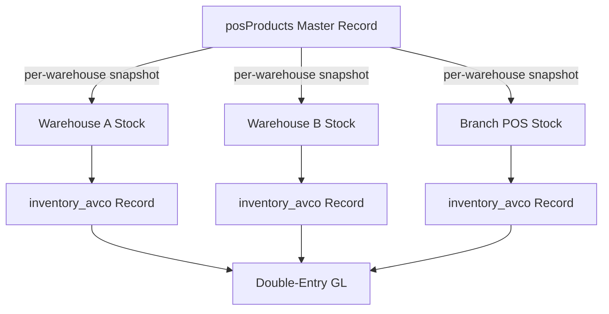
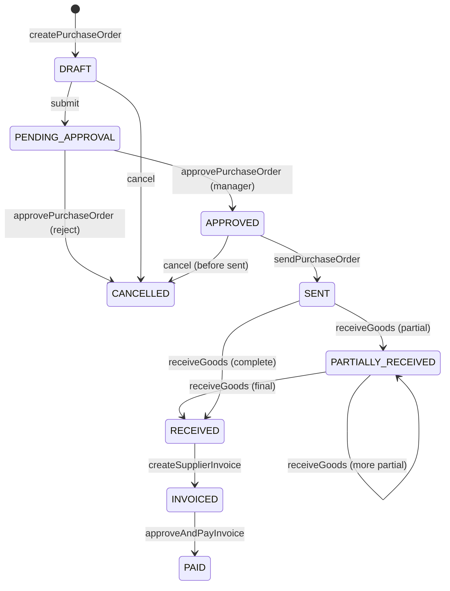
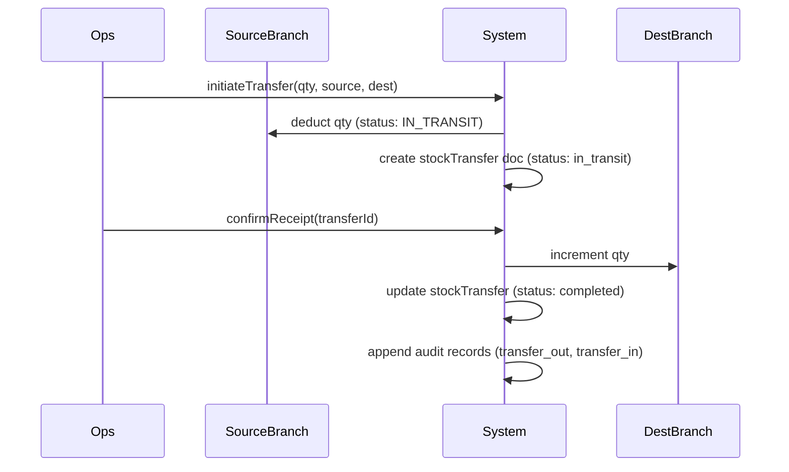
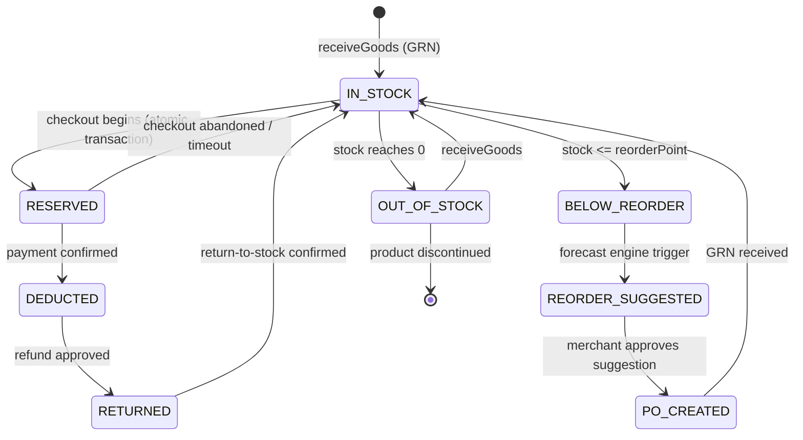

# SOKONI Commerce OS — Volume 6: Inventory & Warehousing

**Suite:** Commerce OS Documentation  
**Volume:** 6 of 12  
**Status:** Production  
**Last Updated:** 2026-06-29  
**Maintainer:** SOKONI Engineering  

---

## Related Volumes

[[vol-05-accounting]] | [[vol-04-payments]] | [[vol-03-pos-enterprise]] | [[vol-07-procurement]] | [[vol-10-artificial-intelligence]]

---

## 1. Executive Summary

SOKONI's Inventory & Warehousing system is the stock-of-record for every physical and digital product on the platform. It enforces **real-time quantity integrity** across all branches, warehouses, and sales channels simultaneously — marketplace orders, SmartPOS terminal sales, click-and-collect pickups, and B2B wholesale shipments all deduct from the same authoritative stock pool.

The system is built on three non-negotiable guarantees:

1. **Never oversell.** Every stock decrement runs inside a Firestore transaction that re-reads current quantity before committing. A flash-sale stock limit atomically flips its status to `ended` at the moment the last unit is reserved.
2. **Full audit trail.** Every quantity movement — whether a sale, a purchase receipt, a write-off, a return, or a manual adjustment — appends an immutable record to `inventory_audit` with a server-side timestamp, actor identity, and computed cost values.
3. **Accurate cost accounting.** Three valuation methods — AVCO (Average Cost), FIFO (lot-based), and FEFO (expiry-date ordered) — are supported per product per warehouse. The costing layer feeds directly into the double-entry general ledger described in [[vol-05-accounting]].

Surrounding these guarantees is an automated procurement cycle: the system monitors reorder points, forecasts demand using 30-day rolling usage windows augmented by Claude Haiku AI recommendations, generates suggested purchase orders, and processes supplier invoices through a five-step approval workflow with a ±5 % tolerance gate before double-entry payment posting.

---

## 2. Inventory Architecture

### 2.1 Data Model Overview

```
tenants/{tenantId}/
├── posProducts/{productId}              ← master product record
├── inventory_variants/{variantId}       ← SKU/attribute variants
├── inventory_batches/{batchId}          ← lot & batch tracking
├── inventory_audit/{auditId}            ← immutable movement log
├── inventory_avco/{productId}_{warehouseId}  ← running AVCO state
│   └── history/{historyId}             ← AVCO change log
├── stockMovements/{movId}              ← cross-system movement log
└── warehouses/{warehouseId}/
    └── locations/{locationId}          ← bin/shelf positions
```

The `posProducts/{productId}` document is the **master record**. It carries the current on-hand quantity (`stock`), reorder thresholds (`reorderPoint`, `reorderForecastQty`), valuation method (`valuationMethod`), and branch/warehouse scope fields. All mutations go through Cloud Functions — no client SDK write is permitted directly against stock fields.

### 2.2 Multi-Location Tracking

Each product record carries `warehouseId` and optional `branchId` scope fields. When a tenant operates multiple locations, stock is tracked per `(productId, warehouseId)` pair. Aggregated platform-wide stock is computed on demand by the `getProcurementForecast` Cloud Function rather than maintained as a denormalised total, which eliminates double-write race conditions.



### 2.3 Audit Trail Architecture

The `inventory_audit` sub-collection is append-only. No Cloud Function ever updates or deletes an audit document. Every record carries:

| Field | Description |
|---|---|
| `type` | Movement class: `sale`, `purchase_receipt`, `adjustment`, `transfer_out`, `transfer_in`, `write_off`, `return` |
| `productId` | Product reference |
| `variantId` | Variant reference (nullable) |
| `batchId` | Batch reference for FEFO/FIFO tracking (nullable) |
| `qtyDelta` | Signed quantity change (negative for deductions) |
| `unitCost` | Cost at time of movement |
| `cogsValue` | Computed COGS for this movement |
| `actorUid` | Firebase Auth UID of the actor |
| `serverTimestamp` | Firestore server-side timestamp |
| `sourceRef` | Order ID, PO ID, GRN ID, or transfer ID that caused the movement |

---

## 3. Valuation Methods

SOKONI supports three industry-standard costing methods. The method is set per product and cannot be changed after the first stock movement without a formal revaluation process that generates a GL adjustment entry.

### 3.1 Average Cost (AVCO)

AVCO is the default method and the most operationally straightforward. The running average unit cost is recalculated on every purchase receipt using the weighted-average formula:

```
newAVCO = (currentQty × currentAVCO + newQty × unitCost) / (currentQty + newQty)
```

The current AVCO state is stored in:

```
tenants/{tenantId}/inventory_avco/{productId}_{warehouseId}
```

This document carries `currentQty`, `currentAVCO`, and `lastUpdated`. Every recalculation also appends a record to its `history` sub-collection, providing a full timeline of cost changes.

When stock is **deducted** (sold, transferred out, or written off), the AVCO value does **not** change — the deduction simply records `cogsValue = qty × currentAVCO`. This ensures cost stability between purchase events.

### 3.2 FIFO (First In, First Out)

FIFO tracks stock by lot. Each purchase receipt creates an `inventory_batches` record with a monotonically increasing `receivedAt` timestamp. On deduction, the system queries:

```javascript
col(tenantId, 'inventory_batches')
  .where('productId', '==', productId)
  .where('warehouseId', '==', warehouseId)
  .where('remainingQty', '>', 0)
  .orderBy('receivedAt', 'asc')
```

Lots are consumed in receipt-date order. Cost of goods is the `unitCost` of the oldest lot being consumed.

### 3.3 FEFO (First Expired, First Out)

FEFO is mandatory for perishable goods — food, pharmaceuticals, cosmetics with shelf lives. It operates identically to FIFO but sorts on `expiryDate` ascending:

```javascript
col(tenantId, 'inventory_batches')
  .where('productId', '==', productId)
  .where('warehouseId', '==', warehouseId)
  .where('remainingQty', '>', 0)
  .orderBy('expiryDate', 'asc')
```

The batch record carries `manufacturingDate`, `expiryDate`, `batchNumber`, and `lotNumber`. Batches with `expiryDate` within the configured alert window (default: 30 days) trigger a notification to the merchant via the [[Enterprise Notification Center]].

---

## 4. AVCO Implementation

### 4.1 inventoryUpdateAVCO (Cloud Function)

Called by `receiveGoods` whenever new stock arrives. The function runs a Firestore transaction to guarantee atomicity:

```
1. Read current AVCO doc at tenants/{t}/inventory_avco/{productId}_{warehouseId}
2. Compute newAVCO = (currentQty × currentAVCO + newQty × unitCost) / (currentQty + newQty)
3. Write updated AVCO doc (currentQty, currentAVCO, lastUpdated)
4. Append history record to AVCO doc's history sub-collection
5. Update posProducts stock via FieldValue.increment(newQty)
```

If the AVCO document does not yet exist (first purchase), `currentQty` and `currentAVCO` both default to zero, and `newAVCO` equals `unitCost` exactly.

### 4.2 inventoryDeductAVCO (Cloud Function)

Called on every sale or outbound transfer. The deduction does not change the AVCO value — it records the COGS impact:

```
1. Read current AVCO (currentAVCO)
2. Compute cogsValue = deductQty × currentAVCO
3. Decrement posProducts.stock via FieldValue.increment(-deductQty)
4. Append inventory_audit record with type='sale', qtyDelta=-deductQty, cogsValue
5. Post GL entry: debit COGS / credit Inventory (via FinOS double-entry API)
```

### 4.3 inventoryGetCOGSReport (Cloud Function)

Aggregates deduction history across a date range. The query filters `inventory_audit` by:

- `type` in `['sale', 'write_off', 'transfer_out']`
- `serverTimestamp` between `periodStart` and `periodEnd`

Results are grouped by `productId` and summed for `cogsValue`. Target performance: under 5 seconds for a 12-month range. For tenants with high transaction volumes, the function can fall back to pre-aggregated monthly snapshots maintained by the nightly scheduler.

---

## 5. Batch, Lot & Serial Tracking

### 5.1 Data Fields

The `inventory_batches` collection schema:

| Field | Type | Description |
|---|---|---|
| `id` | string | Generated: `bat_{timestamp}_{uid6}` |
| `productId` | string | Parent product |
| `variantId` | string \| null | Parent variant (nullable) |
| `batchNumber` | string | Supplier-assigned batch identifier |
| `lotNumber` | string | Defaults to `batchNumber` if not provided |
| `serialNumber` | string \| null | For serialised items (one unit per batch doc) |
| `warehouseId` | string | Receiving warehouse |
| `locationId` | string \| null | Bin/shelf within warehouse |
| `quantity` | number | Original received quantity |
| `remainingQty` | number | Current unconsumed quantity |
| `unitCost` | number | Cost per unit at receipt |
| `manufacturingDate` | string \| null | ISO date |
| `expiryDate` | string \| null | ISO date — drives FEFO ordering |
| `receivedAt` | string | ISO timestamp — drives FIFO ordering |
| `supplierId` | string | Linked supplier |
| `poId` | string | Linked purchase order |
| `grnId` | string | Linked GRN |

### 5.2 Serial Number Uniqueness

For serialised products (electronics, equipment), each batch document represents exactly one unit (`quantity: 1`). The `serialNumber` field is enforced unique per tenant per product via a Firestore transaction that queries for an existing document with the same serial before committing the create. Duplicate serial numbers result in an `HttpsError('already-exists', ...)` — never a silent overwrite.

### 5.3 Expiry Alerting

A scheduled Cloud Function (`scheduledExpiryAlerts`, runs nightly) queries all batches where:

```
expiryDate <= today + alertWindowDays
AND remainingQty > 0
AND alerted == false
```

Matching batches trigger a push notification to the merchant and set `alerted: true` to prevent repeat alerts. Critically-expired batches (past `expiryDate`) are flagged for quarantine review — they are not auto-deducted or auto-written-off; human confirmation is required.

---

## 6. Reorder Management

### 6.1 Reorder Thresholds

Every product master carries two reorder fields:

- `reorderPoint` — the on-hand quantity at which a reorder suggestion is triggered
- `reorderForecastQty` — the suggested order quantity (pre-calculated by the forecast engine)

When `posProducts.stock` drops to or below `reorderPoint`, the product transitions into `BELOW_REORDER` status (see Section 14). The procurement forecast engine generates a suggested PO within the next scheduler cycle.

### 6.2 Demand Forecasting

The `getProcurementForecast` Cloud Function analyses 30 days of `stockMovements` to compute:

```
dailyUsageRate = totalQtySold / FORECAST_DAYS
safetyStock    = dailyUsageRate × SAFETY_BUFFER (× 1.2)
suggestedQty   = (dailyUsageRate × leadTimeDays + safetyStock) - currentStock
```

For high-velocity SKUs or products with seasonal patterns, the function passes the usage history to Claude Haiku via the SOKONI AI layer ([[vol-10-artificial-intelligence]]). The model returns a confidence-adjusted forecast and surfaced rationale (e.g., "upcoming public holiday" or "end-of-month salary cycle spike"). The AI recommendation is stored in `procForecast/{merchantId}_{productId}` and displayed to the merchant in the procurement dashboard — it is advisory, not automatically acted upon.

### 6.3 Supplier Performance Scoring

The nightly `scheduledVendorPerformanceUpdate` function computes a composite performance score for each supplier:

| Metric | Weight |
|---|---|
| On-time delivery rate | 40 % |
| Quality acceptance rate (units accepted / units received) | 35 % |
| Price competitiveness vs. market index | 25 % |

Scores are written to `procVendorPerformance/{supplierId}_{YYYY-MM}`. When a reorder suggestion is generated, the system recommends the top-scoring supplier (`TOP_SUPPLIERS_LIMIT = 5`) from `procSuppliers` filtered by product category.

---

## 7. Purchase Order Lifecycle

### 7.1 State Machine



### 7.2 createPurchaseOrder (Cloud Function)

Key behaviours:

- **Idempotency:** A deterministic `poId` is computed via `sha256(merchantId + supplierId + items_hash + createdAt_day)`. Retried calls with the same logical PO return the existing document rather than creating a duplicate.
- **Server-side VAT:** Line item totals are computed on the server at `VAT_RATE = 0.16` (16 % Kenya standard rate). Client-submitted tax figures are ignored.
- **Item limit:** Maximum `MAX_ITEMS_PER_PO = 200` line items per PO. Larger orders must be split.
- **Input sanitisation:** All string inputs (supplier name, notes) are trimmed and length-capped (`MAX_SUPPLIER_NAME = 200`, `MAX_NOTE_LEN = 1000`) before Firestore writes.

### 7.3 receiveGoods (GRN Processing)

When a delivery arrives, the `receiveGoods` Cloud Function:

1. Validates the PO is in `approved` or `sent` or `partially_received` status.
2. For each line item received, computes quantity variance vs. ordered quantity.
3. Writes a `procGRN` document (see Section 8).
4. Increments `posProducts.stock` via `FieldValue.increment(receivedQty)` — atomic, no read-modify-write.
5. Creates an `inventory_batches` record for FEFO/FIFO tracking.
6. Updates `inventoryUpdateAVCO` to recalculate weighted average cost.
7. Appends to `stockMovements` and `inventory_audit`.
8. Updates PO status to `partially_received` or `received` depending on whether all lines are complete.

---

## 8. Goods Received Notes (GRN)

A GRN is the authoritative document confirming physical receipt of goods. It is created automatically by `receiveGoods` and cannot be manually created or modified.

### 8.1 procGRN Schema

| Field | Description |
|---|---|
| `grnId` | Auto-generated |
| `poId` | Linked purchase order |
| `supplierId` | Supplier reference |
| `merchantId` | Receiving merchant |
| `warehouseId` | Receiving warehouse |
| `receivedAt` | Server timestamp |
| `receivedBy` | Actor UID |
| `lineItems[]` | Array of `{productId, orderedQty, receivedQty, varianceQty, unitCost, batchId}` |
| `totalVarianceQty` | Sum of all variance quantities |
| `qualityNotes` | Free text notes on condition (max 1000 chars) |
| `status` | `pending_invoice` → `invoiced` → `paid` |

### 8.2 Quantity Variance Handling

If `receivedQty < orderedQty` for any line, the variance is recorded but does not automatically close the PO line — the PO moves to `partially_received` allowing subsequent GRNs. If `receivedQty > orderedQty`, the excess is logged and the merchant is prompted to either return the excess or negotiate an amended PO price.

---

## 9. Supplier Management

### 9.1 procSuppliers Schema

| Field | Description |
|---|---|
| `supplierId` | Auto-generated |
| `name` | Supplier display name (max 200 chars) |
| `contactEmail` | Primary contact |
| `contactPhone` | KE format validated |
| `kraPin` | Kenya Revenue Authority PIN |
| `vatRegistered` | Boolean |
| `paymentTermsDays` | Net payment terms (e.g., 30, 60) |
| `defaultLeadTimeDays` | Average delivery lead time |
| `categories[]` | Product categories supplied |
| `performanceScore` | Composite score 0–100 |
| `active` | Soft-delete flag |
| `createdAt` | ISO timestamp |

### 9.2 Supplier Onboarding

New suppliers are registered via `addSupplier`. The function validates KRA PIN format (if provided) and checks for duplicates by `contactEmail` within the tenant before creating the record. Supplier data is tenant-scoped — no cross-tenant supplier visibility.

### 9.3 Performance Dashboard

The `getSupplierPerformance` Cloud Function returns a time-series of monthly performance metrics by reading `procVendorPerformance/{supplierId}_*` documents. The procurement dashboard renders on-time rate trends, quality acceptance charts, and price competitiveness comparisons across the top 5 active suppliers.

---

## 10. Invoice Processing

### 10.1 createSupplierInvoice

After a GRN is created, the supplier submits an invoice. The merchant registers this via `createSupplierInvoice`, which links the invoice to the GRN and PO and sets status to `pending`. The function stores the invoice document in `procSupplierInvoices/{invoiceId}` and queues an email acknowledgement.

### 10.2 approveAndPayInvoice (Cloud Function)

This is the most security-sensitive function in the procurement module. It enforces a **±5 % tolerance gate**:

```
tolerance = poTotal × 0.05
if abs(invoiceTotal - poTotal) > tolerance:
    reject — status → 'disputed', alert merchant
else:
    approve — proceed to payment posting
```

On approval, the function posts a double-entry GL transaction via the FinOS API ([[vol-05-accounting]]):

```
DEBIT:  accounts_payable   (liability reduced)
CREDIT: bank | cash         (asset reduced)
```

An idempotency guard (`paidAt` field) prevents double-payment on retried calls — if `paidAt` is already set, the function returns the existing result without re-posting.

---

## 11. Stock Transfers

Branch-to-branch and warehouse-to-warehouse transfers follow a two-phase commit pattern to prevent quantity loss:



**In-transit state:** Once the source branch is decremented, the stock is neither at the source nor at the destination — it is in transit. Both `inventory_audit` records are linked by the same `sourceRef: transferId`. The AVCO at the destination is updated using the transfer cost, which preserves cost integrity across locations.

---

## 12. Cycle Counts

A cycle count is a scheduled physical stock verification. It does not stop operations — sales continue during counting.

### 12.1 Count Process

1. Merchant schedules a cycle count for a product range or location via the POS dashboard.
2. System generates a count sheet (list of products with expected `posProducts.stock` values hidden from the counter).
3. Counter records physical quantities.
4. System computes variance: `variance = physicalCount - systemQty`.
5. Variances outside configured tolerance (default: ±2 units or ±1 %) are flagged for manager review.
6. Manager approves adjustments, which trigger an `adjustment` entry in `inventory_audit` and a GL post to the inventory shrinkage/surplus account.

All cycle count approvals are logged to `securityAuditLog` with the manager's UID, timestamp, and variance amounts.

---

## 13. Returns to Supplier

When goods must be returned to a supplier (quality rejection, overshipment, damaged delivery):

1. A **reverse GRN** is created, referencing the original GRN.
2. `posProducts.stock` is decremented via `FieldValue.increment(-returnQty)`.
3. An `inventory_audit` record of type `return_to_supplier` is appended.
4. A credit note is issued against the supplier invoice.
5. If the invoice was already paid, a GL reversal entry is posted:

```
DEBIT:  bank | cash           (asset increased — refund expected)
CREDIT: accounts_payable      (liability recreated)
```

The original GRN status is updated to `partially_returned` or `returned`.

---

## 14. Inventory State Machine

### 14.1 Product Stock States



### 14.2 Reservation Mechanics

Reservations are created atomically during checkout initiation. The transaction:

1. Reads current `stock`.
2. Asserts `stock >= requestedQty`.
3. Decrements `stock` and increments `reserved`.
4. Writes a reservation document with a TTL.

If payment is not confirmed within the TTL window (default: 15 minutes), a scheduled function releases the reservation and restores `stock`.

---

## 15. Self-Healing Checks

The `scheduledInventoryHealthCheck` function runs nightly and scans all `posProducts` documents for negative `stock` values. Negative stock indicates a data integrity violation — typically caused by a race condition that bypassed the transaction guard.

When negative stock is detected:

1. An `adminAlert` is created in `securityAuditLog` with severity `critical`.
2. The product is flagged with `negativeStockDetected: true` and `negativeStockAt` timestamp.
3. A notification is sent to the merchant and platform admin.
4. **No automatic correction is applied.** Human review is mandatory before any adjustment.

This conservative approach ensures that the root cause is investigated — a silent auto-fix would mask the underlying bug.

---

## 16. Oversell Prevention

Oversell prevention is enforced at two layers:

### 16.1 Transaction Guard

Every sale decrement runs inside a `db.runTransaction()`. The transaction re-reads the current `stock` value inside the transaction scope, not the value that was read before the transaction began. If `stock < requestedQty` at read time, the transaction aborts with a user-friendly error before any write occurs.

### 16.2 Flash Sale Atomic Flip

For flash sales with a fixed `stockLimit`:

```javascript
// Inside transaction
const current = snap.data().stockLimit;
if (current <= 0) throw new Error('Flash sale ended');
t.update(ref, {
  stockLimit: F.increment(-qty),
  status: current - qty <= 0 ? 'ended' : 'active',
});
```

The `status` field is set to `'ended'` atomically in the same write that consumes the last unit. No subsequent transaction can succeed because `stockLimit <= 0` is detected at the start.

---

## 17. Demand Forecasting

### 17.1 Statistical Baseline

The `getProcurementForecast` function computes a 30-day rolling baseline:

```
dailyUsageRate  = SUM(qtyDelta for sales in last 30 days) / 30
safetyStock     = dailyUsageRate × 1.2 (SAFETY_BUFFER)
reorderQty      = (dailyUsageRate × leadTimeDays + safetyStock) - currentStock
```

Results for up to `REORDER_ALERTS_LIMIT = 10` products are returned per call, prioritised by urgency (days-until-stockout ascending).

### 17.2 AI-Assisted Forecasting

For tenants on AI-enabled subscription plans, the forecast engine passes usage history to Claude Haiku. The prompt includes:

- 90-day daily sales series
- Upcoming Kenyan public holidays within the lead time window
- Historical seasonal patterns for the product category
- Any merchant-flagged upcoming promotions

Claude Haiku returns an adjusted forecast quantity and a plain-language explanation. The AI result is stored in `procForecast/{merchantId}_{productId}.aiRecommendation` alongside the statistical baseline. Merchants can choose to accept, modify, or ignore the AI recommendation — it never triggers automatic PO creation.

### 17.3 Safety Stock Philosophy

The 20 % safety buffer (`SAFETY_BUFFER = 1.2`) is conservative by design. For perishable goods with short shelf lives, merchants can reduce this to 1.05 via the `safetyBufferOverride` product field — but this reduction is logged to `inventory_audit` and requires manager confirmation.

---

## 18. Security

### 18.1 Write Restrictions

Direct Firestore writes to stock-relevant fields (`stock`, `reserved`, `remainingQty`, `currentAVCO`) are blocked by Firestore Security Rules. All mutations must flow through authenticated Cloud Functions. This eliminates client-side inventory manipulation entirely.

```
// Firestore Rules excerpt
match /tenants/{tenantId}/posProducts/{productId} {
  allow read: if isAuthenticated() && belongsToTenant(tenantId);
  allow write: if false; // CF-only
}
```

### 18.2 Role-Based Access

| Operation | Minimum Role |
|---|---|
| View stock levels | Staff |
| Create/edit products | Manager |
| Approve purchase orders | Manager |
| Approve invoice payment | Admin |
| Approve stock adjustments | Manager |
| Override safety buffer | Manager (logged) |
| View AVCO history | Manager |
| Delete batch records | Admin (soft-delete only) |

### 18.3 Audit Immutability

`inventory_audit` documents are protected by Firestore rules that allow create but deny update and delete. The only way to correct an erroneous audit record is to create a compensating entry — the error record remains permanently visible in the audit trail.

### 18.4 Manager Authorization Integration

Sensitive operations (stock adjustments, cycle count approvals, safety buffer overrides) integrate with the Manager Authorization Engine ([[vol-03-pos-enterprise]]) for PIN/QR/NFC challenge. The challenge result is verified server-side by the Cloud Function before the mutation proceeds.

---

## 19. Performance Targets

| Operation | Target | Method |
|---|---|---|
| Stock availability check | < 100 ms | Cached in `posProducts` master; single document read |
| Add to cart reservation | < 300 ms | Single Firestore transaction |
| GRN processing (full) | < 1 s | Parallel batch + AVCO + stock increment |
| AVCO recalculation | < 200 ms | Single transaction on pre-existing doc |
| COGS report (12 months) | < 5 s | Indexed `inventory_audit` query + monthly snapshot fallback |
| Reorder forecast (10 products) | < 2 s | Indexed `stockMovements` aggregation |
| AI forecast enhancement | < 8 s | Claude Haiku via ANTHROPIC_API_KEY |
| Nightly health check | < 5 min | Paginated scan, 500 docs/page |

### 19.1 Caching Strategy

`posProducts.stock` is the live quantity. It is a single Firestore document field — reads cost one document read. Firestore's local cache means most stock checks in SmartPOS (which maintains an active listener) resolve from cache with zero network latency after the first read, achieving sub-10 ms stock checks in typical POS scenarios.

### 19.2 Index Strategy

Critical Firestore composite indexes required:

```
inventory_batches: productId ASC, warehouseId ASC, remainingQty ASC, expiryDate ASC  (FEFO)
inventory_batches: productId ASC, warehouseId ASC, remainingQty ASC, receivedAt ASC  (FIFO)
inventory_audit:   productId ASC, type ASC, serverTimestamp ASC                       (COGS query)
stockMovements:    merchantId ASC, productId ASC, createdAt ASC                       (forecast)
procPurchaseOrders: merchantId ASC, status ASC, createdAt DESC                        (dashboard)
```

---

## 20. Cloud Functions Reference

| Function | Trigger | Description |
|---|---|---|
| `inventorySaveVariant` | onCall | Create or update a product variant |
| `inventoryGetVariants` | onCall | List active variants for a product |
| `inventoryDeleteVariant` | onCall | Soft-delete a variant |
| `inventoryCreateBatch` | onCall | Receive a new batch/lot |
| `inventoryUpdateAVCO` | Internal | Recalculate AVCO on receipt |
| `inventoryDeductAVCO` | Internal | Record COGS deduction |
| `inventoryGetCOGSReport` | onCall | Aggregate COGS by period |
| `addSupplier` | onCall | Register a new supplier |
| `createPurchaseOrder` | onCall | Draft a new PO |
| `approvePurchaseOrder` | onCall | Manager approve/reject PO |
| `sendPurchaseOrder` | onCall | Mark PO sent to supplier |
| `receiveGoods` | onCall | GRN: receive delivery |
| `createSupplierInvoice` | onCall | Attach supplier invoice to GRN |
| `approveAndPayInvoice` | onCall | Admin: approve + GL payment post |
| `getSupplierPerformance` | onCall | Supplier trend analytics |
| `getProcurementForecast` | onCall | Reorder suggestions |
| `getProcurementDashboard` | onCall | KPI summary |
| `scheduledVendorPerformanceUpdate` | Scheduled (nightly) | Compute supplier scores |
| `scheduledExpiryAlerts` | Scheduled (nightly) | Near-expiry batch notifications |
| `scheduledInventoryHealthCheck` | Scheduled (nightly) | Negative stock detection |

---

## 21. Cross-References

| Volume | Relevance |
|---|---|
| [[vol-03-pos-enterprise]] | SmartPOS terminal integration; manager auth for adjustments |
| [[vol-04-payments]] | Payment confirmation triggers AVCO deduction |
| [[vol-05-accounting]] | Double-entry GL posts on every receipt and payment |
| [[vol-07-procurement]] | Extended procurement workflows and supplier portal |
| [[vol-10-artificial-intelligence]] | Claude Haiku demand forecasting integration |

---

## 22. Changelog

| Date | Change | Author |
|---|---|---|
| 2026-06-29 | Volume 6 initial release — full inventory, AVCO, FEFO, procurement lifecycle | SOKONI Engineering |

---

*Part of the SOKONI Commerce OS Documentation Suite. For platform architecture overview see [[README]] and [[Architecture]].*
