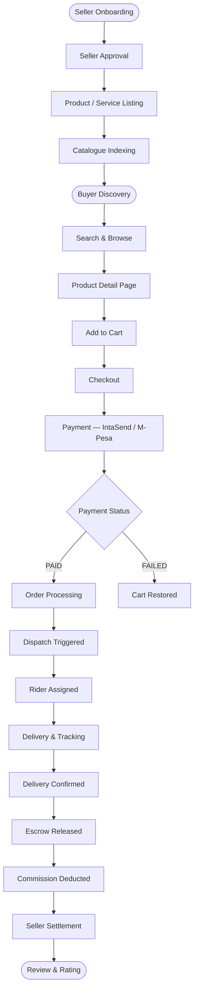
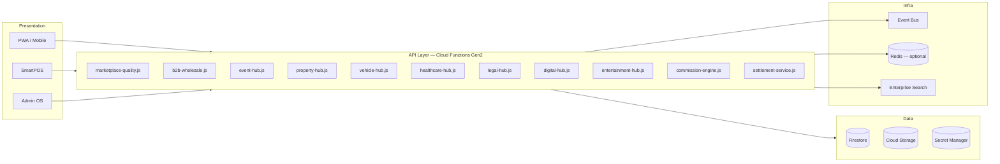
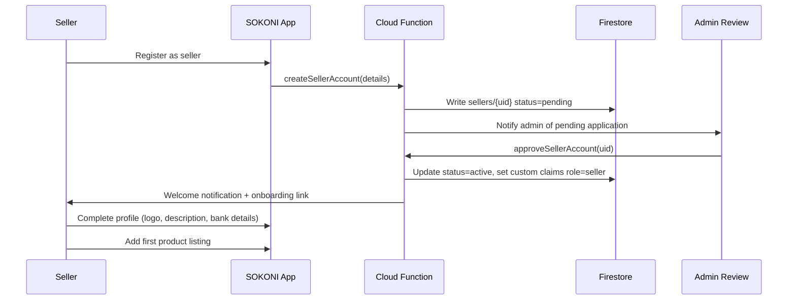
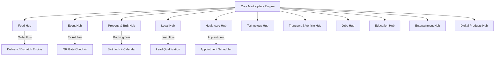
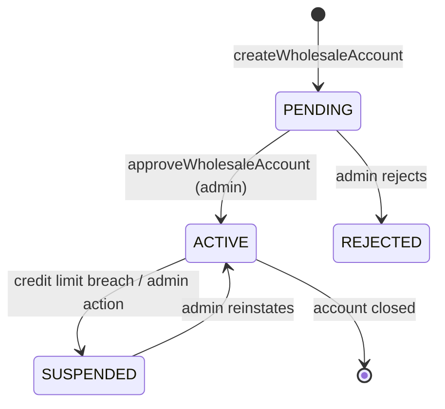
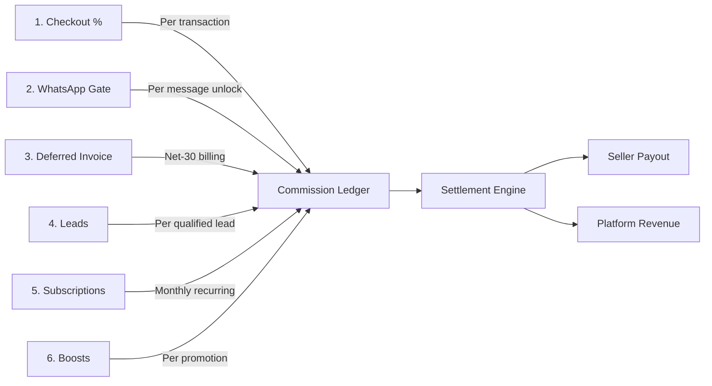
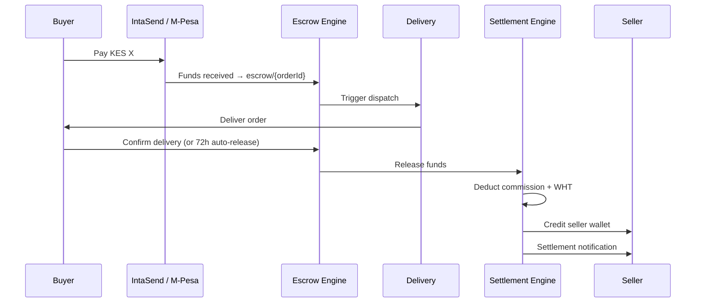
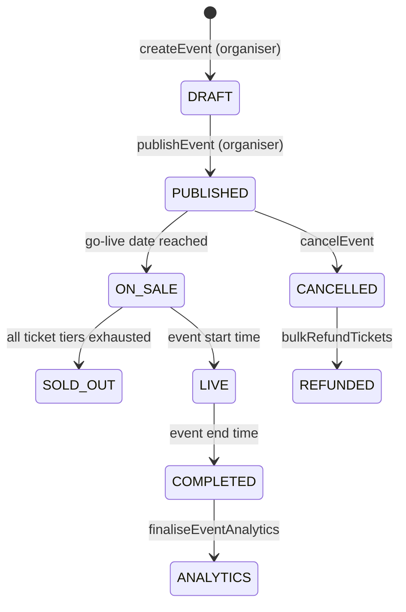
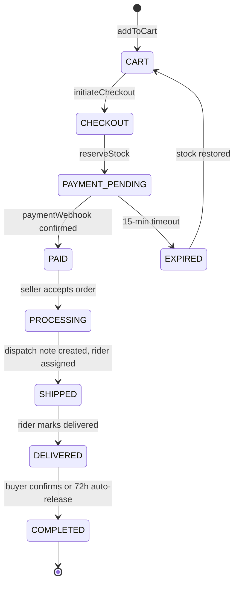
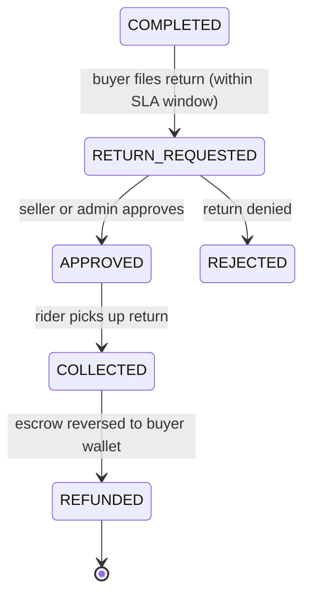

# SOKONI Commerce OS — Volume 7: Marketplace & Commerce

**Version:** 1.0
**Date:** 2026-06-29
**Status:** Production
**Author:** SOKONI Engineering

---

## Related Volumes

- [[vol-04-payments]] — Payment orchestration, escrow, IntaSend / M-Pesa
- [[vol-08-loyalty-platform]] — Loyalty tiers, points, rewards, cashback
- [[vol-09-delivery-logistics]] — Dispatch, rider assignment, live tracking
- [[vol-11-crm-marketing]] — Campaign engine, referrals, push promotions

---

## 1. Executive Summary

SOKONI is a multi-vertical, multi-vendor digital marketplace connecting buyers, sellers, service providers, and communities across Kenya. The commerce layer is the commercial backbone of the platform, handling everything from product discovery through to settlement and post-sale reviews.

The marketplace operates across eleven vertical hubs — Food, Events, Property & BnB, Legal, Healthcare, Technology, Transport, Jobs, Education, Entertainment, and Digital Products — each with its own category taxonomy, booking or order flow, and commission structure, yet all sharing a unified checkout, payment, delivery, and settlement pipeline.

**Core ecosystem participants:**

| Role | Responsibilities |
|---|---|
| Buyer | Browse, search, add to cart, pay, track, review |
| Seller / Vendor | List products, manage orders, receive settlement |
| B2B Wholesaler | Place bulk orders with credit terms and tiered pricing |
| Service Provider | Offer bookings via hub-specific flows |
| Platform (SOKONI) | Operate escrow, collect commission, enforce quality |
| Admin | Moderate listings, manage disputes, configure rules |

**Six monetization rails** underpin the commerce model:

1. Checkout commission — percentage deducted per transaction before settlement
2. WhatsApp gate — per-message fee for seller-buyer WhatsApp unlock
3. Deferred invoice — net-30 B2B billing against approved credit accounts
4. Leads — per-qualified-lead fee for service verticals (Legal, Healthcare, Property)
5. Subscriptions — monthly seller plans (Starter, Growth, Pro, Enterprise)
6. Boosts — promoted listing fees for improved discovery placement

All commission calculations occur server-side; no client-supplied amounts are trusted.

---

## 2. Marketplace Architecture

### 2.1 High-Level Flow



### 2.2 System Architecture



### 2.3 Core Collections

| Collection | Purpose |
|---|---|
| `products/{productId}` | Canonical product catalogue |
| `productStats/{productId}` | View counts, order counts, quality signals |
| `categories/{categoryId}` | 103-category taxonomy |
| `orders/{orderId}` | Order records, state machine |
| `carts/{uid}` | Active buyer carts |
| `escrow/{orderId}` | Funds held pending delivery |
| `commissions/{commissionId}` | Commission ledger |
| `settlements/{settlementId}` | Seller payout records |
| `reviews/{reviewId}` | Buyer ratings and text reviews |
| `wholesaleAccounts/{uid}` | B2B buyer accounts |
| `wholesaleOrders/{orderId}` | Bulk purchase orders |
| `wholesaleLedger/{ledgerId}` | Credit / debit ledger per B2B account |
| `promotions/{promoId}` | Flash sales, coupons, bundle deals |

---

## 3. Product Catalogue

### 3.1 Product Document Schema

```
products/{productId}
├── name            String    — display title (max 150 chars)
├── sku             String    — seller-assigned stock-keeping unit
├── barcode         String    — EAN-13 / QR-linked barcode
├── price           Number    — selling price in KES (set server-side)
├── cost            Number    — cost price (seller-only visibility)
├── compareAtPrice  Number    — original price for sale display
├── categoryId      String    — ref → categories/{categoryId}
├── sellerId        String    — ref → users/{uid} (role=seller)
├── merchantId      String    — ref → merchants/{merchantId}
├── vatRate         Number    — VAT percentage (e.g. 16 for Kenya std)
├── images          Array     — up to 10 CDN URLs
├── status          String    — draft | active | paused | archived
├── variants        Array     — [{sku, size, colour, price, stock}]
├── stock           Number    — current inventory count
├── minOrderQty     Number    — minimum quantity per order
├── weight          Number    — grams (delivery pricing)
├── dimensions      Map       — {l, w, h} cm
├── tags            Array     — search tags
├── isWholesale     Boolean   — visible in wholesale catalogue
├── wholesalePrice  Number    — price for approved B2B buyers
├── createdAt       Timestamp
├── updatedAt       Timestamp
└── active          Boolean
```

### 3.2 Category Taxonomy

The platform operates 103 product/service categories organised in a two-level tree (parent → child). Each category document holds:

```
categories/{categoryId}
├── name          String
├── parentId      String | null
├── iconUrl       String
├── commissionPct Number   — default commission for this category
├── hubId         String   — which vertical hub owns this category
├── sortOrder     Number
└── active        Boolean
```

### 3.3 Quality Engine

`functions/marketplace-quality.js` runs catalogue health checks against up to 2,000 active products and surfaces:

- Missing images — no CDN URLs attached
- Missing descriptions — empty or null description field
- Missing titles — unnamed products
- Potential duplicates — same seller, same normalised title (first 60 chars)
- Outdated listings — listed more than 30 days ago with fewer than 5 views and no view activity in 60 days
- Category outliers — price significantly outside category median
- Abandoned listings — active products with zero orders in 90 days

Admins access the quality report via `getMarketplaceQualityReport` (admin-only callable CF) and can flag individual listings via `flagLowQualityListing`.

---

## 4. Seller Portal

### 4.1 Seller Registration Flow



### 4.2 Seller Dashboard Capabilities

| Module | Features |
|---|---|
| Product Management | Add, edit, pause, archive products; bulk CSV import; image upload |
| Order Management | View incoming orders; accept/reject; print dispatch notes |
| Inventory | Live stock levels; low-stock alerts; FEFO for perishables |
| Analytics | GMV, order count, conversion, top products, return rate |
| Settlement Reports | Daily/weekly/monthly payout schedules; commission statements |
| Subscriptions | View active plan; upgrade/downgrade; billing history |
| Quality Score | Listing completeness score; buyer rating aggregate |
| eTIMS | KRA tax compliance; invoice generation; e-receipt submission |

### 4.3 Seller Subscription Plans

Subscription plans gate feature access and affect commission rates:

| Plan | Monthly Fee | Commission Rate | Product Limit | Analytics Depth |
|---|---|---|---|---|
| Starter | Free | 10% | 50 | 7-day |
| Growth | KES 999 | 8% | 500 | 30-day |
| Pro | KES 2,999 | 6% | Unlimited | 90-day |
| Enterprise | KES 9,999 | 4% | Unlimited | 365-day + AI |

---

## 5. Buyer Portal

### 5.1 Discovery Journey

Buyers arrive via organic search, social share links (including WhatsApp Status from MiniShop), QR codes (physical offline), or direct URL navigation. The discovery path:

1. **Homepage** — featured categories, trending products, personalised recommendations (AI via Claude Haiku)
2. **Category Browse** — hierarchical 103-category tree with product counts
3. **Search** — full-text, Swahili NLP, filters, price range, location radius
4. **Product Detail Page** — gallery, description, variants, seller rating, delivery estimate, reviews
5. **Cart** — persistent across sessions, stock validation on add
6. **Checkout** — address, delivery option, payment method, coupon code, loyalty points redemption
7. **Order Tracking** — real-time rider GPS, 9-stage delivery timeline
8. **Returns** — self-service return request within eligible window
9. **Reviews** — verified purchase gate; 1–5 star rating + text; photo upload

### 5.2 Cart Architecture

Carts are stored in Firestore at `carts/{uid}` with a `lineItems[]` sub-array. Stock reservation occurs at checkout initiation via a Firestore `runTransaction` that atomically:

1. Reads current stock for each line item
2. Validates requested quantity does not exceed available stock
3. Decrements reserved stock
4. Creates the order document in `PAYMENT_PENDING` state

If payment is not completed within 15 minutes, a scheduled function restores reserved stock and marks the order `EXPIRED`.

---

## 6. Hub Architecture

Each vertical hub extends the core marketplace with domain-specific logic, category trees, and booking or order flows. All hubs share the unified checkout, payment, and notification pipeline.



### Hub Summary

| Hub | Cloud Functions File | Key Flow | Commission |
|---|---|---|---|
| Food | food-hub.js | Order → Kitchen → Rider → Delivery | 8–12% |
| Events | event-hub.js | Ticket sale → QR → Gate check-in | 3% |
| Property & BnB | property-hub.js | Enquiry / booking → Host payout | 5% |
| Healthcare | healthcare-hub.js | Appointment → Consult → Record | 10% |
| Legal | legal-hub.js | Lead qualification → Retainer | Per-lead |
| Vehicle | vehicle-hub.js | Listing → Test drive request → Sale | 2% |
| Digital | digital-hub.js | Purchase → Secure download link | 15% |
| Entertainment | entertainment-hub.js | Booking → Access code | 8% |

---

## 7. B2B Wholesale

### 7.1 Module Overview

`functions/b2b-wholesale.js` provides 12 Cloud Functions that power a full wholesale commerce sub-system layered on top of the retail catalogue.

**Key constants:**

| Parameter | Value |
|---|---|
| Default wholesale discount | 10% off retail price |
| High-credit buyer discount | 25% (credit limit > KES 500,000) |
| Minimum item quantity per line | 10 units |
| Maximum credit limit | KES 10,000,000 |
| Maximum credit note | KES 500,000 |
| Credit note validity | 90 days |
| Payment terms | net7, net14, net30 |
| Valid business types | distributor, retailer, manufacturer |

### 7.2 Wholesale Account Lifecycle



### 7.3 Wholesale Order Flow

1. Approved buyer browses `getWholesaleCatalog` — only products with `isWholesale: true` are visible
2. Buyer calls `createWholesaleOrder` with line items (minimum 10 units per line)
3. Server reads prices from Firestore — no client-supplied prices are accepted
4. Discount tier applied server-side based on buyer's `creditLimit`
5. Seller or admin calls `approveWholesaleOrder` — stock atomically deducted
6. Payment via `processWholesalePayment` using wallet balance or credit note; idempotency guard via `paidAt` field prevents double-payment
7. Admin can issue credit notes via `issueWholesaleCreditNote` (KRA PIN validated server-side via regex `^[A-Z]\d{9}[A-Z]$`)

### 7.4 Wholesale Collections

```
wholesaleAccounts/{uid}
wholesaleOrders/{orderId}
wholesaleLedger/{ledgerId}
wholesaleCreditNotes/{noteId}
securityAuditLog/{logId}    — all sensitive actions written here
```

### 7.5 Security Posture

- All prices read from Firestore — never from request payload
- KRA PIN validated with regex before any registration completes
- Role assertions at the top of every Cloud Function
- Idempotency field (`paidAt`) on payment prevents replay attacks
- No internal stack traces exposed to callers — `_err()` helper wraps `HttpsError` with clean messages
- Every sensitive action appended to `securityAuditLog`

---

## 8. Commission Engine

### 8.1 Six Monetization Rails



### 8.2 Checkout Commission

On every completed transaction:

```
grossAmount = sum(lineItem.price × lineItem.qty)
commissionPct = category.commissionPct × sellerPlanMultiplier
commissionAmount = grossAmount × commissionPct / 100
VATOnCommission = commissionAmount × 0.16   // Kenya VAT
WHTAmount = commissionAmount × 0.05         // Withholding Tax if applicable
sellerPayout = grossAmount - commissionAmount - WHTAmount
```

All arithmetic executes in Cloud Functions using integer KES cents (`amountCents`) to avoid floating-point rounding errors.

### 8.3 Boost Pricing

Promoted listings pay a daily flat fee based on category competitiveness:

| Category Tier | Daily Boost Fee |
|---|---|
| Standard | KES 50 |
| High-competition | KES 150 |
| Premium (e.g. Property, Vehicles) | KES 500 |

Boosts are pre-paid and auto-expire. The search ranking engine prioritises active boosts within relevance bands — boosts cannot displace organically dominant results to prevent degrading search quality.

---

## 9. Storefronts — MiniShop

### 9.1 Overview

MiniShop gives every seller a branded micro-storefront accessible via two vanity URL patterns:

- `/shop/{handle}` — standard storefront path
- `/@{handle}` — social-style handle (Instagram/Twitter parity)

The system is implemented across 14 Cloud Functions and supports sellers who operate primarily through social channels rather than direct marketplace discovery.

### 9.2 Key Capabilities

| Feature | Description |
|---|---|
| Digital Business Card | QR code linking to storefront; printable A6 card template |
| WhatsApp Status Share | One-tap share of featured product to WhatsApp Status |
| Campaign Engine | Time-limited promotions pushed to followers |
| Offline QR Discovery | Physical QR on packaging / shelf label links to storefront |
| Custom Banner | Seller uploads brand hero image |
| Featured Products | Seller pins up to 6 products to storefront hero |
| Follow / Unfollow | Buyers follow sellers for personalised feed updates |

### 9.3 Handle Resolution

Handle uniqueness is enforced at registration with a Firestore transaction on `handles/{handle}`. Lowercase, alphanumeric, hyphen-only handles (3–30 chars) are accepted. Once claimed, handles are permanently reserved to prevent brand impersonation.

---

## 10. Reviews & Ratings

### 10.1 Data Model

```
reviews/{reviewId}
├── orderId       String    — must reference a COMPLETED order
├── productId     String
├── sellerId      String
├── buyerUid      String
├── rating        Number    — 1 to 5 (integer)
├── title         String    — max 80 chars
├── body          String    — max 2,000 chars
├── images        Array     — up to 4 photo URLs
├── sellerReply   String    — seller response text
├── sellerRepliedAt Timestamp
├── status        String    — pending | approved | rejected | hidden
├── verified      Boolean   — true only if orderId resolves to buyer
├── helpfulCount  Number    — thumbs-up count from other buyers
├── createdAt     Timestamp
└── updatedAt     Timestamp
```

### 10.2 Verified Purchase Gate

A review can only be submitted if `orderId` references an order with:
- `buyerUid === request.auth.uid`
- `status === COMPLETED`
- `createdAt` within the last 90 days

This prevents review manipulation by sellers or competing parties.

### 10.3 Rating Aggregation

Seller aggregate rating (`sellers/{uid}.ratingAvg`, `ratingCount`) is updated by a Firestore trigger on `reviews` writes using `FieldValue.increment` — no full recalculation needed. Product-level rating (`products/{productId}.ratingAvg`) follows the same pattern.

### 10.4 Moderation Queue

All reviews enter `status: pending`. An automated classifier (Cloud Function + basic keyword scan) promotes benign reviews to `approved` within seconds. Flagged reviews route to admin moderation queue in Admin OS. Sellers can submit a dispute within 14 days; admins have final say.

---

## 11. Promotions & Bundles

### 11.1 Flash Sales

Flash sales apply a percentage or fixed discount to one or more products for a defined window. Stock integrity is protected by `runTransaction` at checkout — the oversell guard reads current stock and applies the discount atomically:

```javascript
// Oversell guard inside runTransaction
const stock = productDoc.data().stock;
if (stock < requestedQty) throw new Error('OUT_OF_STOCK');
transaction.update(productRef, { stock: FieldValue.increment(-requestedQty) });
```

Sellers cannot launch a flash sale if current stock is below the minimum quantity threshold.

### 11.2 Coupon Codes

Coupon validation is decoupled from coupon increment to prevent race conditions:

1. `validateCoupon(code, cartTotal)` — read-only; returns discount amount or error
2. `redeemCoupon(code, orderId)` — atomic increment of `usageCount`; fails if `usageCount >= maxUsage`

A coupon that has been validated but not yet redeemed will not be double-counted because redemption checks `usageCount` inside a transaction.

### 11.3 A/B Testing

The promotion engine supports A/B experiments on pricing, imagery, and copy. Tests auto-conclude when:
- Impression threshold reached (default: 100 impressions per variant), **and**
- One variant shows at least 20% conversion lift over the control

The winning variant is automatically promoted and the experiment is marked `concluded` in Firestore.

### 11.4 Bundle Deals

Bundles group two or more products at a combined discount. Bundle stock is tracked independently — the bundle is unavailable if any constituent product is out of stock. Bundle purchases create a single order line with child references to constituent products, preserving per-product commission accounting.

---

## 12. Escrow & Settlement

### 12.1 Escrow Lifecycle



### 12.2 Settlement Schedules

Sellers choose their payout cadence on account setup:

| Schedule | Payout Day | Minimum Balance |
|---|---|---|
| Daily | Every day 18:00 EAT | KES 500 |
| Weekly | Every Monday 09:00 EAT | KES 1,000 |
| Monthly | 1st of month 09:00 EAT | KES 0 |

Payouts are dispatched to the seller's registered M-Pesa number or bank account via IntaSend. WHT (5%) is deducted and reported to KRA.

### 12.3 Auto-Release Policy

If a buyer neither confirms nor disputes delivery within 72 hours of the carrier marking the order `DELIVERED`, the escrow auto-releases and settlement proceeds. This prevents sellers from being held indefinitely on genuine deliveries.

---

## 13. Event Hub

### 13.1 Event Lifecycle



### 13.2 Cloud Functions (19 total — event-hub.js)

Key functions include:

| Function | Actor | Description |
|---|---|---|
| `createEvent` | Organiser | Create event in DRAFT with category, venue, capacity |
| `publishEvent` | Organiser | Move to PUBLISHED; validate ticket tiers |
| `purchaseTickets` | Buyer | Atomic seat reservation + payment initiation |
| `validateTicketQR` | Gate Staff | Scan QR token; mark ticket as CHECKED_IN |
| `getEventAnalytics` | Organiser | Revenue, attendance rate, scan speed |
| `cancelEvent` | Organiser / Admin | Mark CANCELLED; trigger refund batch |
| `processEventRefund` | System | Return funds to buyer wallet or card |

**Valid event categories:** concerts, conferences, weddings, sports, comedy, food & drink, arts, education, networking, festivals, fashion, fitness, corporate, charity, kids, religious, other.

### 13.3 Ticketing

Ticket types support: General Admission, VIP, Early Bird, Group (minimum quantity), Table (for gala events). Each ticket generates a unique HMAC-protected QR token (`crypto.randomBytes(16).toString('hex')`). Gate staff scan tokens via the SOKONI Gate app; tokens can only be checked in once (Firestore write guard).

Commission: **3% of gross ticket revenue**, collected at purchase.

---

## 14. Property & BnB Hub

### 14.1 Listing Types

`functions/property-hub.js` supports three listing modes:

| Type | Description | Payout Trigger |
|---|---|---|
| `for_sale` | Outright purchase; buyer enquiry → agent contact | On completion of sale |
| `for_rent` | Monthly/annual tenancy | On tenancy agreement signing |
| `short_let` | BnB / serviced apartment; nightly rate | On guest check-out |

### 14.2 Property Types

apartment, house, townhouse, villa, land, commercial, office, warehouse, bedsitter, studio, other.

### 14.3 Slot Locking (Short Lets)

BnB bookings use a 2-minute optimistic slot lock:

1. Buyer requests dates → `lockDates(propertyId, checkIn, checkOut)` — writes lock doc with TTL 2 minutes
2. Buyer completes payment within 2 minutes → lock converted to confirmed booking
3. Lock expired → dates released back to calendar
4. Availability calendar reads confirmed bookings + active locks to prevent double-booking

### 14.4 Pricing Modifiers (8 active)

| Modifier | Effect |
|---|---|
| Base nightly rate | Flat rate per night |
| Weekend premium | +20–40% Friday/Saturday |
| Seasonal rate | Holiday / peak season override |
| Long-stay discount | >7 nights: −10%; >28 nights: −20% |
| Last-minute discount | <48h to check-in: configurable % off |
| Early-bird discount | >60d advance booking: configurable % off |
| Cleaning fee | Fixed one-time fee |
| Security deposit | Held in escrow; returned on check-out |

### 14.5 Host Payout

Host payout (property commission: 5%) is triggered 24 hours after guest check-in confirmation. The security deposit is released (minus any deductions agreed by both parties) within 48 hours of check-out.

---

## 15. Order State Machine

### 15.1 Forward Path



### 15.2 Return Path



### 15.3 State Transition Rules

- Only the platform (Cloud Functions) may advance order state — never client-side writes
- Each state transition appends an event to `orders/{orderId}/timeline` subcollection
- Payment state and order state are separate; payment failure does not corrupt an existing order record — a new payment attempt creates a new payment intent linked to the same order
- Refunds always go through the escrow engine, never direct wallet manipulation

---

## 16. Delivery Integration

When an order reaches `PAID` state, the delivery engine is triggered automatically via the Platform Event Bus:

```
Event: order.paid
→ Subscriber: delivery-dispatch.js
→ Action: createDispatchJob(orderId, sellerId, deliveryAddress)
→ Algorithm: 8-factor rider matching (proximity, rating, load, vehicle type, zone, online status, acceptance rate, cancellation rate)
→ Rider notified within 90 seconds
→ Buyer receives ETA push notification
```

**Live tracking:** GPS coordinates pushed from rider app every 10 seconds. Buyer PWA subscribes to Firestore `dispatchJobs/{jobId}` real-time listener. Spoofing guard rejects coordinates that imply movement faster than 120 km/h.

**Proof of delivery:** Rider captures photo + optional buyer signature. Both stored in Cloud Storage; reference written to order document.

**Post-delivery:** CSAT survey sent to buyer 30 minutes after `DELIVERED` state. If rider accumulates 10 or more cancellations within a rolling 30-day window, account is auto-suspended pending review.

See [[vol-09-delivery-logistics]] for full dispatch system documentation.

---

## 17. Search & Discovery

### 17.1 Enterprise Search Platform

The Search Platform (25 Cloud Functions) provides the discovery backbone:

| Feature | Implementation |
|---|---|
| Full-text search | Firestore composite indexes + Algolia sync queue |
| Swahili NLP | Tokeniser with Swahili stop-words and stemming |
| Typo tolerance | Edit-distance 1–2 on query tokens |
| Category facets | Pre-aggregated facet counts per category |
| Price range filter | Firestore range query on indexed `price` field |
| Location radius | Geohash proximity filter |
| Sort options | Relevance, price asc/desc, newest, rating, distance |
| Personalisation | Claude Haiku re-ranking based on buyer history |
| Circuit breaker | Falls back to basic Firestore query if Algolia unavailable |

### 17.2 Search Result Ranking Signals

```
score = (relevance × 0.40)
      + (boostActive × 0.20)
      + (ratingScore × 0.20)
      + (recency × 0.10)
      + (conversionRate × 0.10)
```

Boosted listings receive the boost weight only within their relevance band — a low-relevance boosted listing will not outrank a high-relevance organic result.

### 17.3 Algolia Sync

Products are synced to Algolia via a Firestore `onWrite` trigger on `products/{productId}`. Failed syncs are queued in `algoliaQueue/{docId}` and retried by a scheduled function every 5 minutes. This prevents search index drift during Algolia outages.

---

## 18. Security

### 18.1 IDOR Protection

Seller data is strictly partitioned. All Cloud Functions that return seller-scoped data include:

```javascript
if (order.sellerId !== request.auth.uid && !isAdmin(request.auth)) {
  throw new HttpsError('permission-denied', 'Access denied');
}
```

Buyers can see their own orders only. Admins can see all orders. Sellers can see orders assigned to them only.

### 18.2 Server-Side Price Enforcement

No client-supplied price is trusted at checkout. The checkout Cloud Function re-reads every `products/{productId}.price` from Firestore and recomputes the total:

```javascript
const productDoc = await db.collection('products').doc(item.productId).get();
const serverPrice = productDoc.data().price; // never use item.price from client
const lineTotal = serverPrice * item.qty;
```

### 18.3 Commission Server-Side Calculation

Commission rates are read from `categories/{categoryId}.commissionPct` and the seller's active subscription plan — never from client payloads. This prevents sellers from manipulating their own commission rate.

### 18.4 Escrow Anti-Circumvention

Sellers cannot initiate their own settlement. Only the settlement Cloud Function (invoked by the escrow engine after delivery confirmation) can credit seller wallets. Firestore security rules deny any direct write to `settlements/` from client SDKs.

### 18.5 Review Integrity

The verified purchase gate ensures only genuine buyers can leave product reviews. The gate checks `orderId` server-side — a buyer who knows a product ID but has not purchased it cannot post a review.

### 18.6 Input Validation & Sanitisation

All string fields from external callers pass through a `san(s, maxLength)` sanitiser before Firestore writes. Numeric fields are explicitly cast (`parseFloat`, `parseInt`) and bounds-checked. Array fields are sliced to maximum allowed length.

### 18.7 App Check Enforcement

All marketplace Cloud Functions set `enforceAppCheck: true` in their runtime configuration. Unattempted requests without a valid App Check token are rejected before any business logic executes.

---

## 19. Performance Targets

| Operation | Target | Strategy |
|---|---|---|
| Product listing page load | < 1.5 seconds | CDN-cached images; Firestore projection queries (select only displayed fields) |
| Search results return | < 800 ms | Algolia pre-indexed; fallback Firestore composite index |
| Checkout Cloud Function | < 3 seconds end-to-end | Parallel Firestore reads; Redis cart cache |
| Settlement batch | < 60 seconds per 1,000 orders | Batched Firestore writes (500 per batch); parallel seller wallet credits |
| QR gate check-in | < 500 ms | Firestore indexed on `ticketToken`; no heavy joins |
| Category page | < 1 second | Pagination (20 items); cursor-based; no offset scans |
| Flash sale launch | < 200 ms response | Pre-warmed Cloud Function instance (`minInstances: 1`) |
| Wholesale catalogue | < 1 second | `isWholesale: true` index; `CATALOG_LIMIT: 100` default |

### 19.1 Firestore Efficiency Rules

- Product listing queries always use `where("active", "!=", false)` to avoid loading archived products
- Never fetch full product documents on list views — use Firestore projections: `.select("name", "price", "images", "ratingAvg", "sellerId")`
- Stats (view counts, order counts) are kept in `productStats/{productId}` separate from product documents to avoid write-contention on high-traffic listings
- Pagination uses cursor (`startAfter(lastDoc)`) not offset

---

## 20. Cross-References

### Related Documentation

- [[vol-04-payments]] — Payment orchestration, IntaSend STK push, M-Pesa webhooks, escrow mechanics, WHT / VAT handling
- [[vol-08-loyalty-platform]] — Loyalty tiers (Bronze → Platinum), SKN-XXXX QR cards, HMAC offline sync, cashback, gift cards
- [[vol-09-delivery-logistics]] — 8-factor dispatch algorithm, rider lifecycle, live GPS tracking, proof of delivery, CSAT
- [[vol-11-crm-marketing]] — Campaign engine, referral system, push notifications, A/B testing, seller CRM
- [[ARCHITECTURE]] — Full enterprise architecture, event bus, Redis operational layer, layered stack diagram
- [[SmartPOS]] — Point-of-sale integration; marketplace ↔ POS sync; click-and-collect flow
- [[eTIMS]] — KRA e-invoicing compliance; VAT submission; WHT reporting

### Key Cloud Function Files

| File | Functions | Purpose |
|---|---|---|
| `functions/marketplace-quality.js` | 3 CFs | Catalogue health scan and quality flagging |
| `functions/b2b-wholesale.js` | 12 CFs | B2B wholesale accounts, orders, credit |
| `functions/event-hub.js` | 19 CFs | Events, ticketing, gate check-in, analytics |
| `functions/property-hub.js` | 12 CFs | Property listings, enquiries, BnB bookings |
| `functions/vehicle-hub.js` | — | Vehicle marketplace listings and enquiries |
| `functions/healthcare-hub.js` | — | Appointments, consults, health records |
| `functions/legal-hub.js` | — | Legal service leads and retainer flow |
| `functions/digital-hub.js` | — | Digital products, secure download links |
| `functions/entertainment-hub.js` | — | Entertainment bookings, access codes |
| `functions/commission-engine.js` | — | Commission calculation, ledger writes |
| `functions/pos-marketplace-sync.js` | 7 CFs | Marketplace ↔ SmartPOS sync, click-and-collect |

---

## Appendix A — Firestore Security Rules Summary (Commerce)

| Collection | Read | Write |
|---|---|---|
| `products` | Public (active only) | Seller (own products), Admin |
| `orders` | Buyer (own), Seller (assigned), Admin | Cloud Functions only |
| `escrow` | Admin only | Cloud Functions only |
| `settlements` | Seller (own), Admin | Cloud Functions only |
| `commissions` | Admin only | Cloud Functions only |
| `reviews` | Public | Authenticated buyers (verified purchase gate) |
| `wholesaleAccounts` | Owner, Admin | Cloud Functions only |
| `carts` | Owner only | Authenticated user (own cart) |
| `categories` | Public | Admin only |
| `promotions` | Public (active only) | Seller (own), Admin |

---

## Appendix B — Glossary

| Term | Definition |
|---|---|
| GMV | Gross Merchandise Value — total value of goods sold before commission |
| WHT | Withholding Tax — 5% deducted on commission by platform; remitted to KRA |
| Escrow | Platform-held funds pending delivery confirmation |
| Settlement | Disbursement of seller proceeds after commission and WHT deduction |
| FEFO | First Expired, First Out — inventory rotation method for perishables |
| IDOR | Insecure Direct Object Reference — access control vulnerability class |
| SKU | Stock Keeping Unit — seller-assigned product identifier |
| BnB | Bed and Breakfast — short-let accommodation category |
| KASS | SOKONI AI Concierge — Claude Haiku powered assistant |
| SLA | Service Level Agreement — return window, response time commitments |
| KRA PIN | Kenya Revenue Authority Personal Identification Number — format: `^[A-Z]\d{9}[A-Z]$` |

---

*Document maintained by SOKONI Engineering. Update whenever commerce architecture, commission model, or hub configuration changes. Next review: 2026-07-29.*
