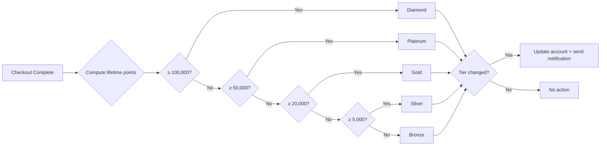
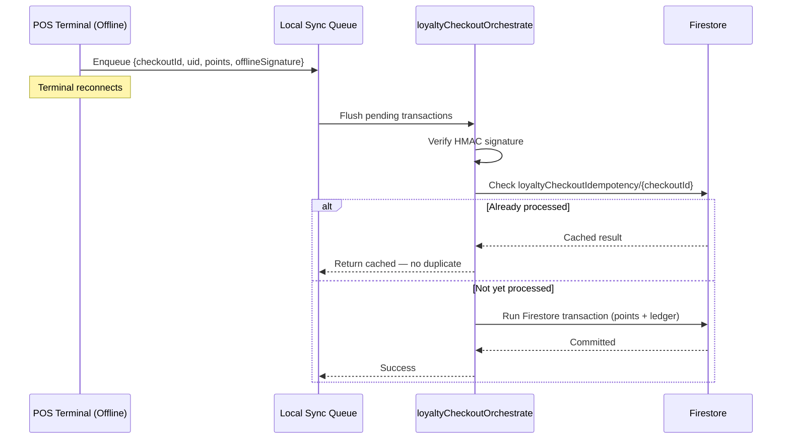
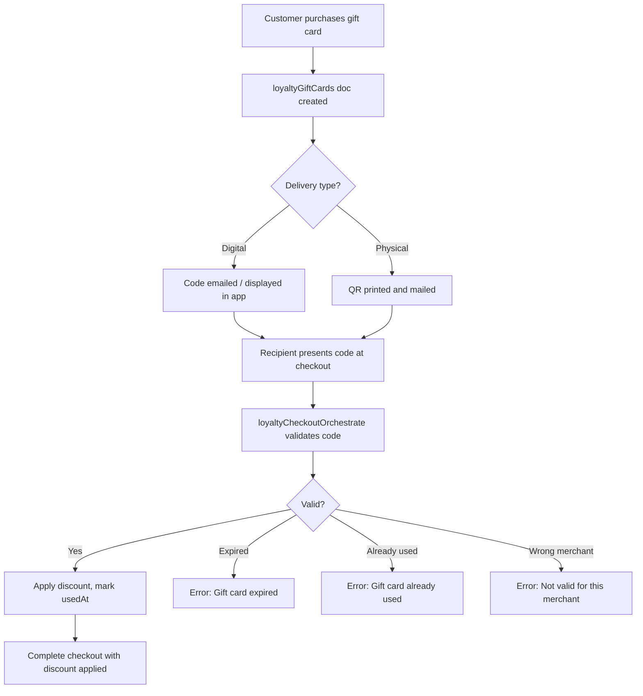
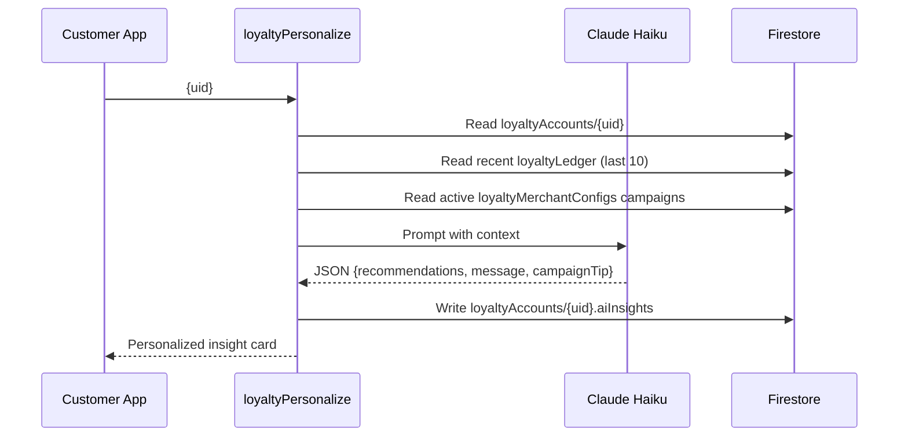
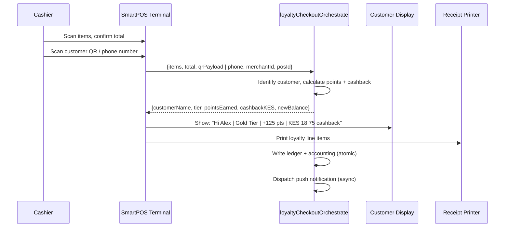

# SOKONI Commerce OS — Volume 8: Universal Loyalty Platform

**Series:** SOKONI Commerce OS Technical Documentation  
**Volume:** 08 of 12  
**Status:** Production — v2.0 Enterprise Edition  
**Last Updated:** 2026-06-29  
**Author:** SOKONI Engineering  

---

## Related Volumes

- [[vol-03-pos-enterprise]] — SmartPOS 3.0 / 4.0 Enterprise BOS (POS checkout integration)
- [[vol-04-payments]] — Payment Orchestrator v2 (wallet settlement)
- [[vol-07-marketplace-commerce]] — Marketplace Commerce (cross-merchant network)
- [[vol-11-crm-marketing]] — CRM & Marketing Engine (campaign triggers)

---

## 1. Executive Summary

The SOKONI Universal Loyalty Platform eliminates the second queue. In legacy retail, loyalty is a separate register transaction — the customer pays, then steps aside, gives a phone number to a second staff member who manually punches points into a card terminal. SOKONI removes this entirely.

Every checkout — whether at a SmartPOS terminal, on the web marketplace, or through a mobile order — automatically identifies the customer, calculates the precise reward owed, credits it to a tamper-evident ledger, updates the customer's membership tier, issues a cashback credit to their wallet, and dispatches a personalised push notification, all before the receipt prints. The cashier does nothing extra. The customer queue does not split.

The platform is designed at scale: 100,000+ active members, 10,000+ merchant locations, and millions of transactions per month, with a hard performance target of points credit in under 500 ms at checkout.

Key capabilities delivered in v2.0:

- **26 Cloud Functions** covering account lifecycle, checkout orchestration, cashback, gift cards, lucky draws, referrals, AI personalization, fraud detection, cross-merchant network, and scheduled reconciliation.
- **Double-entry accounting** on every points event — loyalty liability is always reconcilable.
- **Offline-first HMAC sync** for POS terminals that lose connectivity.
- **Five membership tiers** (Bronze through Diamond) with configurable per-merchant multipliers.
- **Claude Haiku AI personalization** for cross-sell recommendations and tier-up motivation.
- **`loyalty-merchant.html`** — a dedicated merchant analytics portal for loyalty program management.

---

## 2. Philosophy

The loyalty engine is built on a single governing rule: **zero manual intervention at the point of sale**.

This is not a loyalty card system bolted onto a checkout flow. The loyalty engine is embedded inside the checkout orchestrator (`loyaltyCheckoutOrchestrate`). By the time the payment confirmation returns to the POS screen, the following have already occurred atomically inside a single Firestore transaction:

1. Customer identified (by UID, phone number, QR scan, barcode, or loyalty ID).
2. Active campaigns evaluated against the purchase basket.
3. Points calculated with tier multiplier, weekend bonus, birthday bonus, happy-hour bonus, category multiplier, and brand multiplier — all stacked correctly.
4. Points redemption applied and validated (insufficient balance throws before the transaction opens).
5. Gift card discount applied and the gift card marked as used.
6. New points credited to the loyalty account balance.
7. Lifetime points updated, triggering a tier recalculation.
8. Double-entry ledger entry written (immutable).
9. Cashback credited to the customer's cashback wallet.
10. Loyalty accounting entry written (debit: loyalty expense; credit: loyalty liability).
11. Idempotency key committed — identical retry is a no-op.
12. FCM push notification dispatched asynchronously.

The design consequence: no separate loyalty API call after checkout, no eventual consistency window where a customer's balance is stale, and no opportunity for a race condition between payment and points credit because they live inside the same Firestore transaction.

---

## 3. Membership Architecture

### 3.1 Data Model

```
loyaltyAccounts/{uid}
  uid                 : string   — Firebase Auth UID (document key)
  loyaltyId           : string   — SKN-XXXX-XXXX-XXXX format (public identifier)
  cardNumber          : string   — EAN-13 compatible barcode (628400XXXXXXXXXX)
  qrPayload           : string   — "sokoni_loyalty:{loyaltyId}:{hmacSig}"
  phone               : string   — E.164 format, indexed for POS lookup
  name                : string
  email               : string
  birthdayMonth       : number   — 1–12, used for birthday bonus trigger
  birthdayDay         : number   — 1–31
  balance             : number   — current redeemable point balance
  lifetimePoints      : number   — cumulative earned (never decremented)
  totalEarned         : number
  totalRedeemed       : number
  expiredPoints       : number
  cashbackBalance     : number   — KES (not points)
  tier                : string   — bronze | silver | gold | platinum | diamond
  tierName            : string
  linkedCards         : string[] — physical NFC card IDs
  status              : string   — active | suspended | frozen
  fraudRiskScore      : number   — 0–100
  referredBy          : string   — loyaltyId of referrer
  joinedAt            : timestamp
  lastUpdated         : timestamp
  firstPurchaseAt     : timestamp | null
  lastPurchaseAt      : timestamp
  totalPurchases      : number
  totalSpendKES       : number

loyaltyLedger/{entryId}          — immutable, SHA-256 idempotency key
  uid, loyaltyId, type, merchantId
  points, bonusPoints, amountKES
  balanceBefore, balanceAfter
  description, idempotencyKey, createdAt

loyaltyMerchantConfigs/{merchantId}
  pointsPerKES, redemptionRate, maxRedemptionPct
  tierMultipliers, categoryMultipliers, brandMultipliers
  weekendBonus, happyHour, birthdayMultiplier
  welcomePoints, referralPoints, cashbackPct
  pointsExpiryMonths, active

loyaltyGiftCards/{cardId}
loyaltyDraws/{drawId}
loyaltyDrawEntries/{entryId}
loyaltyReferrals/{refId}
loyaltyNetwork/{networkId}
loyaltyReconciliation/{reconcId}
loyaltyAccounting/{entryId}      — double-entry accounting records
loyaltyCheckoutIdempotency/{checkoutId}
```

### 3.2 Account Creation Flow

A loyalty account is created automatically on first checkout if the customer provides a phone number, or explicitly via `createLoyaltyAccount`. The loyalty ID uses rejection-sampling over an unambiguous character set (no O, 0, I, 1, L) and generates a 12-character SKN-prefixed identifier:

```
SKN-XXXX-XXXX-XXXX
```

The QR payload is HMAC-signed:

```
sokoni_loyalty:{loyaltyId}:{hmac16(LOYALTY_HMAC_SECRET, loyaltyId:uid)}
```

The barcode is EAN-13 compatible, using the SOKONI company prefix `628400` followed by a 10-digit random number, enabling physical card readers at POS terminals.

### 3.3 Physical Card Linking

Physical NFC and magnetic-stripe cards are registered in `loyaltyCards/{cardId}` and linked to the digital account via the `linkedCards` array. Scanning a physical card at POS resolves to the same `loyaltyAccounts/{uid}` document — one account, multiple identifiers.

---

## 4. Points Engine

### 4.1 Calculation Pipeline

The points engine runs inside `_calcPoints()` and produces a fully auditable breakdown array alongside the numeric totals. The stacking order is:

```
totalPoints = floor(basePoints × effectiveMultiplier) + bonusPoints

effectiveMultiplier = tierMultiplier + happyHourBonus + weekendBonus + birthdayBonus + campaignMultipliers

bonusPoints = firstPurchaseBonus + categoryBonuses + brandBonuses + spendThresholdBonus + campaignFixedBonuses
```

**Base rate:** `pointsPerKES` (merchant-configurable, default 0.1 — 1 point per KES 10 spent).

**Bonuses applied additively on top of the tier multiplier:**

| Bonus Type | Trigger | Default Value |
|---|---|---|
| Happy Hour | Merchant-configured EAT hours | +0.5 multiplier |
| Weekend | Saturday or Sunday | +0.25 multiplier |
| Birthday | Account birthdayMonth/Day matches today | +2.0 multiplier |
| Campaign Multiplier | Active campaign with `bonusMultiplier` | Additive |

**Bonus fixed points:**

| Bonus Type | Trigger | Default |
|---|---|---|
| First Purchase | `firstPurchaseAt` is null | Merchant-configured |
| Category Multiplier | Item category matches config | Per-category |
| Brand Multiplier | Item brand matches config | Per-brand |
| Spend Threshold | Total spend ≥ configured minimum | Fixed points |
| Campaign Fixed | Active campaign with `bonusPoints` | Per campaign |

### 4.2 Cashback Calculation

Cashback is calculated inside the same `_calcPoints()` call:

```
cashbackKES = (total × cashbackPct) / 100
```

`cashbackPct` is taken from the merchant config; if absent, the tier's default cashback percentage applies. Cashback is credited in Kenya Shillings to `cashbackBalance` — it is immediately spendable at checkout as a payment method, not a points conversion.

### 4.3 Ledger Integrity

Every points event writes to `loyaltyLedger/{entryId}` with a SHA-256 idempotency key derived from the transaction's constituent parts. The document is set with `merge: false` on first write and never updated. Point balance at any moment can be derived by summing all ledger entries for a UID — the stored `balance` field is a materialised view maintained by the checkout transaction for performance, not the source of truth.

---

## 5. Membership Tiers

### 5.1 Tier Definitions

| Tier | Lifetime Points Required | Earn Multiplier | Cashback % |
|---|---|---|---|
| Bronze | 0 | 1.0x | 0.5% |
| Silver | 5,000 | 1.5x | 1.0% |
| Gold | 20,000 | 2.0x | 2.0% |
| Platinum | 50,000 | 3.0x | 3.0% |
| Diamond | 100,000 | 5.0x | 5.0% |

Tier thresholds and multipliers are global defaults. Merchants can override multipliers per tier via `loyaltyMerchantConfigs/{merchantId}.tierMultipliers`.

### 5.2 Tier Benefits Matrix

| Benefit | Bronze | Silver | Gold | Platinum | Diamond |
|---|---|---|---|---|---|
| Priority Support | — | — | — | Yes | Yes |
| Free Delivery | — | — | — | Yes | Yes |
| Birthday Gift | — | — | Yes | Yes | Yes |
| Double Point Days | — | — | Yes | Yes | Yes |
| Early Access | — | — | — | Yes | Yes |
| Exclusive Discounts | — | — | Yes | Yes | Yes |
| VIP Promotions | — | — | — | — | Yes |

### 5.3 Tier Upgrade and Downgrade Rules

Tier promotion is evaluated on every checkout. When `lifetimePoints` crosses a tier threshold, the account document is updated atomically inside the same Firestore transaction that credits the points. A push notification fires: "Congratulations — you've reached Gold Tier."

Tier downgrade uses annual review via the `loyaltyExpiryAndReconcile` scheduled Cloud Function. If a member's trailing 12-month earned points fall below the tier threshold (e.g., Gold requires 20,000 lifetime points; the system evaluates rolling activity), the tier downgrades by one level. The downgrade takes effect at the start of the next anniversary month with a 30-day warning notification.

### 5.4 Tier Calculation Diagram



---

## 6. Offline Loyalty — HMAC Sync

### 6.1 Architecture

SmartPOS terminals operate in environments with intermittent connectivity. When a terminal is offline, it cannot call `loyaltyCheckoutOrchestrate`. The offline loyalty module allows the cashier to calculate and credit points locally, then sync when connectivity is restored.

The security mechanism is HMAC-SHA256. The `LOYALTY_HMAC_SECRET` Firebase Secret is embedded in the terminal's secure enclave at installation time (never stored in localStorage or app bundles). When calculating offline points, the terminal produces:

```
offlineSignature = HMAC-SHA256(LOYALTY_HMAC_SECRET, orderId + ":" + uid + ":" + totalKES + ":" + pointsEarned)
```

Only the first 16 hex characters are transmitted (sufficient for collision resistance, minimising payload size).

### 6.2 Sync Flow



### 6.3 Conflict Detection

The idempotency key (`checkoutId`) is generated on the terminal at sale time. When a sync batch arrives at the Cloud Function, each entry is checked against `loyaltyCheckoutIdempotency`. If the document already exists (because the terminal had briefly reconnected and the transaction succeeded), the cached result is returned and no duplicate credit is applied. HMAC verification failure results in an `unauthenticated` error and an admin alert — it indicates either a tampered offline record or a secret mismatch.

---

## 7. Cashback Engine

### 7.1 Cashback vs Points

Points are a platform currency redeemable against future purchases at the configured redemption rate. Cashback is Kenya Shillings credited directly to the customer's cashback wallet (`cashbackBalance` field). The distinction matters for accounting:

- **Points:** Loyalty liability (deferred revenue) until redeemed.
- **Cashback:** Immediate cash-equivalent liability, settled from merchant revenue share.

### 7.2 Accounting Entry

Every cashback credit generates a double-entry accounting record via `_postAccounting()`:

```
Debit:  loyalty_expense       (merchant's P&L)
Credit: loyalty_cashback_payable (balance sheet liability)
```

When the customer uses cashback at checkout:

```
Debit:  loyalty_cashback_payable
Credit: cash / revenue reduction
```

The `loyaltyAccounting` collection holds these records with SHA-256 idempotency keys, enabling accurate reconciliation in [[vol-04-payments]].

### 7.3 Merchant Cashback Configuration

```json
{
  "cashbackPct": 1.5,
  "tierCashbackOverrides": {
    "gold": 2.0,
    "platinum": 3.0,
    "diamond": 5.0
  }
}
```

If `tierCashbackOverrides` are present, the tier-specific rate takes precedence over the flat `cashbackPct`. This allows a merchant to offer differentiated cashback as a tier benefit.

---

## 8. Wallet System

### 8.1 Wallet Structure

Each customer has two wallet buckets within `loyaltyAccounts/{uid}`:

| Field | Type | Purpose |
|---|---|---|
| `balance` | integer (points) | Redeemable for product discounts at the configured rate |
| `cashbackBalance` | decimal (KES) | Cash-equivalent, immediately spendable |

### 8.2 Points Wallet

Points are earned at checkout, adjusted for promotions and multipliers, and stored as an integer. The redemption rate (default: 100 points = KES 1) is merchant-configurable. The maximum redemption per transaction is capped at `maxRedemptionPct` of the total bill (default: 50%), preventing full bill payment by points unless the merchant explicitly raises the cap.

Redemption validation checks:
1. `currentBalance >= redeemPoints` — sufficient balance.
2. `redeemPoints <= floor(total × maxRedemptionPct × redemptionRate)` — within cap.
3. Redemption and new points earn are computed atomically; the `balanceBefore` and `balanceAfter` fields in the ledger capture the exact state transition.

### 8.3 Cashback Wallet

Cashback accumulates without expiry by default (merchants may configure expiry separately). The cashback wallet is displayed on:
- The customer's app loyalty card screen.
- The POS customer-facing display during checkout.
- The printed receipt (line item: "Cashback earned: KES X.XX").

Withdrawal of cashback to M-Pesa requires reaching the merchant-configured minimum threshold (default: KES 200) and is processed via the FinOS wallet module — see [[vol-04-payments]].

---

## 9. Reward Redemption

### 9.1 Redemption Channels

| Channel | Identifier Used | Flow |
|---|---|---|
| POS QR Scan | QR payload (HMAC-verified) | Cashier scans, `lookupLoyaltyCustomer` returns balance, cashier enters redemption amount |
| POS Barcode | EAN-13 card number | Same as QR |
| POS Phone Number | E.164 phone | Lookup via `phone` field index |
| Online Checkout | UID (authenticated session) | `loyaltyCheckoutOrchestrate` called with `redeemPoints` |
| KASS AI Concierge | UID (authenticated session) | Natural language: "Use my points" |

### 9.2 Partial Redemption

Customers may redeem any amount up to the `maxRedemptionPct` cap. The remaining balance stays in the points wallet. The POS screen shows both the points-to-KES conversion and the remaining balance in real time before the cashier confirms.

### 9.3 Minimum Redemption Threshold

`loyaltyMerchantConfigs/{merchantId}.minRedemptionPoints` (default: 500 points = KES 5) prevents micro-redemptions that generate disproportionate transaction overhead.

---

## 10. Gift Cards

### 10.1 Gift Card Model

```
loyaltyGiftCards/{cardId}
  code            : string   — XXXX-XXXX-XXXX-XXXX (rejection-sampling, no ambiguous chars)
  merchantId      : string   — null for platform-wide
  valueType       : 'fixed' | 'percent'
  value           : number
  minOrderValue   : number   — minimum basket size to apply
  issuedTo        : string   — uid or null (open gift card)
  purchasedBy     : string   — uid of purchaser
  usedAt          : timestamp | null
  usedByUid       : string | null
  expiresAt       : timestamp
  createdAt       : timestamp
  merchantBranded : boolean
  physicalCard    : boolean
```

### 10.2 Gift Card Flow



### 10.3 Partial Use

Gift cards with a balance greater than the checkout total result in the remainder available for future use. The `loyaltyGiftCards` document stores the original value; a `usedAmount` sub-field tracks the consumed portion, leaving the document active until fully depleted.

### 10.4 Offline Redemption

Physical gift card QR codes are HMAC-signed identically to loyalty QR codes. When a POS terminal is offline, it can verify the code's authenticity using the embedded secret and queue the redemption for sync, preventing double-use by checking a local pending-redemptions cache.

---

## 11. Lucky Draws

### 11.1 Draw Entry Logic

```
loyaltyDraws/{drawId}
  merchantId, name, description
  entryPointCost : number   — points spent per entry ticket
  maxEntriesPerCustomer : number
  prizeDescription : string
  prizeValue : number
  status : 'active' | 'closed' | 'completed'
  drawDate : timestamp
  winnerId : string | null
  totalEntries : number

loyaltyDrawEntries/{entryId}
  drawId, uid, loyaltyId
  entries : number   — number of tickets purchased
  pointsSpent : number
  createdAt : timestamp
```

Customers earn draw entries by spending points (not purchasing them — points are deducted). The `loyaltyEnterDraw` Cloud Function validates:
1. Sufficient balance for the requested entries.
2. `maxEntriesPerCustomer` not exceeded.
3. Draw `status === 'active'` and `drawDate` in the future.

Points spent on draw entries are debited from the balance and recorded in the ledger with type `draw_entry`. They do not count as redeemed points (they are consumed for entertainment, not product value) — the accounting treatment is a separate category.

### 11.2 Winner Selection

The `loyaltyRunDraw` Cloud Function (admin-only) runs at the configured `drawDate`. It fetches all entries, builds a weighted array (proportional to tickets held), selects a winner using `crypto.randomBytes()` for cryptographic randomness, writes the `winnerId` to the draw document, and dispatches prize fulfillment notifications.

---

## 12. AI Personalization

### 12.1 Claude Haiku Integration

The `loyaltyPersonalize` Cloud Function calls the Anthropic API (Claude Haiku, via `ANTHROPIC_API_KEY`) to generate personalised loyalty insights for customers. Haiku is chosen for sub-200ms response time at low token cost.

Input context sent to Haiku:
- Current tier and points balance.
- Points to next tier.
- Recent purchase categories (last 10 transactions).
- Merchant's active campaigns.
- Birthday proximity (within 30 days).

Output from Haiku:
- Recommended product categories for next purchase (cross-sell).
- Tier motivation message: "You're 340 points away from Gold — one grocery shop gets you there."
- Campaign awareness: "Double points on electronics this weekend."
- Birthday reward reminder if within 30 days.

### 12.2 Personalization Flow



### 12.3 Tier-Up Motivation Notifications

The scheduled `loyaltySendTierUpAlerts` function runs daily and queries accounts within 10% of the next tier threshold. Each qualifying account receives a push notification constructed from the Haiku-generated motivation message, surfacing a concrete action: "Shop at [merchant] this weekend and earn 2x points."

---

## 13. Cross-Merchant Loyalty Network

### 13.1 Network Architecture

Merchants opt into the SOKONI Loyalty Network by enabling `loyaltyMerchantConfigs/{merchantId}.networkEnabled = true`. Network members allow points earned at any network merchant to be redeemed at their POS.

```
loyaltyNetwork/{networkId}
  merchantIds : string[]   — participating merchants
  settlementCycle : 'weekly' | 'monthly'
  networkRate : number     — network redemption exchange rate adjustment
  fraudThreshold : number  — max daily network redemption per UID
```

### 13.2 Network Settlement

When a customer redeems network-earned points at Merchant B (the points were earned at Merchant A), the settlement engine creates a receivable entry:

```
Merchant A owes Merchant B: redeemPointsValue × networkRate
```

The `loyaltyNetworkSettle` scheduled Cloud Function runs weekly, aggregates all cross-merchant redemptions from the `loyaltyAccounting` collection (type: `network_redemption`), and generates settlement invoices routed through the FinOS payment rail — see [[vol-04-payments]].

### 13.3 Network Fraud Prevention

Cross-merchant redemption is subject to stricter velocity limits than single-merchant redemption. The fraud engine checks:
- Maximum network points redeemed per UID per 24 hours (`fraudThreshold`).
- Velocity: more than 3 network redemptions within 1 hour triggers a review flag.
- Points sourced from accounts less than 7 days old are excluded from network redemption until the account's fraud risk score drops below 20.

---

## 14. Merchant Dashboard — loyalty-merchant.html

The merchant loyalty portal (`loyalty-merchant.html`) is a dark-themed single-page application providing real-time and historical program analytics. The portal connects directly to Cloud Functions via Firebase SDK.

### 14.1 Dashboard Sections

| Section | Metric | Data Source |
|---|---|---|
| Program Overview | Active members, total points issued, total redeemed | `loyaltyAccounts` aggregate |
| Tier Distribution | Donut chart: Bronze/Silver/Gold/Platinum/Diamond | `loyaltyAccounts` `tier` field |
| Top Customers | Top 10 by lifetime points | `loyaltyAccounts` ordered by `lifetimePoints` |
| Points Liability | Total outstanding unredeemed points × redemption rate | Aggregated from `loyaltyAccounting` |
| Cashback Liability | Total `cashbackBalance` across all accounts | Aggregated daily by scheduler |
| Campaign Performance | Enrollments, points issued, conversion rate per campaign | `loyaltyMerchantConfigs/{mid}/campaigns` |
| Loyalty ROI | Revenue attributable to loyalty members vs non-members | Cross-referenced with `orders` collection |
| Point Expiry Forecast | Points expiring in next 30/60/90 days | `loyaltyLedger` expiry index |
| Fraud Alerts | Accounts with `fraudRiskScore` > 60 | Real-time Firestore listener |

### 14.2 Merchant Configuration Panel

Merchants configure their loyalty program without engineering involvement:
- `pointsPerKES` — earn rate.
- Tier multipliers per tier level.
- Category and brand multipliers (uploaded as JSON or entered per-row).
- Happy hour windows (EAT timezone).
- Weekend bonus toggle.
- Birthday multiplier.
- Cashback percentage.
- Points expiry period (months).
- Welcome points for new members.
- Referral bonus amount.

Changes write to `loyaltyMerchantConfigs/{merchantId}` and take effect on the next checkout.

---

## 15. Campaign Engine

### 15.1 Campaign Types

| Campaign Type | Mechanism | Example |
|---|---|---|
| Double Points Period | `bonusMultiplier: 2.0` with date range | "Double points every Friday" |
| Product Category Bonus | `categoryMultipliers` overrides for duration | "3x on electronics this week" |
| Referral Bonus | Fixed points on `createLoyaltyAccount` with `referredBy` | "Earn 200 pts per referral" |
| Birthday Reward | `birthdayMultiplier` + fixed bonus on birthday day | "500 bonus pts on your birthday" |
| Spend Threshold | `spendThreshold.minAmount + bonusPoints` | "Earn 100 extra pts on orders over KES 2,000" |
| Win-Back | Triggered by `lastPurchaseAt` > 60 days ago | "We miss you — 300 bonus pts this week" |
| Happy Hour | Time-window `bonusMultiplier` via `happyHour` config | "1.5x points 12–2pm daily" |
| Day-of-Week | `campaign.dayOfWeek` filter | "2x points every Saturday" |

### 15.2 Campaign Lifecycle

```mermaid
flowchart LR
    A[Merchant creates campaign in portal] --> B[Write to loyaltyMerchantConfigs/{mid}/campaigns]
    B --> C{startsAt in future?}
    C -- Yes --> D[Campaign staged]
    C -- No --> E[Campaign immediately active]
    D --> F[Checkout evaluates now >= startsAt]
    E --> F
    F --> G{now <= endsAt?}
    G -- Yes --> H[Apply campaign bonus to points]
    G -- No --> I[Campaign ignored — expired]
```

---

## 16. Point Expiry

### 16.1 Expiry Rules

Each merchant configures `pointsExpiryMonths` (default: 12). Points earned at a merchant expire if no qualifying purchase is made within that window. The expiry is rolling — any new transaction at the same merchant resets the clock for that merchant's points tranche.

### 16.2 Expiry Warning Notification

The `loyaltyExpiryAndReconcile` scheduled Cloud Function (runs daily) identifies accounts with points expiring within 30 days and dispatches a push notification:

```
"Your 1,240 SOKONI Points expire on 15 Jul 2026.
Shop at any SOKONI merchant before then to keep them active."
```

### 16.3 Expiry Accounting Reversal

When points expire, the accounting entry is:

```
Debit:  loyalty_points_payable   (liability removed)
Credit: loyalty_expired_income   (income — expired points accrue to platform)
```

The `expiredPoints` field on the account document is incremented, and a ledger entry of type `expiry` is written with `points: -N`. The account `balance` is decremented by the same amount inside a Firestore transaction. This ensures the balance field (materialised view) stays consistent with the ledger sum.

---

## 17. Loyalty at POS

### 17.1 POS Checkout Integration

The POS checkout integrates loyalty through a single call to `loyaltyCheckoutOrchestrate`. No separate loyalty step exists in the cashier workflow.



### 17.2 Customer Identification at POS

The lookup cascade in `loyaltyCheckoutOrchestrate`:

1. **UID** — if customer is logged in via app and POS shares session.
2. **QR payload** — HMAC-verified scan.
3. **Barcode** — EAN-13 card number.
4. **Phone number** — cashier enters manually.
5. **Loyalty ID** — SKN-XXXX-XXXX-XXXX typed or scanned.
6. **Auto-create** — if phone provided and no account found, a new account is created with 125 welcome points and returned immediately.

### 17.3 Receipt Format

The printed receipt includes:

```
──────────────────────────────────────────
SOKONI REWARDS
Member: Alex O. | Gold Tier
Points Earned:       +125 pts
Cashback Earned:     KES 18.75
Current Balance:     2,840 pts
Next Tier (Platinum): 47,160 pts away
──────────────────────────────────────────
```

---

## 18. Fraud Prevention

### 18.1 HMAC Verification

Every QR scan and every offline sync transaction is verified against `LOYALTY_HMAC_SECRET` using `crypto.timingSafeEqual()` — not a string comparison — preventing timing-based side-channel attacks. A failed HMAC verification returns `unauthenticated` and writes to the fraud log.

### 18.2 Duplicate Transaction Detection

The `loyaltyCheckoutIdempotency` collection uses SHA-256 hashed `checkoutId` as the document key. Firestore's transaction model ensures the idempotency check and the ledger write are atomic — concurrent duplicate submissions from flaky networks cannot produce duplicate credits.

### 18.3 Velocity Checks

The fraud engine (`loyaltyFraudCheck` internal call within checkout orchestration) evaluates:

| Check | Threshold | Action |
|---|---|---|
| Points earned in last 1 hour | > 10,000 pts | Flag account, pause earning |
| Redemptions in last 24 hours | > 5 transactions | Require re-authentication |
| Network redemption daily | > `fraudThreshold` | Block network redemption |
| Account age on network redemption | < 7 days | Exclude from network |
| `fraudRiskScore` | > 80 | Suspend account, admin alert |

### 18.4 Admin Alerts

Anomalies write to `adminAlerts` collection (picked up by [[vol-03-pos-enterprise]] operations center) and trigger Cloud Messaging push to admin devices. Alert payload includes the account UID, the triggering event type, and the computed risk score delta.

---

## 19. Performance Targets and Architecture

### 19.1 Latency Targets

| Operation | Target | Achieved By |
|---|---|---|
| Points credit at checkout | < 500 ms | Single Firestore transaction; no external HTTP in critical path |
| Tier calculation | < 200 ms | In-memory tier engine (`_tierFor()`), no Firestore read required |
| Customer lookup (phone) | < 150 ms | Indexed `phone` field; `limit(1)` query |
| QR verification | < 50 ms | Pure crypto (`timingSafeEqual`), no network |
| Loyalty dashboard load | < 2 s | Pre-aggregated daily metrics; Firestore composite indexes |
| AI personalization | < 3 s | Haiku model; async — not in checkout critical path |

### 19.2 Scalability Design

- **Sharded counters** are used for platform-wide aggregates (total points issued) to avoid Firestore write-rate contention on a single document.
- **Batch writes** group all checkout-related Firestore operations (account update, ledger entry, accounting entry, idempotency record) into a single `runTransaction` call — one network round trip.
- **Parallel reads** load merchant config and active campaigns concurrently via `Promise.all()`.
- **Scheduled reconciliation** (`loyaltyExpiryAndReconcile`) runs as a Cloud Scheduler-triggered function, offloading expensive aggregation from real-time paths.
- **Cloud Function memory:** `loyaltyCheckoutOrchestrate` is configured at 512 MiB to handle large basket items arrays without GC pressure.

### 19.3 Architecture Diagram

```mermaid
graph TB
    subgraph "Customer Touchpoints"
        POS[SmartPOS Terminal]
        APP[Customer App]
        WEB[Web Checkout]
        KASS[KASS AI Concierge]
    end

    subgraph "Loyalty Cloud Functions (26 total)"
        ORCH[loyaltyCheckoutOrchestrate]
        CREATE[createLoyaltyAccount]
        LOOKUP[lookupLoyaltyCustomer]
        REDEEM[loyaltyRedeem]
        GC[loyaltyGiftCard*]
        DRAW[loyaltyDraw*]
        PERS[loyaltyPersonalize]
        FRAUD[loyaltyFraudCheck]
        SCHED[loyaltyExpiryAndReconcile\n(scheduled daily)]
        NET[loyaltyNetworkSettle\n(scheduled weekly)]
    end

    subgraph "Firestore Collections"
        ACCT[(loyaltyAccounts)]
        LEDGER[(loyaltyLedger)]
        ACCOUNT_BOOK[(loyaltyAccounting)]
        CONFIG[(loyaltyMerchantConfigs)]
        IDEM[(loyaltyCheckoutIdempotency)]
        GIFTCARDS[(loyaltyGiftCards)]
        DRAWS[(loyaltyDraws)]
        NETWORK[(loyaltyNetwork)]
    end

    subgraph "External"
        HAIKU[Claude Haiku API]
        FCM[Firebase Cloud Messaging]
        FINOS[FinOS Payment Rail]
    end

    POS & APP & WEB & KASS --> ORCH
    ORCH --> CREATE
    ORCH --> LOOKUP
    ORCH --> FRAUD
    ORCH --> ACCT & LEDGER & ACCOUNT_BOOK & CONFIG & IDEM
    PERS --> HAIKU
    SCHED --> ACCT & LEDGER
    NET --> FINOS
    ORCH --> FCM
    GC --> GIFTCARDS
    DRAW --> DRAWS
    ORCH --> NETWORK
```

---

## 20. Deployment and Configuration

### 20.1 Required Secrets

| Secret | Purpose | Command |
|---|---|---|
| `LOYALTY_HMAC_SECRET` | QR signing, offline transaction HMAC | `firebase functions:secrets:set LOYALTY_HMAC_SECRET` |
| `ANTHROPIC_API_KEY` | Claude Haiku personalization | `firebase functions:secrets:set ANTHROPIC_API_KEY` |

### 20.2 Firestore Indexes Required

| Collection | Fields | Type |
|---|---|---|
| `loyaltyAccounts` | `phone` ASC | Single field |
| `loyaltyAccounts` | `loyaltyId` ASC | Single field |
| `loyaltyAccounts` | `tier`, `lifetimePoints` DESC | Composite |
| `loyaltyLedger` | `uid`, `createdAt` DESC | Composite |
| `loyaltyAccounting` | `merchantId`, `type`, `createdAt` DESC | Composite |
| `loyaltyGiftCards` | `code` ASC | Single field |
| `loyaltyDrawEntries` | `drawId`, `uid` | Composite |
| `loyaltyMerchantConfigs/{mid}/campaigns` | `active` | Single field |

### 20.3 App Check

All 26 Cloud Functions are deployed with `enforceAppCheck: true`. Loyalty API calls from unauthenticated clients or emulators without a valid App Check token are rejected at the Firebase layer before reaching function code.

### 20.4 Cloud Function List

| Function | Trigger | Purpose |
|---|---|---|
| `createLoyaltyAccount` | onCall | Account creation with welcome points + referral |
| `lookupLoyaltyCustomer` | onCall | POS customer identification |
| `loyaltyCheckoutOrchestrate` | onCall | Full checkout: earn + redeem + cashback + gift card |
| `getLoyaltyAccount` | onCall | Customer app — account details |
| `getLoyaltyLedger` | onCall | Transaction history |
| `earnLoyaltyPoints` | onCall | Manual earn (legacy / non-POS) |
| `redeemLoyaltyPoints` | onCall | Standalone redemption |
| `linkLoyaltyCard` | onCall | Physical card linking |
| `getMerchantLoyaltyConfig` | onCall | Merchant dashboard read |
| `setMerchantLoyaltyConfig` | onCall | Merchant configuration save |
| `createLoyaltyCampaign` | onCall | Campaign creation |
| `loyaltyCheckoutOrchestrate` | onCall | Enterprise checkout (loyalty-enterprise.js) |
| `loyaltyIssueGiftCard` | onCall | Gift card issuance |
| `loyaltyCheckGiftCard` | onCall | Balance check |
| `loyaltyCreateDraw` | onCall | Lucky draw creation |
| `loyaltyEnterDraw` | onCall | Draw entry purchase |
| `loyaltyRunDraw` | onCall | Winner selection (admin) |
| `loyaltyPersonalize` | onCall | Haiku AI recommendations |
| `loyaltyReferral` | onCall | Referral tracking |
| `loyaltyNetworkRedeem` | onCall | Cross-merchant redemption |
| `loyaltyFraudDashboard` | onCall | Fraud metrics (admin) |
| `loyaltyNetworkSettle` | onSchedule | Weekly cross-merchant settlement |
| `loyaltyExpiryAndReconcile` | onSchedule | Daily expiry + tier review |
| `loyaltySendTierUpAlerts` | onSchedule | Daily tier-up notifications |
| `loyaltyReconcileAccounting` | onSchedule | Daily accounting reconciliation |
| `loyaltyArchiveLedger` | onSchedule | Monthly ledger archival |

---

## 21. Cross-References

- [[vol-03-pos-enterprise]] — SmartPOS checkout integration, customer-facing display, receipt printer
- [[vol-04-payments]] — FinOS wallet, cashback settlement, network invoice rail
- [[vol-07-marketplace-commerce]] — Online checkout loyalty hooks, digital order points
- [[vol-11-crm-marketing]] — Campaign trigger events, win-back audience segmentation, birthday workflows
- [[CLAUDE]] — Engineering standards: security, performance, documentation requirements

---

## Changelog

| Date | Version | Change |
|---|---|---|
| 2026-06-29 | v2.0 | Enterprise Edition: 26 CFs, cashback engine, gift cards, lucky draws, AI personalization, cross-merchant network, double-entry accounting, HMAC offline sync |
| 2026-06-28 | v1.0 | Universal Loyalty: 26 CFs, SKN-XXXX QR cards, HMAC offline sync, Haiku insights, loyalty-merchant.html |

---

*This document is part of the SOKONI Commerce OS documentation suite. For platform architecture overview see [[ARCHITECTURE]]. For API reference see [[API-REFERENCE]].*
