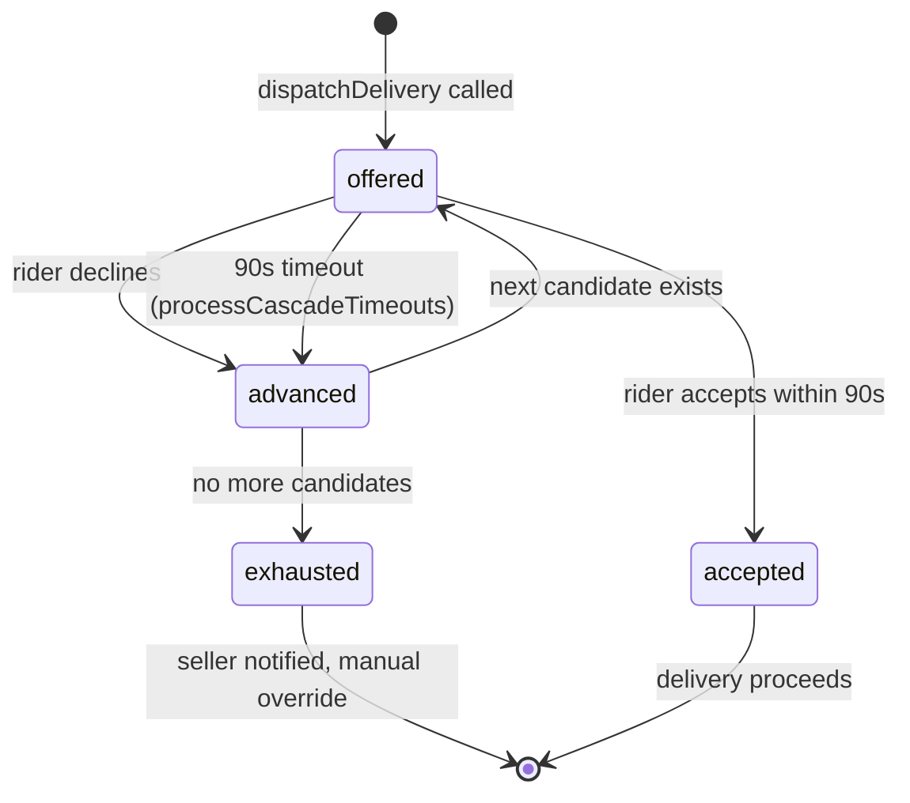
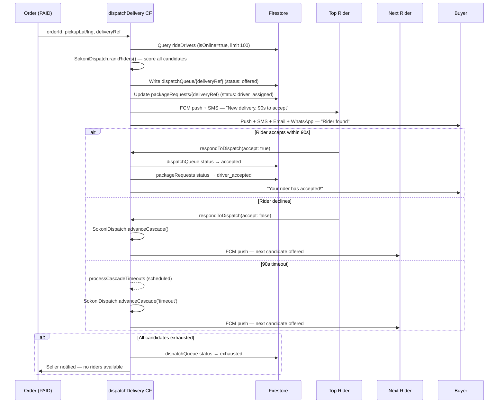
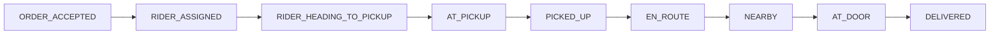
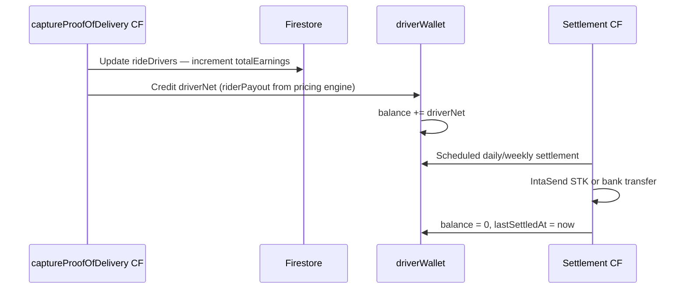

# SOKONI Commerce OS — Volume 9: Delivery & Logistics

> **Series:** SOKONI Commerce OS Documentation Suite
> **Volume:** 9 of 20
> **Status:** Production
> **Last Updated:** 2026-06-29
> **Maintainer:** Platform Engineering

---

## Related Volumes

[[vol-04-payments]] | [[vol-07-marketplace-commerce]] | [[vol-14-analytics-bi]] | [[vol-15-enterprise-operations]]

---

## 1. Executive Summary

SOKONI Delivery & Logistics is the physical fulfilment layer of the platform. It bridges digital commerce with real-world movement: a buyer places an order, a merchant prepares it, a rider collects and delivers it, and the settlement flows automatically into the rider's wallet. Every step is instrumented, auditable, and fair.

The system is built on three commitments:

**End-to-end automation.** From the moment an order is paid, the dispatch engine takes over. No manual rider allocation, no phone calls, no spreadsheets. The cascade algorithm ranks available riders, offers the delivery, handles accept/decline, and cascades to the next candidate — all within 90 seconds per attempt.

**Real-time transparency.** Both the buyer and the merchant can watch a delivery move across a map. GPS coordinates are uploaded every 4 seconds (moving) or every 10 seconds (customer-facing tracking view). A 9-stage timeline keeps every party informed at each handover point.

**Fair driver economics.** The pricing engine guarantees a minimum payout of KES 180 per trip and a target rider share of 82% of the customer fee. Peak-hour multipliers increase rider earnings, not just platform revenue. The rider wallet auto-settles to M-Pesa on a daily or weekly schedule.

### Cloud Functions in Scope (`functions/dispatch.js`)

| CF | Type | Purpose |
|---|---|---|
| `dispatchDelivery` | Callable | Rank riders, create cascade, notify top candidate |
| `respondToDispatch` | Callable | Rider accept / decline; cascade advance |
| `processCascadeTimeouts` | Scheduled (every 1 min) | Advance stale `offered` entries |
| `captureProofOfDelivery` | Callable | OTP + photo + GPS proof, mark delivered |
| `handleFailedDelivery` | Callable | Retry logic, return, refund routing |
| `detectGPSFraud` | Callable / Trigger | Haversine speed check, flag anomalies |
| `rollupDeliveryAnalytics` | Scheduled | Zone/rider/time analytics aggregation |
| `updateDeliveryStage` | Firestore trigger | Stage transition, customer notification |

---

## 2. Dispatch Architecture

### 2.1 The 8-Factor Scoring Model

The dispatch engine (`functions/sokoni-dispatch.js`) scores every available online rider against the incoming delivery using six primary weighted dimensions plus two adjustment factors. The weights sum to 1.0.

| Factor | Weight | How It Is Measured |
|---|---|---|
| Distance to pickup | 0.25 | Haversine km from rider GPS to `pickupLat/pickupLng` |
| ETA to pickup | 0.20 | `distKm / (25 km/h avg speed)` — capped at 35 min max |
| Current workload | 0.15 | `activeDeliveries` count vs. `maxConcurrentPerRider` (3) |
| Vehicle type match | 0.15 | Weight capacity and parcel size rank compatibility |
| Rider rating | 0.15 | 0–5 star average from CSAT history |
| Acceptance rate | 0.10 | Historical accept/decline ratio |
| Hub-affinity bonus | +0.05 | Rider assigned to same hub as pickup (additive) |
| Battery / signal penalty | −0.05 to −0.10 | Battery <20% or network strength <2 bars (subtractive) |

Riders are hard-filtered before scoring:

- Must be `isOnline: true` and not `status: 'break'`
- Must be within `maxDispatchRadiusKm: 15` km of the pickup point
- Vehicle must meet the parcel's weight and size requirements
- Must have fewer than 3 active deliveries
- Cannot have ETA >35 minutes

Up to 20 ranked candidates are stored in the `dispatchQueue/{deliveryRef}` document.

### 2.2 Cascade State Machine



The `dispatchTimeoutSec` is set to 90 seconds. The scheduled CF `processCascadeTimeouts` runs every minute and picks up any `offered` entries whose `timeoutAt` has passed, advancing the cascade or marking it `exhausted`.

---

## 3. Rider Management

Each rider is stored in the `rideDrivers/{riderId}` collection with the following profile schema:

```
rideDrivers/{riderId}
  name, phone, email
  vehicleType          // moto | bicycle | car | van | truck | tuktuk | ebike
  vehiclePlate
  zoneId               // geographic zone assignment
  hubId                // affiliated hub (optional)
  isOnline             // availability toggle
  status               // 'available' | 'busy' | 'break' | 'suspended'
  rating               // 0.0–5.0 running average
  acceptanceRate       // 0.0–1.0
  completionRate       // 0.0–1.0
  cancellationCount    // lifetime cancellations (≥10 triggers auto-suspend)
  activeDeliveries     // count of in-progress deliveries
  totalDeliveries      // lifetime count
  totalEarnings        // lifetime KES earned
  fcmToken             // FCM push token for notifications
  lat, lng             // last known GPS position
  battery              // device battery % (optional)
  networkStrength      // signal bars 0–4 (optional)
  walletBalance        // current unsettled balance KES
  suspendedAt          // timestamp if suspended
  suspensionReason
```

### Auto-Suspension Rule

When a rider accumulates 10 or more cancellations in their lifetime, the dispatch engine automatically sets `status: 'suspended'`. The rider receives an SMS and push notification with a link to the appeals process. A fleet manager must review and manually reinstate via the fleet-monitor dashboard.

---

## 4. Order Assignment Flow



The dispatch cascade stores up to 20 ranked riders. Each is offered the delivery sequentially. If all candidates are exhausted, the seller is notified and the system retries (up to 6 times, every 10 minutes) via the `handleFailedDelivery` failed-action table (`no_riders_available` reason).

---

## 5. GPS & Navigation

### 5.1 sokoni-navigation.js

The navigation engine (`sokoni-navigation.js`) is a self-contained browser module that powers the rider-facing navigation experience. Key constants:

| Parameter | Value | Purpose |
|---|---|---|
| `OSRM_BASE` | `https://router.project-osrm.org/route/v1` | Open-source routing engine |
| `ARRIVAL_RADIUS_M` | 60 m | Triggers "arrived" geofence |
| `DEVIATION_M` | 160 m | Distance from route before recalculation |
| `UPLOAD_INTERVAL_MS` | 4,000 ms | Firestore location write cadence (when moving) |
| `SMOOTH_K` | 0.25 | Bearing smoothing factor for map arrow |
| `STEP_ADVANCE_M` | 30 m | Distance from maneuver point before advancing to next step |

### 5.2 OSRM Route Calculation

Route requests are sent to OSRM's driving profile. The response provides:

- Turn-by-turn step geometry as a polyline
- Total distance in metres
- Total duration in seconds
- Per-step maneuver type and modifier (used to render direction icons)

When a rider deviates more than 160 m from the planned route, the engine automatically requests a new route from the current GPS position. Recalculation is debounced to avoid excessive API calls.

### 5.3 GPS Location Writes to Firestore

While a rider is moving, their position is written to `deliveryLocations/{riderId}` every 4 seconds. The document structure:

```
deliveryLocations/{riderId}
  lat, lng
  bearing          // smoothed heading in degrees
  speedKmH
  accuracy         // GPS accuracy in metres
  deliveryRef      // active delivery reference
  updatedAt
```

The customer tracking page subscribes to this document via `onSnapshot` and re-renders the rider marker on every update.

### 5.4 GPS Spoofing Guard

The `detectGPSFraud` CF applies haversine distance validation between consecutive GPS readings. If the calculated speed between two readings exceeds `fraudMaxSpeedKmH: 120 km/h`, the reading is flagged as a potential spoof:

- The suspicious reading is written to `gpsAnomalies/{riderId}` with a timestamp
- If three anomalies occur within a single delivery, the rider's `status` is set to `'fraud_review'` and the delivery is re-dispatched
- A security alert is raised in the platform monitoring system

---

## 6. Live Tracking

### 6.1 Customer Tracking Page

The customer-facing tracking page (`delivery-tracking.html`) subscribes to two Firestore documents:

1. `packageRequests/{deliveryRef}` — for status, ETA, rider details, and stage
2. `deliveryLocations/{riderId}` — for real-time GPS coordinates

The rider marker on the Leaflet map is updated on every `onSnapshot` callback. Position interpolation (linear smoothing between updates) prevents the marker from jumping when network latency causes irregular update intervals.

### 6.2 ETA Recalculation

ETA is re-calculated on every location update:

```
etaMin = remainingDistKm / (currentSpeedKmH || 25) * 60
```

If the recalculated ETA differs from the stored ETA by more than 5 minutes, a push notification is sent to the buyer: "Your delivery is running slightly late — new ETA: X minutes."

### 6.3 Update Cadence

| Scenario | Firestore Write Interval |
|---|---|
| Rider moving | Every 4 seconds (`UPLOAD_INTERVAL_MS`) |
| Rider stationary | Every 30 seconds (keep-alive) |
| Customer tracking UI refresh | On every `onSnapshot` event (real-time) |
| ETA display refresh | Every 10 seconds (UI timer) |

---

## 7. Delivery Pricing

### 7.1 Pricing Engine — sokoni-delivery-pricing.js

The `SokoniDeliveryPricing.calculate(opts)` function returns a `PricingResult` with a full cost breakdown. All values are in KES.

### 7.2 Vehicle Rate Table

| Vehicle | Base Fare (KES) | Per km (KES) | Per min (KES) | Max Weight |
|---|---|---|---|---|
| Motorcycle | 100 | 18 | 0.80 | 15 kg |
| Bicycle | 60 | 10 | 0.45 | 8 kg |
| E-Bike | 70 | 12 | 0.50 | 12 kg |
| Tuk-Tuk | 130 | 22 | 0.85 | 30 kg |
| Car | 220 | 38 | 1.00 | 50 kg |
| Van | 450 | 58 | 1.60 | 200 kg |
| Truck | 800 | 85 | 2.00 | 1,000 kg |

### 7.3 Multipliers and Surcharges

**Speed tier multiplier** (applied to variable components):

| Tier | Multiplier | Description |
|---|---|---|
| Express (1–2 hrs) | 1.55 | Priority fulfilment |
| Same-Day (4–8 hrs) | 1.00 | Standard |
| Scheduled | 0.85 | Planned ahead, discounted |

**Peak-hour multiplier** (applied on top of speed tier):

| Window | Multiplier |
|---|---|
| Morning peak (7–9 AM) | 1.30 |
| Lunch rush (12–1 PM) | 1.15 |
| Evening peak (5–8 PM) | 1.35 |

**Additional surcharges:**
- Rural delivery: +KES 60 flat
- Wait time at pickup: +KES 3 per minute
- Demand multiplier: 1.0–2.0 (from backend demand signal, clamped)

### 7.4 Rider Payout Protection

The engine enforces minimum rider earnings regardless of surcharges, subsidies, or discounts:

| Protection Rule | Value |
|---|---|
| Target rider share | 82% of customer fee |
| Floor rider share | 75% of customer fee |
| Absolute minimum payout | KES 180 per trip |
| Minimum per road km | KES 12 |
| Minimum per travel minute | KES 0.50 |

If the calculated rider payout falls below the floor, SOKONI absorbs the shortfall as a subsidy (capped at 40% of the customer fee). This design ensures riders are never underpaid regardless of promotional pricing decisions.

### 7.5 Pricing Transparency

The `SokoniDeliveryPricing.renderBreakdown(result)` function returns an HTML string showing the full itemised breakdown — base fare, distance component, time component, weight surcharge, size surcharge, speed tier, peak multiplier, demand multiplier, rural surcharge, and subsidy — rendered into the checkout UI for full customer transparency.

---

## 8. Proof of Delivery

### 8.1 `captureProofOfDelivery` CF

When a rider reaches the delivery address, they capture proof through the rider app. The `captureProofOfDelivery` callable CF validates:

1. **Rider identity** — `riderId` must match `delivery.riderId` or `delivery.driverId`
2. **OTP or QR verification** — The customer shares a 4–6 digit OTP or shows a QR code; both are accepted as equivalent proof
3. **GPS proximity** — Rider GPS must be within a defined radius of `dropoffLat/dropoffLng` (validated by `SokoniLogistics.validateProof`)
4. **Photo evidence** — `photoUrl` is stored in Cloud Storage and linked to the proof record

### 8.2 `deliveryProofs` Collection Schema

```
deliveryProofs/{deliveryRef}
  deliveryRef
  riderId
  otp                // OTP entered or null
  qrVerified         // boolean — QR scan used
  photoUrl           // Cloud Storage URL
  signatureDataUrl   // base64 signature (optional)
  gpsLat, gpsLng
  gpsAccuracyM
  capturedAt
  valid              // boolean
```

### 8.3 High-Value Order OTP Enforcement

Orders above a configurable threshold (default KES 5,000) set `proofRequirements: ['otp', 'photo']`. Both must be satisfied before `captureProofOfDelivery` marks the delivery as `delivered`. For standard orders, OTP alone is sufficient.

### 8.4 Batch Proof Commit

The CF uses a Firestore batch write to atomically:

- Write to `deliveryProofs/{deliveryRef}`
- Update `packageRequests/{deliveryRef}` to `status: 'delivered'`, `sellerPayoutReady: true`
- Decrement `rideDrivers/{riderId}.activeDeliveries`
- Increment `rideDrivers/{riderId}.totalDeliveries` and `totalEarnings`

---

## 9. 9-Stage Delivery Timeline

The delivery lifecycle tracks through 9 discrete stages, each triggering a multi-channel customer notification (push, SMS, email, WhatsApp deep-link).



| Stage | Trigger | Customer Message |
|---|---|---|
| `ORDER_ACCEPTED` | Payment confirmed, order placed | "Your order is confirmed and being prepared." |
| `RIDER_ASSIGNED` | `dispatchDelivery` succeeds | "A rider has been found. ETA: X min." |
| `RIDER_HEADING_TO_PICKUP` | Rider starts navigation to seller | "Your rider is on their way to collect your order." |
| `AT_PICKUP` | Rider arrives at seller (60 m geofence) | "Rider has arrived at the seller. Almost ready!" |
| `PICKED_UP` | Seller confirms handover / rider confirms collection | "Your order is on its way!" |
| `EN_ROUTE` | Rider begins navigation to delivery address | "Your rider is heading to you. Track live: [link]" |
| `NEARBY` | Rider within 500 m of delivery address | "Your rider is nearly there — be ready!" |
| `AT_DOOR` | Rider arrives at delivery address (60 m geofence) | "Your rider is at your door. Please open the OTP." |
| `DELIVERED` | `captureProofOfDelivery` succeeds | "Delivered! Rate your experience." |

The `updateDeliveryStage` Firestore trigger (`onDocumentUpdated` on `packageRequests`) calls `SokoniLogistics.renderNotification(stage, ...)` to produce per-channel notification content and dispatches via `smsQueue`, `emailQueue`, `whatsappQueue`, and FCM.

---

## 10. Returns & Collections

The reverse logistics flow handles:

- **Customer-initiated return** — Customer requests a return via the buyer portal; a return pickup is dispatched to collect from the customer's address and deliver to the merchant
- **Failed delivery return** — When a delivery cannot be completed after maximum retry attempts (`handleFailedDelivery` exhausts retries and selects `action: 'return'`), the rider is instructed to return the parcel to the seller

The `FAIL_ACTIONS` table in `sokoni-dispatch.js` governs retry and return logic:

| Reason | Retryable | Max Retries | Retry After | Final Action |
|---|---|---|---|---|
| Customer unavailable | Yes | 2 | 30 min | Return to seller |
| Wrong address | No | — | — | Refund |
| Payment failed | No | — | — | Refund |
| Order rejected | No | — | — | Refund |
| Rider breakdown | Yes | 3 | 5 min | Reassign rider |
| Seller delay | Yes | 2 | 20 min | Continue |
| No riders available | Yes | 6 | 10 min | Continue |

**Proof of collection** for returns uses the same `captureProofOfDelivery` CF with `deliveryType: 'return'` — photo and GPS coordinates are required. Reverse logistics pricing applies a fixed return surcharge on top of the standard delivery fee.

---

## 11. Driver Wallet & Settlement

### 11.1 Wallet Architecture

Each rider has a wallet document at `driverWallet/{riderId}`:

```
driverWallet/{riderId}
  balance          // unsettled KES balance
  totalLifetime    // all-time earnings KES
  lastSettledAt
  settlementMethod // 'mpesa' | 'bank'
  mpesaPhone
  pendingPayout    // amount awaiting settlement
```

### 11.2 Earnings Credit Flow



### 11.3 Settlement Schedule

| Option | Trigger | Method |
|---|---|---|
| Daily | Midnight auto-run | M-Pesa via IntaSend STK |
| Weekly | Sunday midnight | M-Pesa or bank transfer |
| On-demand | Rider requests withdrawal | M-Pesa (minimum KES 200) |

The settlement CF deducts the platform commission (18% average across vehicle types, always leaving a minimum KES 180 with the rider) and initiates payment via the IntaSend SDK configured in [[vol-04-payments]].

---

## 12. Fleet Management

### 12.1 fleet-monitor.html

The fleet monitor dashboard provides the operations team with:

- **Live rider map** — All `isOnline: true` riders plotted on a Leaflet map, colour-coded by status (available = green, busy = orange, break = grey, suspended = red)
- **Zone heat maps** — Demand density overlays per zone showing active orders vs. available riders
- **Idle time tracking** — Riders online but with no accepted delivery for >30 minutes are flagged
- **Cascade monitor** — Live table of all `offered` dispatch queue entries with seconds-remaining countdown
- **Suspension queue** — Riders at 8–9 cancellations (approaching the 10-cancel auto-suspend threshold) shown with a warning indicator

### 12.2 Fleet Operations Firestore Queries

```
// Active riders in a zone
rideDrivers.where('zoneId', '==', zone).where('isOnline', '==', true)

// Riders approaching suspension
rideDrivers.where('cancellationCount', '>=', 8)

// Open dispatch entries
dispatchQueue.where('status', '==', 'offered').orderBy('timeoutAt')
```

---

## 13. Route Optimization

### 13.1 OSRM Integration

The navigation engine sends route requests to OSRM in the format:

```
GET /route/v1/driving/{lng1},{lat1};{lng2},{lat2}
    ?overview=full&geometries=geojson&steps=true
```

The `steps: true` parameter returns turn-by-turn navigation instructions that power the rider's in-app guidance.

### 13.2 Multi-Stop Routing

When a rider has multiple active deliveries (up to `maxBatchSize: 3`), the navigation engine calculates a combined route. The batch optimisation in `sokoni-dispatch.js` evaluates whether adding a secondary delivery to a rider's route increases total distance by more than `batchMaxDetourKm: 3.0 km`. If the detour exceeds this threshold, the secondary delivery is dispatched to a different rider.

### 13.3 Fuel Cost Consideration

The pricing engine records route distance at booking time. The rider payout's per-km component (`minPerKm: KES 12`) ensures that even at Kenya's highest fuel prices, a motorcycle rider earns a meaningful margin after fuel — a deliberate design decision to keep SOKONI riders earning fairly relative to competitors.

---

## 14. ETA Engine

### 14.1 ETA Calculation Formula

```
Initial ETA:
  etaMin = distKm / (avgSpeedKmH / 60)  [avgSpeedKmH = 25 for Nairobi moto]

Live recalculation (during delivery):
  etaMin = remainingDistM / 1000 / currentSpeedKmH * 60
  fallback: remainingDistM / 1000 / 25 * 60
```

### 14.2 Notification Trigger

If `|newEtaMin - storedEtaMin| > 5`, a push notification is sent to the buyer. This prevents notification fatigue from minor ETA fluctuations while ensuring buyers are informed of meaningful delays.

### 14.3 Historical ETA Accuracy

The `rollupDeliveryAnalytics` scheduled CF computes, per zone and per vehicle type:

- Median ETA prediction error
- Percentage of deliveries within ±5 minutes of predicted ETA
- P90 ETA error

These metrics are used to calibrate the `avgSpeedKmH` constant for each zone over time, moving toward zone-specific speed profiles that reflect actual Nairobi traffic conditions.

---

## 15. CSAT & Ratings

### 15.1 Post-Delivery Rating Flow

After the `DELIVERED` stage notification, a rating prompt is sent to the buyer:

- 1–5 star rating for the rider
- Optional text comment
- Specific categories: punctuality, handling, communication

Ratings are written to `riderRatings/{ratingId}` and trigger an update to `rideDrivers/{riderId}.rating` using an exponential moving average (EMA), giving more weight to recent deliveries.

### 15.2 Performance Thresholds

| Metric | Threshold | Action |
|---|---|---|
| Average rating | < 3.5 | Automatic performance review notice |
| Average rating | < 3.0 sustained for 30 days | Supervisor review required |
| Cancellation count | >= 10 | Auto-suspend |
| Acceptance rate | < 0.50 | Warning notification |
| Completion rate | < 0.80 | Placed in reduced-dispatch priority pool |

### 15.3 Rider Response

Riders can view their ratings and post a single response to each review via the rider app. Responses are visible to the operations team and factor into dispute resolution.

---

## 16. Delivery Analytics

The `rollupDeliveryAnalytics` scheduled CF aggregates metrics into `deliveryAnalytics/{zone}/{date}`:

| Metric | Granularity |
|---|---|
| Average delivery time (minutes) | Zone, vehicle type, hour of day |
| On-time rate (% delivered within ETA ±5 min) | Zone, date |
| Cancellation rate | Zone, rider, reason |
| Zone demand vs. supply ratio | Zone, hour |
| Cost per delivery (platform cost) | Zone, vehicle type |
| Rider productivity (deliveries/hour) | Rider, date |
| First-attempt delivery success rate | Zone, date |
| Return rate | Merchant, product category |

These analytics are surfaced in the executive dashboard (`executive-dashboard.html`) and the fleet monitor (`fleet-monitor.html`). See [[vol-14-analytics-bi]] for query patterns and data pipeline architecture.

---

## 17. Offline Delivery Support

The rider app is designed for partial-offline operation, critical in areas with weak connectivity:

| Capability | Offline Behaviour |
|---|---|
| Proof of delivery capture | Queued in IndexedDB; synced on reconnect |
| GPS logging | Stored locally every 5 seconds |
| Stage updates | Written to local state; batch-synced on reconnect |
| Route display | Cached tile layers; OSRM recalculation skipped |
| Push notifications | FCM deferred by OS until connectivity restored |

When the rider reconnects, all queued proof records, GPS logs, and stage updates are flushed to Firestore in chronological order. Timestamps use `serverTimestamp()` for the official record, preserving local timestamps as `capturedAt` for audit purposes.

---

## 18. Security

### 18.1 Dispatch Security Controls

All dispatch CFs are deployed with `enforceAppCheck: true` and `invoker: 'private'`. Only authenticated requests carrying a valid App Check token from the SOKONI rider or seller app can invoke them.

### 18.2 GPS Anti-Fraud

The haversine speed check catches the most common GPS spoofing technique (injecting a fake location far from the actual position). The `fraudMaxSpeedKmH: 120` threshold is set conservatively — no legitimate road vehicle in Nairobi will exceed 120 km/h between two consecutive 4-second GPS samples.

Three anomalies in a single delivery trigger immediate:

1. Rider `status` → `'fraud_review'`
2. Delivery re-dispatch to the next ranked candidate
3. Security event logged to `securityAuditLog`

### 18.3 Delivery Proximity Enforcement

The `SokoniLogistics.validateProof` function checks that the rider's GPS coordinates at proof capture are within a configured radius of the delivery address `dropoffLat/dropoffLng`. A rider cannot mark a delivery as `delivered` from across town. The proximity check uses the same haversine formula as the navigation engine for consistency.

### 18.4 OTP for High-Value Orders

Orders above KES 5,000 require OTP confirmation. The OTP is:

- Generated server-side (cryptographically random)
- Stored in `packageRequests/{deliveryRef}.deliveryOTP` (access-controlled, not readable by the rider via client SDK)
- Communicated to the buyer via SMS and push notification
- Single-use; invalidated on first successful proof capture

### 18.5 Audit Trail

Every stage transition writes an audit entry:

```
deliveryAuditLog/{deliveryRef}/{eventId}
  stage
  triggeredBy      // 'rider' | 'system' | 'admin'
  actorId
  gpsLat, gpsLng
  timestamp
  metadata
```

This audit trail is immutable (append-only Firestore rules) and feeds into the security incident response system described in [[vol-15-enterprise-operations]].

---

## 19. Performance Targets

| Metric | Target | How Measured |
|---|---|---|
| Dispatch algorithm execution time | < 2 seconds | CF execution log p95 |
| GPS update Firestore write latency | < 3 seconds end-to-end | `onSnapshot` receive time vs. write time |
| ETA accuracy (within ±5 min) | ≥ 80% of deliveries | `rollupDeliveryAnalytics` on-time rate |
| Cascade timeout processing | ≤ 60 seconds from timeout to next rider notification | Scheduled CF run interval |
| Proof capture CF response time | < 2 seconds | CF execution log p95 |
| Customer tracking page first load | < 2 seconds on 3G | Firebase Hosting CDN + Firestore |
| Rider position map refresh | Continuous (onSnapshot) | Leaflet re-render on every event |

The `processCascadeTimeouts` CF runs every 1 minute via Cloud Scheduler. In the worst case, a timed-out cascade entry waits up to 60 seconds before the next rider is offered. This is acceptable given the 90-second rider window — the total offer-to-next-offer delay stays under 150 seconds.

---

## 20. Cross-References

| Topic | Volume |
|---|---|
| Payment settlement and M-Pesa integration | [[vol-04-payments]] |
| Order lifecycle and marketplace commerce | [[vol-07-marketplace-commerce]] |
| Delivery analytics data pipeline | [[vol-14-analytics-bi]] |
| Fleet operations and incident response | [[vol-15-enterprise-operations]] |
| Rider wallet and financial settlement | [[vol-04-payments]] |
| App Check and security posture | [[vol-16-security-compliance]] |
| Notifications (push, SMS, email, WhatsApp) | [[vol-11-notifications-messaging]] |

---

## Appendix A — Firestore Collections

| Collection | Purpose |
|---|---|
| `packageRequests/{deliveryRef}` | Master delivery record, status machine |
| `dispatchQueue/{deliveryRef}` | Cascade state, ranked rider list |
| `rideDrivers/{riderId}` | Rider profile, availability, earnings |
| `deliveryLocations/{riderId}` | Real-time GPS position |
| `deliveryProofs/{deliveryRef}` | Proof of delivery record |
| `deliveryAttempts/{attemptId}` | Failed delivery attempt log |
| `deliveryAuditLog/{deliveryRef}` | Immutable stage transition log |
| `gpsAnomalies/{riderId}` | GPS fraud detection events |
| `driverWallet/{riderId}` | Rider wallet balance and settlement history |
| `deliveryAnalytics/{zone}/{date}` | Aggregated zone/rider performance metrics |
| `smsQueue` | Outbound SMS messages |
| `emailQueue` | Outbound email messages |
| `whatsappQueue` | WhatsApp deep-link messages |

---

## Appendix B — Environment Variables and Secrets

| Variable | Purpose |
|---|---|
| `INTASEND_PUBLIC_KEY` | IntaSend STK push for rider settlement |
| `INTASEND_PRIVATE_KEY` | IntaSend API (Secret Manager) |
| `ANTHROPIC_API_KEY` | ETA ML improvement (future integration) |

---

*Volume 9 of the SOKONI Commerce OS Documentation Suite. For questions, contact the Platform Engineering team. Next review: 2026-09-29.*
