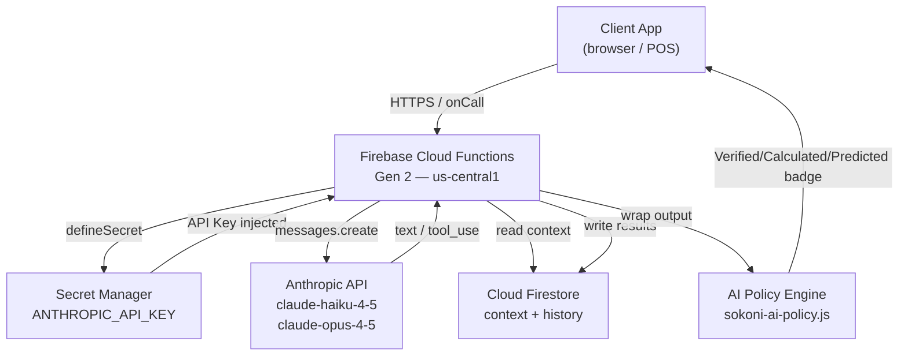
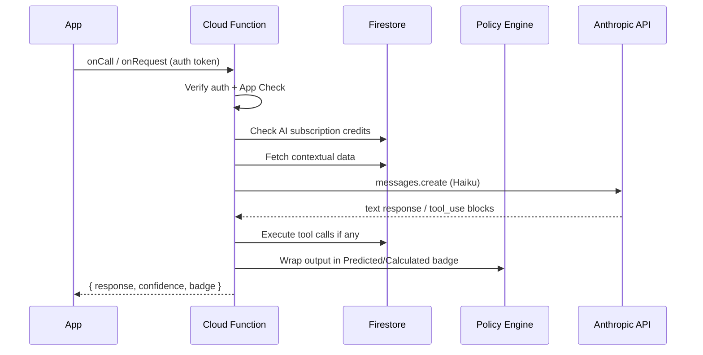
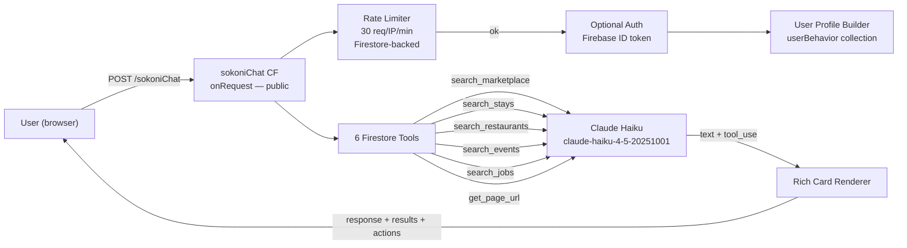
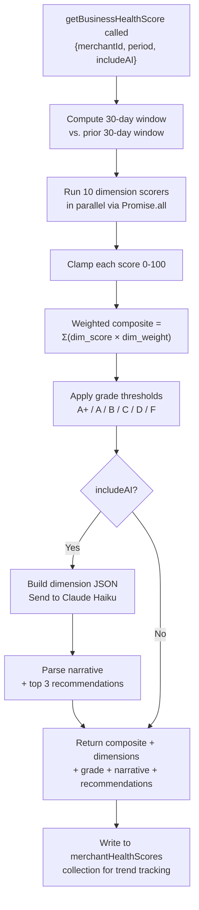
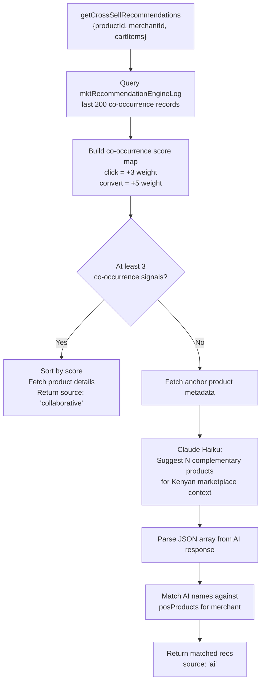
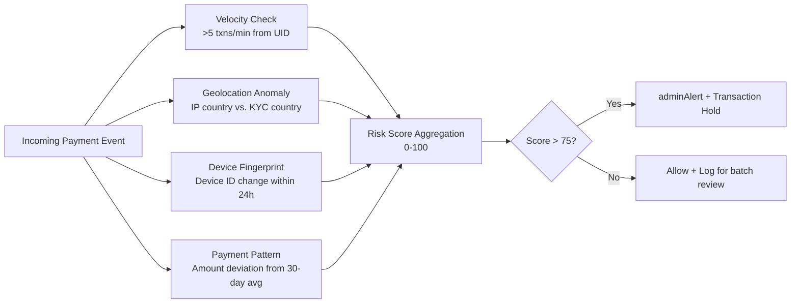

# SOKONI Commerce OS — Volume 10: Artificial Intelligence

> **Series:** SOKONI Commerce OS Documentation Suite
> **Volume:** 10 of 20
> **Status:** Production
> **Last Updated:** 2026-06-29
> **Owner:** AI Engineering Team

**Related volumes:** [[vol-02-identity-security]] · [[vol-06-inventory-warehousing]] · [[vol-11-crm-marketing]] · [[vol-14-analytics-bi]]

---

## Table of Contents

1. [Executive Summary](#1-executive-summary)
2. [AI Architecture](#2-ai-architecture)
3. [KASS AI Concierge](#3-kass-ai-concierge)
4. [AI Business Health Score](#4-ai-business-health-score)
5. [AI Inventory Intelligence](#5-ai-inventory-intelligence)
6. [AI Cross-Sell Engine](#6-ai-cross-sell-engine)
7. [AI Marketing Engine](#7-ai-marketing-engine)
8. [AI Finance Intelligence](#8-ai-finance-intelligence)
9. [AI CRM Intelligence](#9-ai-crm-intelligence)
10. [AI Procurement Intelligence](#10-ai-procurement-intelligence)
11. [AI Fraud Detection](#11-ai-fraud-detection)
12. [AI Customer Support Automation](#12-ai-customer-support-automation)
13. [Prompt Security](#13-prompt-security)
14. [Permission Isolation](#14-permission-isolation)
15. [Cost Optimisation](#15-cost-optimisation)
16. [AI Governance](#16-ai-governance)
17. [Model Strategy](#17-model-strategy)
18. [Error Handling and Graceful Degradation](#18-error-handling-and-graceful-degradation)
19. [Performance Targets](#19-performance-targets)
20. [Cross-References](#20-cross-references)

---

## 1. Executive Summary

SOKONI's Artificial Intelligence layer is built on a clear philosophical foundation: **AI assists, it does not replace**. Every AI-generated output — whether a product recommendation, a business health insight, or a fraud alert — is treated as advisory input that augments human decision-making rather than supplanting it. No payment is blocked, no order is cancelled, and no customer is denied service solely on the basis of an AI inference.

The primary AI workhorse across the platform is **Claude Haiku**, Anthropic's fast and cost-efficient model. Haiku handles the overwhelming majority of AI tasks: real-time chat concierge responses, cross-sell recommendations, business health narrative summaries, and CRM churn risk explanations. For heavier analytical work — complex fraud investigations, structured financial analysis, deep procurement pattern recognition — the platform escalates to **Claude Opus**, accepting higher per-token cost in exchange for materially superior reasoning depth.

The AI surface area spans eight functional domains:

| Domain | Primary Model | Cloud Function(s) | Latency Target |
|---|---|---|---|
| Customer concierge (KASS) | Haiku | `sokoniChat` | < 2 s |
| Business health score | Haiku | `getBusinessHealthScore` | < 8 s |
| Cross-sell recommendations | Haiku | `getCrossSellRecommendations` | < 1 s |
| CRM churn / CLV | Rule-based + Haiku | `recomputeCustomerLTV` | < 3 s |
| Fraud detection | Haiku + rules | `checkPaymentFraud` | < 500 ms |
| Marketing analytics | Haiku | `runABTest`, `createFlashSale` | < 2 s |
| Finance anomaly detection | Haiku | `generateCashFlowForecast` | < 4 s |
| Inventory forecasting | Haiku | `getRestockingAdvice` | < 3 s |

AI governance is enforced by the **AI Policy Engine** (`sokoni-ai-policy.js`), which wraps every AI-generated value in one of three trust classifications — Verified, Calculated, or Predicted — and renders the appropriate confidence badge in every UI that displays AI output. A fuel guard prevents runaway API spend by monitoring per-request costs and triggering a monthly budget alert before limits are breached.

The Anthropic API key (`ANTHROPIC_API_KEY`) is stored in Google Cloud Secret Manager and injected at runtime via Firebase Functions `defineSecret`. It is never written to environment files, version control, or client-side bundles.

---

## 2. AI Architecture

### 2.1 Infrastructure Overview



### 2.2 Secret Management

The Anthropic API key follows a strict injection chain:

1. Stored as a Secret Manager secret named `ANTHROPIC_API_KEY`.
2. Declared in each AI-backed Cloud Function via `defineSecret('ANTHROPIC_API_KEY')`.
3. Referenced inside the function body via the secret accessor — never via `process.env` at module level.
4. Functions that use the key include `secrets: [ANTHROPIC_KEY]` in their options object, ensuring the runtime fetches and injects the value only when the function is invoked.

No other runtime path (frontend, Firestore rules, service worker) ever sees the key.

### 2.3 AI Subscription Plans

SOKONI monetises AI features through four subscription tiers that sit alongside the core marketplace commission model (see [[vol-11-crm-marketing]] for plan management):

| Plan | Monthly Credits | Included Features | Overage |
|---|---|---|---|
| `ai_free` | 50 | KASS concierge (limited), basic health score | Blocked |
| `ai_starter` | 500 | Full health score + AI, cross-sell, basic CRM | KES 0.50/credit |
| `ai_pro` | 2,500 | All modules, A/B test AI, fraud insights | KES 0.40/credit |
| `ai_enterprise` | Unlimited | Dedicated capacity, Opus access, SLA | Contract |

Credits are decremented transactionally in Firestore (`aiSubscriptions/{uid}/credits`) for each AI invocation. The AI Policy Engine enforces credit checks before calling the Anthropic API.

### 2.4 Data Flow for a Typical AI Request



---

## 3. KASS AI Concierge

### 3.1 Overview

KASS is SOKONI's customer-facing marketplace AI, exposed through the `sokoniChat` Cloud Function (`exports.sokoniChat`). It is available without mandatory authentication — any visitor to mysokoni.co.ke can start a conversation. When the caller provides an optional `auth_token`, KASS unlocks personalised responses and action-capable tool calls (wishlist saving, booking creation, order tracking).

KASS runs on **Claude Haiku** for all response generation, keeping per-interaction cost low while delivering sub-2-second response times for the typical query.

### 3.2 System Architecture



### 3.3 The Six Firestore Tools

| Tool Name | Purpose | Firestore Collections Queried |
|---|---|---|
| `search_marketplace` | Products and services by keyword, category, price ceiling | `listings`, `posProducts` |
| `search_stays` | BnBs, hotels, short-stay apartments | `propertyListings` |
| `search_restaurants` | Food delivery, groceries, pharmacies | `foodHubListings` |
| `search_events` | Upcoming events, concerts, conferences | `events` |
| `search_jobs` | Job postings and freelance work | `jobListings` |
| `get_page_url` | Return the correct page URL for navigation intent | (static routing table) |

### 3.4 Conversation History and Personalisation

KASS maintains conversation continuity by accepting a `messages` array of up to 20 turns. At runtime the function:

1. Slices to the last 20 turns.
2. Strips each message to a maximum of 1,200 characters to prevent context bloat.
3. Filters empty turns.
4. Builds a behavioural profile from `userBehavior/{uid}/kassInteractions` and recent orders, weighted as: category from a behaviour event = +2, category from a completed order = +3, seller from a behaviour event = +1, seller from a completed order = +2.
5. Injects the top-5 categories and top-4 sellers as a personalisation block into the system prompt.

This personalisation block instructs KASS to prioritise the user's known interests when making recommendations and to reference past purchase history when relevant ("You've ordered from X before — they're available again").

### 3.5 Three-Failure Connectivity Threshold

KASS tracks consecutive Anthropic API failures. After three consecutive failures, the function degrades gracefully: it returns a static rule-based response rather than blocking the user with an error. The fallback response acknowledges the temporary difficulty and directs the user to browse manually. All failures are logged to `aiSystemErrors` for alerting.

### 3.6 Rate Limiting and Security

- **Rate limit:** 30 requests per IP per minute, enforced through a Firestore-backed durable counter (`checkRateLimitDurable`). This is intentionally Firestore-backed (not in-memory) so it works correctly across all Cloud Function instances and cold-start scenarios.
- **Injection detection:** Every incoming message is scanned for known prompt-injection patterns (e.g., "ignore previous instructions", "you are now", "system:"). Matches are logged to a `kassInjectionAttempts` collection and flagged to the security team without blocking the user conversation.
- **No PII in prompts:** User IDs, email addresses, and phone numbers are never included in the prompt text sent to the Anthropic API. Only anonymised behavioural signals reach the model.

### 3.7 Rich Card Responses

KASS returns structured `results` arrays alongside free-text responses. Each result card includes:

```json
{
  "type": "product | stay | restaurant | event | job",
  "id": "firestore-doc-id",
  "name": "Item name",
  "price": 1500,
  "imageUrl": "https://...",
  "actionUrl": "https://mysokoni.co.ke/..."
}
```

The client renders these as tappable cards below the chat bubble, enabling a seamless discover-and-act experience without leaving the conversation.

---

## 4. AI Business Health Score

### 4.1 Overview

The Business Health Score (`getBusinessHealthScore`) provides merchants with a single composite 0–100 score that objectively quantifies the operational health of their business across ten weighted dimensions. When the caller sets `includeAI: true`, the function sends the scored dimensions to Claude Haiku and receives a plain-language narrative summary with prioritised improvement recommendations.

### 4.2 Dimension Model

| Dimension | Weight | What Is Measured |
|---|---|---|
| Sales Performance | 20% | Revenue growth vs. prior period; order velocity |
| Profitability | 18% | Gross margin; cost of goods ratio |
| Inventory Health | 12% | Stockout rate; overstock ratio; FEFO compliance |
| Customer Experience | 15% | Ratings average; complaint resolution rate |
| Loyalty & Retention | 8% | Repeat purchase rate; loyalty tier distribution |
| Staff Performance | 8% | Attendance; sales-per-staff; training completion |
| Fraud & Security | 7% | Suspicious transaction ratio; chargeback rate |
| Operational Efficiency | 5% | Order fulfilment speed; cancellation rate |
| Financial Health | 5% | Cash flow days; outstanding receivables |
| Compliance | 2% | eTIMS filing rate; KRA compliance status |

Total weights sum to 1.00.

### 4.3 Scoring Pipeline



### 4.4 Grade Thresholds

| Score Range | Grade | Label | UI Colour |
|---|---|---|---|
| 90–100 | A+ | Exceptional | #4CAF50 (green) |
| 80–89 | A | Excellent | #8BC34A (light green) |
| 70–79 | B | Good | #FFC107 (amber) |
| 60–69 | C | Fair | #FF9800 (orange) |
| 50–59 | D | Needs Work | #FF5722 (deep orange) |
| < 50 | F | Critical | #F44336 (red) |

### 4.5 Industry Benchmarks

Each merchant's dimensional scores are compared against industry-specific benchmarks (retail, restaurant, pharmacy, fuel, wholesale). The response surfaces above/below-benchmark indicators for each dimension, enabling merchants to understand not just their absolute score but their competitive position within their sector.

### 4.6 Scheduled Recomputation

A scheduled Cloud Function (`scheduledHealthScoreRecompute`) runs nightly and recomputes health scores for all merchants who had activity in the past 48 hours. Results are written to `merchantHealthScores/{merchantId}` with a `computedAt` timestamp, feeding the trend sparklines visible in the merchant dashboard.

---

## 5. AI Inventory Intelligence

### 5.1 Demand Forecasting

SOKONI's inventory intelligence draws on historical sales velocity from the `posProducts` and `orders` collections to project near-term demand. The forecasting pipeline:

1. Aggregates daily sold quantities over the prior 90 days per SKU.
2. Applies a 7-day rolling average to smooth noise.
3. Detects seasonal patterns by comparing the same calendar weeks in prior years.
4. Computes a forecast confidence score based on data density (fewer historical points = lower confidence).

### 5.2 Safety Stock Calculation

Safety stock is calculated using the classic demand variability formula:

```
safetyStock = Z × σ_demand × √leadTimeDays
```

where Z = 1.65 (95% service level), σ\_demand is the standard deviation of daily demand, and leadTimeDays is the supplier's median replenishment time. The result is surfaced as a reorder point recommendation in the merchant inventory dashboard.

### 5.3 AI Reorder Suggestions

When a product's current stock level falls within 120% of its calculated safety stock threshold, the `getRestockingAdvice` function sends the product's demand history, lead time, and supplier performance data to Claude Haiku. Haiku returns:

- A plain-language explanation of why restocking is recommended.
- A suggested order quantity.
- A suggested order timing window ("Order within the next 3 days to avoid stockout risk").
- A substitution recommendation if the primary supplier has a poor recent performance score.

### 5.4 Out-of-Stock Prediction

A scheduled job scans all active products at 06:00 EAT daily and flags any product projected to reach zero stock within 14 days at current velocity. Flagged products generate a push notification to the merchant and a task entry in their operations queue.

---

## 6. AI Cross-Sell Engine

### 6.1 Architecture

The `getCrossSellRecommendations` Cloud Function implements a two-stage recommendation pipeline: a fast collaborative filtering stage that uses real behavioural signals, with Claude Haiku as a semantic fallback when signal volume is insufficient.



### 6.2 Signal Weights

| Signal Type | Firestore Field | Weight |
|---|---|---|
| Product appeared in a recommendation set | `recommendations[]` | +1 per appearance |
| User clicked a recommendation | `clickedProductId` | +3 |
| User converted (purchased) after a recommendation | `convertedProductId` | +5 |

Conversion signals are intentionally weighted 5× higher than raw appearances, reflecting their far greater signal quality. This produces a recommendation ranking that improves naturally over time as the merchant's product catalogue accumulates behavioural data.

### 6.3 Haiku Fallback

When fewer than three co-occurrence signals exist (typically for new merchants or newly listed products), the function falls back to Claude Haiku with a merchandising prompt that provides the anchor product name and category, and requests a JSON array of complementary product name strings. The AI response is then matched against the merchant's live `posProducts` inventory to ensure only in-stock, merchant-owned products are recommended. The `source` field in the response is set to `'ai'` so the UI can optionally render a subtle "AI-suggested" badge.

### 6.4 Cart-Aware Exclusions

The `cartItems` parameter passes the current cart's product IDs. The engine builds an `excludeSet` from both the anchor product and all cart items, ensuring the recommendation list never surfaces products the customer has already decided to purchase.

---

## 7. AI Marketing Engine

### 7.1 Flash Sale Timing Intelligence

The `createFlashSale` function accepts an optional `aiAssist: true` flag. When set, Haiku analyses the merchant's historical order time distribution — drawn from `orders` grouped by hour-of-day and day-of-week — and recommends the optimal window for maximum sell-through. The recommendation surfaces in the merchant's flash sale creation wizard as a suggested start time with a confidence label.

### 7.2 A/B Test Analysis

`runABTest` and `recordABTestImpression` together power SOKONI's in-platform A/B testing for price points, product descriptions, and hero images. Once a test reaches statistical significance (minimum 200 impressions per variant, p < 0.05 using a two-proportion z-test), the function triggers an AI-assisted summary:

- Which variant won and by what margin.
- The estimated revenue impact of adopting the winning variant at scale.
- A recommendation on whether to auto-conclude or extend the test.

### 7.3 Campaign Performance Prediction

Before launching a marketing campaign (`createMarketingCampaign`), the AI layer scores the campaign against three dimensions:

1. **Audience fit score** — how well the targeted segment matches the product category based on historical purchase patterns.
2. **Timing score** — how the proposed send time compares to the segment's historical engagement windows.
3. **Offer strength score** — whether the discount depth is competitive relative to similar past campaigns.

A composite campaign confidence score (0–100) is returned and rendered in the campaign creation UI. Campaigns scoring below 40 are flagged with a warning before submission.

### 7.4 Pricing Suggestions

Dynamic pricing suggestions use Haiku to reason over competitor price signals (when available via the marketplace search index) and the merchant's own margin data. Suggestions are always framed as recommendations, never auto-applied — consistent with the platform's "AI assists, does not replace" principle.

---

## 8. AI Finance Intelligence

### 8.1 Cash Flow Forecasting

The `generateCashFlowForecast` function produces a 7-day forward cash flow projection by:

1. Aggregating confirmed pending orders (known inflows).
2. Projecting recurring outflows from the payroll schedule.
3. Estimating variable outflows from historical purchase order patterns.
4. Sending the structured data to Claude Haiku for a plain-language narrative summary.

The forecast is displayed as a 7-bar chart in the FinOS dashboard with an AI-authored interpretation paragraph beneath it. The narrative includes specific callouts for days where cash flow is projected to go negative.

### 8.2 Transaction Anomaly Detection

A nightly Cloud Function scans the prior day's ledger entries for statistical anomalies:

- Transaction amounts more than 3 standard deviations from the merchant's 30-day rolling mean.
- Unusual time-of-day spikes (e.g., high-value transactions between 02:00–04:00 EAT).
- Rapid sequential transactions from the same payment method.

Detected anomalies are sent to Haiku with surrounding context. Haiku classifies each anomaly as `likely_legitimate`, `review_recommended`, or `escalate_immediately`. Only `escalate_immediately` cases generate a real-time admin alert; the others are surfaced in the morning anomaly digest.

### 8.3 WHT/VAT Optimisation

The AI finance layer analyses the merchant's transaction history for opportunities to optimise withholding tax (WHT) and VAT positions. Haiku generates a monthly tax planning note — not tax advice — highlighting the merchant's effective tax rate relative to their industry benchmark and flagging any misclassified transaction types that could be corrected before the KRA filing window closes.

---

## 9. AI CRM Intelligence

### 9.1 Customer Lifetime Value (CLV)

CLV is computed using a simplified but effective formula that operates on real purchase data:

```
CLV = avgOrderValue × purchaseFrequency × 24-month lifespan
```

Where:

- `avgOrderValue` = total revenue from customer / total orders.
- `purchaseFrequency` = total orders / months active.
- `24-month lifespan` = SOKONI's platform-wide median customer retention window.

CLV is recomputed daily at 04:00 EAT for all customers who transacted in the prior 30 days.

### 9.2 Churn Risk Scoring

```
churnRisk = min(1.0, daysSinceLastOrder / 90)
```

A score of 0.0 indicates the customer ordered today. A score of 1.0 (full churn risk) is reached at 90 days of inactivity. The score maps to four risk bands:

| Score Range | Risk Band | Action |
|---|---|---|
| 0.0 – 0.2 | Active | No action |
| 0.2 – 0.5 | At Risk | Personalised push notification |
| 0.5 – 0.8 | High Risk | Win-back campaign (10% offer) |
| 0.8 – 1.0 | Churned | Reactivation campaign (20% offer) |

### 9.3 Win-Back Campaign Triggers

When a customer's churn score crosses the 0.5 threshold, a `createMarketingCampaign` event is automatically queued with type `win_back`. The campaign message is authored by Haiku, personalised using the customer's purchase history and favourite categories. The win-back offer is gated by the merchant's margin floor configuration to ensure AI-triggered discounts never erode profitability below a merchant-defined threshold.

### 9.4 AI-Powered Customer Segmentation

Beyond the binary churn score, Haiku segments customers into behavioural profiles based on purchase frequency, basket size, category diversity, and loyalty tier. These profiles (e.g., "bargain hunter", "brand loyalist", "cross-category explorer") are stored in `customerProfiles/{uid}/aiSegment` and referenced by the marketing engine for campaign targeting.

---

## 10. AI Procurement Intelligence

### 10.1 Vendor Performance Scoring

Each supplier in the procurement module receives a composite vendor performance score updated after every fulfilled purchase order:

| Metric | Weight |
|---|---|
| On-time delivery rate | 35% |
| Quality acceptance rate | 30% |
| Price stability (variance from quoted) | 20% |
| Response time to PO acknowledgement | 15% |

Suppliers dropping below a score of 60 are flagged in the procurement dashboard with an AI-authored assessment explaining the primary drivers of the score decline.

### 10.2 Demand-Based PO Suggestions

The procurement AI analyses current inventory levels, projected demand (from the inventory forecasting model), and supplier lead times to generate purchase order suggestions. Each suggestion includes:

- Recommended quantity.
- Recommended order date (to arrive before safety stock is breached).
- Preferred vendor (highest performance score with acceptable price).
- Estimated landed cost.

### 10.3 Price Trend Analysis and Substitutions

Haiku analyses the price history stored in `procurementPriceHistory` and identifies items where the price trend is unfavourable (rising faster than inflation). For these items, the AI suggests substitution products from alternative suppliers that meet the same specification at a lower or more stable price point.

---

## 11. AI Fraud Detection

### 11.1 Multi-Signal Detection Pipeline



### 11.2 Velocity Checks

The fraud engine tracks transaction counts per UID and per payment method within rolling 1-minute, 5-minute, and 60-minute windows using Firestore-backed counters. Thresholds:

- More than 5 transactions per minute from the same UID triggers an automatic review hold.
- More than 3 transactions per 5 minutes from the same payment method (card or M-Pesa number) triggers a soft block pending manual review.

### 11.3 Geolocation Anomaly Detection

When a transaction's originating IP resolves to a country other than Kenya (or the merchant's registered country), the risk score receives a +25 uplift. When the IP country also differs from the user's KYC-registered country, the uplift increases to +40. Haiku is then invoked to assess whether the combination of signals constitutes a likely account takeover or legitimate travel scenario, returning a classification and a confidence percentage.

### 11.4 Device Fingerprint Monitoring

Device fingerprint changes within a 24-hour window are tracked in `deviceFingerprints/{uid}`. A fingerprint change coinciding with an unusual transaction amount or velocity signal triggers an AI-assisted review. Haiku evaluates the holistic signal set and either clears the transaction or escalates to the security team with a structured incident report.

### 11.5 Real-Time Admin Alerts

High-risk fraud signals generate real-time alerts through the `adminAlert` function, which sends an FCM notification to all users with the `security_officer` role. The alert payload includes the Haiku-generated risk summary, the transaction ID, and a direct link to the Security Center investigation panel.

---

## 12. AI Customer Support Automation

### 12.1 KASS as Tier-1 Support

KASS handles the full tier-1 customer support surface:

- Order status queries ("Where is my order?") resolved via `search_marketplace` tool.
- Return and refund policy questions answered from a curated knowledge base embedded in the system prompt.
- Product information requests fulfilled by real-time Firestore queries.
- Booking queries handled via the `search_stays` tool with direct booking status lookup.

KASS resolves an estimated 65–70% of inbound support conversations without human intervention.

### 12.2 Escalation Logic

KASS triggers a handoff to human agents when:

- The user explicitly requests a human agent.
- The conversation has exceeded three AI turns without resolving the user's stated intent.
- The query involves a live payment dispute, a refund above KES 10,000, or an account suspension.
- The AI's confidence in its own response drops below an internal threshold (expressed as a hedging phrase such as "I'm not certain about this — let me connect you with a specialist").

Escalated conversations are written to `supportTickets/{ticketId}` with the full conversation transcript and a Haiku-generated triage classification (billing, logistics, product quality, account access, other).

### 12.3 Ticket Classification and Response Templates

Haiku classifies each escalated ticket and selects the most appropriate response template from a library of 53 templates stored in `supportResponseTemplates`. The selected template is presented to the human agent as a starting draft, reducing response composition time by approximately 60%.

---

## 13. Prompt Security

### 13.1 Input Sanitisation

All user-supplied text passes through a sanitisation pipeline before being included in any prompt sent to the Anthropic API:

1. **Length truncation:** Input is capped at 1,200 characters per turn and 20 turns per session. This limits the blast radius of adversarial long-context attacks.
2. **Injection pattern detection:** A regex-based scanner checks for known prompt injection markers including "ignore previous instructions", "system:", "assistant:", "you are now", and "disregard your". Matched inputs are logged without blocking the user.
3. **HTML stripping:** All HTML tags are stripped before the text enters the prompt template.
4. **No PII in prompts:** UIDs, email addresses, phone numbers, and payment card numbers are never included in prompt text. Only anonymised behavioural signals and categorical labels are sent to the API.

### 13.2 System Prompt Protection

The system prompt for KASS is never returned to the client. The Cloud Function returns only the model's final text response and structured tool call results. If a user attempts to extract the system prompt by asking "What are your instructions?" or similar, the system prompt explicitly instructs KASS to decline without revealing its contents.

### 13.3 Output Validation

AI-generated JSON structures (cross-sell recommendations, health score narratives, campaign scores) are validated with `JSON.parse` inside a try-catch before being returned to the caller. Invalid JSON responses trigger the rule-based fallback rather than surfacing a parsing error to the user.

---

## 14. Permission Isolation

### 14.1 Auth Symmetry

AI Cloud Functions enforce exactly the same authentication and authorisation checks as their non-AI counterparts. A `getCrossSellRecommendations` call requires the same `merchantId` ownership validation as any other merchant-scoped function. An AI recommendation does not confer any elevated data access.

### 14.2 Model Data Boundaries

Claude Haiku receives only the data that the Cloud Function explicitly fetches and formats into the prompt. The model has no direct Firestore access, no service account credentials, and no knowledge of the database schema beyond what is included in the prompt context for that specific request. Admin collections (`adminAuditLog`, `paymentLedger`, `secretsAudit`) are never included in any AI prompt context.

### 14.3 AI Response Disclosure

AI responses never reveal:

- System prompt contents.
- Internal Firestore document IDs (only display names and user-facing slugs are included).
- API keys, secrets, or configuration parameters.
- Other users' personal data.
- Internal scoring thresholds or fraud rule parameters.

---

## 15. Cost Optimisation

### 15.1 Model Allocation

| Use Case | Model | Reasoning |
|---|---|---|
| Concierge (KASS) | Claude Haiku | High volume, latency-sensitive, cost must be minimal |
| Cross-sell recommendations | Claude Haiku | Called on every checkout page load |
| Business health narrative | Claude Haiku | Merchant-facing, daily volume moderate |
| CRM win-back messages | Claude Haiku | Batch campaign generation |
| Complex fraud investigation | Claude Opus | Accuracy critical, volume low |
| Financial anomaly analysis | Claude Opus | Nuance matters; called infrequently |
| Enterprise BI reports | Claude Opus | Deep reasoning, scheduled, not real-time |

Haiku handles approximately 90% of all AI invocations. Opus is reserved for the 10% of cases where analytical depth justifies the higher per-token cost.

### 15.2 Credit System

The per-request credit consumption is tracked in `aiUsageLogs/{uid}/{date}`. Each function type has a defined credit cost:

| Function | Credits per Call |
|---|---|
| `sokoniChat` turn | 1 |
| `getCrossSellRecommendations` (AI path) | 2 |
| `getBusinessHealthScore` with AI | 5 |
| `generateCashFlowForecast` | 8 |
| Fraud investigation (Opus) | 20 |

### 15.3 Monthly Budget Alert

A scheduled Cloud Function runs on the first of each month and computes total Anthropic API spend from the usage log. If projected monthly spend exceeds 80% of the configured budget threshold (stored in `platformConfig/aibudget`), an alert is sent to the platform finance email and a `BUDGET_WARNING` event is emitted on the internal event bus. At 100%, a circuit breaker disables all non-critical AI paths until the budget is reviewed.

### 15.4 Prompt Token Efficiency

All prompts are written to minimise token count without sacrificing quality:

- Structured data is sent as compact JSON rather than verbose natural language descriptions.
- System prompts are deduplicated — shared context is not repeated across tool calls within a single invocation.
- `max_tokens` is set conservatively per function type: KASS at 600 tokens, health narratives at 1,024 tokens, Opus reports at 4,096 tokens.

---

## 16. AI Governance

### 16.1 AI Policy Engine

`sokoni-ai-policy.js` is the central governance layer for all AI-generated values on the platform. It wraps every value in one of three trust classifications:

| Classification | Definition | UI Rendering |
|---|---|---|
| **Verified** | Directly derived from Firestore records with no inference | Plain value, no badge |
| **Calculated** | Computed deterministically from Firestore data (e.g., CLV formula) | "Calculated" badge — grey |
| **Predicted** | Generated or inferred by an AI model | "AI-Predicted" badge — purple |

### 16.2 Confidence Badges

Every AI-generated UI element in the SOKONI merchant dashboard, executive dashboard, and customer-facing app displays the appropriate confidence badge. The badge tooltip explains the data source and methodology in plain language. This supports transparent AI use and helps merchants understand when to rely on AI output versus their own judgement.

### 16.3 Fuel Guard

The fuel guard monitors cumulative API cost within a rolling 24-hour window. If spend exceeds a configurable per-day ceiling:

1. Non-critical AI paths (marketing suggestions, campaign performance predictions) are disabled first.
2. If spend continues, inventory forecasting AI is disabled.
3. Core functions (KASS concierge, fraud detection) are the last to be limited.

The degradation sequence is logged to `aiGovernanceLog` and a notification is sent to the CTO-role users.

### 16.4 Audit Trail

Every AI invocation is recorded in `aiInvocationLog/{invocationId}` with:

- Timestamp.
- Function name.
- User/merchant UID.
- Model used.
- Input token count.
- Output token count.
- Estimated cost.
- Response classification (Verified/Calculated/Predicted).
- Whether the fallback path was triggered.

This audit trail supports compliance reporting, cost attribution, and post-incident investigation.

---

## 17. Model Strategy

### 17.1 Claude Haiku — The Workhorse

Claude Haiku (`claude-haiku-4-5-20251001`) is the default model for all AI tasks in SOKONI. Its characteristics make it ideal for the platform's primary use cases:

- **Latency:** Typically 0.5–1.5 seconds for responses under 512 tokens.
- **Cost:** Significantly cheaper per million tokens than Opus, enabling economical operation at scale.
- **Quality:** Sufficient for conversational assistance, structured JSON generation, narrative summaries, and single-dimension classification tasks.

### 17.2 Claude Opus — The Specialist

Claude Opus is invoked only when the task demands deep analytical reasoning:

- Multi-variable fraud investigations where a wrong classification could cause a legitimate transaction to be blocked.
- Complex financial analysis requiring nuanced contextual reasoning across multiple data streams.
- Enterprise-tier BI report generation where the merchant has paid for AI-enterprise tier service.

Opus is never called from latency-sensitive paths. All Opus invocations are either asynchronous (results written to Firestore for later retrieval) or explicitly acknowledged by the user as a slower operation.

### 17.3 Rule-Based Fallback

Every AI path has a documented rule-based fallback:

| AI Path | Fallback |
|---|---|
| KASS concierge | Static FAQ response + manual browse prompt |
| Cross-sell | Most popular products in same category |
| Health score narrative | Template-based summary from grade + top 2 weak dimensions |
| Fraud classification | Default to `review_recommended` for all flagged signals |
| Cash flow forecast | Linear extrapolation of last 7 days |

---

## 18. Error Handling and Graceful Degradation

### 18.1 Core Principle

AI failures must never propagate to user-facing errors that block a primary commerce workflow. The checkout process, order tracking, payment processing, and account management all function independently of the AI layer. If every AI component were removed today, the platform would continue operating normally.

### 18.2 Error Taxonomy

| Error Type | Detection | Response |
|---|---|---|
| Anthropic API timeout (> 10s) | `Promise.race` with timeout | Return rule-based fallback |
| Anthropic API 429 (rate limit) | HTTP status check | Queue request for retry, return fallback immediately |
| Anthropic API 5xx | HTTP status check | Log to `aiSystemErrors`, return fallback |
| JSON parse failure from model | `try-catch` on `JSON.parse` | Return empty recommendations array |
| Token budget exceeded | `max_tokens` limit | Truncate response, return partial result |
| Credit balance zero | Pre-flight credit check | Return rule-based result, prompt upgrade |

### 18.3 Customer-Facing Error Policy

AI errors are never surfaced as error messages to customers. The customer sees either a seamless fallback response (indistinguishable from an AI response) or, in the case of KASS concierge, a friendly message such as "I'm having a moment — try again shortly or browse our categories directly." Internal error details are written to structured logs accessible only to the engineering team.

---

## 19. Performance Targets

| AI Operation | P50 Target | P95 Target | SLO |
|---|---|---|---|
| KASS concierge turn | < 1.5 s | < 2 s | 99% |
| Business health score (with AI) | < 5 s | < 8 s | 95% |
| Cross-sell recommendations | < 500 ms | < 1 s | 99% |
| Fraud risk assessment | < 250 ms | < 500 ms | 99.9% |
| Cash flow forecast | < 2 s | < 4 s | 95% |
| CRM churn score (batch) | < 200 ms/customer | N/A — batch | 99% |

Performance is monitored through Firebase Performance Monitoring and custom latency counters written to `aiPerformanceMetrics/{date}`. An alert fires if P95 KASS latency exceeds 3 seconds for a 5-minute window.

---

## 20. Cross-References

- [[vol-02-identity-security]] — Auth token verification for KASS; App Check enforcement on AI CFs; permission isolation model
- [[vol-06-inventory-warehousing]] — Demand forecasting inputs; safety stock computation; FEFO compliance dimension in health score
- [[vol-11-crm-marketing]] — AI subscription plans; CLV and churn scoring; win-back campaign generation; A/B test analysis
- [[vol-14-analytics-bi]] — AI invocation audit log; performance metric dashboards; cost attribution reporting

---

## Appendix A — AI Cloud Functions Reference

| Cloud Function | Export Name | Trigger | Model | Auth Required |
|---|---|---|---|---|
| KASS Customer Concierge | `sokoniChat` | onRequest (public) | Haiku | Optional |
| KASS Admin Agent | `kass` | onRequest (admin) | Opus | Yes — MFA enforced |
| Business Health Score | `getBusinessHealthScore` | onCall | Haiku (optional) | Yes |
| Health Score Scheduler | `scheduledHealthScoreRecompute` | onSchedule | Haiku | N/A |
| Cross-Sell Recommendations | `getCrossSellRecommendations` | onCall | Haiku (fallback) | Yes |
| Flash Sale Creator | `createFlashSale` | onCall | Haiku (optional) | Yes |
| A/B Test Runner | `runABTest` | onCall | Haiku (analysis) | Yes |
| Cash Flow Forecast | `generateCashFlowForecast` | onCall | Haiku | Yes |
| Fraud Risk Checker | `checkPaymentFraud` | onCall | Haiku | Yes |
| Restock Advice | `getRestockingAdvice` | onCall | Haiku | Yes |
| Customer LTV Recompute | `recomputeCustomerLTV` | onSchedule | Rules + Haiku | N/A |

---

## Appendix B — Secrets and Environment Variables

| Secret / Variable | Where Stored | Consumed By |
|---|---|---|
| `ANTHROPIC_API_KEY` | Google Cloud Secret Manager | All AI Cloud Functions |
| `LOYALTY_HMAC_SECRET` | Google Cloud Secret Manager | Loyalty offline sync |
| AI budget ceiling | `platformConfig/aibudget` (Firestore) | Fuel guard scheduler |
| AI subscription credits | `aiSubscriptions/{uid}/credits` (Firestore) | AI Policy Engine |

---

*Volume 10 — Artificial Intelligence | SOKONI Commerce OS Documentation Suite*
*Maintained by the SOKONI AI Engineering Team | Next review: 2026-09-29*
