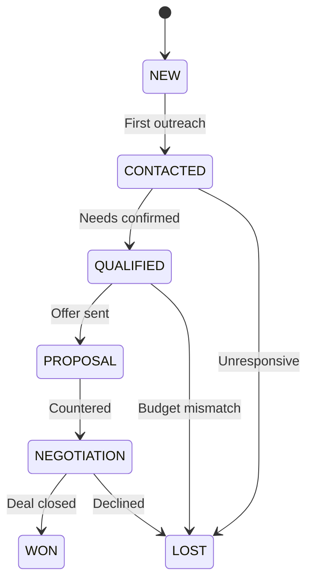
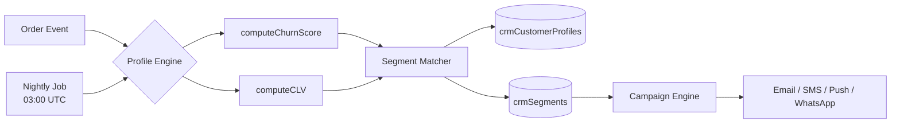
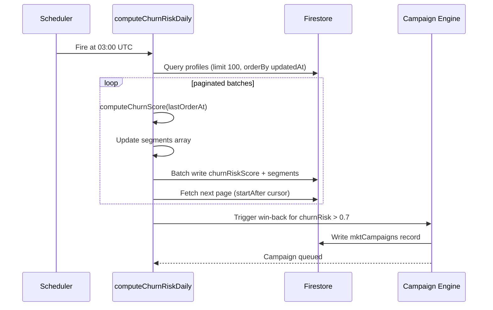
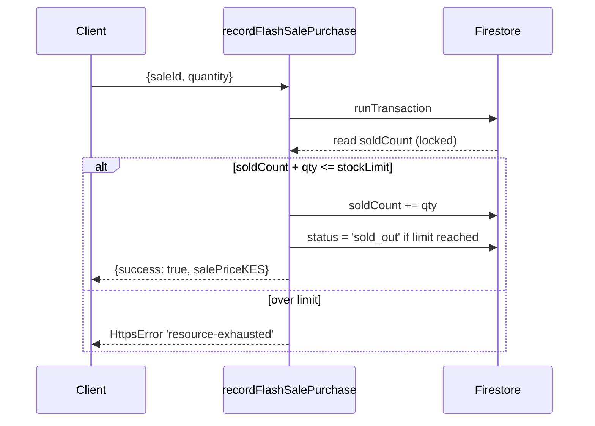
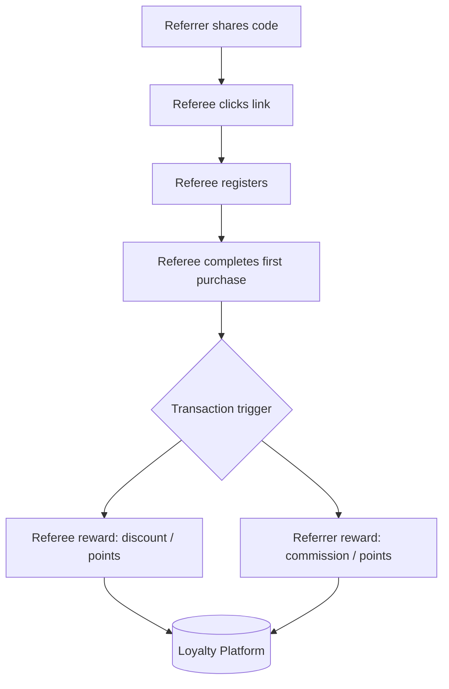
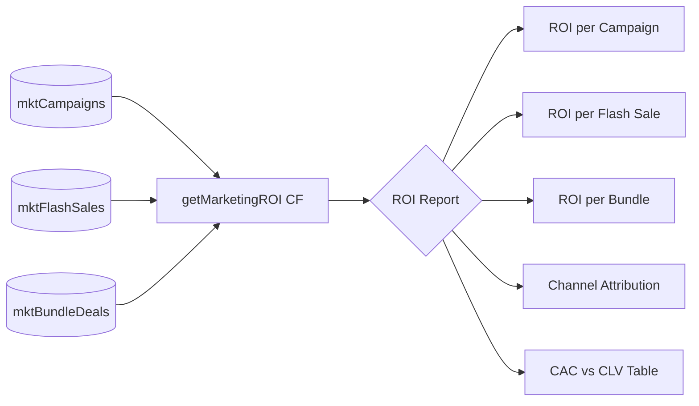
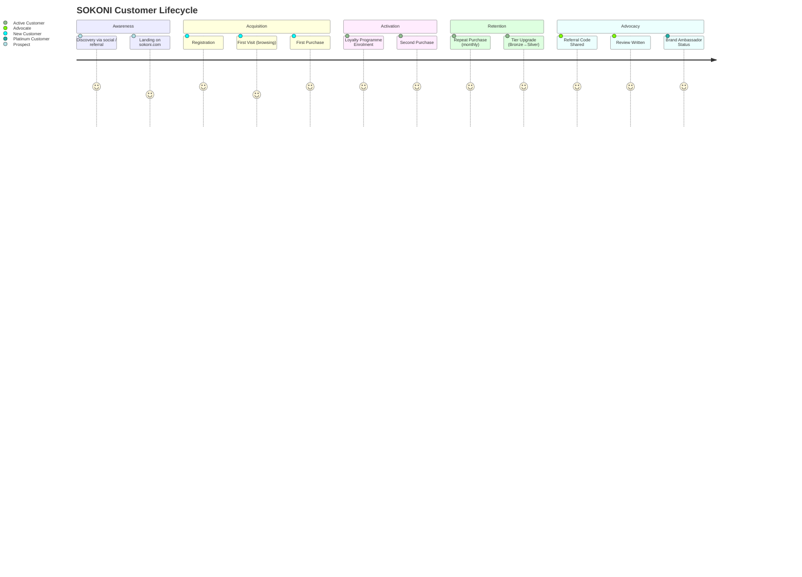
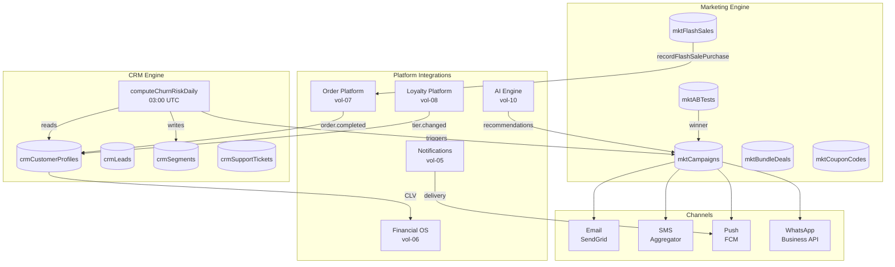

# SOKONI Commerce OS — Volume 11: CRM & Marketing Engine

**Suite:** Commerce OS Documentation  
**Volume:** 11 of 20  
**Status:** Production — v1.0  
**Last Updated:** 2026-06-29  
**Maintainer:** SOKONI Engineering  

---

## Related Volumes

[[vol-07-marketplace-commerce]] | [[vol-08-loyalty-platform]] | [[vol-10-artificial-intelligence]] | [[vol-14-analytics-bi]] | [[vol-06-financial-os]] | [[vol-05-notifications]]

---

## 1. Executive Summary

The SOKONI CRM & Marketing Engine is the intelligence layer that transforms raw transaction data into lasting customer relationships and measurable revenue growth. It operates across two Cloud Function modules — `crm.js` (CRM Engine v1.0) and `marketing-engine.js` (Marketing & Promotions Engine v1.0) — and exposes a combined surface of more than twenty Gen 2 Cloud Functions.

The system delivers four strategic capabilities:

**360-Degree Customer View.** Every buyer on the platform accumulates a continuously updated profile in `crmCustomerProfiles/{uid}`. The profile aggregates order history, average order value, purchase frequency, support history, active segments, churn risk score, computed Customer Lifetime Value (CLV), and loyalty tier sourced from [[vol-08-loyalty-platform]]. No manual data entry is required; the profile is built and maintained by event-driven Cloud Functions and a nightly scheduled job.

**Automated Retention.** A scheduled Cloud Function (`computeChurnRiskDaily`) runs at 03:00 UTC every day, processes all customer profiles in paginated batches of 100 documents, recalculates the `churnRiskScore` for each, and immediately fires a win-back campaign for any customer whose score crosses 0.7. This closes the retention loop without human intervention.

**Multi-Channel Marketing.** Campaigns are delivered across email (SendGrid, 53 templates), SMS (aggregator), WhatsApp Business API, and Firebase push notifications (Enterprise Notification Center, 5 priority levels, 20 categories). Flash sales, bundle deals, and coupon codes complement campaign messaging with direct pricing incentives. A/B tests are built into the campaign engine so every message variant has a statistically governed path to a winner.

**AI-Powered Segmentation.** Claude Haiku (accessed via `ANTHROPIC_API_KEY` Secret Manager secret) backs the cross-sell and upsell recommendation functions when co-occurrence data is insufficient. Segments — high-value, at-risk, new, dormant, and tier-based — are computed automatically and stored in the `crmSegments` collection, where they drive audience targeting for every campaign type.

---

## 2. Firestore Collections

| Collection | Purpose |
|---|---|
| `crmCustomerProfiles/{uid}` | 360-degree customer record |
| `crmLeads/{leadId}` | B2B and high-value prospect pipeline |
| `crmLeadActivities/{activityId}` | Sub-collection: calls, emails, demos per lead |
| `crmSegments/{segmentId}` | Named audience segments with membership lists |
| `crmSupportTickets/{ticketId}` | Customer service case management |
| `mktCampaigns/{campaignId}` | Email/SMS/push/WhatsApp campaigns |
| `mktFlashSales/{saleId}` | Time-boxed flash sale definitions |
| `mktBundleDeals/{bundleId}` | Product bundle configurations |
| `mktCouponCodes/{couponId}` | Coupon validation records |
| `mktABTests/{testId}` | A/B test configurations and results |
| `mktDynamicPricing/{ruleId}` | Rule-based dynamic pricing |
| `mktRecommendationEngineLog/{logId}` | Cross-sell and upsell audit trail |

---

## 3. Customer Profile (CRM)

### 3.1 Document Shape — `crmCustomerProfiles/{uid}`

```
{
  uid:                  string,            // Firebase Auth UID (document ID)
  displayName:          string,
  email:                string,            // encrypted at rest via Firestore CMEK
  phone:                string | null,
  createdAt:            Timestamp,
  lastOrderAt:          Timestamp | null,
  orderCount:           number,
  totalSpendKES:        number,
  avgOrderValueKES:     number,
  purchaseFrequency:    number,            // orders per month (trailing 6 months)
  clv:                  number,            // avgOrderValue × purchaseFrequency × 24
  churnRiskScore:       number,            // 0.0 – 1.0
  loyaltyTier:          'Bronze' | 'Silver' | 'Gold' | 'Platinum',
  segments:             string[],          // e.g. ['high_value', 'at_risk']
  marketingConsent:     boolean,
  marketingConsentAt:   Timestamp | null,
  gdprExportRequestAt:  Timestamp | null,
  notes:                string | null,
  updatedAt:            Timestamp
}
```

### 3.2 CLV Formula

```
CLV = avgOrderValueKES × purchaseFrequency × CLV_LIFESPAN_MO
```

Where `CLV_LIFESPAN_MO = 24` (months). `purchaseFrequency` is the count of orders placed in the trailing 6-month window divided by 6, giving a monthly rate. CLV is recomputed every time an order completes and on every nightly churn run.

### 3.3 Churn Risk Score

```
churnRiskScore = min(1.0, daysSinceLastOrder / CHURN_WINDOW_DAYS)
```

Where `CHURN_WINDOW_DAYS = 90`. A score of `0.0` means the customer purchased today. A score of `1.0` means the customer has not purchased in 90 or more days and is considered fully churned for campaign purposes. The nightly scheduler updates every profile; a score above `0.7` triggers the win-back campaign pipeline automatically.

### 3.4 Cloud Functions

| Function | Trigger | Description |
|---|---|---|
| `upsertCrmProfile` | `onCall` | Create or update a customer profile |
| `getCrmProfile` | `onCall` | Retrieve a single profile (merchant-scoped) |
| `computeChurnRiskDaily` | `onSchedule` 03:00 UTC | Paginated churn recalculation across all profiles |
| `exportCustomerDataGDPR` | `onCall` | Full GDPR data export for a UID |

---

## 4. Lead Management

The lead pipeline manages B2B prospects and high-value individual buyer acquisition through a structured sales workflow.

### 4.1 Pipeline Stages



The valid status values in code are: `new`, `contacted`, `qualified`, `converted`, `lost`.

### 4.2 Document Shape — `crmLeads/{leadId}`

```
{
  leadId:         string,
  merchantId:     string,         // owning merchant
  contactName:    string,
  contactEmail:   string,
  contactPhone:   string | null,
  company:        string | null,
  source:         LeadSource,     // walk_in | referral | social | event | online | cold_call
  status:         LeadStatus,     // new | contacted | qualified | converted | lost
  estimatedValue: number,         // KES
  projectedCLV:   number,         // estimatedValue × CLV_LIFESPAN_MO / 12
  notes:          string | null,
  assignedTo:     string | null,  // staff UID
  createdAt:      Timestamp,
  updatedAt:      Timestamp,
  wonAt:          Timestamp | null,
  lostReason:     string | null
}
```

### 4.3 Lead Activities Sub-Collection

Every interaction is logged under `crmLeads/{leadId}/crmLeadActivities/{activityId}`:

```
{
  activityId:  string,
  type:        'call' | 'email' | 'visit' | 'whatsapp' | 'demo',
  summary:     string,
  outcome:     string | null,
  performedBy: string,    // staff UID
  performedAt: Timestamp
}
```

### 4.4 Conversion Tracking

When a lead status transitions to `converted`, the system:
1. Writes `wonAt` timestamp and final `estimatedValue`.
2. Creates or links a `crmCustomerProfiles` document for the converted contact.
3. Records a conversion event in `mktRecommendationEngineLog` for attribution analysis.
4. Emits a platform event (`lead.converted`) that the Commission Engine can consume.

---

## 5. Customer Segmentation

Segments are computed automatically and stored as named lists in `crmSegments/{segmentId}`. Every profile's `segments` array is kept synchronised.

### 5.1 Segment Definitions

| Segment | Rule | Action |
|---|---|---|
| `high_value` | CLV > merchant CLV threshold (P75 by default) | Priority support queue; exclusive offers |
| `at_risk` | `churnRiskScore > 0.7` | Win-back campaign immediate |
| `new_customer` | Account age ≤ 30 days | Onboarding sequence; first-purchase coupon |
| `dormant` | No purchase in 90+ days AND `churnRiskScore = 1.0` | Re-engagement bundle offer |
| `bronze_tier` | Loyalty tier = Bronze | Bronze-tier promotions |
| `silver_tier` | Loyalty tier = Silver | Silver-tier promotions |
| `gold_tier` | Loyalty tier = Gold | Gold exclusive flash sales |
| `platinum_tier` | Loyalty tier = Platinum | Platinum concierge outreach |

Segments are evaluated during the nightly `computeChurnRiskDaily` run and on every order completion event.

### 5.2 Segment Architecture



---

## 6. Churn Prediction

The `computeChurnRiskDaily` scheduled function is the backbone of automated retention.

### 6.1 Execution Flow



### 6.2 Score Computation

```javascript
function computeChurnScore(lastOrderAt) {
  if (!lastOrderAt) return 1.0;
  const days = (Date.now() - lastOrderAt.toMillis()) / 86_400_000;
  return Math.min(1, days / CHURN_WINDOW_DAYS); // CHURN_WINDOW_DAYS = 90
}
```

### 6.3 Performance Target

Each profile update must complete in under 5 ms of CPU time. With 100-document batch sizes and Firestore bulk writes, the nightly job processes 10,000 profiles in under 10 minutes, well within the 9-hour maintenance window before the next business day begins.

---

## 7. Support Tickets

### 7.1 Document Shape — `crmSupportTickets/{ticketId}`

```
{
  ticketId:      string,
  uid:           string,          // customer UID
  merchantId:    string | null,   // merchant context if applicable
  subject:       string,
  description:   string,
  status:        'open' | 'in_progress' | 'resolved' | 'closed',
  priority:      'low' | 'medium' | 'high' | 'urgent',
  assignedTo:    string | null,
  slaDeadline:   Timestamp,
  resolvedAt:    Timestamp | null,
  resolutionMs:  number | null,   // wall-clock resolution time in milliseconds
  csatScore:     1 | 2 | 3 | 4 | 5 | null,
  csatAt:        Timestamp | null,
  createdAt:     Timestamp,
  updatedAt:     Timestamp
}
```

### 7.2 SLA Matrix

| Priority | First Response | Resolution Target |
|---|---|---|
| `low` | 24 hours | 72 hours |
| `medium` | 8 hours | 24 hours |
| `high` | 2 hours | 8 hours |
| `urgent` | 15 minutes | 2 hours |

When a ticket is created with priority `urgent`, the system immediately writes an alert document to the `adminAlerts` collection. The Platform Monitoring layer [[vol-15-monitoring-observability]] picks this up and fires a PagerDuty-style notification to the on-call queue.

### 7.3 CSAT Collection

After a ticket transitions to `resolved`, a time-delayed push notification is sent to the customer requesting a 1–5 CSAT rating. The rating is written back to the ticket document and rolled into the merchant's support quality score, which appears in the Admin OS.

---

## 8. Campaign Engine

### 8.1 Campaign Document — `mktCampaigns/{campaignId}`

```
{
  campaignId:    string,
  merchantId:    string,
  type:          'birthday' | 'win_back' | 'tier_upgrade' | 'spend_milestone',
  channel:       'email' | 'sms' | 'push' | 'whatsapp',
  audienceType:  'segment' | 'individual',
  audienceRef:   string,          // segmentId or uid
  subject:       string,
  body:          string,
  ctaUrl:        string | null,
  scheduledAt:   Timestamp | null,
  sentAt:        Timestamp | null,
  abTestId:      string | null,   // link to mktABTests if running a split
  abArm:         'A' | 'B' | null,
  impressions:   number,
  opens:         number,
  clicks:        number,
  conversions:   number,
  openRate:      number,          // opens / impressions
  ctr:           number,          // clicks / impressions
  conversionRate: number,
  status:        'draft' | 'scheduled' | 'sending' | 'sent' | 'failed',
  createdAt:     Timestamp,
  updatedAt:     Timestamp
}
```

### 8.2 Campaign Types

| Type | Trigger | Audience | Typical Channel |
|---|---|---|---|
| `birthday` | Customer birthday (scheduled daily check) | Individual | Email + push |
| `win_back` | `churnRiskScore > 0.7` (nightly job) | `at_risk` segment | Email + SMS |
| `tier_upgrade` | Points milestone reached | Individual | Push + email |
| `spend_milestone` | Total spend crosses KES threshold | Individual | Push + email |

---

## 9. Flash Sales

Flash sales are time-boxed promotional pricing events with a hard stock ceiling enforced atomically to prevent overselling.

### 9.1 Document Shape — `mktFlashSales/{saleId}`

```
{
  saleId:      string,
  merchantId:  string,
  productId:   string,
  originalPriceKES: number,
  salePriceKES:     number,
  discountPct:      number,
  stockLimit:       number,       // maximum units at sale price
  soldCount:        number,       // atomic; never written without runTransaction
  startsAt:         Timestamp,
  endsAt:           Timestamp,
  status:           'active' | 'ended' | 'sold_out',
  createdAt:        Timestamp,
  updatedAt:        Timestamp
}
```

### 9.2 Atomic Oversell Guard

`recordFlashSalePurchase` uses a Firestore `runTransaction` to ensure `soldCount` is always read and incremented in the same atomic operation:



### 9.3 Scheduled Cleanup

`concludeExpiredFlashSales` runs every 10 minutes. It queries `mktFlashSales` where `endsAt <= now` and `status == 'active'`, then bulk-writes `status = 'ended'`. This guarantees that a flash sale cannot remain active past its end time even if no purchase event triggers the transition.

---

## 10. Bundle Deals

### 10.1 Document Shape — `mktBundleDeals/{bundleId}`

```
{
  bundleId:          string,
  merchantId:        string,
  title:             string,
  description:       string,
  productIds:        string[],          // qualifying product IDs
  individualTotalKES: number,           // sum of individual prices
  bundlePriceKES:    number,            // discounted bundle price
  savingKES:         number,            // individualTotal - bundlePrice
  discountPct:       number,
  marginPct:         number | null,     // merchant-provided cost basis
  inventoryReserved: boolean,
  stockLimit:        number | null,
  soldCount:         number,
  startsAt:          Timestamp | null,
  endsAt:            Timestamp | null,
  status:            'active' | 'ended',
  createdAt:         Timestamp,
  updatedAt:         Timestamp
}
```

`createBundleDeal` automatically calculates `savingKES` and `discountPct` from the provided `individualTotalKES` and `bundlePriceKES`, and optionally calculates `marginPct` if a cost basis is supplied. This prevents merchant input errors and ensures the discount is always presented accurately to buyers.

---

## 11. Coupons & Referrals

### 11.1 Coupon Validation Flow

`applyCouponCode` is a **validate-only** function. It checks:

1. Coupon code exists in `mktCouponCodes`.
2. Coupon is not expired (`expiresAt > now`).
3. Coupon has not exceeded its `maxUses` limit (`usedCount < maxUses`).
4. Minimum order value is met.
5. Applicable product/category scope matches cart contents.

It returns the discount amount but does **not** increment `usedCount`. The increment happens at order confirmation time inside the order completion transaction. This prevents race conditions where a user validates a coupon but does not complete the purchase, yet still "consumes" a use.

### 11.2 Referral System



Referral codes are generated as part of the Universal Auth System [[vol-03-auth-security]] and stored against the referrer's profile. The first-purchase event in the Order Engine queries the buyer's `referredBy` field and triggers both reward writes atomically within the same order completion transaction.

---

## 12. Push Notifications

Push notification delivery uses the Enterprise Notification Center [[vol-05-notifications]], which provides:

- **5 priority levels:** CRITICAL, HIGH, NORMAL, LOW, BACKGROUND
- **20 semantic categories:** order_update, payment_confirmed, campaign, flash_sale, support_ticket, loyalty_reward, etc.
- **DND scheduling:** per-user quiet hours respected for non-critical categories
- **Delivery confirmation:** FCM delivery receipt written back to the notification record
- **Deep-link on tap:** every marketing notification carries a `deepLink` URL that routes the user to the relevant product, campaign, or profile screen

Campaign notifications set priority `NORMAL` or `LOW` so they always respect DND. Urgent support ticket alerts set priority `CRITICAL` and bypass DND.

---

## 13. Email System

The email layer uses SendGrid with the `SENDGRID_API_KEY` secret stored in Secret Manager.

### 13.1 Template Library (53 templates)

| Category | Examples |
|---|---|
| Transactional | Order confirmation, payment receipt, shipping update, delivery confirmation, return confirmation |
| Account | Welcome, email verification, password reset, account suspended |
| Support | Ticket created, ticket resolved, CSAT request |
| Marketing — Campaign | Promotional offer, newsletter, product spotlight |
| Marketing — Retention | Win-back offer, birthday offer, tier upgrade congratulations, anniversary reward |
| Marketing — Flash Sale | Flash sale alert, sell-out warning, flash sale ended |
| Loyalty | Points earned, tier upgrade, reward expiry warning |

### 13.2 Sender Addresses

All marketing and transactional email originates from one of 40 provisioned `@mysokoni.co.ke` addresses, routed by category (e.g., `orders@mysokoni.co.ke`, `support@mysokoni.co.ke`, `hello@mysokoni.co.ke`). SPF, DKIM, and DMARC records are configured at the DNS layer.

---

## 14. SMS & WhatsApp

### 14.1 SMS

SMS is dispatched via the platform's configured aggregator. Messages are delivered using pre-approved templates to comply with carrier requirements. Delivery receipts are written to the campaign's performance record. Opt-out is handled via a STOP keyword; the aggregator webhook updates the customer's `smsOptOut: true` flag in `crmCustomerProfiles`.

### 14.2 WhatsApp Business API

WhatsApp campaigns use the Meta WhatsApp Business API with pre-approved message templates. Interactive templates (buttons, quick replies) are supported for campaign CTAs. The WhatsApp gate for MiniShop [[vol-09-minishop]] is a separate feature; marketing campaigns go through the Business API pipeline, not the MiniShop gate.

### 14.3 Opt-Out Management

Every channel tracks opt-out state independently on the customer profile:

```
marketingEmailOptOut:    boolean
marketingSmsOptOut:      boolean
marketingPushOptOut:     boolean
marketingWhatsappOptOut: boolean
```

Transactional messages (order confirmations, receipts, support tickets) are always delivered regardless of marketing opt-out state.

---

## 15. A/B Testing

### 15.1 Document Shape — `mktABTests/{testId}`

```
{
  testId:          string,
  merchantId:      string,
  type:            'price' | 'description' | 'image' | 'promotion',
  productId:       string | null,
  campaignId:      string | null,
  armA:            object,      // variant A definition
  armB:            object,      // variant B definition
  impressionsA:    number,
  impressionsB:    number,
  conversionsA:    number,
  conversionsB:    number,
  convRateA:       number,
  convRateB:       number,
  winner:          'A' | 'B' | 'inconclusive' | null,
  status:          'active' | 'concluded',
  concludedAt:     Timestamp | null,
  createdAt:       Timestamp,
  updatedAt:       Timestamp
}
```

### 15.2 Auto-Conclude Logic

`recordABTestImpression` runs inside a `runTransaction`. After each impression:

1. If both arms have ≥ 100 impressions **and** one arm shows ≥ 20% relative lift in conversion rate → conclude, set `winner`.
2. If total impressions across both arms ≥ 1,000 and no 20% relative lift → conclude with `winner = 'inconclusive'`.
3. Otherwise the test remains `active`.

The winning arm is automatically applied to future campaigns referencing the same product or campaign template.

### 15.3 Statistical Note

The 20% relative lift threshold is a practical business heuristic, not a formal p-value test. For high-stakes pricing decisions, merchants are advised to export raw impression and conversion counts to [[vol-14-analytics-bi]] for a full significance test before rolling out the winner globally.

---

## 16. Marketing ROI

`getMarketingROI` aggregates performance across three promotion types:



For each item the function returns:

- `revenue`: total KES generated by the promotion
- `cost`: any direct cost (discount given, coupon value, send cost)
- `roi`: `(revenue - cost) / cost × 100` as a percentage
- `conversions`: number of purchases attributable to the promotion
- `cac`: `cost / conversions` — cost to acquire one converting customer

The CAC vs CLV comparison flags any campaign where `cac > clv * 0.5` as unprofitable at the cohort level, helping merchants immediately identify loss-making promotions.

---

## 17. Customer Journey



### 17.1 Intervention Points

| Stage | Signal | Automated Action |
|---|---|---|
| Post-registration | No purchase within 7 days | `new_customer` campaign: first-purchase coupon |
| Post-first-purchase | No second purchase within 21 days | Follow-up campaign: personalised recommendations |
| Churn risk rising | `churnRiskScore > 0.5` | Preemptive offer: bonus loyalty points |
| At-risk | `churnRiskScore > 0.7` | Win-back campaign: significant discount |
| Dormant | `churnRiskScore = 1.0`, 90+ days | Re-engagement bundle; SMS + email |
| Tier threshold | Points within 10% of next tier | Tier-up motivation push notification |

---

## 18. Retention Engine

The retention engine operates as a rules-based automation layer over the campaign engine.

### 18.1 Automated Sequences

**Win-Back Campaign**  
Triggered by `computeChurnRiskDaily` when `churnRiskScore > 0.7`. Sends a personalised email + push notification with a time-limited discount offer (default: 15% off next purchase, valid 7 days). If the customer purchases within the window, the churn score resets on the next nightly run.

**Birthday Offer**  
A daily scheduled function queries profiles where `dateOfBirth.month == currentMonth && dateOfBirth.day == currentDay`. Sends a birthday greeting with a surprise reward — typically bonus loyalty points or a flat KES discount valid for 72 hours.

**Tier-Up Motivation**  
When the Loyalty Engine [[vol-08-loyalty-platform]] detects a customer within 10% of the next tier threshold, it emits a `loyalty.tier_approaching` event. The CRM engine receives this event and fires a personalised push notification showing the exact points needed and a featured product that would earn them.

**Anniversary Reward**  
On the anniversary of the customer's first purchase, an email is sent with a special loyalty point multiplier offer valid for 24 hours.

**Post-Purchase Follow-Up**  
72 hours after order delivery is confirmed, the customer receives a review request and a cross-sell recommendation powered by `getCrossSellRecommendations`.

---

## 19. Privacy & Compliance

### 19.1 GDPR & Kenya Data Protection Act

The platform operates under both the EU General Data Protection Regulation (for European users) and the Kenya Data Protection Act 2019.

**Marketing Consent**  
`marketingConsent` is recorded as a boolean with a mandatory `marketingConsentAt` timestamp. Consent is collected at registration and can be updated at any time from the customer's account settings. The consent record is immutable in the audit log — only the current value in `crmCustomerProfiles` changes.

**Right to Erasure**  
The `exportCustomerDataGDPR` Cloud Function assembles all personal data held for a UID across: `crmCustomerProfiles`, `orders`, `crmSupportTickets`, `crmLeads` (if the customer was also a lead contact), loyalty records, and wallet transactions. The export is returned as a structured JSON payload. A separate erasure function anonymises PII fields (name, email, phone replaced with hashed identifiers) while preserving aggregate financial records required for tax compliance under Kenyan law.

**Opt-Out Architecture**  
Marketing opt-out is channel-specific. Opting out of marketing email does not affect transactional email. The system enforces this separation at the send layer — campaign functions check `marketingEmailOptOut` before dispatching; order functions do not.

**Data Minimisation**  
Customer profile queries use Firestore field projections to return only the fields required by the calling function. PII fields (email, phone) are excluded from segment computation queries that only need `lastOrderAt`, `totalSpendKES`, and `loyaltyTier`.

### 19.2 Secret Management

| Secret | Purpose |
|---|---|
| `ANTHROPIC_API_KEY` | Claude Haiku for cross-sell / upsell recommendations |
| `SENDGRID_API_KEY` | Email dispatch |

Both secrets are stored in Google Cloud Secret Manager and accessed via `defineSecret` in the Cloud Function manifest. They are never logged, never exposed to client responses, and never written to Firestore.

---

## 20. Performance Targets

| Operation | Target | Mechanism |
|---|---|---|
| Customer profile build | < 1 second | Single Firestore write with pre-computed fields |
| Churn score update per profile | < 5 ms CPU | Simple arithmetic; no sub-collection reads |
| Campaign send throughput | 10,000 / hour | SendGrid batch API; FCM batch notifications |
| A/B assignment | < 50 ms | Deterministic hash of UID mod 2; no DB read |
| Flash sale purchase | < 500 ms | Single runTransaction on one document |
| Segment evaluation | < 2 s | In-memory rule evaluation during profile write |
| ROI report generation | < 5 s | Parallel collection queries with Promise.all |

A/B arm assignment uses a deterministic hash so the same customer always sees the same arm across sessions without storing an assignment record. This eliminates a Firestore read on every page load while guaranteeing consistent experience.

---

## 21. Architecture Diagram



---

## 22. Security Architecture

All mutating Cloud Functions (`createBundleDeal`, `createFlashSale`, `recordFlashSalePurchase`, `createMarketingCampaign`, `runABTest`, `applyCouponCode`, and all CRM write functions) are deployed with `enforceAppCheck: true`. Read-only functions like `getActiveBundleDeals`, `getFlashSalePrice`, and `getCrossSellRecommendations` are deployed with reduced options (`OPT_READ`) that still require authentication but do not enforce App Check tokens on the client, reducing latency for public-facing browsing.

Merchant ownership is enforced by `assertMerchantOwner`, which checks both `ownerId` and `adminUids` against the calling UID before any data is returned or mutated.

Input sanitisation strips HTML tags from all string inputs (preventing stored XSS) and enforces maximum lengths on every field before any Firestore write.

---

## 23. Cross-References

| Volume | Relevance |
|---|---|
| [[vol-07-marketplace-commerce]] | Order completion events that trigger profile updates and coupon consumption |
| [[vol-08-loyalty-platform]] | Loyalty tier source for customer profiles; tier-up motivation campaigns |
| [[vol-10-artificial-intelligence]] | Claude Haiku for cross-sell / upsell recommendation fallback |
| [[vol-14-analytics-bi]] | Marketing ROI data export; A/B test statistical significance |
| [[vol-06-financial-os]] | CLV feeds into financial forecasting; commission attribution |
| [[vol-05-notifications]] | Enterprise Notification Center used for all push campaign delivery |
| [[vol-03-auth-security]] | Referral code generation; GDPR erasure coordination |
| [[vol-09-minishop]] | MiniShop campaign integration; WhatsApp share links |
| [[vol-15-monitoring-observability]] | Urgent ticket alerts; campaign send failure alerting |

---

## 24. Deployment Notes

### 24.1 Required Secrets

Before deploying `crm.js` and `marketing-engine.js`, the following secrets must be set in Secret Manager:

```bash
firebase functions:secrets:set ANTHROPIC_API_KEY
firebase functions:secrets:set SENDGRID_API_KEY
```

### 24.2 Firestore Indexes Required

Key composite indexes (must be deployed before functions go live):

| Collection | Fields | Order |
|---|---|---|
| `crmCustomerProfiles` | `merchantId`, `churnRiskScore` | ASC, DESC |
| `crmCustomerProfiles` | `merchantId`, `updatedAt` | ASC, ASC |
| `crmLeads` | `merchantId`, `status`, `createdAt` | ASC, ASC, DESC |
| `mktFlashSales` | `merchantId`, `status`, `endsAt` | ASC, ASC, ASC |
| `mktCampaigns` | `merchantId`, `status`, `scheduledAt` | ASC, ASC, ASC |
| `mktABTests` | `merchantId`, `status` | ASC, ASC |
| `crmSupportTickets` | `merchantId`, `priority`, `status` | ASC, ASC, ASC |

### 24.3 Scheduled Functions

| Function | Schedule | Notes |
|---|---|---|
| `computeChurnRiskDaily` | `0 3 * * *` | 03:00 UTC daily |
| `concludeExpiredFlashSales` | `*/10 * * * *` | Every 10 minutes |

---

*This document is part of the SOKONI Commerce OS Documentation Suite. For the complete suite index see [[commerce-os-index]]. For platform-wide architecture see [[platform-architecture]].*
