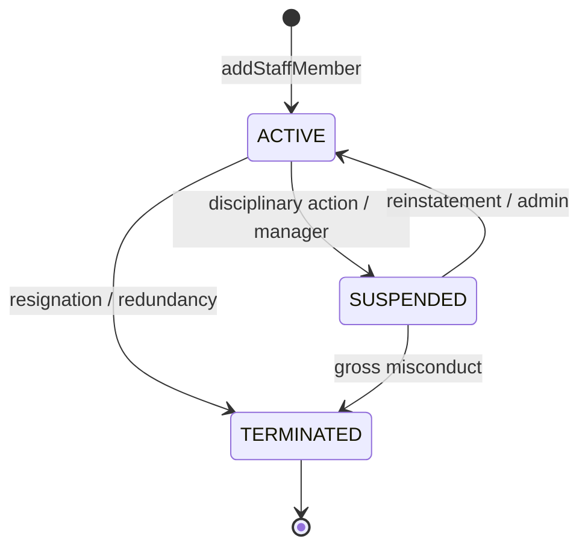
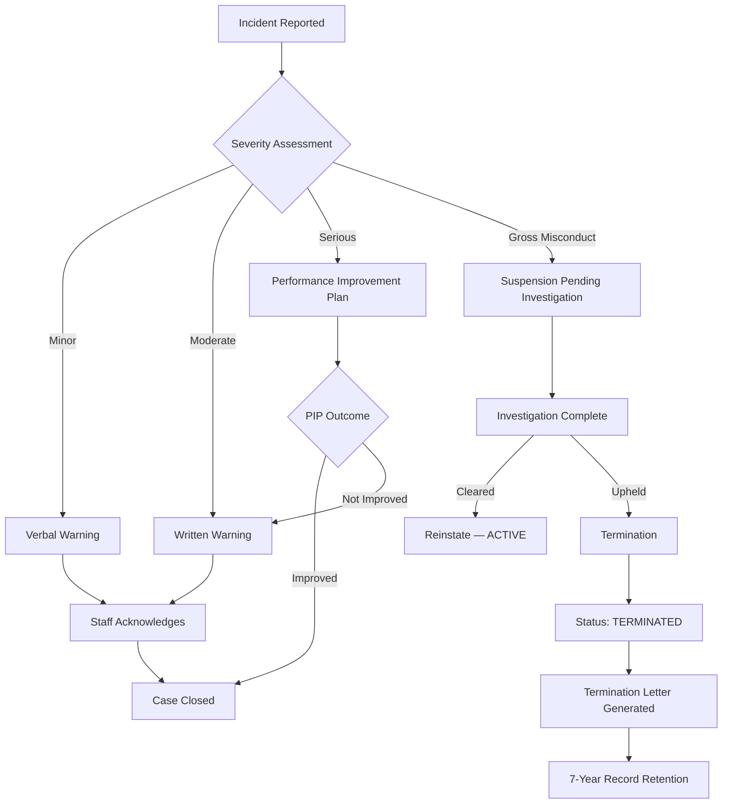
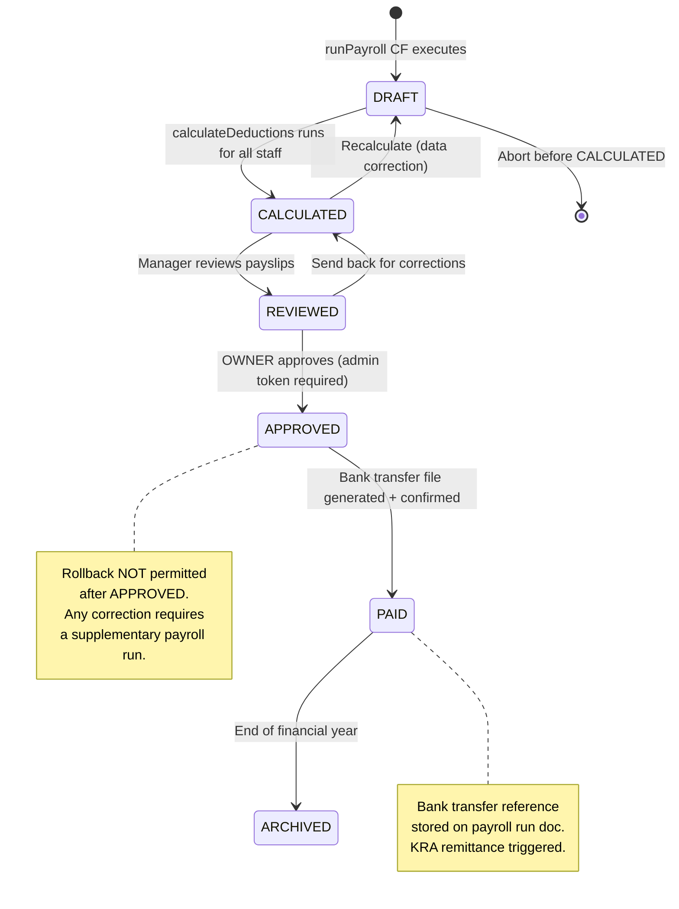

# SOKONI Commerce OS — Volume 12: HR & Workforce Management

> **Suite:** [[Commerce OS Documentation]]
> **Volume:** 12 of 20
> **Status:** Production — Finance Act 2024/2025 Compliant
> **Last Updated:** 2026-06-29
> **Cross-references:** [[vol-05-accounting]] | [[vol-02-identity-security]] | [[vol-14-analytics-bi]] | [[vol-03-pos-enterprise]]

---

## 1. Executive Summary

The SOKONI HR & Workforce Management module is a complete, Kenya-statutory-compliant human resources platform embedded within the [[Commerce OS]] suite. It provides end-to-end management of the employee lifecycle — from onboarding and attendance tracking through payroll processing, leave administration, performance reviews, and disciplinary management — all within a single unified Cloud Functions backend.

**Key capabilities at a glance:**

- Full Kenya statutory compliance: PAYE (5 progressive bands), NHIF (17-band lookup table), NSSF Act 2013 (Tier I + Tier II), and Affordable Housing Levy — all aligned with Finance Act 2024/2025
- AES-256-GCM encryption of all bank account details at rest, with the encryption key held exclusively in Firebase Secret Manager as `PAYROLL_ENCRYPTION_KEY`
- Automated payroll engine with duplicate-run guard, proration for partial months, and batch-write atomicity across all payslips in a single Firestore transaction
- Digital payslip generation with full itemised breakdown and annual P9 form support for KRA compliance
- Role-gated access enforced by Cloud Function auth guards — payroll functions require admin or manager tokens; payslips are readable only by the employee of record
- 12 Cloud Functions covering staff management, attendance, payroll, leave, and training — all deployed as Firebase Gen2 callable functions with `enforceAppCheck: true`
- Performance targets: payroll calculation under 5 seconds for 100 employees; individual payslip generation under 500 ms; attendance clock-in acknowledgement under 200 ms

The HR module is tightly integrated with [[vol-03-pos-enterprise]] (SmartPOS clock-in terminals), [[vol-05-accounting]] (payroll journal entries into the double-entry ledger), and [[vol-14-analytics-bi]] (workforce KPI dashboards).

---

## 2. Employee Lifecycle

Every person employed by a SOKONI merchant is registered in the `posStaff` Firestore collection. This collection is the single source of truth for all HR operations.

### 2.1 Staff Record Schema

```
posStaff/{staffId}
  merchantId        : string   — owning merchant
  name              : string   — full legal name
  employeeNumber    : string   — unique within merchant (e.g. EMP-001)
  department        : string   — e.g. "Kitchen", "Front of House", "Warehouse"
  position          : string   — job title
  role              : string   — CASHIER | SUPERVISOR | MANAGER | BRANCH_MANAGER | OWNER
  branchId          : string   — assigned branch (null = merchant-wide)
  grossSalary       : number   — monthly gross (KES), stored in plaintext
  employmentType    : string   — FULL_TIME | PART_TIME | CONTRACT | CASUAL
  startDate         : string   — ISO date (YYYY-MM-DD)
  kraPin            : string   — KRA Personal Identification Number
  phone             : string
  email             : string
  bankAccountEnc    : string   — AES-256-GCM JSON blob (see §7)
  status            : string   — ACTIVE | SUSPENDED | TERMINATED
  terminationDate   : string?  — set when status → TERMINATED
  terminationReason : string?
  createdAt         : Timestamp
  updatedAt         : Timestamp
  createdBy         : string   — UID of manager who registered the employee
```

### 2.2 addStaffMember Cloud Function

The `addStaffMember` callable function is the sole authorised path to create a staff record. It:

1. Validates caller has `admin` or `manager` custom claim (via `assertAdminOrManager`)
2. Validates all required fields: `merchantId`, `name`, `employeeNumber`, `department`, `position`, `grossSalary`, `startDate`
3. Verifies `grossSalary` is a positive number
4. Parses `startDate` as a valid ISO date
5. Encrypts the `bankAccount` object using AES-256-GCM with `PAYROLL_ENCRYPTION_KEY` from Secret Manager
6. Writes the document to `posStaff/{newId}` and records the action in the audit log

### 2.3 Employment Status Transitions



Status changes are always admin-gated and written with the acting manager UID and timestamp. Terminated staff records are retained for 7 years to satisfy KRA audit requirements (see §18).

---

## 3. Attendance & Shifts

### 3.1 hrAttendance Collection

Each clock-in/out event is stored as a separate document:

```
hrAttendance/{attendanceId}
  merchantId  : string
  staffId     : string
  staffName   : string
  branchId    : string
  date        : string        — YYYY-MM-DD (Nairobi timezone via getNairobiDateString())
  clockIn     : Timestamp
  clockOut    : Timestamp?
  hoursWorked : number?       — computed on clock-out
  overtimeHrs : number?       — hours beyond standard shift (e.g. > 8h)
  method      : string        — POS_TERMINAL | MANAGER_APPROVAL | MOBILE
  approvedBy  : string?       — UID, if manager-approved
  notes       : string?
```

### 3.2 Clock-In via SmartPOS

The [[vol-03-pos-enterprise]] SmartPOS terminal exposes a dedicated clock-in screen. Staff tap their employee QR card (carrying `staffId` and `merchantId` encoded with HMAC-SHA256) against the terminal camera. The POS calls `hrClockIn` CF which:

- Verifies HMAC signature on the QR payload
- Checks for an already-open attendance record for today (prevents double clock-in)
- Writes a new `hrAttendance` document with `clockIn` timestamp in Nairobi timezone
- Returns acknowledgement within the 200 ms performance target

Clock-out follows the same pattern via `hrClockOut`, which computes `hoursWorked` and flags `overtimeHrs` when the shift exceeds the standard 8-hour threshold.

### 3.3 Shift Scheduling

Shift templates are stored in `hrShifts/{merchantId}/templates/{templateId}`. A published schedule for a given week is stored in `hrShifts/{merchantId}/published/{weekStart}` as a map of `staffId → [{ day, shiftStart, shiftEnd }]`. Key rules:

- Minimum staffing requirements per branch are enforced at publish time
- Overtime alerts are raised automatically when a scheduled shift + already-logged hours would exceed 48 hours/week (Kenya Employment Act limit)
- Staff are notified of their published schedule via the [[Enterprise Notification Center]]

### 3.4 Leave Management — hrLeaves Collection

```
hrLeaves/{leaveId}
  merchantId   : string
  staffId      : string
  type         : string   — ANNUAL | SICK | MATERNITY | PATERNITY | UNPAID
  startDate    : string
  endDate      : string
  daysRequested: number
  status       : string   — PENDING | APPROVED | REJECTED | CANCELLED
  appliedAt    : Timestamp
  reviewedBy   : string?  — manager UID
  reviewedAt   : Timestamp?
  reason       : string?
  attachments  : string[] — storage paths (e.g. medical cert for SICK leave)
```

Statutory leave entitlements enforced by the system (Kenya Employment Act 2007):

| Leave Type | Entitlement | Notes |
|---|---|---|
| Annual | 21 working days/year | Accrues monthly at 1.75 days |
| Sick | 7 days full pay + 7 days half pay | Medical certificate required >3 days |
| Maternity | 3 months (90 days) | Full pay; 6 weeks compulsory post-birth |
| Paternity | 2 weeks (14 days) | Full pay |
| Unpaid | As agreed | Deducted from gross proration |

---

## 4. Payroll Engine

The payroll engine is the centrepiece of the HR module. It runs as the `runPayroll` Cloud Function and processes all active employees for a given merchant and payroll period in a single atomic batch operation.

### 4.1 runPayroll Cloud Function

**Input parameters:**

| Field | Type | Description |
|---|---|---|
| `merchantId` | string | Target merchant |
| `period` | string | `YYYY-MM` format (e.g. `2026-06`) |
| `approvedBy` | string | UID of authorising admin |

**Execution sequence:**

1. **Auth guard** — `assertAdmin(request.auth)` — only admin tokens may trigger payroll
2. **Duplicate-run guard** — checks `hrPayrollRuns/{merchantId}_{period}` — throws `already-exists` if a completed run exists for this period
3. **Fetch active staff** — queries `posStaff` where `merchantId == merchantId` and `status == ACTIVE`
4. **For each employee:**
   a. Fetch attendance records for the period from `hrAttendance`
   b. Count `daysWorked` (days with a complete clock-in + clock-out)
   c. Calculate `workingDaysInMonth` via `getWorkingDaysInMonth(period)` (Monday–Friday count, excluding weekends; public holidays are a future enhancement)
   d. Prorate gross: `proratedGross = grossSalary × (daysWorked / workingDaysInMonth)`
   e. Run `calculateDeductions(proratedGross)` to get the full statutory breakdown
   f. Fetch commission total from `hrCommissions` sub-collection for the period
   g. Build the payslip document
5. **Batch write** — all payslips are written atomically via `db.batch()` to `hrPayslips/{merchantId}/{period}/{staffId}`
6. **Mark run complete** — write `hrPayrollRuns/{merchantId}_{period}` with status, timestamp, and employee count
7. **Post journal entries** — emit payroll cost to [[vol-05-accounting]] double-entry ledger via internal event

### 4.2 Payslip Document Schema

```
hrPayslips/{merchantId}/{period}/{staffId}
  staffId              : string
  staffName            : string
  employeeNumber       : string
  department           : string
  position             : string
  period               : string         — YYYY-MM
  workingDaysInMonth   : number
  daysWorked           : number
  grossSalary          : number         — contractual monthly gross
  proratedGross        : number         — prorated for days worked
  commissions          : number         — sales commission earned
  totalEarnings        : number         — proratedGross + commissions
  deductions:
    paye               : number
    nhif               : number
    nssfEmployee       : number         — Tier I + Tier II
    housingLevyEmployee: number
    totalDeductions    : number
  employer:
    nssfEmployer       : number
    housingLevyEmployer: number
  taxableIncome        : number
  personalRelief       : number         — KES 2,400
  netPay               : number
  status               : string         — DRAFT | APPROVED | PAID
  generatedAt          : Timestamp
  approvedBy           : string?
  approvedAt           : Timestamp?
  paidAt               : Timestamp?
```

---

## 5. Kenya Statutory Deductions

All statutory rates are sourced from the Kenya Finance Act 2024/2025 and the NSSF Act 2013. The implementation lives in `functions/hr-payroll.js` and is pure, deterministic, and unit-testable.

### 5.1 PAYE — Pay As You Earn

PAYE is calculated on taxable income (gross less NSSF employee contribution) using five progressive bands:

| Band | Monthly Taxable Income (KES) | Rate |
|---|---|---|
| Band 1 | 0 – 24,000 | 10% |
| Band 2 | 24,001 – 32,333 | 25% |
| Band 3 | 32,334 – 500,000 | 30% |
| Band 4 | 500,001 – 800,000 | 32.5% |
| Band 5 | Above 800,000 | 35% |

**Personal Relief:** KES 2,400/month is deducted from the gross PAYE liability. Net PAYE is floored at KES 0 (no negative PAYE).

**Example — KES 50,000 gross:**

```
Taxable income       = 50,000 − 1,530 (NSSF)  = 48,470
Band 1 (0−24,000)   = 24,000 × 10%            = 2,400.00
Band 2 (24k−32,333) =  8,333 × 25%            = 2,083.25
Band 3 (32k−48,470) = 16,137 × 30%            = 4,841.10
Gross PAYE                                     = 9,324.35
Less personal relief                           −  2,400.00
Net PAYE                                       = 6,924.35
```

### 5.2 NHIF — National Hospital Insurance Fund

NHIF uses a 17-band flat-amount lookup table (not a percentage):

| Monthly Gross (KES) | NHIF Contribution (KES) |
|---|---|
| Up to 5,999 | 150 |
| 6,000 – 7,999 | 300 |
| 8,000 – 11,999 | 400 |
| 12,000 – 14,999 | 500 |
| 15,000 – 19,999 | 600 |
| 20,000 – 24,999 | 750 |
| 25,000 – 29,999 | 850 |
| 30,000 – 34,999 | 900 |
| 35,000 – 39,999 | 950 |
| 40,000 – 44,999 | 1,000 |
| 45,000 – 49,999 | 1,100 |
| 50,000 – 59,999 | 1,200 |
| 60,000 – 69,999 | 1,300 |
| 70,000 – 79,999 | 1,400 |
| 80,000 – 89,999 | 1,500 |
| 90,000 – 99,999 | 1,600 |
| 100,000+ | 1,700 |

NHIF is an employee-only deduction. There is no employer matching contribution under the current NHIF Act framework.

### 5.3 NSSF — National Social Security Fund (Act 2013)

NSSF uses a two-tier contribution structure. Both employee and employer contribute equally:

| Tier | Pensionable Pay Range (KES) | Rate | Max Employee (KES) | Max Employer (KES) |
|---|---|---|---|---|
| Tier I | First 7,000 | 6% each | 420 | 420 |
| Tier II | 7,001 – 36,000 | 6% each | 1,740 | 1,740 |
| **Total** | | | **2,160** | **2,160** |

NSSF employee contribution is deducted before PAYE is computed (it is a pre-tax deduction), reducing the taxable income base.

### 5.4 Affordable Housing Levy

Introduced by the Finance Act 2023 and upheld by the Court of Appeal:

- **Employee:** 1.5% of gross monthly salary
- **Employer:** 1.5% of gross monthly salary (employer match)
- No ceiling on the levy; it applies to the full gross

For a KES 50,000 gross: employee pays KES 750; employer pays KES 750.

---

## 6. calculateDeductions Helper

The `calculateDeductions(grossSalary)` function is the computational core of the payroll engine. It returns a complete, itemised breakdown suitable for direct insertion into a payslip document.

**Function signature (from `functions/hr-payroll.js`):**

```javascript
function calculateDeductions(grossSalary) {
  const nhif         = calculateNHIF(grossSalary);
  const nssf         = calculateNSSF(grossSalary);   // { tier1, tier2, total }
  const housingLevy  = Math.round(grossSalary * HOUSING_LEVY_RATE * 100) / 100;

  // NSSF is deducted before PAYE is computed (pre-tax)
  const taxableIncome = Math.max(0, grossSalary - nssf.total);
  const paye          = calculatePAYE(taxableIncome);

  const totalDeductions = Math.round((nhif + nssf.total + housingLevy + paye) * 100) / 100;
  const netSalary       = Math.round((grossSalary - totalDeductions) * 100) / 100;

  return {
    gross: Math.round(grossSalary * 100) / 100,
    nhif,
    nssf,                   // { tier1, tier2, total }
    housingLevy,            // employee portion
    taxableIncome,
    paye,
    totalDeductions,
    netSalary,
    employerNSSF: nssf.total,
    employerHousingLevy: Math.round(grossSalary * HOUSING_LEVY_RATE * 100) / 100,
  };
}
```

**Return object — full field reference:**

| Field | Description | Unit |
|---|---|---|
| `gross` | Input gross salary | KES |
| `nhif` | NHIF deduction (employee) | KES |
| `nssf.tier1` | NSSF Tier I employee | KES |
| `nssf.tier2` | NSSF Tier II employee | KES |
| `nssf.total` | NSSF total employee | KES |
| `housingLevy` | Housing Levy employee (1.5%) | KES |
| `taxableIncome` | Gross less NSSF (PAYE base) | KES |
| `paye` | Net PAYE after personal relief | KES |
| `totalDeductions` | Sum of all employee deductions | KES |
| `netSalary` | Take-home pay | KES |
| `employerNSSF` | Employer NSSF match | KES |
| `employerHousingLevy` | Employer Housing Levy (1.5%) | KES |

All monetary values are rounded to 2 decimal places using `Math.round(x * 100) / 100` to prevent floating-point drift across large payroll batches.

**Proration for partial months:**

When an employee works fewer days than the full month (new hire, termination mid-month, unpaid leave), the engine prorates the gross before calling `calculateDeductions`:

```javascript
const proratedGross = grossSalary * (daysWorked / workingDaysInMonth);
const breakdown     = calculateDeductions(proratedGross);
```

`workingDaysInMonth` counts Monday–Friday days in the period using `getWorkingDaysInMonth(yearMonth)`.

---

## 7. Bank Account Encryption

Bank account details (bank name, account number, branch code) are classified as **sensitive PII** and are encrypted at rest using AES-256-GCM before storage in Firestore. They are never transmitted to any client application.

### 7.1 Encryption Algorithm

| Parameter | Value |
|---|---|
| Algorithm | AES-256-GCM |
| Key length | 256-bit (32 bytes / 64 hex chars) |
| IV length | 96-bit (12 bytes) — randomly generated per encryption |
| Auth tag | 128-bit (16 bytes) |
| Key source | Firebase Secret Manager: `PAYROLL_ENCRYPTION_KEY` |
| Storage format | JSON string: `{ iv, encryptedData, tag }` — all hex-encoded |

### 7.2 Stored Payload Example

```json
{
  "iv": "a1b2c3d4e5f6a7b8c9d0e1f2",
  "encryptedData": "4f3a9c1b2d...",
  "tag": "8e7f6a5b4c3d2e1f0a9b8c7d"
}
```

This JSON string is stored as the `bankAccountEnc` field on the `posStaff` document.

### 7.3 Decryption Rules

- Decryption occurs **only within Cloud Function context** where `PAYROLL_ENCRYPTION_KEY` is available as a runtime secret
- The decrypted account number is used transiently during payroll processing (e.g. to populate bank transfer files) and is never logged or returned to the client
- No Firestore Security Rule grants any client — including authenticated admin users — read access to `bankAccountEnc` in plaintext

### 7.4 Key Rotation Procedure

1. Generate a new 32-byte key: `openssl rand -hex 32`
2. Add the new version to Secret Manager as `PAYROLL_ENCRYPTION_KEY` with a new version number
3. Deploy a one-time `rotateEncryptionKey` Cloud Function that reads each `posStaff` document, decrypts with the old key, re-encrypts with the new key, and writes back
4. After verifying 100% of records are migrated (check audit log), deactivate the old Secret Manager version
5. Redeploy all payroll Cloud Functions pinned to the new secret version

---

## 8. Payslip Generation

### 8.1 Digital Payslip

Each payslip is a Firestore document in `hrPayslips/{merchantId}/{period}/{staffId}`. The `hr-payroll.html` employee portal fetches only the calling user's own payslips (enforced by Firestore Security Rules: `request.auth.uid == resource.data.staffUid`).

**Payslip UI sections (hr-payroll.html):**

1. Employee details header (name, employee number, department, period)
2. Earnings breakdown (prorated gross, commissions, total earnings)
3. Statutory deductions table (PAYE, NHIF, NSSF Tier I, NSSF Tier II, Housing Levy, total deductions)
4. Employer costs (NSSF employer, Housing Levy employer — shown to managers only)
5. Net pay summary (large, prominent)
6. Authorisation block (approved by, date)

### 8.2 Annual P9 Form

At year-end (January payroll run), the `generateP9` Cloud Function aggregates all 12 monthly payslips for each employee and produces the KRA P9 form fields:

| P9 Field | Source |
|---|---|
| Employee name | `posStaff.name` |
| KRA PIN | `posStaff.kraPin` |
| Gross earnings | Sum of `proratedGross` + `commissions` |
| PAYE deducted | Sum of monthly `deductions.paye` |
| Personal relief | 12 × KES 2,400 = KES 28,800 |
| Taxable income | Sum of monthly `taxableIncome` |
| NSSF deducted | Sum of monthly `deductions.nssfEmployee` |

The P9 is generated as a downloadable PDF via the `hr-payroll.html` portal and as a structured JSON export for bulk KRA iTax upload.

### 8.3 Payslip History

Employees can access their full payslip history through the self-service section of `hr-payroll.html`. The portal queries `hrPayslips/{merchantId}/{period}/{staffId}` with a Firestore index on `[merchantId, staffId, period DESC]`.

---

## 9. Roles & Permissions

### 9.1 posRoles Collection

Staff roles are defined at the merchant level in `posRoles/{merchantId}/roles/{role}`:

```
posRoles/{merchantId}/roles/{role}
  role          : string   — CASHIER | SUPERVISOR | MANAGER | BRANCH_MANAGER | OWNER
  permissions   : string[] — list of granted permission keys
  createdAt     : Timestamp
  updatedAt     : Timestamp
```

### 9.2 Permission Matrix

| Operation | CASHIER | SUPERVISOR | MANAGER | BRANCH_MANAGER | OWNER |
|---|---|---|---|---|---|
| Clock in/out | Yes | Yes | Yes | Yes | Yes |
| View own payslip | Yes | Yes | Yes | Yes | Yes |
| View team attendance | — | Yes | Yes | Yes | Yes |
| Approve leave | — | — | Yes | Yes | Yes |
| Add staff | — | — | Yes | Yes | Yes |
| Run payroll | — | — | — | — | Yes (admin) |
| Approve payroll | — | — | — | — | Yes (admin) |
| View all payslips | — | — | — | Yes | Yes |
| Edit staff salary | — | — | — | — | Yes |
| Terminate staff | — | — | Yes (SUSPENDED only) | Yes | Yes |

### 9.3 Manager-Auth Guard

Sensitive HR operations — salary edits, terminations, payroll approval — are protected by the [[vol-03-pos-enterprise]] Manager Authorization Engine (`pos-manager-auth.js`). The manager must re-authenticate via PIN, QR code, NFC tap, or biometric before the operation proceeds. Every authorisation attempt is recorded in the immutable `managerAuthLog` sub-collection.

---

## 10. Performance Management

### 10.1 performanceReviews Collection

```
performanceReviews/{reviewId}
  merchantId    : string
  staffId       : string
  reviewPeriod  : string   — YYYY-QN (e.g. 2026-Q2)
  reviewDate    : string
  reviewedBy    : string   — manager UID
  kpis          : map      — { kpiKey: { target, actual, score } }
  overallRating : number   — 1 (poor) to 5 (exceptional)
  strengths     : string
  improvements  : string
  actionItems   : string[]
  linkedToCommission: boolean
  createdAt     : Timestamp
```

### 10.2 KPIs by Role

| Role | KPIs |
|---|---|
| CASHIER | Sales per shift, transaction count, average basket size, voids rate, speed (avg transaction time) |
| SUPERVISOR | Team attendance rate, cash variance, upsell conversion, customer satisfaction (CSAT) |
| MANAGER | Revenue vs target, payroll cost %, staff turnover, compliance score |
| DRIVER | Deliveries completed, on-time rate, CSAT, cancellation rate |

Quarterly review ratings (1–5) are stored and linked to the commission calculation for the following quarter when `linkedToCommission: true`. Ratings of 5 unlock an enhanced commission multiplier configurable per merchant.

---

## 11. Commission Tracking

### 11.1 hrCommissions Sub-Collection

```
posStaff/{staffId}/hrCommissions/{period}
  staffId        : string
  period         : string   — YYYY-MM
  totalSales     : number   — KES value of sales processed by this cashier
  transactionCount: number
  commissionRate : number   — e.g. 0.02 for 2%
  commissionType : string   — PERCENT_OF_SALES | PER_TRANSACTION | FLAT
  commissionEarned: number  — KES amount to add to payslip
  locked         : boolean  — true after payroll run (immutable)
  lockedAt       : Timestamp?
```

### 11.2 Commission Rules

Commission rules are configured at the merchant level in `hrCommissionRules/{merchantId}`:

- **PERCENT_OF_SALES:** cashier earns a percentage of the KES value of their processed transactions
- **PER_TRANSACTION:** flat KES amount per completed sale
- **FLAT:** fixed monthly bonus, optionally tied to a minimum sales target

During `runPayroll`, the engine reads the locked commission document for the period (or locks and computes it on first run) and adds `commissionEarned` to the payslip's `totalEarnings`.

---

## 12. Training Records

```
hrTraining/{trainingId}
  merchantId     : string
  staffId        : string
  courseName     : string
  courseType     : string   — COMPLIANCE | PRODUCT | SKILLS | ONBOARDING
  completedAt    : Timestamp?
  expiresAt      : Timestamp?  — null if no expiry
  certNumber     : string?
  completedBy    : string   — staff UID
  verifiedBy     : string?  — manager UID
  status         : string   — ASSIGNED | IN_PROGRESS | COMPLETED | EXPIRED
```

Mandatory compliance training tracked for all staff:

| Course | Audience | Renewal Period |
|---|---|---|
| Food Safety & Hygiene | Food hub staff | Annual |
| Cash Handling & POS Security | All cashiers | Annual |
| Data Protection (Kenya DPA 2019) | All staff | Biennial |
| Fire Safety | All staff | Annual |
| Anti-Money Laundering | Finance roles | Annual |

The [[vol-14-analytics-bi]] analytics dashboard surfaces training completion rates and upcoming expiry alerts at branch and merchant level.

---

## 13. Shift Scheduling

### 13.1 Shift Templates

Shift templates define the standard working hours for each role at each branch:

```
hrShiftTemplates/{merchantId}/templates/{templateId}
  name          : string   — e.g. "Morning Shift", "Closing Shift"
  startTime     : string   — HH:MM (24h)
  endTime       : string   — HH:MM (24h)
  durationHours : number
  roles         : string[] — applicable roles
  branchId      : string
```

### 13.2 Published Schedule

Managers publish weekly schedules through the `hr-payroll.html` scheduling view. The drag-and-drop interface assigns shift templates to staff for each weekday. On publish:

1. System validates minimum staffing per branch (configurable floor per role)
2. Calculates projected weekly hours per staff member and raises an alert if any would exceed 48 hours (Kenya Employment Act maximum)
3. Writes to `hrSchedules/{merchantId}/{weekStart}`
4. Sends push notification to each scheduled employee via the [[Enterprise Notification Center]]

### 13.3 Overtime Alerts

Overtime is defined as hours worked beyond the standard shift end time, or beyond 48 hours in a week. The attendance module flags these automatically during clock-out and records `overtimeHrs` on the attendance document. Overtime costs are surfaced in the [[vol-14-analytics-bi]] HR analytics dashboard.

---

## 14. Disciplinary Process

```
hrDisciplinary/{caseId}
  merchantId     : string
  staffId        : string
  caseType       : string   — VERBAL_WARNING | WRITTEN_WARNING | PIP | SUSPENSION | TERMINATION
  incidentDate   : string
  description    : string
  evidenceUrls   : string[] — storage paths
  outcome        : string
  issuedBy       : string   — manager UID
  acknowledgedBy : string?  — staff UID + timestamp
  acknowledgedAt : Timestamp?
  status         : string   — OPEN | ACKNOWLEDGED | CLOSED | APPEALED
  appealNotes    : string?
  createdAt      : Timestamp
  closedAt       : Timestamp?
```

### 14.1 Disciplinary Flow



Manager approval is required at every escalation step. OWNER approval is mandatory for any termination. Legal documentation (warning letters, PIP documents, termination letters) is generated as PDFs and stored in Firebase Storage with restricted access rules.

---

## 15. HR Analytics

The HR analytics module feeds the [[vol-14-analytics-bi]] Business Intelligence layer with the following KPIs. All metrics are computed server-side to avoid client-side data leakage.

| Metric | Calculation | Frequency |
|---|---|---|
| Headcount by branch | Count `posStaff` where `status == ACTIVE` and `branchId` | Real-time |
| Payroll cost % of revenue | `totalPayrollCost / periodRevenue × 100` | Monthly |
| Attendance rate | `daysWorked / scheduledDays × 100` per employee | Weekly |
| Overtime cost | Sum of `overtimeHrs × hourlyRate × 1.5` | Monthly |
| Staff turnover rate | `terminationsInPeriod / avgHeadcount × 100` | Quarterly |
| Sales per labour hour | `branchRevenue / totalHoursWorked` | Weekly |
| Training compliance % | `completedCourses / requiredCourses × 100` | Monthly |
| Leave utilisation % | `leaveDaysTaken / leaveEntitlement × 100` | Annual |

The `hr-payroll.html` manager dashboard renders these metrics using Canvas charts, with branch-level drill-down for multi-branch merchants.

---

## 16. Payroll State Machine



**State transition rules:**

| From | To | Actor | Condition |
|---|---|---|---|
| — | DRAFT | Admin | `runPayroll` called; no existing run for period |
| DRAFT | CALCULATED | System | All deductions computed successfully |
| CALCULATED | REVIEWED | Manager | Manager reviews payslip batch |
| REVIEWED | APPROVED | Owner/Admin | Explicit approval; cannot be undone |
| APPROVED | PAID | Admin | Bank transfer confirmed |
| PAID | ARCHIVED | System | Automated at year-end |

Rollback is only permitted before `APPROVED`. After approval, any correction must be applied as a supplementary payroll run for the affected employees only.

---

## 17. Security

The HR & Payroll module operates under the highest security tier in the SOKONI platform. All access paths are designed with the principle of least privilege.

### 17.1 Encryption at Rest

- All `bankAccountEnc` fields use AES-256-GCM with a per-encryption random 12-byte IV
- Auth tag prevents ciphertext tampering (GCM provides authenticated encryption)
- The `PAYROLL_ENCRYPTION_KEY` secret is accessible only to Cloud Functions at runtime — never to client applications, never to Firestore Security Rules, never logged

### 17.2 Cloud Function Access Control

| Cloud Function | Required Claim |
|---|---|
| `addStaffMember` | `admin` or `manager` |
| `hrClockIn` / `hrClockOut` | Authenticated (any staff) |
| `runPayroll` | `admin` |
| `approvePayroll` | `admin` |
| `getPayslip` | `admin`, `manager`, or own UID |
| `generateP9` | `admin` |
| `requestLeave` | Authenticated (own record) |
| `approveLeave` | `admin` or `manager` |
| `assignTraining` | `admin` or `manager` |

All functions deploy with `enforceAppCheck: true` — unatteched clients are rejected before any function logic executes.

### 17.3 Firestore Security Rules

```
// posStaff — admin/manager read; admin write
match /posStaff/{staffId} {
  allow read: if isAdminOrManager();
  allow write: if isAdmin();
}

// hrPayslips — admin/manager read; employee reads own only
match /hrPayslips/{merchantId}/{period}/{staffId} {
  allow read: if isAdmin()
               || isManager()
               || request.auth.uid == resource.data.staffUid;
  allow write: if false; // Cloud Functions only
}

// hrAttendance — staff reads own; manager reads team
match /hrAttendance/{attendanceId} {
  allow read: if isAdmin()
               || isManager()
               || request.auth.uid == resource.data.staffUid;
  allow write: if false; // Cloud Functions only
}
```

### 17.4 Audit Log

Every payroll run, salary change, staff status change, and termination is recorded in `hrAuditLog/{merchantId}/events/{eventId}` with:

- `action` — the operation performed
- `actorUid` — UID of the Cloud Function caller
- `targetStaffId` — affected employee
- `before` / `after` — relevant field snapshots (excluding encrypted fields)
- `timestamp` — server-side Firestore timestamp

The audit log collection is write-protected: only Cloud Functions may write; no document may be deleted or overwritten by any actor including admins.

### 17.5 PAYROLL_ENCRYPTION_KEY Rotation

Follow §7.4 for the full rotation procedure. Rotation should occur:
- Annually as standard key hygiene
- Immediately upon any suspected key compromise
- When an administrator with Secret Manager access leaves the organisation

---

## 18. Compliance

### 18.1 Statutory Remittance Deadlines

| Obligation | Authority | Deadline | Penalty for Late |
|---|---|---|---|
| PAYE | KRA | 9th of following month | 25% of amount + 1% per month |
| NHIF | NHIF | 9th of following month | Prosecution + KES 2,000/employee/month |
| NSSF | NSSF | 15th of following month | 5% of arrears per month |
| Housing Levy | KNHCF | 9th of following month | 3% per annum on arrears |

### 18.2 Annual Returns

| Return | Form | Deadline | Recipient |
|---|---|---|---|
| P9 (Employee Tax Deduction Card) | KRA iTax | 28 February | KRA |
| NHIF Annual Return | NHIF Portal | 31 January | NHIF |
| NSSF Annual Return | NSSF Portal | 31 January | NSSF |
| Housing Levy Annual Reconciliation | KNHCF Portal | 31 January | KNHCF |

### 18.3 Record Retention

In compliance with the Kenya Tax Procedures Act 2015 and the Employment Act 2007:

- Payroll records must be retained for **7 years** after the payroll period
- Terminated employee records must be retained for **7 years** from termination date
- Leave records: **3 years** minimum
- Disciplinary records: **7 years** for terminations; **3 years** for warnings

The SOKONI platform flags staff records for archiving (not deletion) when retention periods are met, and presents a deletion confirmation to the OWNER with a legal acknowledgement checkbox.

### 18.4 Finance Act 2024/2025 Alignment

The PAYE bands, NHIF table, NSSF tiers, and Housing Levy rates implemented in `functions/hr-payroll.js` are drawn directly from the Finance Act 2024/2025. A `STATUTORY_RATES_VERSION` constant in the module header records the Act version so that rate table audits are traceable to the governing legislation.

---

## 19. Performance Targets

| Operation | Target SLA | Implementation Strategy |
|---|---|---|
| Payroll calculation — 100 employees | < 5 seconds | Parallel `calculateDeductions` calls; single batch write at end |
| Individual payslip generation | < 500 ms | Pre-computed deductions; no on-the-fly recalculation after approval |
| Attendance clock-in acknowledgement | < 200 ms | Lightweight CF; HMAC validation only; single Firestore write |
| Staff dashboard load | < 1 second | Firestore composite index on `[merchantId, status, createdAt DESC]` |
| P9 annual form generation | < 10 seconds for 200 employees | Aggregation query with Firestore `collectionGroup` |
| Payslip history pagination | < 300 ms per page | Index on `[merchantId, staffId, period DESC]`; page size 12 |

Payroll batch operations are protected by Firestore's 500-document batch write limit. For merchants with more than 490 active employees, the `runPayroll` CF automatically chunks the batch into sequential sub-batches of 490 documents each.

---

## 20. Cross-References

| Module | Relationship |
|---|---|
| [[vol-05-accounting]] | Payroll costs are posted as journal entries to the double-entry ledger; payroll run triggers `PAYROLL_COST` debit against `SALARIES_EXPENSE` account |
| [[vol-02-identity-security]] | Custom claims (`admin`, `manager`) are the auth gate for all payroll CFs; App Check enforced on every callable |
| [[vol-14-analytics-bi]] | HR KPIs (headcount, payroll %, attendance, turnover) are surfaced in the executive dashboard |
| [[vol-03-pos-enterprise]] | SmartPOS terminals are the primary clock-in device; Manager Auth Engine guards salary edits and terminations |
| [[Commerce OS Documentation]] | This volume is part of the full Commerce OS suite |

---

## Appendix A — Collection Index Reference

| Collection | Composite Index |
|---|---|
| `posStaff` | `merchantId ASC, status ASC, createdAt DESC` |
| `hrAttendance` | `merchantId ASC, staffId ASC, date DESC` |
| `hrAttendance` | `merchantId ASC, branchId ASC, date ASC` |
| `hrLeaves` | `merchantId ASC, staffId ASC, status ASC` |
| `hrLeaves` | `merchantId ASC, type ASC, startDate DESC` |
| `hrPayslips` | `merchantId ASC, staffId ASC, period DESC` |
| `hrPayrollRuns` | `merchantId ASC, status ASC, createdAt DESC` |
| `hrDisciplinary` | `merchantId ASC, staffId ASC, createdAt DESC` |
| `hrTraining` | `merchantId ASC, staffId ASC, status ASC, expiresAt ASC` |
| `performanceReviews` | `merchantId ASC, staffId ASC, reviewPeriod DESC` |

---

## Appendix B — Cloud Functions Summary

| CF Name | Trigger | Auth | Description |
|---|---|---|---|
| `addStaffMember` | onCall | admin \| manager | Register new employee; encrypt bank details |
| `hrDashboard` | onCall | admin \| manager | Aggregate staff list with attendance summary |
| `hrClockIn` | onCall | authenticated | Record clock-in event |
| `hrClockOut` | onCall | authenticated | Record clock-out; compute hours |
| `hrAttendanceReport` | onCall | admin \| manager | Attendance summary for period |
| `runPayroll` | onCall | admin | Calculate and batch-write all payslips |
| `approvePayroll` | onCall | admin | Transition payroll run to APPROVED |
| `getPayslips` | onCall | employee \| manager \| admin | Retrieve payslip history |
| `getPayrollSummary` | onCall | admin | Payroll cost summary by period |
| `hrLeaveRequest` | onCall | authenticated | Submit leave application |
| `hrLeaveApproval` | onCall | admin \| manager | Approve or reject leave |
| `hrTrainingAssign` | onCall | admin \| manager | Assign training course to employee |

---

## Appendix C — Secret Manager Requirements

| Secret Name | Description | Rotation |
|---|---|---|
| `PAYROLL_ENCRYPTION_KEY` | AES-256-GCM hex key (64 chars) for bank account encryption | Annual / on demand |

The secret must be provisioned before any `addStaffMember` or `runPayroll` call will succeed. Provisioning command:

```bash
openssl rand -hex 32 | \
  gcloud secrets create PAYROLL_ENCRYPTION_KEY \
    --data-file=- \
    --replication-policy=automatic \
    --project=YOUR_PROJECT_ID
```

Grant the Cloud Functions service account `roles/secretmanager.secretAccessor` on this secret.

---

*Part of the [[Commerce OS Documentation]] suite. Previous: [[vol-11-procurement]]. Next: [[vol-13-marketing-engine]].*
