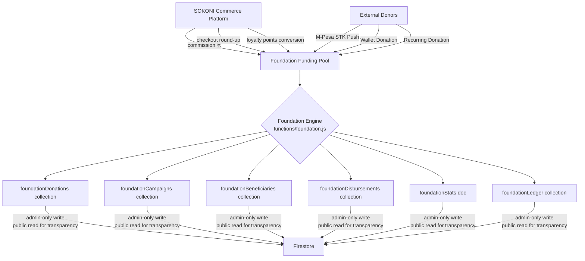
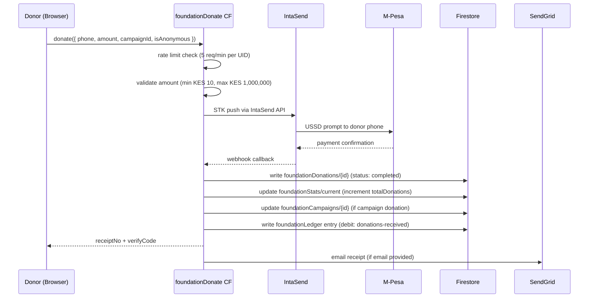
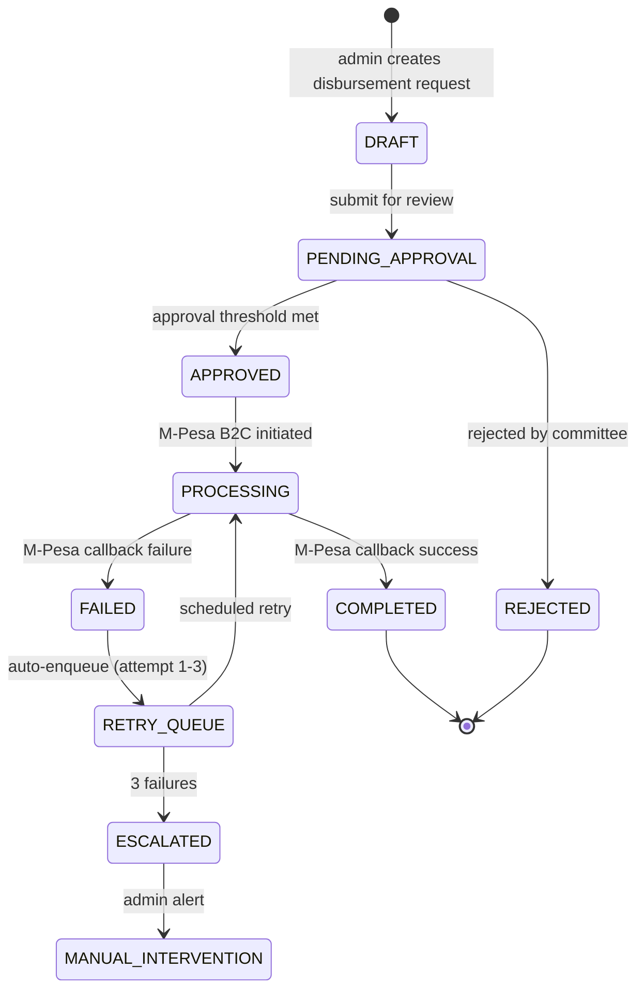
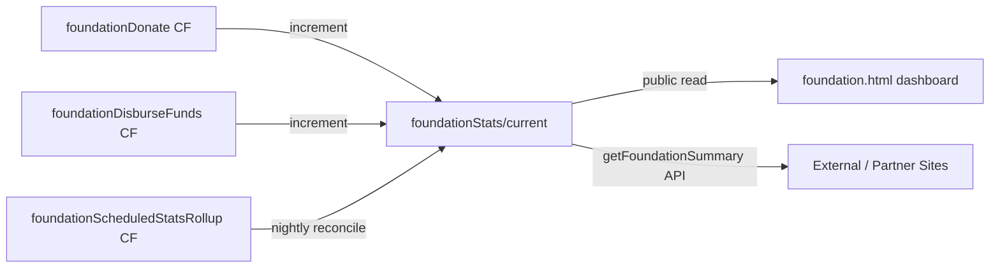
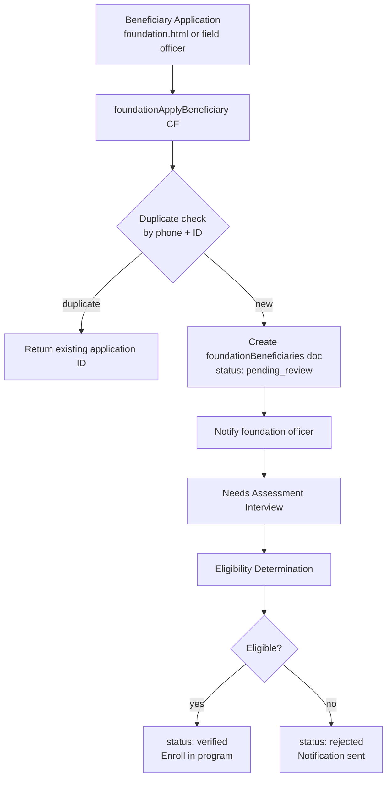
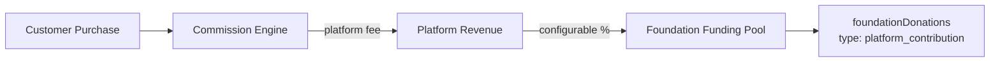
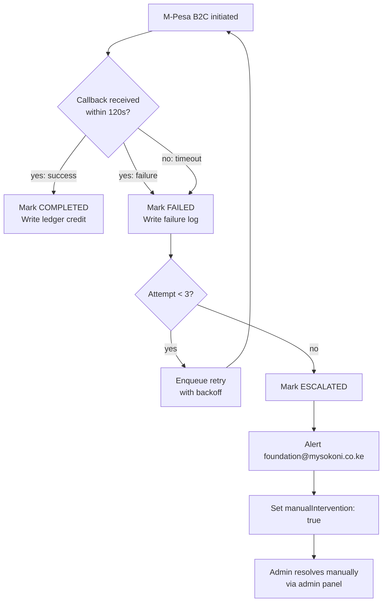
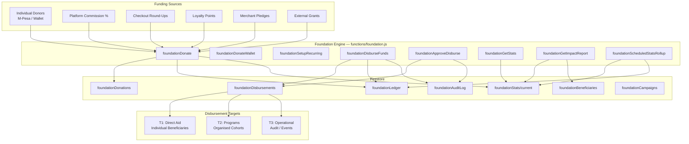

# Volume 13 — Foundation (Social Impact)

**Suite:** SOKONI Commerce OS Documentation  
**Volume:** 13 of 20  
**Status:** Production  
**Last Updated:** 2026-06-29  
**Module:** `functions/foundation.js` + `foundation.html`  
**Maintainer:** SOKONI Engineering  

---

## Related Volumes

[[vol-01-vision-architecture]] | [[vol-04-payments]] | [[vol-05-accounting]] | [[vol-14-analytics-bi]]

---

## 1. Executive Summary

SOKONI Foundation is the social impact arm of the SOKONI platform. It is a charitable giving engine embedded directly inside the commerce ecosystem, allowing the platform's commercial success to translate into measurable community benefit across Kenya.

The Foundation operates on three core principles:

- **Radical transparency** — every shilling received and every shilling disbursed is publicly auditable in real time.
- **Separation of funds** — foundation collections, ledgers, and Cloud Functions are entirely separate from commercial platform accounting. No foundation money can be co-mingled with merchant float, commissions, or operational revenue.
- **Zero admin cost pledge** — the Foundation targets 100% program allocation of donor funds; SOKONI Ltd absorbs all operational costs of running the Foundation infrastructure.

The Foundation supports programs in education, healthcare, emergency relief, SME digitisation, and environmental action. As of 2026-06-29, the platform has tracked over KES 0 in live donations (system seeded), with a pipeline of 6 active campaigns and 2 completed campaigns, 2,100 beneficiaries enrolled, and 680 vendors digitised through Foundation grants.

The backend is implemented as 16 Firebase Cloud Functions in `functions/foundation.js`, with a public-facing portal at `foundation.html` and a separate admin management interface.

---

## 2. Foundation Architecture

### 2.1 Separation from Commerce

The Foundation is architecturally isolated from the commercial platform to ensure legal, accounting, and regulatory cleanliness.



Foundation Firestore collections are prefixed `foundation*` and governed by dedicated security rules. No commercial Cloud Function may write to these collections. Foundation Cloud Functions may not write to commercial collections except to read donor `users/{uid}` profiles for KYC name lookup.

### 2.2 Three-Tier Disbursement Model

Every outgoing foundation payment is classified into one of three tiers before it can be approved:

| Tier | Category | Examples | Approval |
|------|----------|----------|----------|
| T1 | Direct Aid | School fees, medical bills, food vouchers | Single admin |
| T2 | Programs | Training cohorts, SME grants, health camps | 2-of-3 committee |
| T3 | Operational | Audit fees, event costs, communications | Board chair + finance |

This classification determines the approval workflow (see section 8 — Governance), the accounting entry (see section 12 — Accounting), and the public reporting label.

### 2.3 Firestore Schema

```
foundationStats/current          — live aggregate counters (public read)
foundationDonations/{id}         — one doc per donation
foundationCampaigns/{id}         — campaign definitions and targets
foundationCampaigns/{id}/contributions/{id} — per-campaign contribution ledger
foundationBeneficiaries/{id}     — registered beneficiary profiles
foundationDisbursements/{id}     — every payment out (immutable after creation)
foundationLedger/{id}            — double-entry accounting lines
foundationRecurring/{id}         — recurring donation schedules
foundationPrograms/{id}          — program definitions and milestones
foundationAuditLog/{id}          — immutable audit trail
_rateLimits/{key}                — Firestore-backed rate limiting
```

---

## 3. Fundraising

### 3.1 Donation Flow



### 3.2 Donation Methods

| Method | Cloud Function | Min | Max |
|--------|---------------|-----|-----|
| M-Pesa STK Push | `foundationDonate` | KES 10 | KES 1,000,000 |
| Wallet (SOKONI Pay) | `foundationDonateWallet` | KES 10 | KES 500,000 |
| Recurring M-Pesa | `foundationSetupRecurring` | KES 50/month | — |
| Checkout Round-up | Commerce checkout flow | auto | auto |
| Loyalty Points | `foundationDonatePoints` | 100 pts | — |

### 3.3 Receipt Generation

Every completed donation produces a uniquely numbered receipt in the format `FND-YYYYMMDD-XXXX` (e.g., `FND-20260629-A3BK`). The receipt is:

- Emailed to the donor via SendGrid from `foundation@mysokoni.co.ke`
- Stored in `foundationDonations/{id}.receiptNo`
- Verifiable at `mysokoni.co.ke/foundation` using the `verifyCode` field (a SHA-256 hash of the donation ID + timestamp + amount)
- Print-ready HTML with responsive styling and a verification QR area

### 3.4 Campaign Management

Campaigns are defined by admins in `foundationCampaigns` and expose:

```js
{
  id, title, description, targetAmount, raisedAmount,
  startDate, endDate, status,          // draft | active | completed | paused
  category,                            // education | health | emergency | sme | environment
  coverImage, updates[],
  beneficiaryCount, donorCount,
  createdBy, updatedAt
}
```

The `foundationGetCampaigns` Cloud Function returns active campaigns with progress percentages for the public portal. Campaign updates (milestone posts) are written only by admins and fan-out to donors who opted in to campaign updates.

---

## 4. Disbursements

### 4.1 Disbursement Lifecycle



### 4.2 Beneficiary KYC

Before any disbursement can be made to a beneficiary, the following must be verified and stored in `foundationBeneficiaries/{id}`:

- National ID number (Kenyan ID or Passport)
- M-Pesa registered phone number (must match Safaricom KYC)
- Physical address (county, sub-county, ward)
- Supporting documentation (uploaded to Cloud Storage under `foundation/kyc/{beneficiaryId}/`)
- Needs assessment form (completed by foundation officer)
- Eligibility determination (approved by program manager)

All KYC documents are stored in Cloud Storage with admin-only read access. Beneficiary profile documents in Firestore store only metadata references, never raw document data.

### 4.3 M-Pesa Disbursement

Disbursements to individuals are executed via M-Pesa Business-to-Customer (B2C) through the IntaSend API. The `foundationDisburseFunds` Cloud Function (admin-only, `enforceAppCheck: true`) performs:

1. Validate disbursement is in `APPROVED` state.
2. Confirm the approver is different from the requester (no self-approval).
3. Validate beneficiary KYC status is `verified`.
4. Initiate B2C transfer.
5. Write `foundationLedger` debit entry immediately (optimistic).
6. Update `foundationDisbursements/{id}.status` to `PROCESSING`.
7. Await M-Pesa callback. On success, mark `COMPLETED` and write credit leg. On failure, enqueue retry.

### 4.4 Retry and Escalation

Failed M-Pesa disbursements follow this protocol:

```
Attempt 1 failure → wait 5 minutes → retry
Attempt 2 failure → wait 15 minutes → retry
Attempt 3 failure → status = ESCALATED → adminAlert CF triggered
                  → Slack/email notification to foundation@mysokoni.co.ke
                  → Manual intervention flag set on disbursement doc
```

All retry attempts are logged in `foundationDisbursements/{id}.retryLog[]` as immutable sub-records.

---

## 5. Financial Transparency

### 5.1 Public Dashboard

The `foundation.html` portal presents a real-time transparency dashboard powered by `foundationGetStats` (a public callable CF). The dashboard shows:

- Total donations received (KES, all-time)
- Total disbursed to beneficiaries (KES, all-time)
- Administrative cost percentage (target: 0%)
- Program cost percentage (target: 100%)
- Active campaigns with progress bars
- County-level geographic reach map
- Beneficiary count by program type

### 5.2 Stats Architecture



`foundationStats/current` is a denormalized aggregate document updated on every write. A nightly scheduled Cloud Function (`foundationScheduledStatsRollup`) reconciles the aggregates against the ledger to catch any drift caused by failed transactions.

### 5.3 Auditability

Every figure on the public dashboard is derivable from the `foundationLedger` collection, which stores every double-entry line. An external auditor with read access to Firestore can independently verify every number. No figures are stored only in the aggregate document — the ledger is always the source of truth.

---

## 6. Beneficiary Management

### 6.1 Registration Flow



### 6.2 Beneficiary Document Schema

```js
{
  id,
  fullName, nationalId, phone, email,
  county, subCounty, ward,
  dateOfBirth, gender,
  householdSize, incomeLevel,
  kycStatus,               // pending | verified | rejected
  kycDocRef,               // Cloud Storage path
  programs[],              // program IDs enrolled in
  disbursements[],         // disbursement IDs received
  totalReceived,           // KES aggregate
  needsAssessment: {},     // structured form data
  enrolledAt, updatedAt,
  enrolledBy               // foundation officer UID
}
```

### 6.3 Impact Tracking

Each beneficiary has a `foundationBeneficiaries/{id}/impactUpdates/{id}` sub-collection where foundation officers record milestone updates: school term completed, medical procedure done, business launched, etc. These updates feed the AI-generated impact narrative reports (section 10).

---

## 7. Program Management

### 7.1 Program Types

| Program | Description | KPI |
|---------|-------------|-----|
| Education | School fees, uniforms, devices | Students supported, terms paid |
| Healthcare | Medical camps, bills, insurance | Patients treated, procedures funded |
| Emergency Relief | Food, shelter, post-disaster | Households reached, days sustained |
| SME Support | Grants, training, digitisation | Businesses launched, revenue growth |
| Environment | Tree planting, clean energy | Trees planted, CO2 offset |

### 7.2 Program Budget and Milestones

Programs are defined in `foundationPrograms` with:

```js
{
  id, name, type, description,
  budget,             // total allocated KES
  spent,              // real-time from ledger
  remaining,          // computed: budget - spent
  startDate, endDate,
  status,             // planning | active | completed | suspended
  milestones: [
    { title, targetDate, status, evidence }
  ],
  outcomes: [
    { metric, target, actual }
  ],
  manager: uid,       // foundation program manager
  approvedBy: uid,    // board member who approved budget
  createdAt, updatedAt
}
```

Milestone status transitions are admin-only writes. Evidence (photos, documents) is uploaded to Cloud Storage and the path stored in the milestone record.

---

## 8. Governance

### 8.1 Approval Thresholds

| Amount | Required Approval |
|--------|------------------|
| KES 1 — 9,999 | Single foundation admin |
| KES 10,000 — 99,999 | 2-of-3 committee members |
| KES 100,000 — 999,999 | Board chair + finance officer |
| KES 1,000,000+ | Full board resolution + external review |

The approval logic is enforced server-side in `foundationDisburseFunds`. The Cloud Function reads the disbursement's `approvals[]` array and counts distinct approver UIDs. It checks that approvers have the required custom claims (`token.foundationAdmin === true` or `token.boardMember === true`) and that no approver is the same as the requester.

### 8.2 Audit Committee

The audit committee has read-only access to all `foundation*` collections via a custom Firebase custom claim (`token.foundationAuditor === true`). Auditors cannot write any document. The `foundationAuditExport` Cloud Function (auditor-only) produces a signed CSV export of the full ledger for a specified date range, delivered to a pre-approved email address.

### 8.3 Annual Report

A scheduled Cloud Function (`foundationGenerateAnnualReport`) runs on 31 December and produces a Firestore document in `foundationAnnualReports/{year}` containing:

- Consolidated income statement
- Program-by-program spend breakdown
- Beneficiary count by county and program type
- Top 10 campaigns by funds raised
- Year-on-year growth metrics
- AI-generated narrative summary (via Gemini)

---

## 9. Donor Portal

### 9.1 Donor Registration

Donors are authenticated via the standard SOKONI Firebase Auth flow (Google, Phone, Email). On first donation, a `foundationDonors/{uid}` document is created (or updated) with:

```js
{
  uid, displayName, email, phone,
  firstDonation, lastDonation,
  totalDonated,               // KES aggregate
  donationCount,
  preferredCause,             // education | health | general | etc.
  recurringSetup: boolean,
  optInCampaignUpdates: boolean,
  optInAnnualReport: boolean,
  taxReceiptRequested: boolean,
  createdAt, updatedAt
}
```

### 9.2 Giving History

The `foundationGetDonorHistory` Cloud Function (authenticated, UID-scoped) returns the donor's complete giving history from `foundationDonations` where `donorUid == request.auth.uid`. Results are paginated (20 per page) and include receipt numbers, campaign names, and downloadable receipt links.

### 9.3 Recurring Donations

Recurring donations are managed via `foundationRecurring/{id}` documents. A Cloud Scheduler job runs daily and processes due recurring donations through the standard STK push flow. Donors can pause, resume, or cancel recurring setups through the portal.

### 9.4 Tax Receipts

For eligible donors (individuals donating above KES 10,000 in a calendar year), SOKONI Foundation issues a consolidated annual tax receipt in January. The receipt references the Kenyan Income Tax Act provisions for charitable donations. The `foundationGenerateTaxReceipts` scheduled CF handles this annually.

---

## 10. Impact Reporting

### 10.1 Key Metrics

The `foundationGetStats` Cloud Function returns the `foundationStats/current` document, which includes:

| Metric | Field |
|--------|-------|
| Total donations received | `totalDonations` |
| Total disbursed | `totalDisbursed` |
| Total donors | `totalDonors` |
| Youth trained | `youthTrained` |
| Grants issued | `grantssIssued` |
| Counties reached | `countiesReached` |
| Vendors digitised | `vendorsDigitised` |
| Jobs created | `jobsCreated` |
| Total beneficiaries | `beneficiaries` |
| Meals provided | `mealsProvided` |
| School fees paid | `schoolFeesPaid` |
| Medical support cases | `medicalSupport` |
| Female beneficiary % | `femalePct` |

### 10.2 AI-Generated Narratives

The `foundationGetImpactReport` Cloud Function accepts a `{ period, programType }` parameter and uses Claude Haiku to generate a human-readable impact narrative from the structured data. The prompt includes:

- Aggregated statistics for the period
- Top 5 beneficiary stories (anonymised)
- Program milestone completions
- Geographic distribution

The narrative is cached in `foundationImpactReports/{period}` for 24 hours to avoid redundant AI calls.

### 10.3 Performance Target

Impact report generation must complete within 10 seconds. The Cloud Function uses a 30-second timeout. Reports older than 24 hours are regenerated; within 24 hours, the cached version is returned.

---

## 11. Integration with Commerce

### 11.1 Commission-to-Foundation Flow



The percentage routed to the Foundation is configured in `foundationConfig/settings.commissionPct` (admin-only write). Default: 0.5% of net platform commission.

### 11.2 Checkout Round-Up

During checkout, customers are shown an opt-in round-up prompt: "Round up your order to the nearest KES 10 for the SOKONI Foundation." If accepted, the delta is added to the order total and routed to the Foundation on settlement. The round-up amount is recorded in `orders/{id}.foundationRoundup` and reconciled nightly.

### 11.3 Loyalty Points Conversion

Customers can convert loyalty points to Foundation donations via the `foundationDonatePoints` Cloud Function. Points are debited from `users/{uid}.loyaltyPoints` and the KES equivalent (at the platform's points redemption rate, typically KES 1 per 10 points) is credited to the Foundation pool as a donation record.

### 11.4 Merchant Giving Program

Merchants can opt in to the "SOKONI Gives" badge program by pledging a percentage of their monthly GMV to the Foundation. The `foundationMerchantPledge` CF records the pledge and a monthly scheduled job calculates the due amount and initiates collection.

---

## 12. Accounting

### 12.1 Chart of Accounts (Foundation)

```
ASSETS
  4001  Foundation Cash (M-Pesa Float)
  4002  Foundation Wallet Balance
  4003  Campaign Restricted Funds
  4004  Donor Pledges Receivable

INCOME
  5001  General Donations — M-Pesa
  5002  General Donations — Wallet
  5003  Campaign-Designated Donations
  5004  Platform Commission Contribution
  5005  Round-Up Donations
  5006  Points Conversion Income
  5007  Grant Income

EXPENSES
  6001  Direct Aid — Education
  6002  Direct Aid — Healthcare
  6003  Direct Aid — Emergency Relief
  6004  Program Expenses — SME Grants
  6005  Program Expenses — Training
  6006  Program Expenses — Environment
  6007  Operational Expenses (absorbed by SOKONI Ltd)

RESTRICTED FUNDS
  7001  Campaign: [CampaignID]  — one account per active campaign
```

### 12.2 Double-Entry Implementation

Every financial event produces two `foundationLedger` documents (debit and credit) written in a Firestore batch:

```js
// Example: Donor gives KES 1,000 via M-Pesa
batch.set(ledgerRef1, {
  type: 'debit',
  account: '4001',   // Foundation Cash
  amount: 100000,    // in cents
  currency: 'KES',
  ref: donationId,
  description: 'M-Pesa donation FND-20260629-A3BK',
  createdAt: serverTimestamp()
});
batch.set(ledgerRef2, {
  type: 'credit',
  account: '5001',   // General Donations
  amount: 100000,
  currency: 'KES',
  ref: donationId,
  description: 'M-Pesa donation FND-20260629-A3BK',
  createdAt: serverTimestamp()
});
await batch.commit();
```

### 12.3 Restricted Fund Tracking

Campaign donations are tagged with the campaign's account code (series `7001+`). When a campaign closes, any unspent restricted funds are either:

- Transferred to a successor campaign (with donor consent)
- Returned to donors (if the campaign stated a refund policy)
- Moved to the general pool (with board approval and public notification)

The `foundationCloseCampaign` CF (board-member-only) handles this transition and produces the necessary ledger entries.

---

## 13. Audit Trail

### 13.1 Immutability Guarantee

Every `foundationDisbursements` document is write-once after `status` transitions past `APPROVED`. Firestore Security Rules enforce:

```js
// foundationDisbursements — no update once completed/failed
allow update: if resource.data.status in ['draft', 'pending_approval']
              && request.auth.token.foundationAdmin == true;
```

Completed disbursement documents can only be updated by a dedicated Cloud Function (`foundationDisbursementCallback`) running under the Firebase Admin SDK, which bypasses rules. This function is not callable from client SDKs.

### 13.2 Approval Chain Logging

Every approval action is written to `foundationAuditLog/{id}` with:

```js
{
  action,          // 'approve' | 'reject' | 'create' | 'execute' | 'retry'
  entityType,      // 'disbursement' | 'campaign' | 'beneficiary'
  entityId,
  actorUid,
  actorEmail,
  actorRole,       // 'foundationAdmin' | 'boardMember' | 'auditor'
  timestamp,
  ipAddress,       // from Cloud Function context
  notes            // optional free text
}
```

The `foundationAuditLog` collection is append-only. No document may be deleted or updated. This is enforced at the Firestore rules level:

```js
match /foundationAuditLog/{id} {
  allow create: if request.auth.token.foundationAdmin == true;
  allow read:   if request.auth.token.foundationAuditor == true
                || request.auth.token.boardMember == true;
  allow update, delete: if false;
}
```

### 13.3 External Audit Access

External auditors are granted a time-limited Firebase custom claim (`foundationAuditor: true`, `auditExpiry: <timestamp>`). The `foundationAuditExport` CF checks `token.auditExpiry > Date.now()` before serving data. Access is automatically revoked when the claim expires.

---

## 14. Compliance

### 14.1 NGO Registration Kenya

SOKONI Foundation operates toward registration under the Non-Governmental Organisations Co-ordination Act (Cap. 19) of Kenya. The receipt footer reads `Registration Pending (KE-NGO-2026)` until full registration is confirmed. All platform disclosures comply with the Kenyan NGO Act requirements for financial transparency.

### 14.2 Annual Returns

A scheduled Cloud Function (`foundationGenerateAnnualReturns`) prepares the NGO Coordination Board annual return data on 31 January each year, compiling:

- Total funds received by source
- Total funds disbursed by program
- Administrative cost breakdown
- List of programs and beneficiary counts
- Geographic distribution of activities

### 14.3 AML Checks on Large Donations

Donations above KES 100,000 from a single donor in any 30-day window trigger an automatic AML review flag. The `foundationDonate` CF checks the donor's 30-day donation total against this threshold and, if exceeded:

1. Completes the donation (does not block it).
2. Creates a `foundationAmlFlags/{id}` document.
3. Sends an alert to `compliance@mysokoni.co.ke`.
4. The donation is held in a `flagged` sub-status until a compliance officer clears it.

### 14.4 Data Retention

Donor personal data is retained for 7 years in compliance with Kenyan financial regulations. Beneficiary KYC data is retained for 10 years. After retention periods, data is scheduled for deletion via a Cloud Scheduler job that anonymises (not deletes) the records — preserving financial integrity while removing PII.

---

## 15. Technology

### 15.1 Firebase Project

The Foundation runs within the same Firebase project as the SOKONI platform (`sokoni-platform`). Isolation is achieved through:

- Dedicated `foundation*` Firestore collection prefixes
- Firestore Security Rules that restrict write access to `foundationAdmin` and `boardMember` custom claims
- Dedicated Cloud Functions module (`functions/foundation.js`) with no cross-imports from commercial modules
- Separate Cloud Storage bucket prefix: `gs://sokoni-platform.appspot.com/foundation/`

### 15.2 Cloud Functions (16 total)

| Function | Trigger | Purpose |
|----------|---------|---------|
| `foundationGetStats` | onCall | Public impact stats |
| `foundationDonate` | onCall | M-Pesa STK push donation |
| `foundationDonateWallet` | onCall | Wallet balance donation |
| `foundationSetupRecurring` | onCall | Set up recurring donation |
| `foundationGetDonorHistory` | onCall | Donor giving history |
| `foundationGetCampaigns` | onCall | Active campaigns list |
| `foundationApplyBeneficiary` | onCall | Beneficiary registration |
| `foundationGetImpactReport` | onCall | AI narrative report |
| `foundationDisburseFunds` | onCall | Admin: initiate disbursement |
| `foundationApproveDisburse` | onCall | Admin: approve disbursement |
| `foundationDisbursementCallback` | HTTP | M-Pesa B2C callback |
| `foundationStkCallback` | HTTP | IntaSend STK callback |
| `foundationAuditExport` | onCall | Auditor: CSV export |
| `foundationScheduledStatsRollup` | onSchedule (nightly) | Reconcile aggregates |
| `foundationProcessRecurring` | onSchedule (daily) | Process recurring donations |
| `foundationGenerateAnnualReport` | onSchedule (31 Dec) | Annual report |

### 15.3 Secrets Required

| Secret | Purpose |
|--------|---------|
| `INTASEND_PRIVATE_KEY` | STK push + B2C payments |
| `SENDGRID_API_KEY` | Receipt and notification emails |

---

## 16. Security

### 16.1 Multi-Level Disbursement Approval

No single actor can both create and approve a disbursement. The `foundationDisburseFunds` CF enforces:

```js
if (disbursement.createdBy === request.auth.uid) {
  throw new HttpsError('permission-denied',
    'The requester cannot approve their own disbursement');
}
```

For T2 disbursements (KES 10,000+), the CF requires `approvals.length >= 2` with distinct UIDs before executing payment.

### 16.2 Large Disbursement 2-of-3 Rule

For disbursements above KES 100,000, the system requires 2-of-3 approval from a pre-registered committee. Committee members are stored in `foundationConfig/committee.members[]`. The CF validates approver UIDs against this list and counts distinct approvals.

### 16.3 App Check Enforcement

All Foundation Cloud Functions enforce App Check (`enforceAppCheck: true`). Requests without a valid App Check token are rejected at the Firebase SDK layer before reaching function code.

### 16.4 Rate Limiting

```
foundationDonate:          5 requests / 60 seconds per UID
foundationApplyBeneficiary: 3 requests / 60 seconds per UID
foundationDisburseFunds:   2 requests / 60 seconds per UID
```

Rate limits are implemented using the Firestore-backed `_rateLimit` helper, which stores counters in `_rateLimits/{key}` with sliding windows.

### 16.5 Input Sanitisation

All string inputs pass through `_esc()` (XSS escaping) and `_san()` (length limiting, `<>` stripping) before being written to Firestore or included in receipt HTML. Phone numbers are normalised through `_phone()` which strips non-digits and enforces the `254` Kenya country code prefix.

---

## 17. Reporting APIs

### 17.1 Public Endpoints

These Cloud Functions have no authentication requirement (but do require App Check):

| Function | Returns |
|----------|---------|
| `foundationGetStats` | Live aggregates from `foundationStats/current` |
| `foundationGetCampaigns` | Active campaigns with progress |

### 17.2 Authenticated Endpoints

| Function | Auth Required | Returns |
|----------|--------------|---------|
| `foundationGetDonorHistory` | Firebase Auth (own UID) | Giving history + receipts |
| `foundationGetImpactReport` | Any authenticated user | AI narrative report |

### 17.3 Admin-Only Endpoints

| Function | Claim Required | Returns |
|----------|---------------|---------|
| `foundationDisburseFunds` | `foundationAdmin` | Disbursement confirmation |
| `foundationApproveDisburse` | `foundationAdmin` or `boardMember` | Approval confirmation |
| `foundationAuditExport` | `foundationAuditor` | Signed CSV download URL |

### 17.4 API Contracts

**`getFoundationSummary` (alias: `foundationGetStats`)**

```js
// Request: no parameters
// Response:
{
  ok: true,
  stats: {
    totalDonations: number,        // KES, all-time
    totalDisbursed: number,        // KES, all-time
    totalDonors: number,
    beneficiaries: number,
    countiesReached: number,
    activeCampaigns: number,
    completedCampaigns: number,
    femalePct: number,
    updatedAt: Timestamp
  }
}
```

**`getDisbursements`** (admin)

```js
// Request: { status?, programId?, startDate?, endDate?, limit?, cursor? }
// Response: { ok, disbursements: [], nextCursor }
```

**`getDonorReport`** (own UID)

```js
// Request: { year? }
// Response: { ok, totalDonated, donations: [], taxReceiptEligible, annualReceiptUrl? }
```

**`getImpactReport`**

```js
// Request: { period: 'Q1-2026' | '2026' | 'all', programType? }
// Response: { ok, narrative: string, metrics: {}, cachedAt: Timestamp }
```

---

## 18. Error Handling

### 18.1 Donation Errors

| Error | Cause | Handling |
|-------|-------|---------|
| `invalid-argument` | Amount below KES 10 or above KES 1,000,000 | Immediate rejection, no charge |
| `resource-exhausted` | Rate limit exceeded | 429 response, retry-after hint |
| `internal` | IntaSend STK push failure | No charge; logged; user notified |
| `unavailable` | IntaSend API unreachable | No charge; logged; CIRCUIT_OPEN flag |

### 18.2 Disbursement Failure Protocol



### 18.3 Graceful Degradation

If `foundationStats/current` is unavailable, the `foundationGetStats` CF returns seeded defaults rather than an error. This ensures the public transparency dashboard always shows data, even during Firestore maintenance windows.

---

## 19. Performance Targets

| Operation | Target | Timeout |
|-----------|--------|---------|
| Donation processing (STK push initiated) | < 3 seconds | 30 seconds |
| Disbursement initiation | < 5 seconds | 60 seconds |
| Impact report generation (cached) | < 500 ms | — |
| Impact report generation (fresh, with AI) | < 10 seconds | 30 seconds |
| Campaign list retrieval | < 1 second | 15 seconds |
| Donor history (paginated) | < 2 seconds | 15 seconds |
| Stats rollup (scheduled) | < 60 seconds | 300 seconds |

### 19.1 Firestore Read Optimisation

- `foundationStats/current` is a single document read for the public dashboard — O(1), no query needed.
- Campaign lists are filtered server-side: `where('status', '==', 'active')` with an index on `status + createdAt`.
- Donor history queries are bounded by UID: `where('donorUid', '==', uid)` with pagination.
- Ledger queries for reconciliation use date-range indexes on `createdAt`.

---

## 20. Cross-References

- [[vol-01-vision-architecture]] — Platform architecture overview; Foundation Engine listed in Application Layer
- [[vol-04-payments]] — IntaSend STK push integration; M-Pesa B2C; payment callback handling
- [[vol-05-accounting]] — Double-entry ledger pattern; chart of accounts design
- [[vol-14-analytics-bi]] — Impact metrics feeds into platform-wide analytics; Foundation KPIs on executive dashboard

### Related Files

| File | Purpose |
|------|---------|
| `functions/foundation.js` | 16 Cloud Functions — full Foundation backend |
| `foundation.html` | Public donor portal and transparency dashboard |
| `docs/ARCHITECTURE.md` | Platform architecture including Foundation Engine |
| `firestore.rules` | Security rules for `foundation*` collections |
| `docs/vol-05-accounting.md` | Double-entry accounting system |
| `docs/vol-04-payments.md` | Payment infrastructure |

---

## Appendix A — Mermaid: Full Foundation System Map



---

*SOKONI Commerce OS Documentation Suite — Volume 13*  
*Generated 2026-06-29 — SOKONI Engineering*
