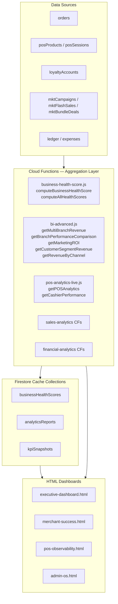
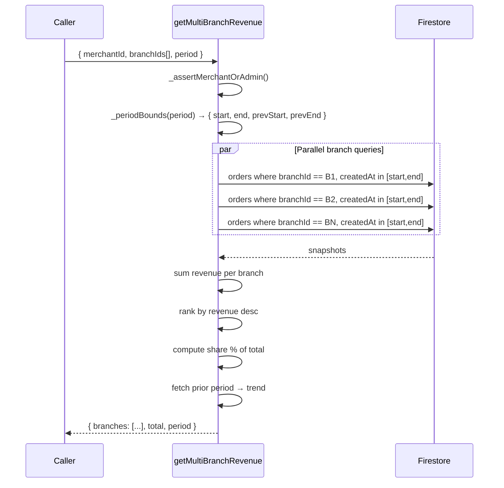
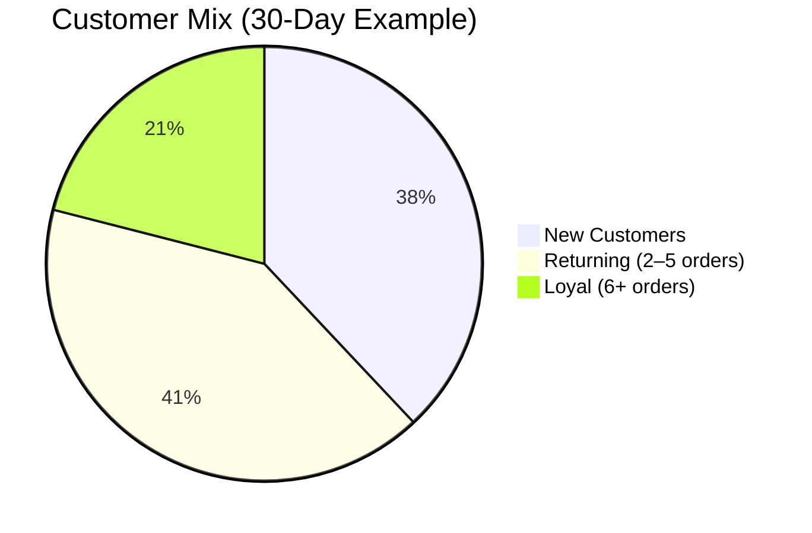
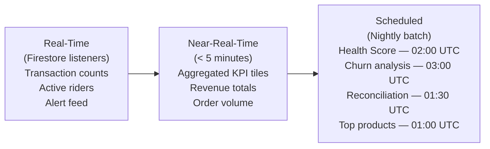

# SOKONI Commerce OS — Volume 14: Analytics & Business Intelligence

**Suite:** SOKONI Commerce OS Documentation
**Volume:** 14 of 20
**Status:** Production
**Last Updated:** 2026-06-29
**Maintainer:** SOKONI Engineering

---

## Table of Contents

1. [Executive Summary](#executive-summary)
2. [Analytics Architecture](#analytics-architecture)
3. [Business Health Score](#business-health-score)
4. [Multi-Branch Revenue](#multi-branch-revenue)
5. [Marketing ROI](#marketing-roi)
6. [Customer Segment Revenue](#customer-segment-revenue)
7. [Revenue by Channel](#revenue-by-channel)
8. [Executive Dashboard](#executive-dashboard)
9. [Sales Analytics](#sales-analytics)
10. [Inventory Analytics](#inventory-analytics)
11. [Customer Analytics](#customer-analytics)
12. [Financial Analytics](#financial-analytics)
13. [POS Analytics](#pos-analytics)
14. [Loyalty Analytics](#loyalty-analytics)
15. [AI Insights](#ai-insights)
16. [KPIs and Targets](#kpis-and-targets)
17. [Data Freshness](#data-freshness)
18. [Export and Reporting](#export-and-reporting)
19. [Performance Targets](#performance-targets)
20. [Cross-References](#cross-references)

---

## Executive Summary

SOKONI's Analytics and Business Intelligence layer delivers real-time, AI-augmented intelligence across every dimension of the platform. Rather than building a separate data warehouse, the platform derives its analytical power directly from Firestore collections, aggregated by Cloud Functions, and visualized in HTML dashboards that are shipped as part of the hosting layer.

The centerpiece is the **AI Business Health Score** — a 10-dimension composite score (0–100) computed nightly for every active merchant. It converts raw Firestore data into a single letter grade (A+ through F) that any merchant or admin can act on immediately. Supporting this are five advanced BI Cloud Functions (`bi-advanced.js`) that handle cross-branch revenue ranking, marketing ROI attribution, customer segment revenue, and channel revenue splits.

At the platform level the **executive-dashboard.html** surface provides operators with live GMV, order volume, gross revenue, margin, active merchants, and rider fleet data — auto-refreshing every 30 seconds with Canvas-based sparklines and a live alert feed.

Key capabilities in this volume:

- 10-dimension AI Business Health Score with industry benchmarks (retail, restaurant, pharmacy, fuel, wholesale)
- Claude Haiku narrative insights attached to every health score report
- Five advanced BI Cloud Functions (Gen2, App Check enforced)
- Executive dashboard (dark-mode, 30-second refresh, Canvas sparklines)
- Multi-branch revenue ranking with share percentage and trend
- Marketing ROI attribution across campaigns, flash sales, and bundles
- Customer segment revenue joined from loyalty tier data
- Revenue channel split (marketplace / POS / online / WhatsApp)
- POS cashier-level performance via `pos-analytics-live.js`
- Full export layer: CSV, scheduled email, PDF, external BI API

---

## Analytics Architecture

### Design Principle

At current SOKONI scale, a separate data warehouse (BigQuery, Redshift, Snowflake) would introduce operational overhead, replication lag, schema drift, and additional cost without meaningful benefit. The architecture instead treats Firestore as the system of record and uses Cloud Functions as the aggregation layer. Report results are cached back into dedicated Firestore documents so dashboards read pre-computed data rather than re-scanning collections on every page load.

### Component Map



### Runtime Stack

| Layer | Technology |
|---|---|
| Database | Cloud Firestore (Native mode) |
| Compute | Firebase Cloud Functions Gen2 (Node.js 22) |
| Caching | Firestore cache documents + TTL checks |
| Visualization | Canvas API + Chart.js (no external CDN dependency) |
| AI Narration | Claude Haiku via Anthropic API (`ANTHROPIC_API_KEY` secret) |
| Auth | Firebase Auth + App Check enforced on all BI CFs |
| Region | us-central1 |

### Security Model

Every BI Cloud Function enforces App Check and verifies that the requesting user either owns the `merchantId` being queried or holds an `admin` / `superAdmin` custom claim. This prevents merchants from querying competitor data even if they know the Firestore document path.

```javascript
// Enforced on every BI CF
const OPT = {
  region:          'us-central1',
  enforceAppCheck: true,
  timeoutSeconds:  120,
  memory:          '256MiB',
};
```

---

## Business Health Score

### Overview

The Business Health Score (`business-health-score.js`) produces a 0–100 composite score for each merchant across ten weighted dimensions. It runs both on-demand (merchant or admin triggers `computeBusinessHealthScore`) and on a nightly schedule (`computeAllHealthScores` at 02:00 UTC).

### Dimension Weights

| Dimension | Weight | Label |
|---|---|---|
| sales | 20% | Sales Performance |
| profitability | 18% | Profitability |
| customer | 15% | Customer Experience |
| inventory | 12% | Inventory Health |
| loyalty | 8% | Loyalty & Retention |
| staff | 8% | Staff Performance |
| fraud | 7% | Fraud & Security |
| operations | 5% | Operational Efficiency |
| financial | 5% | Financial Health |
| compliance | 2% | Compliance |

Weights sum to exactly 1.00. This distribution reflects that sales momentum and profitability are the primary health signals, while compliance is measured but penalised only when breached.

### Grade Scale

| Score Range | Grade | Label | Hex Colour |
|---|---|---|---|
| 90–100 | A+ | Exceptional | `#4CAF50` |
| 80–89 | A | Excellent | `#8BC34A` |
| 70–79 | B | Good | `#FFC107` |
| 60–69 | C | Fair | `#FF9800` |
| 50–59 | D | Needs Work | `#FF5722` |
| 0–49 | F | Critical | `#F44336` |

### Scoring Pipeline

```mermaid
flowchart LR
    T1[Sales scorer<br/>30-day orders vs prior 30d] --> AGG
    T2[Profitability scorer<br/>margin % vs benchmark] --> AGG
    T3[Inventory scorer<br/>dead stock + reorder miss] --> AGG
    T4[Customer scorer<br/>avg rating + dispute rate] --> AGG
    T5[Loyalty scorer<br/>redemption rate + tier dist.] --> AGG
    T6[Staff scorer<br/>cashier accuracy + session] --> AGG
    T7[Fraud scorer<br/>flagged txns + chargeback] --> AGG
    T8[Operations scorer<br/>fulfillment rate + latency] --> AGG
    T9[Financial scorer<br/>cash position + receivables] --> AGG
    T10[Compliance scorer<br/>eTIMS filing + KYB status] --> AGG
    AGG["Weighted Sum<br/>∑(score_i × weight_i)"] --> GRADE[Grade A+ → F]
    GRADE --> AI[Claude Haiku<br/>narrative + recommendations]
    AI --> CACHE[businessHealthScores/<br/>{merchantId}_{date}]
```

### Sales Dimension Scoring Logic

The sales scorer queries the last 30 days versus the prior 30-day window and computes growth:

- Growth ≥ 20% → score 98
- Growth ≥ 10% → score 90–98 (linear)
- Growth ≥ 5% → score 80–90 (linear)
- Growth ≥ 0% → score 70–80 (linear)
- Growth ≥ −10% → score 50–70 (linear)
- Growth ≥ −20% → score 30–50 (linear)
- Growth < −20% → score 20

A bonus of +5 applies for order count ≥ 50 (healthy volume), and −10 for fewer than 5 orders (insufficient trading signal).

### Industry Benchmarks

The engine ships with benchmark profiles for five Kenyan business verticals:

| Vertical | Sales | Profit | Inventory | Customer | Loyalty | Fraud |
|---|---|---|---|---|---|---|
| Retail | 72 | 65 | 78 | 75 | 68 | 85 |
| Restaurant | 70 | 60 | 82 | 80 | 72 | 88 |
| Pharmacy | 75 | 70 | 85 | 78 | 65 | 90 |
| Fuel | 80 | 55 | 90 | 72 | 60 | 85 |
| Wholesale | 68 | 68 | 76 | 65 | 58 | 82 |

When a merchant's dimension score falls below its vertical benchmark, the AI narrative flags this explicitly and recommends corrective action.

### Cache Document Schema

```
businessHealthScores/{merchantId}_{YYYY-MM-DD}
  ├── merchantId: string
  ├── date: string (ISO)
  ├── score: number (0–100)
  ├── grade: string ('A+' | 'A' | 'B' | 'C' | 'D' | 'F')
  ├── label: string ('Exceptional' | ... | 'Critical')
  ├── color: string (hex)
  ├── dimensions: { [key]: { score, weight, label, raw } }
  ├── benchmarks: { [key]: number }
  ├── narrative: string (Claude Haiku)
  ├── recommendations: string[]
  ├── computedAt: Timestamp
  └── ttl: Timestamp (+24h)
```

---

## Multi-Branch Revenue

The `getMultiBranchRevenue` Cloud Function queries orders across up to 10 branches in parallel and returns a ranked leaderboard.

### Query Flow



### Response Shape

Each branch entry in the response includes:

- `branchId` / `branchName`
- `revenue` (current period, KES)
- `orders` (transaction count)
- `aov` (average order value)
- `share` (percentage of total group revenue)
- `trend` (growth vs prior period, signed percentage)
- `rank` (1-based position)

---

## Marketing ROI

`getMarketingROI` evaluates the financial return of three campaign types against their estimated spend.

### ROI Formula

```
ROI = (revenue_attributed - cost_estimate) / cost_estimate × 100
```

A ROI of 0 means break-even. Positive values indicate profitable campaigns. The function reads:

- `mktCampaigns` — email/SMS/push campaigns with `spendEstimate` and attributed order linkage via `campaignId`
- `mktFlashSales` — time-limited price reductions with `soldCount` and `discountAmount`
- `mktBundleDeals` — product bundles with margin compression captured in `bundleMargin`

### Channel Attribution

Orders carry a `promoCode` or `campaignId` field at creation time. The ROI function joins these fields to the campaign collections to attribute revenue. Orders without attribution fall into the `organic` bucket, which is excluded from campaign ROI but reported separately as baseline.

### Response Structure

```json
{
  "campaigns": [
    { "id": "...", "name": "Ramadan Sale", "type": "email", "revenue": 48200, "cost": 3500, "roi": 12.77, "orders": 94 }
  ],
  "flashSales": [...],
  "bundleDeals": [...],
  "summary": {
    "bestType": "flashSales",
    "totalAttributedRevenue": 182400,
    "totalSpend": 14700,
    "blendedROI": 11.4
  }
}
```

---

## Customer Segment Revenue

`getCustomerSegmentRevenue` joins `loyaltyAccounts` tier assignments with `orders` revenue to produce revenue contribution by loyalty tier.

### Tier Mapping

| Tier | Qualification | Typical CLV Index |
|---|---|---|
| Diamond | Top 2% by spend | 5.2× |
| Gold | Top 10% by spend | 2.8× |
| Silver | Mid 30% by spend | 1.4× |
| Bronze | Entry level | 1.0× |

The function fetches all `loyaltyAccounts` for the merchant, groups customer UIDs by tier, then queries `orders` per tier group using `in` clauses (batched to Firestore's 30-element limit per batch). Revenue is summed per tier and the CLV estimate is derived from total tier revenue divided by customer count within the period.

---

## Revenue by Channel

`getRevenueByChannel` groups all orders for a merchant by their `channel` field and returns time-series data for the configured period.

### Supported Channels

| Channel Key | Source |
|---|---|
| `marketplace` | SOKONI marketplace web/app |
| `pos` | SmartPOS terminal sessions |
| `online` | MiniShop / branded storefront |
| `whatsapp` | WhatsApp Commerce orders |
| `delivery` | Third-party delivery integrations |

### Output

The function returns current-period revenue per channel, prior-period revenue, growth percentage, and share of total. Merchants can identify which channels are growing and which are stagnating without manual spreadsheet work.

---

## Executive Dashboard

The **executive-dashboard.html** is a dark-mode single-page application targeting platform operators (admin and super-admin roles). It uses the GitHub-inspired colour palette (`#0d1117` background, `#58a6ff` primary) and is fully responsive.

### KPI Tiles (Top Row)

| KPI | Source | Refresh |
|---|---|---|
| Gross Merchandise Value (GMV) | Aggregated orders | 30 seconds |
| Total Orders | Live Firestore count | 30 seconds |
| Platform Revenue (commissions) | Commission ledger | 30 seconds |
| Gross Margin % | Revenue vs COGS | 30 seconds |
| Active Merchants | merchantProfiles where status=active | 30 seconds |
| Active Riders | riderProfiles where status=online | 30 seconds |

### Canvas Sparklines

Each KPI tile renders a 7-day sparkline using the native Canvas API, avoiding Chart.js for the tile layer (keeping initial bundle weight low). The sparkline data is fetched from `kpiSnapshots` daily aggregation documents.

### Alert Feed

A live Firestore listener on `platformAlerts` collection populates a scrolling alert strip below the KPI row. Alert severities map to the colour palette: critical (`--red`), warning (`--orange`), info (`--blue`).

### 30-Second Auto-Refresh

A `setInterval` loop fires every 30,000 ms and calls all BI Cloud Functions in parallel using `Promise.allSettled`, so a single slow function does not block the others from updating the UI.

---

## Sales Analytics

### Time Granularities

| Granularity | Lookback | Use Case |
|---|---|---|
| Hourly | Current day | Identify peak trading hours |
| Daily | Last 30 days | Spot weekday vs weekend patterns |
| Weekly | Last 12 weeks | Detect seasonal trends |
| Monthly | Last 12 months | MoM growth tracking |
| Annual | Last 3 years | YoY comparison |

### Key Metrics

- **AOV (Average Order Value):** total revenue / order count; tracked daily with 30-day moving average
- **Transaction Count vs Value:** volume anomalies (many small orders vs few large) surface fraud or channel shift signals
- **Top Products:** ranked by revenue contribution; refreshed daily at 01:00 UTC
- **Top Categories:** aggregated from product metadata; used to identify demand concentration risk
- **Hourly Heatmap:** 24 × 7 grid showing order volume per hour per day of week; rendered as a Canvas grid in merchant dashboards

### YoY Comparison

Year-over-year comparisons align calendar weeks to account for day-of-week effects. A merchant's Week 26 of 2026 is compared to Week 26 of 2025, not raw calendar date arithmetic.

---

## Inventory Analytics

See also [[vol-07-inventory-management]] for the underlying stock engine.

### Metrics Tracked

| Metric | Formula | Alert Threshold |
|---|---|---|
| Stock Turnover Rate | COGS / Average Inventory Value | < 2× per quarter |
| Dead Stock | Units with zero sales in 90 days | > 15% of SKUs |
| Shrinkage | (Opening + Received) − (Sold + Closing) | > 2% of COGS |
| Reorder Forecast Accuracy | Predicted demand vs actual demand | < 80% accuracy |

### COGS by Period

Cost of Goods Sold is computed using the AVCO (Average Cost) method implemented in the Commerce OS. Each unit sold carries a weighted average cost at the time of sale, ensuring COGS figures remain accurate even when supplier prices fluctuate.

### Supplier Performance

Each inbound stock movement records `supplierId`. The analytics layer aggregates:

- On-time delivery rate per supplier
- Average lead time vs quoted lead time
- Rejection rate (damaged / incorrect SKU on arrival)

---

## Customer Analytics

See also [[vol-11-crm-marketing]] for the CRM data model.

### Acquisition vs Retention



### Cohort Retention

Customers are grouped into weekly acquisition cohorts. The retention grid shows what percentage of each cohort placed another order in subsequent weeks. A healthy SOKONI merchant should see Week-4 retention above 30% for food/daily-use categories, and above 15% for discretionary retail.

### Key Acquisition and Lifetime Metrics

| Metric | Definition |
|---|---|
| CAC (Customer Acquisition Cost) | Marketing spend / new customers in period |
| LTV (Lifetime Value) | Average order value × purchase frequency × average customer lifespan |
| Purchase Frequency | Orders / unique customers in period |
| Geographic Heat Map | Order delivery coordinates clustered by 500m grid cells |

---

## Financial Analytics

See also [[vol-05-accounting]] for the double-entry ledger design.

### Revenue vs Budget

Merchants who configure a monthly revenue budget in their profile settings see a live progress bar and projected month-end figure based on the current daily run rate.

### Gross Margin by Category

Each order line item carries a `costPrice` recorded at the time of sale (AVCO). Gross margin is computed as:

```
Gross Margin % = (Revenue - COGS) / Revenue × 100
```

The analytics layer groups this by product category to surface which categories carry healthy margins and which are being sold near or below cost.

### Cash Position and 7-Day Forecast

The 7-day cash forecast model (part of [[vol-05-accounting]] FinOS) reads:
- Current wallet balance
- Pending settlement amounts (escrow)
- Historical average daily spend (outflows)
- Projected revenue based on the prior-week run rate

### VAT Liability

For merchants registered for VAT, the analytics layer maintains a running VAT output tax figure (16% on taxable supplies) and input tax credit estimate, producing a net VAT liability figure updated daily. This feeds the eTIMS filing workflow in [[vol-08-etims-compliance]].

---

## POS Analytics

`pos-analytics-live.js` delivers cashier-level intelligence to SmartPOS merchants.

### Cashier Performance Dashboard

| Metric | Definition |
|---|---|
| Transactions per shift | Count of completed sessions |
| Average basket size | Revenue / transaction count |
| Average checkout time | Mean seconds from scan-start to payment-complete |
| Void rate | Voided lines / total lines scanned |
| Discount rate | Discount value / gross sales |
| Cash vs card split | By payment method |

### Hourly Transaction Volume

A 24-column bar chart (one per hour, grouped by day) shows trading patterns. The system identifies the top-3 peak hours automatically and flags them as staffing guidance in the daily ops report.

### Peak Hour Analysis

Peak hours are computed as the top quartile of hourly revenue for the trailing 28 days. Merchants with a predictable lunch spike (e.g., 12:00–14:00 for restaurants) receive automatic staffing reminder notifications via the [[vol-09-notifications]] notification engine.

---

## Loyalty Analytics

See also [[vol-06-loyalty-rewards]] for the full loyalty engine design.

### Points Liability

The platform maintains a `pointsLiability` figure — the monetary value of all unredeemed points — computed as:

```
Liability (KES) = Total Outstanding Points × Redemption Rate per Point
```

This figure appears on the merchant financial dashboard as a contingent liability.

### Key Loyalty Metrics

| Metric | Target |
|---|---|
| Redemption Rate | > 40% of earned points redeemed within 90 days |
| Tier Upgrade Rate | > 15% of Bronze customers reaching Silver in 6 months |
| Loyalty ROI | Revenue from loyalty members vs non-members |
| Churn Saved | Customers who were at churn risk but re-engaged via loyalty reward |

### Cross-Merchant Network Activity

Enterprise Loyalty members can earn and redeem points across the SOKONI merchant network. The analytics layer tracks cross-merchant earn and burn flows, identifying which partner merchants benefit most from the network effect and adjusting their loyalty incentive tiers accordingly.

---

## AI Insights

Every Business Health Score report triggers a Claude Haiku inference call that produces:

### Narrative Summary

A 3–5 sentence plain-language summary of the merchant's current health, written for a business owner rather than a data analyst. Example:

> "Your sales grew 14% this month — well above the retail benchmark of 72. However, your inventory health score of 41 indicates that 23% of your SKUs have not sold in 90 days, tying up capital. Your customer experience score remains strong at 81, suggesting your service quality is a competitive advantage."

### Anomaly Explanations

When a dimension score drops more than 15 points week-over-week, the AI generates an anomaly explanation card. It correlates the drop with observable signals: e.g., a spike in `disputes` collection documents around the same date, or a sudden change in fulfillment time.

### Action Recommendations

The health score response includes a `recommendations` array (up to 5 items), ranked by estimated impact. Each recommendation includes:

- `dimension` — which health dimension it addresses
- `action` — specific, actionable step
- `expectedImpact` — estimated score improvement if implemented
- `effort` — low / medium / high

### Natural Language Query (Planned)

A future iteration will allow merchants to ask KASS (the AI concierge) questions like "Why did my health score drop last week?" and receive a narrative answer grounded in the same dimension data. See [[vol-10-artificial-intelligence]] for the KASS architecture.

---

## KPIs and Targets

### Merchant KPIs

| KPI | Target | Frequency |
|---|---|---|
| Monthly Revenue Growth | ≥ 10% MoM | Monthly |
| Gross Margin % | ≥ 30% (retail) / ≥ 60% (services) | Monthly |
| Inventory Turnover | ≥ 4× per year | Quarterly |
| Customer Repeat Rate | ≥ 40% within 60 days | Monthly |
| Order Fulfillment Rate | ≥ 95% | Weekly |
| Health Score | ≥ 70 (Grade B) | Daily |

### Cashier KPIs

| KPI | Target | Frequency |
|---|---|---|
| Transactions per shift | ≥ 80 (high-volume POS) | Daily |
| Average basket size | ≥ Merchant AOV − 10% | Daily |
| Void rate | ≤ 3% | Daily |
| Checkout time | ≤ 90 seconds | Daily |

### Rider KPIs

| KPI | Target | Frequency |
|---|---|---|
| Deliveries per day | ≥ 15 (Nairobi urban) | Daily |
| On-time delivery rate | ≥ 90% | Weekly |
| Customer rating | ≥ 4.3 / 5.0 | Weekly |
| Acceptance rate | ≥ 80% | Daily |
| Cancellation rate | ≤ 10% (auto-suspend at ≥ 10) | Daily |

### Admin / Platform KPIs

| KPI | Target | Frequency |
|---|---|---|
| Platform GMV | Defined by quarterly OKR | Monthly |
| Commission Revenue | ≥ 3.2% of GMV blended | Monthly |
| Merchant Churn Rate | ≤ 5% per quarter | Quarterly |
| New Merchant Onboarding | Pipeline target | Weekly |
| Platform Health Score | ≥ 80 average across all merchants | Weekly |

---

## Data Freshness

SOKONI's analytics layer uses a tiered freshness model matched to each metric's business criticality:



| Data Type | Freshness | Mechanism |
|---|---|---|
| Transaction counts | Real-time | Firestore `onSnapshot` listener |
| Active riders / merchants | Real-time | Firestore `onSnapshot` listener |
| Revenue KPI tiles | < 5 minutes | Polling Cloud Function + Firestore cache |
| Channel revenue split | < 5 minutes | Polling + cache TTL |
| Marketing ROI | < 5 minutes | On-demand CF call with 5-minute cache |
| Business Health Score | 24 hours | `computeAllHealthScores` at 02:00 UTC |
| Churn risk flags | 24 hours | Scheduled CF at 03:00 UTC |
| Cohort retention grid | 24 hours | Scheduled CF at 04:00 UTC |
| Financial reconciliation | 24 hours | `scheduledReconciliation` at 01:30 UTC |

Cache TTL is stored as a `ttl` Timestamp field on each cache document. CFs check the TTL before re-computing — if the cached document is still fresh, the cached result is returned immediately without touching source collections.

---

## Export and Reporting

### CSV Export

Merchants and admins can trigger CSV exports for:

- Orders (date range, with or without line items)
- Inventory snapshot (current stock levels, COGS, reorder status)
- Customer list (anonymised by default; PII-complete for GDPR data requests)
- Loyalty points ledger
- Staff performance summary

CSV generation happens in a Cloud Function (`generateReport`) that writes the file to Cloud Storage and returns a signed URL valid for 24 hours. The URL is delivered via an in-app notification and email.

### Scheduled Email Reports

The platform supports scheduled email reports via the SendGrid integration. Merchants can configure:

- Daily summary (yesterday's revenue, top product, new customers)
- Weekly digest (week-over-week comparison, health score, inventory alerts)
- Monthly financial summary (P&L summary, VAT liability, cashflow)

Report templates live in the email system's 53-template library. See the [[vol-09-notifications]] document for delivery mechanics.

### PDF Generation

For formal reporting (accountant-ready P&L, VAT return workings), the platform generates PDFs server-side using a headless Chrome approach. The PDF job is queued to a Cloud Task and the generated file is stored in Cloud Storage with a merchant-scoped access path.

### External BI API

Enterprises requiring integration with third-party BI tools (Power BI, Tableau, Metabase) can access a read-only API surface. Access is token-gated (admin issues API tokens via admin-os.html). The API exposes:

- `/api/bi/revenue?merchantId=...&period=...`
- `/api/bi/healthscore?merchantId=...&date=...`
- `/api/bi/channels?merchantId=...&period=...`
- `/api/bi/inventory?merchantId=...`

Rate limited to 60 requests per minute per token. Responses are paginated (50 records default, 500 max).

---

## Performance Targets

| Operation | Target | Measurement Point |
|---|---|---|
| Executive dashboard initial load | < 2 seconds | Time to interactive |
| KPI tile refresh (30s cycle) | < 500 ms per tile | CF response time |
| Channel revenue split (on-demand) | < 3 seconds | End-to-end CF latency |
| Multi-branch revenue (10 branches) | < 5 seconds | Parallel query completion |
| 12-month P&L report | < 10 seconds | Full render including chart |
| Health score computation (per merchant) | < 30 seconds | Single merchant CF call |
| Batch health score (all merchants, 02:00 UTC) | < 20 minutes | Full batch completion |
| CSV export (10,000 orders) | < 60 seconds | File available in Storage |

### Optimisation Patterns Applied

- **Parallel Firestore queries:** All multi-branch and multi-dimension queries use `Promise.all` to execute in parallel rather than serially.
- **Cache-first reads:** Dashboard tiles read from `kpiSnapshots` or `businessHealthScores` first; only trigger a CF recompute if the TTL has expired.
- **Firestore projection:** All aggregation queries use `.select()` to fetch only the fields needed (e.g., `totalAmount`, `createdAt`, `status`), minimising document read cost.
- **Composite indexes:** All time-range + merchantId queries rely on composite Firestore indexes defined in `firestore.indexes.json`.
- **Memory sizing:** BI CFs are sized at 256 MiB — sufficient for 10-branch parallel queries without incurring the cost of larger instances.

---

## Cross-References

- [[vol-10-artificial-intelligence]] — Claude Haiku integration, KASS AI concierge, AI policy engine
- [[vol-05-accounting]] — Double-entry ledger, FinOS v2, 7-day forecast, VAT computation
- [[vol-11-crm-marketing]] — CRM data model, marketing campaign engine, customer segmentation
- [[vol-15-enterprise-operations]] — Admin OS, ops center, alert management, platform health monitoring
- [[vol-06-loyalty-rewards]] — Loyalty tier definitions, points liability, cross-merchant network
- [[vol-07-inventory-management]] — AVCO, dead stock, reorder engine, shrinkage tracking
- [[vol-08-etims-compliance]] — eTIMS filing, KRA integration, VAT reporting
- [[vol-09-notifications]] — Scheduled email reports, alert delivery, DND windows
- [[vol-12-smartpos]] — POS cashier analytics, pos-analytics-live.js, session management
- [[vol-13-logistics]] — Rider KPIs, delivery tracking, fleet monitoring

---

## Appendix A: Cloud Functions Reference

| Function | File | Trigger | Auth |
|---|---|---|---|
| `computeBusinessHealthScore` | `business-health-score.js` | onCall | App Check + merchant/admin |
| `computeAllHealthScores` | `business-health-score.js` | onSchedule (02:00 UTC) | N/A (service account) |
| `getMultiBranchRevenue` | `bi-advanced.js` | onCall | App Check + merchant/admin |
| `getBranchPerformanceComparison` | `bi-advanced.js` | onCall | App Check + merchant/admin |
| `getMarketingROI` | `bi-advanced.js` | onCall | App Check + merchant/admin |
| `getCustomerSegmentRevenue` | `bi-advanced.js` | onCall | App Check + merchant/admin |
| `getRevenueByChannel` | `bi-advanced.js` | onCall | App Check + merchant/admin |

## Appendix B: Firestore Collections Used

| Collection | Purpose |
|---|---|
| `orders` | Primary revenue source; channel, promoCode, campaignId fields |
| `posProducts` | Inventory health scoring |
| `mktCampaigns` | Marketing ROI attribution |
| `mktFlashSales` | Flash sale ROI |
| `mktBundleDeals` | Bundle deal ROI |
| `loyaltyAccounts` | Customer tier assignment for segment revenue |
| `businessHealthScores` | Nightly health score cache |
| `kpiSnapshots` | Daily aggregated KPI snapshots for sparklines |
| `analyticsReports` | On-demand report results cache |
| `platformAlerts` | Live alert feed for executive dashboard |

---

*Volume 14 of the SOKONI Commerce OS Documentation Suite. For the full index see [[SOKONI-Documentation-Index]]. All Cloud Function code is in `functions/bi-advanced.js` and `functions/business-health-score.js`. Executive dashboard UI is at `executive-dashboard.html`.*
