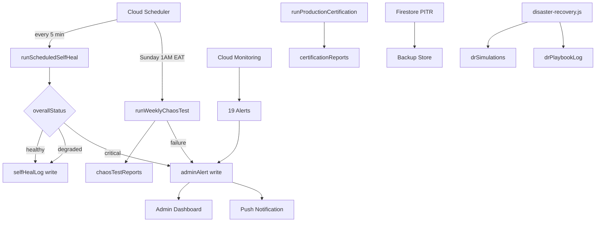
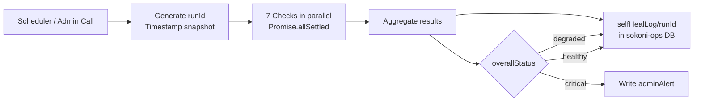
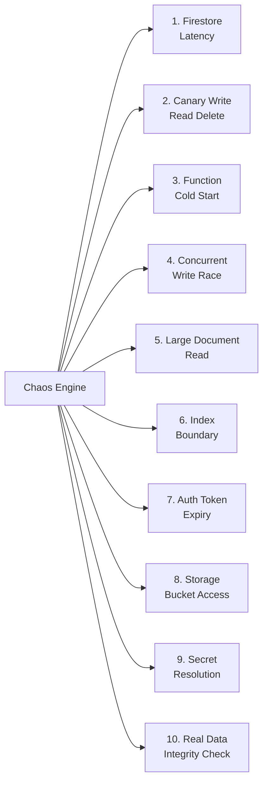
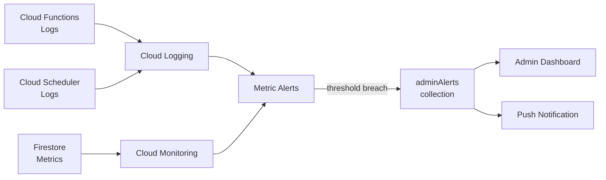
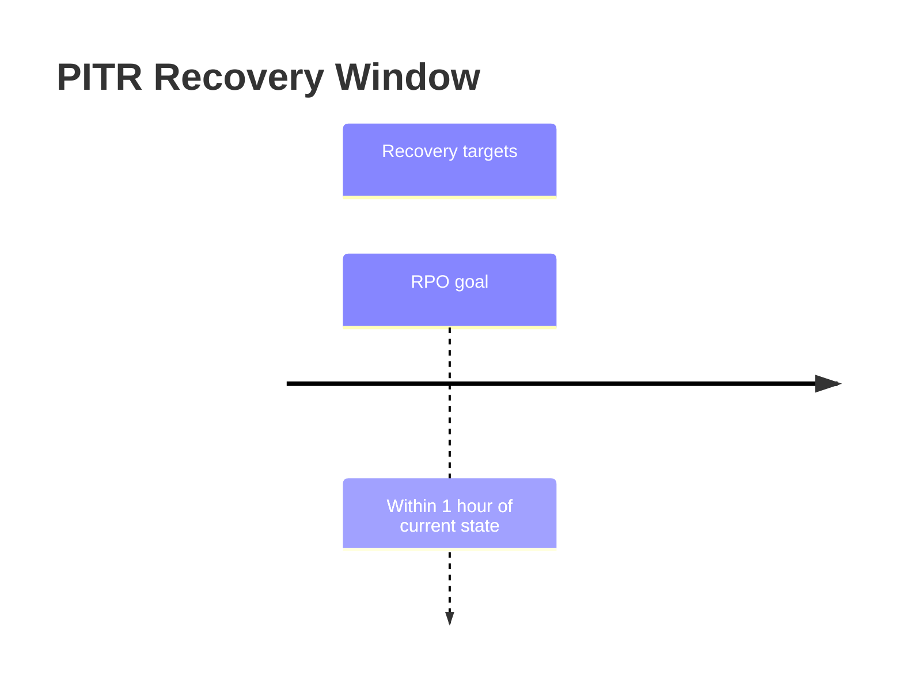
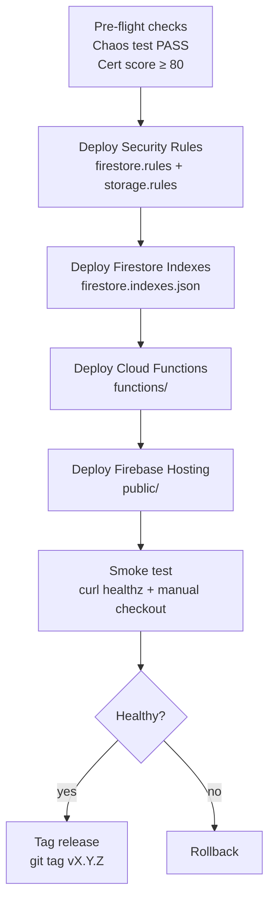

# SOKONI Commerce OS — Volume 15: Enterprise Operations

> **Series:** SOKONI Commerce OS Documentation Suite  
> **Volume:** 15 of 20  
> **Status:** Production  
> **Last Updated:** 2026-06-29  
> **Firebase Project:** `sokoni-aeb26`  
> **Domain:** `mysokoni.co.ke`  
> **Classification:** Internal Engineering Reference

---

## Related Volumes

[[vol-02-identity-security]] | [[vol-03-pos-enterprise]] | [[vol-17-testing-qa]] | [[vol-18-production-certification]]

See also: [[Commerce OS]] | [[SmartPOS]] | [[Payments]] | [[Authentication]] | [[Events]] | [[Orders]] | [[Marketplace]]

---

## 1. Executive Summary

SOKONI operates as a 24/7 digital ecosystem serving merchants, buyers, drivers, and administrators across Kenya. The platform cannot afford planned downtime — merchant POS terminals process real payments around the clock, delivery riders depend on live dispatch, and buyers expect instant order acknowledgement. Enterprise Operations is the discipline that keeps all of this running without human intervention outside of genuine emergencies.

The operations layer rests on four pillars:

| Pillar | Mechanism | Cadence |
|---|---|---|
| Self-Healing | `runScheduledSelfHeal` Cloud Function | Every 5 minutes |
| Chaos Engineering | `runWeeklyChaosTest` Cloud Function | Sunday 1:00 AM EAT |
| Production Certification | `runProductionCertification` Cloud Function | On demand / post-deploy |
| Disaster Recovery | PITR + DR simulation + playbooks | Verified monthly |

Together these pillars ensure that most operational issues are detected, categorised, and repaired automatically before any user is aware a problem existed. Where automatic repair is not possible the system escalates to the admin team with a structured alert that includes the affected resource, the severity, and the recommended remediation step.

Zero-downtime deployments are achieved through Firebase Hosting's atomic rollout model, graduated function rollout using traffic splitting, and a kill-switch feature flag system that can disable any feature for any merchant within seconds.

---

## 2. System Architecture Overview



---

## 3. Self-Healing Engine

### 3.1 Overview

The Self-Healing Engine is implemented in `functions/self-heal.js`. It runs as a Gen2 Cloud Scheduler job (`onSchedule`) every 5 minutes and is also callable on demand by administrators via an `onCall` endpoint (`runManualSelfHeal`). Both entry points execute the same core logic: seven parallel health checks, each reporting a structured result, which are then aggregated into an overall platform status.



### 3.2 Configuration

| Parameter | Value |
|---|---|
| Schedule | `every 5 minutes` |
| Region | `us-central1` |
| AppCheck | `enforceAppCheck: true` |
| Log target | `selfHealLog/{runId}` in `sokoni-ops` database |
| Alert target | `adminAlerts` collection in `sokoni-ops` database |
| Timeout | 540 seconds (Gen2 maximum) |

### 3.3 Overall Status Derivation

After all seven checks complete, the engine computes `overallStatus`:

- **healthy** — all checks resolved without error and no critical condition was detected.
- **degraded** — one or more checks detected anomalies that were auto-repaired, or a check reported non-zero `errors` while repairs were still attempted.
- **critical** — any check detected a condition that could not be automatically resolved, or the error count exceeds the configured threshold.

A `critical` status immediately triggers an `adminAlert` write. `degraded` and `healthy` results are logged without alerting unless the same degraded condition persists across multiple consecutive runs.

### 3.4 Structured Logger

The engine uses a structured logger bound to each `runId`:

```js
// functions/self-heal.js — lines 28-35
function createLogger(runId) {
  const base = { service: 'self-heal', runId };
  return {
    info:  (msg, x = {}) => console.log(JSON.stringify({ severity: 'INFO',    message: msg, ...base, ...x })),
    warn:  (msg, x = {}) => console.warn(JSON.stringify({ severity: 'WARNING', message: msg, ...base, ...x })),
    error: (msg, x = {}) => console.error(JSON.stringify({ severity: 'ERROR',  message: msg, ...base, ...x })),
  };
}
```

All log lines are structured JSON with `severity`, `message`, `service`, and `runId` fields so that Cloud Logging filters and alerts can target them precisely.

---

## 4. Seven Automated Health Checks

Each check runs independently inside `Promise.allSettled()`. A check that throws an unhandled exception is caught at the aggregation layer and recorded as an error without blocking the other six checks.

### 4.1 Check 1 — Stuck Payment Sessions

**Trigger:** A `paymentSession` document has `updatedAt` older than 30 minutes and its `status` is not in the terminal set `[COMPLETED, FAILED, EXPIRED, VOIDED, ARCHIVED]`.

**Repair actions:**
1. Update the document: set `status = EXPIRED`, record `expiredAt`, append `_auditNote` for the audit trail.
2. If the session has a `deviceId`, write a `remoteCommands` sub-document to `posDevices/{deviceId}` so the POS terminal can reconcile its local state.
3. Increment `result.fixed` for reporting.

**Alert condition:** If any individual session update throws, the error is counted but the engine continues with remaining sessions. If `errors > 0`, the check result is marked `error`.

**Why this matters:** A payment session stuck in `PENDING` blocks merchant reconciliation and can cause false revenue reporting. Auto-expiry restores the session to a known terminal state that downstream reconciliation can process correctly.

### 4.2 Check 2 — Failed Sync Queue Retry

**Trigger:** A document in `syncQueue` has `status = failed` and `retryCount < 5`.

**Repair actions:**
1. Compute the next retry delay using exponential backoff: `delay = 2^retryCount * 30 seconds`.
2. Update `status = pending`, increment `retryCount`, set `nextRetryAt = now + delay`.
3. The sync worker picks the document on its next poll cycle.

**Terminal condition:** Items with `retryCount >= 5` are not touched by this check. They are flagged for manual review via a separate alert.

**Backoff table:**

| Retry | Delay |
|---|---|
| 0 → 1 | 30 s |
| 1 → 2 | 60 s |
| 2 → 3 | 120 s |
| 3 → 4 | 240 s |
| 4 → 5 (terminal) | manual review |

### 4.3 Check 3 — Negative Inventory

**Trigger:** A document in `inventory` has `quantity < 0`.

**Repair actions:**
1. Flag the document with `integrityFlag = negative_quantity` and `flaggedAt = now`.
2. Write an `adminAlert` at `severity: warning` referencing the `productId` and `merchantId`.
3. Do not auto-correct the quantity — doing so would hide a real data integrity problem.

**Why no auto-correct:** Negative inventory can result from a race condition, an incorrect write, or an unprocessed return. Silently setting quantity to zero would mask the root cause. The alert drives investigation.

### 4.4 Check 4 — Loyalty Ledger Drift

**Trigger:** A random sample of 20 loyalty accounts is taken. For each account, the engine sums all `loyaltyTransactions` sub-documents and compares the result to the `pointsBalance` field on the account document. A drift of more than 10 points on any account triggers an alert.

**Why sampling:** Scanning every loyalty account on every 5-minute run would be prohibitively expensive at scale. A 20-account sample provides probabilistic coverage. Over 24 hours (288 runs × 20 accounts each), every account in a dataset of several thousand is checked multiple times.

**Alert condition:** `severity: warning`. The alert includes `accountId`, `calculatedBalance`, `storedBalance`, and `drift`.

**Repair:** Not auto-corrected. Ledger corrections require a reconciliation transaction that debits or credits the difference with a `source = ledger_correction` transaction record for auditing.

### 4.5 Check 5 — Stale Device Heartbeats

**Trigger:** A `posDevice` document has `lastHeartbeat` older than 2 hours and `connectivity != offline`.

**Repair actions:**
1. Update `connectivity = offline` and `offlineSince = now`.
2. If the device was marked `connectivity = online`, also write to `posDeviceStatusHistory` for fleet monitoring.

**Why 2 hours:** POS devices send heartbeats every 5 minutes under normal operation. A 2-hour gap indicates a genuine connectivity failure rather than a momentary blip. Marking the device offline prevents the dispatch system from routing orders to a terminal that cannot process them.

### 4.6 Check 6 — Unresolved Critical Alerts Escalation

**Trigger:** An `adminAlert` document has `severity = critical`, `resolved = false`, and `createdAt` older than 24 hours.

**Repair actions:**
1. Update the existing alert document with `escalated = true` and `escalatedAt = now`.
2. Write a new `adminAlert` at `severity: critical` with `category: escalation` so the admin dashboard surfaces it as a fresh item.

**Design rationale:** Critical alerts that remain unresolved for 24 hours indicate a failure of the on-call process. The escalation creates a second alert to ensure the issue remains visible even if the first alert was acknowledged and then forgotten.

### 4.7 Check 7 — Bootstrap Cache Staleness

**Trigger:** The bootstrap cache document (typically `platformCache/bootstrap`) has `cachedAt` older than 10 minutes.

**Repair actions:**
1. Delete the stale cache document.
2. The next request to the bootstrap endpoint will regenerate the cache.

**Why this matters:** The bootstrap cache holds platform configuration, feature flags, and capability keys that all Cloud Functions read on cold start. A stale bootstrap cache can cause functions to operate with outdated configuration — for example, serving a feature that has been disabled via kill switch.

---

## 5. Chaos Engineering

### 5.1 Philosophy

SOKONI's chaos engineering programme follows the principle that controlled failure in a test window is preferable to uncontrolled failure in production. Rather than waiting for real incidents to reveal platform weaknesses, the chaos engine deliberately induces failure scenarios every week and validates that the platform responds correctly.

### 5.2 Schedule

```
Cron: 0 22 * * 0   (UTC)
EAT:  Sunday 01:00 AM
```

Sunday 1:00 AM EAT is chosen because it is the lowest-traffic period of the week for the Kenyan market. The test window is expected to complete within 5 minutes, well before the Sunday morning trading period begins.

### 5.3 Chaos Scenarios

The `runWeeklyChaosTest` function executes 10 scenarios:



| # | Scenario | Pass Condition |
|---|---|---|
| 1 | Firestore write + read latency | Round-trip < 500 ms |
| 2 | Canary write / read / delete cycle | All three operations succeed with data integrity |
| 3 | Function cold start simulation | Initialization < 10 s |
| 4 | Concurrent write race on a shared counter | Final value matches expected with no corruption |
| 5 | Large document read (simulate heavy query) | Completes without timeout |
| 6 | Index boundary query (near compound index limit) | Returns correct results |
| 7 | Auth token validation under expiry conditions | Rejection or refresh handled correctly |
| 8 | Cloud Storage bucket accessibility | Bucket readable and writable |
| 9 | Secret Manager resolution | All required secrets resolvable |
| 10 | Real data integrity spot-check | Sample documents pass schema validation |

### 5.4 Results and Reporting

Each chaos run writes a report to `chaosTestReports/{YYYY-MM-DD}` in the `sokoni-ops` database:

```json
{
  "runDate": "2026-06-29",
  "totalScenarios": 10,
  "passed": 10,
  "failed": 0,
  "criticalFailures": 0,
  "durationMs": 187432,
  "scenarios": [ ... ],
  "overallResult": "PASS"
}
```

A critical failure in any scenario triggers an immediate `adminAlert` at `severity: critical` with `category: chaos_engineering`. This alert is not automatically resolved — it requires human review and sign-off before the next deployment proceeds.

### 5.5 Chaos Test as Deployment Gate

The weekly chaos test result is one of the 12 domains checked by `runProductionCertification`. A FAIL result from the most recent chaos test will lower the certification score and may prevent a deployment from proceeding if the composite score drops below the required threshold. See [[vol-18-production-certification]] for certification scoring details.

---

## 6. Cloud Monitoring and Alerting

### 6.1 Monitoring Stack



SOKONI uses Firebase's native integration with Google Cloud Monitoring for infrastructure metrics and custom application metrics written via structured logs. The platform has 19 configured alert policies covering the most critical operational conditions.

### 6.2 Key Metrics

| Metric | p50 Target | p95 Target | p99 Target |
|---|---|---|---|
| Cloud Function latency | < 200 ms | < 800 ms | < 2,000 ms |
| Firestore read latency | < 50 ms | < 200 ms | < 500 ms |
| Payment processing time | < 3 s | < 8 s | < 15 s |
| Self-heal run duration | < 15 s | < 25 s | < 30 s |
| Chaos test duration | < 3 min | < 4 min | < 5 min |
| Production cert duration | < 90 s | < 110 s | < 120 s |

### 6.3 Alert Routing

All alerts converge on the `adminAlerts` collection in the `sokoni-ops` Firestore database. Every alert document carries:

- `severity`: `info` | `warning` | `critical`
- `category`: e.g. `payments`, `inventory`, `loyalty`, `chaos_engineering`, `escalation`
- `title` and `detail`: human-readable description
- `resolved`: `false` until acknowledged and resolved by an admin
- `source`: the originating system (e.g. `self_heal_engine`, `chaos_engine`, `cloud_monitoring`)
- `createdAt`: server timestamp

The admin dashboard polls this collection in real time. Unresolved critical alerts older than 24 hours are re-escalated by Check 6 of the Self-Healing Engine.

### 6.4 Uptime Checks

Firebase Hosting uptime is monitored from four Cloud Monitoring uptime check regions. The check hits `https://mysokoni.co.ke/healthz` every 60 seconds. An alert fires if two consecutive checks fail from the same region.

---

## 7. Feature Flags and Kill Switches

### 7.1 Flag Architecture

Feature flags are stored in Firestore under `featureFlags/{merchantId}`. A global default document at `featureFlags/__default__` applies to all merchants that do not have an explicit override.

```
featureFlags/
  __default__/
    loyaltyV2: true
    etimsIntegration: true
    smartposAdvanced: false
    maintenanceMode: false
  {merchantId}/
    smartposAdvanced: true     ← merchant-specific override
    overrides/
      {featureName}: { enabled: true, reason: "pilot", expiresAt: ... }
```

### 7.2 Canary Rollout

When introducing a new feature, the recommended process is:

1. Deploy the feature with the flag set to `false` in `__default__`.
2. Enable the flag for a pilot cohort of 10% of merchants by writing to individual `featureFlags/{merchantId}` documents.
3. Monitor error rates, latency, and user feedback for 24 hours.
4. If metrics are healthy, enable the flag in `__default__` to roll out to all merchants.
5. Remove the individual overrides once the rollout is complete.

### 7.3 Kill Switch Protocol

If a deployed feature causes a production incident:

1. Set the feature flag to `false` in `__default__` — takes effect on the next request, no redeployment required.
2. Write an `adminAlert` documenting the kill switch activation and the reason.
3. Investigate and fix the underlying issue.
4. Re-enable via canary rollout once the fix is deployed.

Kill switches are the fastest path to incident mitigation and should always be implemented for any feature that touches payments, inventory, or user data.

### 7.4 Maintenance Mode

Setting `maintenanceMode: true` in `featureFlags/__default__` causes all non-admin Cloud Functions to return a structured maintenance response. Client applications check this flag at startup and display a maintenance banner with an estimated return time. Maintenance windows should be communicated at least 48 hours in advance via the notification system.

---

## 8. Disaster Recovery

### 8.1 Recovery Objectives

| Objective | Target |
|---|---|
| RTO (Recovery Time Objective) | < 4 hours |
| RPO (Recovery Point Objective) | < 1 hour |

### 8.2 PITR — Point-in-Time Recovery

Firestore PITR is enabled on the `sokoni-aeb26` project. PITR retains the complete history of all Firestore writes for a rolling 7-day window. In the event of accidental data corruption or deletion, the database can be restored to any point within this window with one-minute granularity.



### 8.3 Disaster Recovery Module

`functions/disaster-recovery.js` exposes seven admin-only Cloud Functions:

| Function | Purpose |
|---|---|
| `runDRSimulation` | Simulate DR scenarios and record results in `drSimulations` |
| `verifyFirestoreBackup` | Verify PITR backup availability |
| `verifyStorageIntegrity` | Verify Cloud Storage bucket accessibility |
| `testSecretAccess` | Check which secrets are resolvable via `process.env` |
| `generateDRReport` | Produce a full DR readiness report (score 0-100) |
| `runRecoveryPlaybook` | Execute a named recovery playbook step and log to `drPlaybookLog` |
| `getDRHistory` | Fetch last 20 simulations and last 20 playbook runs |

All functions require `admin` or `superAdmin` custom claims and enforce App Check. Input is sanitised with the `_san()` helper that strips `< > " ' \`` to prevent injection.

### 8.4 DR Collections

```
drSimulations/        — one document per simulation run
drPlaybookLog/        — one document per playbook execution
backupVerifications/  — one document per backup verification check
```

### 8.5 Recovery Playbooks

Named playbooks executable via `runRecoveryPlaybook`:

| Playbook | Trigger Condition |
|---|---|
| `restore_payment_sessions` | Mass payment session corruption |
| `restore_inventory_snapshot` | Inventory collection corruption |
| `restore_loyalty_ledger` | Loyalty balance mass drift |
| `restore_user_profiles` | User collection corruption |
| `failover_cloud_storage` | Primary bucket inaccessible |

Each execution is logged with `startedBy`, `startedAt`, `completedAt`, `steps`, and `outcome`.

---

## 9. Backup Strategy

### 9.1 Firestore Backups

Firestore automated exports run daily at 02:00 AM EAT to a dedicated Cloud Storage bucket (`gs://sokoni-aeb26-backups/firestore/`). Exports are retained for 30 days. The export job is triggered via Cloud Scheduler and logs to Cloud Logging.

### 9.2 Cloud Storage Versioning

Object versioning is enabled on the primary media storage bucket. Previous versions are retained for 90 days before lifecycle rules delete them. This protects against accidental overwrites of product images, receipt PDFs, and signed contract documents.

### 9.3 Backup Verification

Monthly backup verification is performed by `verifyFirestoreBackup` and `verifyStorageIntegrity`. Results are written to `backupVerifications/` and a summary is included in the monthly DR report generated by `generateDRReport`. Any verification failure triggers a `severity: critical` admin alert.

### 9.4 Export Schedule Summary

| Asset | Frequency | Retention | Storage Path |
|---|---|---|---|
| Firestore full export | Daily 02:00 AM EAT | 30 days | `gs://sokoni-aeb26-backups/firestore/` |
| Cloud Storage versions | On write | 90 days | Same bucket, versioned |
| Backup verification log | Monthly | 12 months | `backupVerifications/` |

---

## 10. Deployment Process

### 10.1 Pre-Flight Sequence

Zero-downtime deployments follow a strict sequence to prevent transient states where code is running against an incompatible schema or rule set:



**Rules before code:** Security rules are deployed first so that new Cloud Functions cannot be invoked under the wrong access policy. **Indexes before queries:** New compound indexes must be deployed and built before any function that relies on them goes live. Index builds take up to 10 minutes on large collections.

### 10.2 Rollback Procedures

**Hosting rollback:** Firebase Hosting retains the last 10 deployment versions. An immediate rollback to any previous version takes effect within seconds:

```bash
firebase hosting:rollback --site sokoni-aeb26
```

**Functions rollback:** Cloud Functions does not have a one-command rollback. The procedure is:

1. Check out the previous release tag in git.
2. Redeploy the functions package.
3. Validate with smoke tests.

**Rules rollback:** Same procedure as functions — check out the previous rules file and redeploy.

### 10.3 Deployment Commands Reference

```bash
# Deploy everything (use only when all pre-flight checks pass)
firebase deploy --project sokoni-aeb26

# Deploy only rules (fastest safety fix)
firebase deploy --only firestore:rules,storage --project sokoni-aeb26

# Deploy only functions
firebase deploy --only functions --project sokoni-aeb26

# Deploy only hosting
firebase deploy --only hosting --project sokoni-aeb26

# Deploy specific function
firebase deploy --only functions:runScheduledSelfHeal --project sokoni-aeb26
```

---

## 11. Version Management

### 11.1 Service Worker Versioning

The service worker (`service-worker.js`) is versioned with a `CACHE_VERSION` constant. The current production version is **SW v301**. The version must be incremented with every deployment that changes cached assets, otherwise returning users may receive stale resources.

**Critical:** The `service-worker.js` file must never be cached by Cloudflare or any CDN. The `firebase.json` hosting configuration sets:

```json
{
  "headers": [
    {
      "source": "/service-worker.js",
      "headers": [
        { "key": "CDN-Cache-Control", "value": "no-store" },
        { "key": "Cache-Control", "value": "no-cache, no-store, must-revalidate" }
      ]
    }
  ]
}
```

Failure to set `CDN-Cache-Control: no-store` on the service worker caused a historical incident where Cloudflare cached an old SW for 7 days, resulting in `ERR_TOO_MANY_REDIRECTS` for affected users. See [[Cloudflare SW Cache Bug]] in the project memory.

### 11.2 Function Version Tracking

Cloud Functions versions are tied to the git tag at deployment time. The deployment process adds a `_deployedAt` and `_gitTag` annotation to the `platformConfig/version` document in Firestore so the admin dashboard can display the running version without checking git.

---

## 12. Production Certification

### 12.1 Overview

`runProductionCertification` is a Cloud Function that executes a 12-domain automated check and produces a composite score from 0 to 100. It is designed to be run after every significant deployment and before any major feature launch.

### 12.2 Scoring Domains

| # | Domain | Max Points |
|---|---|---|
| 1 | Security rules correctness | 15 |
| 2 | App Check enforcement | 10 |
| 3 | Payment integrity | 15 |
| 4 | Chaos test last result | 10 |
| 5 | Self-heal engine health | 10 |
| 6 | Firestore index coverage | 8 |
| 7 | Secret availability | 8 |
| 8 | Cloud Storage accessibility | 6 |
| 9 | Function cold-start latency | 6 |
| 10 | Backup verification recency | 5 |
| 11 | Alert backlog | 4 |
| 12 | DR readiness score | 3 |
| **Total** | | **100** |

### 12.3 Grade Scale

| Score | Grade | Deployment Recommendation |
|---|---|---|
| 95-100 | A+ | Deploy with confidence |
| 85-94 | A | Deploy; monitor for 30 min |
| 75-84 | B | Deploy only non-critical; investigate gaps |
| 60-74 | C | Do not deploy; fix issues first |
| < 60 | F | Halt all deployments; incident response |

### 12.4 Report Storage

```
certificationReports/{merchantId}_{YYYY-MM-DD}/
  score: 92
  grade: "A"
  domains: [ ... ]
  generatedAt: <timestamp>
  passedAll: false
  failedDomains: ["alert_backlog"]
```

---

## 13. Operational Runbooks

All runbooks live in the `docs/` directory (Obsidian vault). The following are the primary operational runbooks:

| Runbook | File | Trigger |
|---|---|---|
| Payment stuck | `docs/runbook-payment-stuck.md` | Check 1 alert or merchant complaint |
| Inventory negative | `docs/runbook-inventory-negative.md` | Check 3 alert |
| Loyalty ledger drift | `docs/runbook-loyalty-drift.md` | Check 4 alert |
| Deployment failure | `docs/runbook-deployment-failure.md` | Deploy exit code non-zero |
| Secret rotation | `docs/runbook-secret-rotation.md` | Quarterly schedule or compromise |
| DR activation | `docs/runbook-dr-activation.md` | RTO/RPO breach or data corruption |

Each runbook follows the structure: **Symptoms → Immediate mitigation → Root cause investigation → Resolution → Post-mortem**.

The primary entry-point runbook for domain and DNS procedures is `docs/OPS_RUNBOOK.md`, which documents DNS record configuration for `mysokoni.co.ke`, SSL verification, Firebase Hosting redirect rules, and email infrastructure setup.

---

## 14. Log Management

### 14.1 Log Standards

All Cloud Functions emit structured JSON logs compatible with Cloud Logging's structured logging format. Every log line includes at minimum:

- `severity`: `INFO` | `WARNING` | `ERROR` | `CRITICAL`
- `message`: human-readable description
- `service`: the function name or module identifier
- A correlation ID (e.g. `runId`, `orderId`, `sessionId`) for trace correlation

### 14.2 Sensitive Data Policy

The following data must never appear in logs:

- M-Pesa phone numbers (log last 4 digits only if needed)
- Full payment amounts in bulk log statements (use aggregates)
- User email addresses or national ID numbers
- Secret values or API keys
- Full JWT tokens or session cookies

### 14.3 Retention and Alerting

| Log type | Retention | Alert on |
|---|---|---|
| Cloud Functions logs | 30 days | ERROR severity from payment functions |
| Firestore audit logs | 30 days | Write to `adminAlerts` with severity critical |
| Cloud Scheduler logs | 30 days | Schedule execution failure |
| Self-heal run logs | 90 days (in Firestore `selfHealLog`) | overallStatus = critical |

---

## 15. Security Operations

### 15.1 Security Center Dashboard

`security-center.html` provides a SOC-style dashboard that surfaces real-time security metrics, unresolved critical alerts, recent auth anomalies, and the current production certification grade. Access is restricted to users with `superAdmin` custom claims.

### 15.2 Rotation Schedule

| Asset | Rotation Frequency | Procedure |
|---|---|---|
| Firebase Admin SDK keys | Quarterly | `runbook-secret-rotation.md` |
| IntaSend API keys | Quarterly | IntaSend dashboard + Secret Manager |
| SendGrid API key | Quarterly | SendGrid dashboard + Secret Manager |
| LOYALTY_HMAC_SECRET | Quarterly | Secret Manager + loyalty function redeploy |
| PAYMENT_HMAC_SECRET | Quarterly | Secret Manager + payment function redeploy |
| PAYROLL_ENCRYPTION_KEY | Quarterly | Secret Manager + payroll function redeploy |
| Firebase Hosting SSL | Automatic | Firebase provisions and renews automatically |

### 15.3 Access Reviews

Monthly: Review all users with `admin` or `superAdmin` custom claims. Remove stale access. Document in `auditLog`.

Annual: External penetration test covering the API surface, Firestore rules, and the web application. Findings are tracked in the security backlog and resolved within 30 days for critical, 90 days for high, 180 days for medium severity issues.

---

## 16. Cost Optimisation

### 16.1 Cloud Functions

All Cloud Functions use `minInstances: 0` (no warm instances) except for high-frequency endpoints such as the POS payment handler and the KASS AI concierge, which use `minInstances: 1` to eliminate cold-start latency for latency-sensitive flows. This configuration ensures the platform pays only for actual invocations during low-traffic periods.

### 16.2 Firestore

- All queries use `.limit()` to prevent unbounded full-collection scans.
- Pagination uses `startAfter()` cursors rather than `offset()` to avoid reading and discarding documents.
- The self-heal engine uses `limit(100)` on stuck payment queries to bound the read cost per run.
- Compound indexes are reviewed monthly to ensure they cover actual query patterns and no over-indexing occurs. The current index count is 197/200 — approaching the per-database limit, which is tracked in the [[Firestore Index Architecture]] memory document.

### 16.3 Cloud Storage

Lifecycle rules on the primary storage bucket:

- Move objects to `NEARLINE` storage after 30 days of no access.
- Move objects to `COLDLINE` storage after 90 days.
- Delete `tmp/` prefix objects after 7 days.
- Delete non-current object versions after 90 days.

### 16.4 Cloud Monitoring

Custom metrics are logged via structured log entries rather than custom metric writes where possible, as log-based metrics have no per-metric cost beyond the log ingestion cost that is already incurred.

---

## 17. Multi-Region Strategy

### 17.1 Current Deployment

All Cloud Functions and Firestore are deployed to `us-central1`. Firebase Hosting is globally distributed via the Firebase CDN, providing low-latency static asset delivery to Kenyan users without a regional function deployment.

### 17.2 Planned Regions

| Region | Trigger | Purpose |
|---|---|---|
| `africa-south1` (Johannesburg) | When available and stable | Reduce function latency for Kenyan users by ~60-80 ms |
| `europe-west1` (Belgium) | EU merchant expansion | GDPR data residency compliance |

### 17.3 Migration Approach

Regional migration will use a traffic-splitting approach: route 10% of traffic to the new region, monitor for 48 hours, then complete the cutover. PITR will be verified in the new region before decommissioning the old region's data.

---

## 18. Performance Targets Summary

| Operation | Target |
|---|---|
| Self-heal run complete | < 30 seconds |
| Chaos test complete | < 5 minutes |
| Production cert complete | < 2 minutes |
| Monitoring alert trigger | < 60 seconds from event |
| Feature flag kill switch activation | < 5 seconds (next request) |
| Hosting rollback | < 30 seconds |
| Functions rollback | < 10 minutes |
| PITR restore initiation | < 30 minutes |
| Full RTO | < 4 hours |
| RPO | < 1 hour |

---

## 19. Operational Health Dashboard

The operations state is visible through three surfaces:

1. **Admin Dashboard** (`admin-os.html`) — real-time `adminAlerts` feed, self-heal status, certification grade, chaos test last result.
2. **Reliability Center** (`reliability-center.html`) — historical self-heal run logs, uptime trends, error rate charts.
3. **Security Center** (`security-center.html`) — SOC-style view of security alerts, access anomalies, secret rotation status.
4. **POS Observability** (`pos-observability.html`) — SmartPOS device heartbeat map, stuck payment count, sync queue depth.

---

## 20. Cross-References

| Volume | Topic |
|---|---|
| [[vol-02-identity-security]] | Authentication, App Check enforcement, security rules |
| [[vol-03-pos-enterprise]] | SmartPOS device management, payment sessions, heartbeats |
| [[vol-17-testing-qa]] | Unit and integration testing, chaos test as quality gate |
| [[vol-18-production-certification]] | 12-domain certification scoring, grade thresholds |

Related platform documents:
- [[Commerce OS]] — Commerce OS v1.0 overview and module index
- [[Payments]] — Payment FSM, escrow, reconciliation
- [[SmartPOS]] — SmartPOS 4.0 architecture
- [[Authentication]] — Universal auth system
- [[Marketplace]] — Multi-vendor marketplace architecture

---

## Appendix A — Self-Heal Log Document Schema

```json
{
  "runId": "sh_1751212800000_abc123",
  "startedAt": "<server_timestamp>",
  "completedAt": "<server_timestamp>",
  "durationMs": 12847,
  "overallStatus": "healthy",
  "triggeredBy": "scheduler",
  "checks": {
    "stuckPayments":      { "check": "stuck_payments",      "count": 2, "fixed": 2, "errors": 0 },
    "syncQueue":          { "check": "sync_queue",          "count": 0, "fixed": 0, "errors": 0 },
    "negativeInventory":  { "check": "negative_inventory",  "count": 0, "fixed": 0, "errors": 0 },
    "loyaltyDrift":       { "check": "loyalty_drift",       "sampled": 20, "driftDetected": 0, "errors": 0 },
    "deviceHeartbeats":   { "check": "device_heartbeats",   "count": 1, "fixed": 1, "errors": 0 },
    "alertEscalation":    { "check": "alert_escalation",    "count": 0, "escalated": 0, "errors": 0 },
    "bootstrapCache":     { "check": "bootstrap_cache",     "purged": false, "errors": 0 }
  }
}
```

---

## Appendix B — Admin Alert Document Schema

```json
{
  "severity": "critical",
  "category": "payments",
  "title": "Stuck payment sessions detected",
  "detail": "3 sessions stuck in PENDING state > 30 minutes. Auto-expired by self-heal engine.",
  "resolved": false,
  "escalated": false,
  "source": "self_heal_engine",
  "createdAt": "<server_timestamp>",
  "meta": {
    "count": 3,
    "runId": "sh_1751212800000_abc123"
  }
}
```

---

## Appendix C — Chaos Test Report Schema

```json
{
  "runDate": "2026-06-29",
  "totalScenarios": 10,
  "passed": 9,
  "failed": 1,
  "criticalFailures": 0,
  "durationMs": 234100,
  "overallResult": "WARN",
  "scenarios": [
    {
      "name": "firestoreLatency",
      "passed": true,
      "durationMs": 87,
      "findings": []
    },
    {
      "name": "secretAccess",
      "passed": false,
      "durationMs": 5021,
      "findings": ["ANTHROPIC_API_KEY not resolvable in test environment"]
    }
  ]
}
```

---

*Document maintained by the SOKONI AI Engineering Team. Update this volume whenever self-heal checks, chaos scenarios, DR procedures, or deployment processes change. All changes must be reflected in CHANGELOG.md.*
