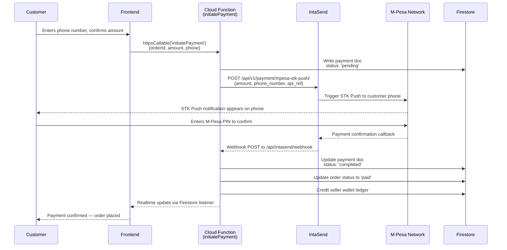
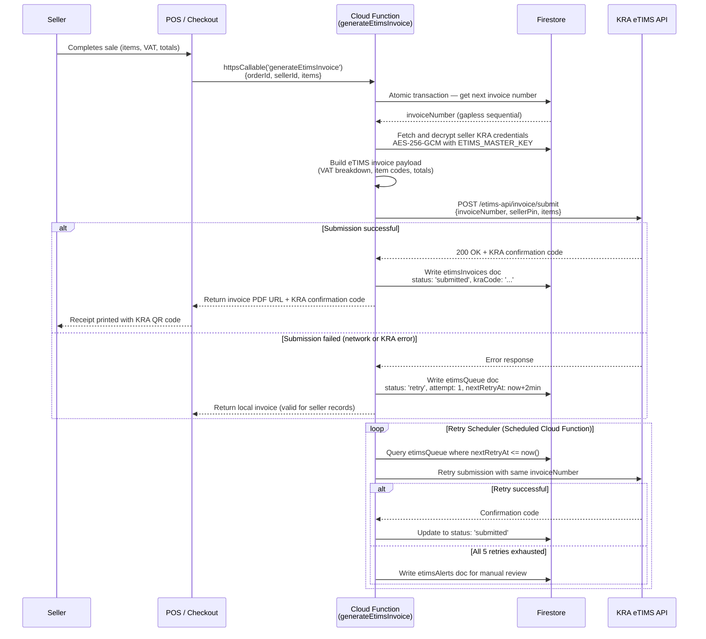

# Vol 16 — APIs & Integrations

> **SOKONI Technical Documentation Series — Volume 16 of 18**
> Project: `sokoni-aeb26` | Platform: Firebase / Cloud Functions | Region: `us-central1`

---

## Related Volumes

- [[vol-01-vision-architecture]] — Platform Architecture & Design Principles
- [[vol-02-identity-security]] — Authentication, Authorization & Security
- [[vol-04-payments]] — Payment Systems & Financial Flows
- [[vol-06-inventory-warehousing]] — Inventory & Warehouse Management
- [[vol-09-delivery-logistics]] — Delivery, Routing & Logistics
- [[vol-10-artificial-intelligence]] — AI Strategy & Intelligence Layer
- [[vol-14-analytics-bi]] — Analytics & Business Intelligence

---

## Table of Contents

1. [REST & Cloud Functions API Overview](#1-rest--cloud-functions-api-overview)
2. [Firebase SDK Integration](#2-firebase-sdk-integration)
3. [IntaSend Payment Integration](#3-intasend-payment-integration)
4. [KRA eTIMS Integration](#4-kra-etims-integration)
5. [SendGrid Email Integration](#5-sendgrid-email-integration)
6. [Firebase Cloud Messaging](#6-firebase-cloud-messaging-push-notifications)
7. [Algolia Search Integration](#7-algolia-search-integration)
8. [Typesense Search Integration](#8-typesense-search-integration)
9. [Google Maps / OSRM Navigation](#9-google-maps--osrm-navigation)
10. [Redis Integration](#10-redis-integration)
11. [Anthropic Claude AI Integration](#11-anthropic-claude-ai-integration)
12. [Webhook System](#12-webhook-system)
13. [Error Codes & Standards](#13-error-codes--standards)
14. [Rate Limiting](#14-rate-limiting)

---

## 1. REST & Cloud Functions API Overview

SOKONI's backend is built entirely on Firebase Cloud Functions (Gen2). All server-side logic is encapsulated in Cloud Functions, with no separate REST API server. Functions are deployed to the `us-central1` region under project `sokoni-aeb26`.

### 1.1 Function Types

SOKONI uses two Cloud Functions invocation models:

| Type | Use Case | Auth Mechanism |
|---|---|---|
| `onCall` | Client-initiated RPC calls | Firebase ID Token + App Check |
| `onRequest` | Webhooks, HTTP endpoints, scheduled jobs | Varies per route |

All sensitive Cloud Functions enforce App Check. This prevents unauthorized clients (scrapers, emulated apps) from invoking backend logic.

```javascript
// Example: Defining a secure onCall function (Gen2)
const { onCall, HttpsError } = require('firebase-functions/v2/https');

exports.mySecureFunction = onCall(
  { enforceAppCheck: true, region: 'us-central1' },
  async (request) => {
    if (!request.auth) {
      throw new HttpsError('unauthenticated', 'Authentication required.');
    }
    // ... function logic
  }
);
```

### 1.2 Base URL

All Cloud Functions are accessible at:

```
https://us-central1-sokoni-aeb26.cloudfunctions.net/{functionName}
```

For `onCall` functions invoked via the Firebase SDK, the client SDK resolves this URL automatically. Direct HTTP invocation uses the base URL above with the function name as the path segment.

### 1.3 Authentication Headers

For `onCall` functions invoked over HTTP (rather than via the Firebase SDK), include the Firebase ID Token:

```
Authorization: Bearer <firebase-id-token>
X-Firebase-AppCheck: <app-check-token>
```

The Firebase JS SDK handles both headers automatically when using `httpsCallable`.

### 1.4 HTTP Rewrites via `firebase.json`

The `firebase.json` hosting configuration maps friendly URL paths to specific Cloud Functions, enabling clean API routes from the hosted frontend:

```json
{
  "hosting": {
    "rewrites": [
      {
        "source": "/api/chat",
        "function": "sokoniChat"
      },
      {
        "source": "/api/facebook/data-deletion",
        "function": "facebookDataDeletion"
      }
    ]
  }
}
```

A client can POST to `/api/chat` on the hosted domain and the request is transparently forwarded to the `sokoniChat` Cloud Function — no CORS issues, no cold-start URL exposure in client code.

### 1.5 Function Inventory Summary

SOKONI deploys over 600 Cloud Functions across functional domains:

| Domain | Approximate Count | Key File(s) |
|---|---|---|
| Payments & FinOS | ~60 | `finos.js`, `payment-orchestrator.js` |
| eTIMS | 28 | `etims.js` |
| Email | 26 | `email-service.js`, `email-templates.js` |
| Loyalty & Rewards | ~42 | `loyalty.js`, `loyalty-enterprise.js` |
| SmartPOS | ~139 | `smartpos-*.js` |
| Algolia Search | ~11 | `algolia-*.js` |
| Typesense Search | ~9 | `typesense-*.js` |
| Redis Layer | 30 | `redis-layer.js` |
| Security | ~58 | `security-*.js` |
| AI / Intelligence | ~15 | `sasos-brain.js`, `pos-ai-assistant.js` |
| Notifications | ~5 | `sokoni-notif-engine.js` |
| Webhooks | ~5 | `inventory-webhooks.js` |

---

## 2. Firebase SDK Integration

### 2.1 SDK Version

SOKONI's frontend uses the **Firebase JS SDK v9 compat layer**. The compat API (`firebase/compat/*`) provides backward-compatible namespaced calls while the project progressively migrates to the modular v9 tree-shakeable API.

```html
<!-- CDN initialization in HTML files -->
<script src="https://www.gstatic.com/firebasejs/9.x.x/firebase-app-compat.js"></script>
<script src="https://www.gstatic.com/firebasejs/9.x.x/firebase-auth-compat.js"></script>
<script src="https://www.gstatic.com/firebasejs/9.x.x/firebase-firestore-compat.js"></script>
<script src="https://www.gstatic.com/firebasejs/9.x.x/firebase-functions-compat.js"></script>
<script src="https://www.gstatic.com/firebasejs/9.x.x/firebase-storage-compat.js"></script>
<script src="https://www.gstatic.com/firebasejs/9.x.x/firebase-messaging-compat.js"></script>
```

### 2.2 App Initialization — `sokoni-config.js`

All Firebase services are initialized in `public/sokoni-config.js`, which is loaded first on every page. This file holds the Firebase client configuration and exposes the initialized services globally.

```javascript
// public/sokoni-config.js (structure overview)
const firebaseConfig = {
  apiKey: "AIza...",
  authDomain: "sokoni-aeb26.firebaseapp.com",
  projectId: "sokoni-aeb26",
  storageBucket: "sokoni-aeb26.appspot.com",
  messagingSenderId: "...",
  appId: "1:...:web:...",
  measurementId: "G-..."
};

firebase.initializeApp(firebaseConfig);

// Expose services globally for use across all page scripts
window.db        = firebase.firestore();
window.auth      = firebase.auth();
window.functions = firebase.functions();
window.storage   = firebase.storage();
```

> **Security note:** The `apiKey` in the Firebase client config is not a secret. It is a public identifier used to route requests to the correct Firebase project. Access control is enforced by Firestore Security Rules and App Check — not by keeping the API key private.

### 2.3 App Check Initialization — `sokoni-appcheck.js`

`public/sokoni-appcheck.js` initializes Firebase App Check using the **ReCaptchaV3Provider**. This file must be loaded and activated before any callable function is invoked. App Check tokens are automatically attached to all Firebase SDK calls once initialized.

```javascript
// public/sokoni-appcheck.js
const appCheck = firebase.appCheck();

appCheck.activate(
  new firebase.appCheck.ReCaptchaV3Provider(
    SOKONI_CONFIG.recaptchaSiteKey  // sourced from sokoni-config.js
  ),
  true  // isTokenAutoRefreshEnabled — keeps the token fresh in long sessions
);
```

All Cloud Functions declare `enforceAppCheck: true`, meaning any call without a valid App Check token is rejected at the Firebase infrastructure level before any function code runs.

### 2.4 Calling Cloud Functions from the Frontend

The standard callable pattern used across all SOKONI frontend pages:

```javascript
// Pattern: Create a callable reference, then invoke it
const processPayment = firebase.functions().httpsCallable('processPayment');

try {
  const result = await processPayment({
    orderId: 'ORD-2026-001',
    amount: 1500,
    currency: 'KES',
    method: 'mpesa'
  });
  console.log('Payment initiated:', result.data);
} catch (error) {
  // error.code and error.message are safe to display
  // Internal stack traces are never forwarded to the client
  showUserError(`[${error.code}]: ${error.message}`);
}
```

The Firebase SDK automatically:

1. Attaches the current user's ID Token to the `Authorization` header
2. Attaches the App Check token to the `X-Firebase-AppCheck` header
3. Serializes the payload as JSON
4. Deserializes the response

### 2.5 Multi-Database Firestore Configuration

SOKONI uses two Firestore databases to manage index limits and operational separation:

| Database ID | Purpose |
|---|---|
| `(default)` | Primary — all core business collections |
| `sokoni-ops` | Operations overflow — metrics, audit logs, collections that would exceed the 200-index limit on the primary database |

```javascript
// Accessing the ops database from Cloud Functions
const { getFirestore } = require('firebase-admin/firestore');

const primaryDb = getFirestore();                    // default database
const opsDb     = getFirestore(app, 'sokoni-ops');  // ops overflow database
```

---

## 3. IntaSend Payment Integration

See also: [[vol-04-payments]]

SOKONI processes all M-Pesa payments through **IntaSend**, a Kenyan payment aggregator that provides a developer-friendly SDK over M-Pesa's Daraja API.

### 3.1 Integration Points

| Component | Details |
|---|---|
| Frontend SDK | `https://cdn.intasend.com/intasend-sdk.js` |
| Publishable Key | Stored in `sokoni-config.js` (safe to expose client-side) |
| Private Key | Secret Manager: `INTASEND_PRIVATE_KEY` |
| STK Push | Handled by IntaSend SDK internally |
| B2C Payout Endpoint | `https://api.intasend.com/api/v1/send-money/mpesa/` |

### 3.2 Collections

| Collection | Purpose |
|---|---|
| `payments` | All payment records — STK Push, card, wallet |
| `walletTransactions` | Wallet top-ups, transfers, deductions |
| `disbursements` | B2C payouts to drivers, sellers, referrals |

### 3.3 M-Pesa STK Push Flow



### 3.4 Payment Integrity Rules

All payment integrity is enforced server-side in Cloud Functions:

- **Amount validation** — the server re-calculates the expected amount from the order document; any client-submitted amount is discarded
- **Ownership check** — only the authenticated buyer of a specific order may initiate payment for it
- **Currency enforcement** — all transactions are denominated in KES; no client-side currency conversion
- **Idempotency** — each payment attempt carries a unique `idempotencyKey`; duplicate requests with the same key return the original result without re-executing
- **State machine** — payments follow a strict FSM: `pending` -> `processing` -> `completed` | `failed` | `refunded`

Never trust client-side payment confirmation. All order fulfillment triggers are fired from the server-side IntaSend webhook handler, not from client-reported status.

### 3.5 B2C Disbursement

Driver pay, seller settlements, and referral bonuses are disbursed via IntaSend's B2C API:

```javascript
// Simplified disbursement pattern (server-side Cloud Function only)
const response = await fetch('https://api.intasend.com/api/v1/send-money/mpesa/', {
  method: 'POST',
  headers: {
    'Authorization': `Bearer ${process.env.INTASEND_PRIVATE_KEY}`,
    'Content-Type': 'application/json'
  },
  body: JSON.stringify({
    currency: 'KES',
    transactions: [{
      name: recipientName,
      account: mpesaPhone,
      amount: disbursementAmount
    }]
  })
});
```

All disbursements are recorded in the `disbursements` collection with a full audit trail **before** the API call is made. If the API call fails, the record is marked `failed` and queued for retry — preventing phantom disbursements and silent money loss.

---

## 4. KRA eTIMS Integration

See also: [[vol-06-inventory-warehousing]]

SOKONI integrates with the **Kenya Revenue Authority Electronic Tax Invoice Management System (KRA eTIMS)** to enable legally compliant electronic tax invoicing for all registered sellers on the platform.

### 4.1 Integration Overview

| Property | Value |
|---|---|
| Primary file | `functions/etims.js` |
| Cloud Functions count | 28 |
| Sandbox URL | `https://etims-api-sandbox.kra.go.ke/etims-api` |
| Production URL | `https://etims-api.kra.go.ke/etims-api` |
| Environment toggle | `ETIMS_ENV` env var (`sandbox` or `production`) |

The environment defaults to `sandbox` unless `ETIMS_ENV=production` is explicitly set. This prevents accidental live KRA submissions during development or staging deployments.

### 4.2 Secrets

| Secret Name | Purpose |
|---|---|
| `ETIMS_MASTER_KEY` | AES-256-GCM master key for per-seller credential encryption |
| `ETIMS_PLATFORM_PIN` | Platform-level KRA registration PIN |
| `ETIMS_PLATFORM_SECRET` | Platform-level KRA API secret |

### 4.3 Per-Seller Credential Encryption

Each seller registered for eTIMS has their KRA credentials (PIN + device serial) stored encrypted in Firestore using **AES-256-GCM**. The `ETIMS_MASTER_KEY` envelope key lives exclusively in Secret Manager and never touches Firestore.

```javascript
// AES-256-GCM encryption for per-seller credentials (server-side only)
const crypto = require('crypto');

function encryptCredential(plaintext, masterKeyHex) {
  const masterKey = Buffer.from(masterKeyHex, 'hex');
  const iv = crypto.randomBytes(12);          // 96-bit IV required for GCM mode
  const cipher = crypto.createCipheriv('aes-256-gcm', masterKey, iv);
  const encrypted = Buffer.concat([
    cipher.update(plaintext, 'utf8'),
    cipher.final()
  ]);
  const authTag = cipher.getAuthTag();        // 128-bit authentication tag

  return {
    iv:        iv.toString('hex'),
    encrypted: encrypted.toString('hex'),
    authTag:   authTag.toString('hex')
  };
}

function decryptCredential(stored, masterKeyHex) {
  const masterKey = Buffer.from(masterKeyHex, 'hex');
  const decipher = crypto.createDecipheriv(
    'aes-256-gcm',
    masterKey,
    Buffer.from(stored.iv, 'hex')
  );
  decipher.setAuthTag(Buffer.from(stored.authTag, 'hex'));
  return decipher.update(stored.encrypted, 'hex', 'utf8') + decipher.final('utf8');
}
```

### 4.4 Invoice Number Sequencing

eTIMS requires gapless, sequential invoice numbers per seller. SOKONI uses **Firestore transactions** to guarantee atomicity under concurrent load with no external sequence generators:

```javascript
// Atomic invoice number generation — no gaps permitted
async function getNextInvoiceNumber(sellerId) {
  const db = getFirestore();
  const counterRef = db.collection('etimsProfiles').doc(sellerId);

  return db.runTransaction(async (txn) => {
    const doc = await txn.get(counterRef);
    const next = (doc.data().lastInvoiceNumber ?? 0) + 1;
    txn.update(counterRef, { lastInvoiceNumber: next });
    return next;
  });
}
```

The Firestore transaction guarantees that even under concurrent invoice creation across multiple Cloud Function instances, numbers are never duplicated or skipped.

### 4.5 Retry Queue with Exponential Backoff

Failed eTIMS submissions are queued for automatic retry using a structured exponential backoff schedule:

| Attempt | Delay Before Retry |
|---|---|
| 1 | 2 minutes |
| 2 | 10 minutes |
| 3 | 30 minutes |
| 4 | 120 minutes (2 hours) |
| 5 | 720 minutes (12 hours) |

After 5 failed attempts the invoice is moved to `etimsAlerts` for manual operator intervention. A scheduled Cloud Function reads `etimsQueue`, filters documents where `nextRetryAt <= now()`, and processes them in bounded batches.

### 4.6 Collections

| Collection | Purpose |
|---|---|
| `etimsProfiles` | Per-seller eTIMS registration details and encrypted credentials |
| `etimsInvoices` | All generated eTIMS invoices with KRA confirmation codes |
| `etimsQueue` | Pending and retry-queued submissions |
| `etimsAlerts` | Failed submissions requiring manual operator action |

### 4.7 eTIMS Invoice Submission Flow



---

## 5. SendGrid Email Integration

### 5.1 Overview

Transactional and system emails are delivered via **SendGrid**. The integration is split across two files for separation of concerns:

| File | Responsibility |
|---|---|
| `functions/email-service.js` | Sending logic, queue management, retry handling |
| `functions/email-templates.js` | 53 pre-built HTML email templates |

### 5.2 Scale & Configuration

| Property | Value |
|---|---|
| Total templates | 53 |
| Cloud Functions | 26 |
| Platform email accounts | 40 `@mysokoni.co.ke` addresses |
| Secret | `SENDGRID_API_KEY` |

> **Action Required:** The `SENDGRID_API_KEY` secret must be set to a live SendGrid API key before email delivery is operational in production. All email operations degrade gracefully when the key is absent — emails are queued in `emailQueue` but not dispatched.

### 5.3 Security — Input Sanitization

All recipient email addresses are validated against a strict regex before being passed to the SendGrid API. This prevents email header injection and related exploits:

```javascript
// Email address validation before dispatch
const EMAIL_REGEX = /^[a-zA-Z0-9.!#$%&'*+/=?^_`{|}~-]+@[a-zA-Z0-9](?:[a-zA-Z0-9-]{0,61}[a-zA-Z0-9])?(?:\.[a-zA-Z0-9](?:[a-zA-Z0-9-]{0,61}[a-zA-Z0-9])?)*$/;

function isValidEmail(email) {
  return typeof email === 'string'
    && email.length <= 254
    && EMAIL_REGEX.test(email);
}

function sendTransactionalEmail(to, templateId, dynamicData) {
  if (!isValidEmail(to)) {
    throw new Error('Invalid recipient email address');
  }
  // Proceed with SendGrid API call — input is validated
}
```

Email subject lines and body content are never constructed by direct interpolation of raw user input. All dynamic values are inserted into pre-approved template slots only.

### 5.4 Template Categories

The 53 email templates cover:

- **Transactional** — Order confirmations, payment receipts, delivery updates
- **Account** — Welcome, email verification, password reset, account suspension
- **Seller** — New order alerts, payout notifications, performance reports
- **Driver** — Assignment notifications, payout summaries, weekly earnings
- **Admin** — System alerts, escalation notices, anomaly reports
- **Marketing** — Promotional campaigns (double opt-in required)
- **eTIMS** — Tax invoice delivery to buyers
- **Loyalty** — Tier upgrades, points expiry warnings, reward redemptions

### 5.5 Collections

| Collection | Purpose |
|---|---|
| `emailLogs` | Complete history of all sent emails with delivery status |
| `emailQueue` | Pending emails awaiting dispatch or retry |

### 5.6 Retry Behaviour

Failed email sends are retried up to 3 times with linear backoff: 1 minute, 5 minutes, 15 minutes. After exhaustion the email is marked `failed` in `emailLogs` and an ops alert is created for review.

---

## 6. Firebase Cloud Messaging (Push Notifications)

### 6.1 Overview

Push notifications are managed by `functions/sokoni-notif-engine.js`, which provides a unified notification dispatch system across the SOKONI platform for all user types — buyers, sellers, drivers, and admins.

### 6.2 Priority System

| Priority Level | Use Cases |
|---|---|
| P1 — Critical | Security alerts, payment failures, account suspension |
| P2 — High | Order status changes, delivery assignments, payment confirmations |
| P3 — Medium | New messages, reviews received, promotion redemptions |
| P4 — Low | Weekly digests, loyalty point summaries |
| P5 — Info | Platform announcements, feature updates |

P1 and P2 notifications bypass Do Not Disturb. P3 through P5 notifications respect DND windows.

### 6.3 Notification Categories

Twenty notification categories are defined, spanning:

- Orders & payments
- Delivery & logistics
- Loyalty & rewards
- Messaging & chat
- Security & account management
- Marketing & promotions
- eTIMS & tax compliance
- Seller & merchant operations
- Driver & logistics ops
- Admin & system monitoring

### 6.4 Do Not Disturb (DND)

Users configure DND windows per notification category. Notifications arriving during a DND window are queued and delivered when the window expires.

```javascript
// DND check before notification dispatch
async function shouldDeliverNow(userId, category, ts) {
  const prefsDoc = await db.collection('notificationPreferences').doc(userId).get();
  const dnd = prefsDoc.data()?.dnd?.[category];
  if (!dnd?.enabled) return true;                         // DND not configured for category

  const hour = new Date(ts).getHours();
  const inDnd = (dnd.startHour <= dnd.endHour)
    ? (hour >= dnd.startHour && hour < dnd.endHour)       // same-day window
    : (hour >= dnd.startHour || hour < dnd.endHour);      // overnight window
  return !inDnd;
}
```

### 6.5 Collections

| Collection | Purpose |
|---|---|
| `notificationQueue` | Outbound notifications pending dispatch |
| `userNotifications` | Per-user notification inbox (read/unread state) |
| `notificationPreferences` | Per-user category preferences and DND configuration |

---

## 7. Algolia Search Integration

See also: [[vol-14-analytics-bi]]

SOKONI integrates **Algolia** as the primary search engine for the marketplace, enabling sub-50ms product search across millions of listings with Swahili language support.

### 7.1 File Inventory

| File | Responsibility |
|---|---|
| `functions/algolia-sync.js` | Real-time Firestore to Algolia sync triggers |
| `functions/algolia-queue.js` | Batch indexing queue management |
| `functions/algolia-transform.js` | Data transformation before indexing |
| `functions/algolia-settings.js` | Index configuration and replica management |
| `functions/algolia-monitor.js` | Health monitoring and circuit breakers |
| `functions/algolia-analytics.js` | Search analytics event forwarding |
| `functions/algolia-personalization.js` | User-level personalization signal ingestion |
| `functions/algolia-reconcile.js` | Firestore to Algolia consistency verification |
| `functions/algolia-recommend.js` | Algolia Recommend integration for related items |
| `functions/algolia-secured-keys.js` | Per-user scoped API key generation |
| `functions/algolia-query-suggestions.js` | Query suggestion index management |

### 7.2 Secrets

| Secret | Purpose |
|---|---|
| `ALGOLIA_APP_ID` | Algolia application identifier |
| `ALGOLIA_ADMIN_KEY` | Full-access admin key (server-side Cloud Functions only) |

The Admin Key is **never** exposed to the client. All frontend search is performed using scoped, per-user Secured API Keys generated server-side via `algolia-secured-keys.js`.

### 7.3 Swahili NLP Support

The Algolia index is configured with custom Swahili language support:

- Custom stop words for common Swahili terms (`na`, `ya`, `wa`, `kwa`, `za`, `au`)
- Phonetic synonyms for common Swahili-English transliterations
- Category-based boosting for local Kenyan product taxonomy
- Typo tolerance tuned for Swahili phonetics and common SMS abbreviations

### 7.4 Secured Keys (Per-User Scoping)

`algolia-secured-keys.js` generates user-scoped Algolia API keys at session time. Keys are constrained to filter-sets matching the user's access level, enforcing the same data visibility rules as Firestore Security Rules at the search layer.

```javascript
// Generating a scoped search key for a buyer session
async function issueSecuredSearchKey(userId, userRole) {
  const client = algoliasearch(
    process.env.ALGOLIA_APP_ID,
    process.env.ALGOLIA_ADMIN_KEY
  );

  // Scope: only return active, publicly visible products
  // or products owned by this user (for drafts/private listings)
  const filters = `status:active AND (visibility:public OR ownerId:${userId})`;

  const securedKey = client.generateSecuredApiKey({
    parentApiKey: process.env.ALGOLIA_SEARCH_ONLY_KEY,
    restrictions: {
      filters,
      userToken: userId,
      validUntil: Math.floor(Date.now() / 1000) + 3600   // 1-hour TTL
    }
  });

  return securedKey;
}
```

### 7.5 Circuit Breakers

`algolia-monitor.js` implements circuit breakers that automatically fall back to Firestore-based search if Algolia is unavailable or rate-limited:

| State | Behaviour |
|---|---|
| Closed | Normal Algolia operation |
| Open | Algolia unreachable — fall back to Firestore compound queries |
| Half-open | Probe Algolia health every 30 seconds; restore on success |

Circuit state is stored in Firestore for cross-instance consistency across the Cloud Functions fleet.

### 7.6 Real-Time Sync

Algolia records are kept in sync via Firestore `onDocumentWritten` triggers in `algolia-sync.js`:

```javascript
// Sync product changes to Algolia index in real time
exports.syncProductToAlgolia = onDocumentWritten(
  { document: 'products/{productId}', region: 'us-central1' },
  async (event) => {
    const after = event.data?.after?.data();

    if (!after) {
      // Document deleted — remove from Algolia index
      await index.deleteObject(event.params.productId);
      return;
    }

    const record = transformProductForAlgolia(after, event.params.productId);
    await index.saveObject(record);
  }
);
```

---

## 8. Typesense Search Integration

SOKONI maintains a **Typesense** integration as a complementary search backend and fallback layer, providing self-hosted search capabilities independent of Algolia availability.

### 8.1 File Inventory

| File | Responsibility |
|---|---|
| `functions/typesense-sync.js` | Firestore to Typesense sync triggers |
| `functions/typesense-queue.js` | Batch indexing queue management |
| `functions/typesense-client.js` | Client configuration and connection pooling |
| `functions/typesense-monitor.js` | Health monitoring and alerting |
| `functions/typesense-analytics.js` | Search event analytics |
| `functions/typesense-reconcile.js` | Firestore to Typesense consistency verification |
| `functions/typesense-admin.js` | Schema management and collection administration |
| `functions/typesense-backup.js` | Index snapshot export to Cloud Storage |
| `functions/typesense-secured-keys.js` | Scoped key generation for frontend clients |

### 8.2 Secrets

| Secret | Purpose |
|---|---|
| `TYPESENSE_API_KEY` | Master API key for server-side operations |
| `TYPESENSE_HOST` | Typesense cluster host URL |

### 8.3 Collections

| Collection | Purpose |
|---|---|
| `typesenseQueue` | Pending document sync operations awaiting processing |

### 8.4 Backup Strategy

`typesense-backup.js` exports Typesense index snapshots to Firebase Cloud Storage on a scheduled basis. This guards against index corruption and enables point-in-time restoration without requiring a full Firestore re-index, which for large datasets can take several hours.

### 8.5 Role in the Search Stack

Typesense serves three purposes in the SOKONI search architecture:

1. **Fallback** — activated when the Algolia circuit breaker trips
2. **Verification layer** — `typesense-reconcile.js` cross-checks Algolia and Typesense indexes against Firestore to detect drift
3. **Vendor independence** — ensures SOKONI is not operationally locked to a single search provider

---

## 9. Google Maps / OSRM Navigation

See also: [[vol-09-delivery-logistics]]

SOKONI's delivery and navigation stack combines **Google Maps** for map display with **OSRM** (Open Source Routing Machine) for routing, and **Nominatim** for geocoding. This hybrid approach balances display quality with routing cost efficiency.

### 9.1 Component Map

| Component | Provider | Purpose |
|---|---|---|
| Map display | Google Maps JavaScript SDK | Rendering tiles, markers, polylines, polygons |
| Routing engine | OSRM (`router.project-osrm.org`) | Turn-by-turn directions, distance, ETA |
| Forward geocoding | Nominatim (`nominatim.openstreetmap.org`) | Address text to coordinates |
| Reverse geocoding | Nominatim | Coordinates to human-readable address |

### 9.2 Implementation — `sokoni-navigation.js`

```javascript
// OSRM route request — returns geometry and turn-by-turn steps
async function getRoute(origin, destination) {
  const url =
    `https://router.project-osrm.org/route/v1/driving/` +
    `${origin.lng},${origin.lat};${destination.lng},${destination.lat}` +
    `?overview=full&geometries=geojson&steps=true`;

  const response = await fetch(url);
  if (!response.ok) throw new Error(`OSRM error: ${response.status}`);
  const data = await response.json();
  if (data.code !== 'Ok') throw new Error('Routing failed: ' + data.code);

  return {
    distance: data.routes[0].distance,         // metres
    duration: data.routes[0].duration,         // seconds
    geometry: data.routes[0].geometry,         // GeoJSON LineString for polyline
    steps:    data.routes[0].legs[0].steps     // turn-by-turn instructions
  };
}

// Nominatim forward geocoding — Kenya-scoped
async function geocodeAddress(address) {
  const encoded = encodeURIComponent(address);
  const url = `https://nominatim.openstreetmap.org/search` +
    `?q=${encoded}&format=json&limit=1&countrycodes=ke`;

  const response = await fetch(url, {
    // Nominatim Terms of Service require a valid User-Agent with contact info
    headers: { 'User-Agent': 'SOKONI/1.0 (sokoni-aeb26; support@mysokoni.co.ke)' }
  });

  const results = await response.json();
  if (!results.length) throw new Error('Address not found in Kenya');
  return {
    lat: parseFloat(results[0].lat),
    lng: parseFloat(results[0].lon),
    displayName: results[0].display_name
  };
}
```

### 9.3 GPS Spoofing Protection

The delivery tracking system in `sokoni-navigation.js` includes multi-layered GPS spoofing detection:

- **Speed plausibility** — maximum speed thresholds per vehicle class (bodaboda: 80 km/h, van: 120 km/h)
- **Jump detection** — sudden coordinate changes implying teleportation are flagged
- **Temporal consistency** — reported timestamps must be monotonically increasing
- **Suspicious pattern flags** — repeated identical GPS coordinates for extended periods trigger an audit flag on the driver profile

---

## 10. Redis Integration

### 10.1 Overview

Redis provides optional high-performance caching and ephemeral state storage across the platform. The integration is designed to be **fully optional** — the platform degrades gracefully to direct Firestore reads if Redis is unavailable.

| Property | Value |
|---|---|
| Primary file | `functions/redis-layer.js` |
| Client SDK | `public/sokoni-redis.js` |
| Cloud Functions | 30 |
| Configuration | `REDIS_URL` in `functions/.env` |
| Monitoring UI | `redis-monitor.html` |

### 10.2 Activation

Redis is activated by setting the `REDIS_URL` environment variable in `functions/.env`:

```bash
# functions/.env
REDIS_URL=rediss://:password@hostname:6380   # TLS recommended for production
```

If `REDIS_URL` is absent or the connection fails on startup, all Redis calls transparently fall back to Firestore. No code changes are required to toggle Redis on or off — the fallback path is always exercised in the test suite.

### 10.3 Fallback-Safe Cache Pattern

```javascript
// Fallback-safe cache read — never throws due to Redis unavailability
async function getCachedOrFetch(key, fetchFn, ttlSeconds = 300) {
  if (redisClient?.isReady()) {
    try {
      const cached = await redisClient.get(key);
      if (cached) return JSON.parse(cached);
    } catch (err) {
      // Redis unavailable — fall through to Firestore
      logger.warn('Redis read failed, falling back to Firestore:', err.message);
    }
  }

  // Source of truth: Firestore
  const data = await fetchFn();

  // Cache asynchronously — failure here is non-critical
  if (redisClient?.isReady()) {
    redisClient.setEx(key, ttlSeconds, JSON.stringify(data)).catch(() => {});
  }

  return data;
}
```

### 10.4 Primary Use Cases

| Use Case | TTL |
|---|---|
| Product listings cache | 5 minutes |
| Search result caching | 2 minutes |
| Rate limit counters | Per window (1 to 5 min) |
| Session token validation cache | 1 hour |
| Seller dashboard aggregates | 15 minutes |
| Loyalty tier cache | 30 minutes |
| eTIMS queue length | 1 minute |

---

## 11. Anthropic Claude AI Integration

See also: [[vol-10-artificial-intelligence]]

SOKONI integrates **Anthropic Claude** (Claude Haiku) as the AI backbone for multiple intelligence features across the platform. Claude Haiku was selected for its sub-500ms response times, cost efficiency at scale, and sufficient reasoning capability for commerce-domain tasks.

### 11.1 Secret

| Secret | Purpose |
|---|---|
| `ANTHROPIC_API_KEY` | Anthropic API authentication — active and live in production |

### 11.2 Integration Points

| Feature | File | Cloud Function |
|---|---|---|
| KASS AI Concierge | `functions/kass.js` | `sokoniChat` |
| Merchant Success Coaching | `functions/merchant-success.js` | `merchantAiCoach` |
| Loyalty Insights | `functions/loyalty-enterprise.js` | `loyaltyAiInsights` |
| POS AI Assistant | `functions/pos-ai-assistant.js` | `posAiAssistant` |
| Inventory Intelligence | `functions/inventory-ai.js` | `inventoryAiAnalysis` |
| AI Strategy Engine | `functions/sasos-brain.js` | `sasosStrategy` |

### 11.3 KASS AI Concierge — `sokoniChat`

KASS (SOKONI AI Shopping System) is the platform's primary customer-facing AI assistant. It provides natural language product discovery, order tracking, seller information lookup, and platform navigation assistance.

KASS uses a **tool use / function calling** architecture with 6 Firestore-backed tools:

```javascript
// Tool definitions for KASS (simplified)
const kassTools = [
  {
    name: 'search_products',
    description: 'Search for products by name, category, or description in the SOKONI marketplace',
    input_schema: {
      type: 'object',
      properties: {
        query:    { type: 'string', description: 'Search query' },
        category: { type: 'string', description: 'Optional product category filter' },
        maxPrice: { type: 'number', description: 'Maximum price in KES' }
      },
      required: ['query']
    }
  },
  {
    name: 'get_order_status',
    description: 'Get the current status and tracking information for a customer order',
    input_schema: {
      type: 'object',
      properties: {
        orderId: { type: 'string', description: 'The order ID to look up' }
      },
      required: ['orderId']
    }
  }
  // Additional tools: get_seller_info, get_delivery_eta,
  // lookup_loyalty_balance, get_product_details
];
```

**Connectivity threshold:** After 3 consecutive failures connecting to the Anthropic API, KASS enters degraded mode and responds with pre-scripted fallback answers covering the most common customer queries. All failures are logged to Cloud Logging for operations monitoring.

### 11.4 Standard API Call Pattern

```javascript
// Claude Haiku call pattern used across SOKONI AI features
const Anthropic = require('@anthropic-ai/sdk');
const client = new Anthropic({ apiKey: process.env.ANTHROPIC_API_KEY });

async function analyzeSellerHealth(sellerMetrics) {
  const message = await client.messages.create({
    model: 'claude-haiku-4-5',
    max_tokens: 1024,
    system: 'You are a SOKONI business advisor. Analyze seller metrics and give actionable, Kenya-context-aware recommendations in 3 to 5 bullet points.',
    messages: [{
      role: 'user',
      content: `Seller metrics:\n${JSON.stringify(sellerMetrics, null, 2)}`
    }]
  });

  return message.content[0].text;
}
```

### 11.5 `sasos-brain.js` — AI Strategy Engine

The SASOS (SOKONI AI Strategy & Operations System) brain provides platform-level intelligence including:

- Seller health scoring and proactive intervention recommendations
- Demand forecasting for inventory reorder point calculation
- Fraud pattern detection signal generation
- Commission and dynamic pricing optimization inputs
- Platform-wide trend analysis for executive dashboards

### 11.6 AI Policy Wrapper — `sokoni-ai-policy.js`

All AI outputs surfaced to users pass through the AI Policy layer. Every data point is tagged with its provenance:

| Tag | Meaning |
|---|---|
| `Verified` | Data confirmed from Firestore source of truth |
| `Calculated` | Derived from real data through deterministic computation |
| `Predicted` | AI-generated estimate — clearly labeled in the UI |

Predicted outputs carry explicit confidence badges in the UI. Fuel cost and delivery ETA estimates include uncertainty disclaimers. No AI output is presented as authoritative fact without a `Verified` or `Calculated` tag.

---

## 12. Webhook System

### 12.1 Overview

SOKONI supports outbound webhooks for inventory events, enabling third-party ERP, WMS, and accounting systems to receive real-time event notifications without polling Firestore.

| Property | Value |
|---|---|
| Primary file | `functions/inventory-webhooks.js` |
| Direction | Outbound (SOKONI to External systems) |
| Signing | HMAC-SHA256 per payload |
| Timeout | 10 seconds per dispatch attempt |

### 12.2 URL Validation (SSRF Prevention)

Before dispatching any webhook, the destination URL is validated to prevent Server-Side Request Forgery (SSRF) attacks:

```javascript
function validateWebhookUrl(url) {
  let parsed;
  try {
    parsed = new URL(url);
  } catch {
    throw new Error('Invalid webhook URL format');
  }

  // Enforce HTTPS only — no plaintext delivery of event data
  if (parsed.protocol !== 'https:') {
    throw new Error('Webhook URL must use HTTPS');
  }

  // Block private network ranges and loopback addresses
  const blockedPrefixes = [
    'localhost', '127.', '10.', '192.168.', '172.16.', '::1', '0.'
  ];
  const isPrivate = blockedPrefixes.some(
    prefix => parsed.hostname === prefix.replace('.', '') ||
              parsed.hostname.startsWith(prefix)
  );
  if (isPrivate) {
    throw new Error('Webhook URL must not target a private or loopback address');
  }

  return true;
}
```

### 12.3 Payload Signing

All webhook payloads are signed with HMAC-SHA256 using a per-integration secret. Receiving systems verify authenticity by re-computing the signature:

```javascript
// Webhook dispatch with HMAC-SHA256 signature
async function dispatchWebhook(endpoint, payload, signingSecret) {
  validateWebhookUrl(endpoint);

  const body      = JSON.stringify(payload);
  const timestamp = Date.now().toString();
  const signature = crypto
    .createHmac('sha256', signingSecret)
    .update(`${timestamp}.${body}`)
    .digest('hex');

  const response = await fetch(endpoint, {
    method: 'POST',
    headers: {
      'Content-Type':          'application/json',
      'X-Sokoni-Signature':    `sha256=${signature}`,
      'X-Sokoni-Timestamp':    timestamp,
      'X-Sokoni-Event':        payload.event,
      'X-Sokoni-Delivery-Id':  payload.deliveryId
    },
    body,
    signal: AbortSignal.timeout(10_000)   // 10-second hard timeout
  });

  if (!response.ok) {
    throw new Error(`Webhook delivery failed: HTTP ${response.status}`);
  }
}
```

### 12.4 Inventory Webhook Events

| Event | Trigger |
|---|---|
| `inventory.low_stock` | Stock level falls below the seller-configured reorder threshold |
| `inventory.out_of_stock` | Stock quantity reaches zero |
| `inventory.restocked` | Stock level increased following replenishment |
| `inventory.adjustment` | Manual inventory adjustment recorded by seller |
| `inventory.transfer` | Inter-warehouse stock transfer completed |
| `inventory.expiry_warning` | Perishable product approaching expiry date (FEFO mode) |

---

## 13. Error Codes & Standards

### 13.1 `onCall` Error Codes

All `onCall` Cloud Functions return `HttpsError` with standard Firebase error codes. Internal implementation details, database paths, and stack traces are never forwarded to the client:

| Firebase Code | HTTP Equivalent | When Used |
|---|---|---|
| `unauthenticated` | 401 | No valid Firebase ID Token present |
| `permission-denied` | 403 | Authenticated but not authorized for the action |
| `not-found` | 404 | Requested resource does not exist |
| `already-exists` | 409 | Duplicate resource creation attempt |
| `resource-exhausted` | 429 | Rate limit or quota exceeded |
| `invalid-argument` | 400 | Client provided malformed or invalid input |
| `failed-precondition` | 400 | Operation invalid in the current resource state |
| `unavailable` | 503 | Dependent service temporarily unavailable |
| `internal` | 500 | Unexpected server-side error |

### 13.2 Error Response Structure

```javascript
// Throwing a typed, sanitized error from a Cloud Function
throw new HttpsError(
  'permission-denied',
  'You do not have permission to access this resource.'
  // Third argument (details) intentionally omitted for sensitive contexts
);
```

The client receives a safe, structured response:

```json
{
  "error": {
    "code": 7,
    "message": "You do not have permission to access this resource.",
    "status": "PERMISSION_DENIED"
  }
}
```

### 13.3 Error Sanitization Policy

The following information is **never** sent to clients:

- Stack traces or source file paths
- Firestore collection or document paths
- Raw database error messages
- Internal service names or Cloud Function names (in error bodies)
- User inputs reflected without sanitization
- Cloud infrastructure details (project ID, region, service account emails)

All server errors are logged with full detail in **Cloud Logging**, accessible only to authorized engineers. Only pre-approved, human-readable summaries are returned to clients.

### 13.4 HTTP Endpoints (`onRequest`)

For `onRequest` functions — webhooks, scheduled tasks, HTTP APIs — standard HTTP status codes apply:

| Status | Meaning |
|---|---|
| 200 | Success |
| 201 | Resource created |
| 204 | No content — successful DELETE operation |
| 400 | Bad request — client error |
| 401 | Unauthorized — missing or invalid auth |
| 403 | Forbidden — insufficient permissions |
| 404 | Not found |
| 409 | Conflict — duplicate or state mismatch |
| 429 | Too many requests — rate limit exceeded |
| 500 | Internal server error |
| 503 | Service temporarily unavailable |

### 13.5 Idempotency

All mutating API calls — payment initiation, order creation, eTIMS invoice submission — accept an `idempotencyKey` string in the request body. Duplicate requests carrying the same key return the original operation result without re-executing, protecting against network-retry duplicate charges and double-submissions.

---

## 14. Rate Limiting

See also: [[vol-02-identity-security]]

### 14.1 Dual-Key Rate Limiting

Payment and sensitive Cloud Functions apply a **dual-key** rate limiting strategy, tracking both the client IP address and the authenticated UID independently. This prevents two distinct attack vectors:

- **IP spoofing bypass** — An attacker creating multiple accounts cannot escape UID-based limits
- **Shared IP collateral damage** — A single abusive user on a shared network does not exhaust limits for all other users at that IP

```javascript
// Dual-key rate limit enforcement in payment Cloud Functions
async function enforceRateLimit(request, ipLimit, uidLimit, windowMs) {
  const ip  = request.rawRequest?.ip ?? 'unknown';
  const uid = request.auth?.uid       ?? 'anonymous';

  const windowKey = Math.floor(Date.now() / windowMs);
  const ipKey     = `rl:ip:${ip}:${windowKey}`;
  const uidKey    = `rl:uid:${uid}:${windowKey}`;

  const db = getFirestore();
  const [ipDoc, uidDoc] = await Promise.all([
    db.collection('rateLimits').doc(ipKey).get(),
    db.collection('rateLimits').doc(uidKey).get()
  ]);

  const ipCount  = (ipDoc.data()?.count  ?? 0) + 1;
  const uidCount = (uidDoc.data()?.count ?? 0) + 1;

  if (ipCount > ipLimit || uidCount > uidLimit) {
    throw new HttpsError(
      'resource-exhausted',
      'Too many requests. Please wait before trying again.'
    );
  }

  // Increment counters in batch — non-blocking
  const ttl = new Date(Date.now() + windowMs);
  const batch = db.batch();
  batch.set(db.collection('rateLimits').doc(ipKey),
    { count: ipCount, expiresAt: ttl }, { merge: true });
  batch.set(db.collection('rateLimits').doc(uidKey),
    { count: uidCount, expiresAt: ttl }, { merge: true });
  await batch.commit();
}
```

### 14.2 Brute-Force Protection

Authentication-adjacent endpoints — login, OTP verification, POS PIN entry — apply strict brute-force protection:

| Parameter | Value |
|---|---|
| Window duration | 5 minutes |
| Max attempts per window | 5 |
| Lockout duration (first offense) | 15 minutes |
| Lockout escalation | Doubles on each subsequent lockout (15 to 30 to 60 to 120 min) |
| Permanent block threshold | 10 lockouts within 24 hours |

### 14.3 Rate Limit Storage

Rate limit state is stored in Firestore under `rateLimits/{key}`. Using Firestore rather than in-memory counters ensures limits are enforced consistently across the entire Cloud Functions fleet — a request hitting any instance is counted globally.

Document structure:

```
rateLimits/{key}
  count:       number       // attempts in the current window
  expiresAt:   timestamp    // window expiry (for TTL-based cleanup)
  lockedUntil: timestamp?   // null unless the account is currently locked
```

Expired `rateLimits` documents are purged by a scheduled daily Cloud Function to control collection growth.

### 14.4 Limits by Endpoint Category

| Endpoint Category | Window | Limit |
|---|---|---|
| Payment initiation | 5 minutes | 10 per UID |
| M-Pesa STK Push trigger | 5 minutes | 5 per phone number |
| OTP request | 5 minutes | 3 per phone number |
| Authenticated search | 1 minute | 60 per UID |
| Public product reads | 1 minute | 120 per IP |
| Admin actions | 1 minute | 30 per UID |
| eTIMS invoice submission | 1 minute | 20 per seller UID |
| Webhook inbound | 1 minute | 200 per source IP |
| Disbursement initiation | 1 hour | 50 per admin UID |

### 14.5 Rate Limit Response Headers

HTTP `onRequest` endpoints return standard rate limit headers, enabling API clients to implement proactive backoff:

```
X-RateLimit-Limit:     60
X-RateLimit-Remaining: 45
X-RateLimit-Reset:     1751760000
Retry-After:           30
```

The `Retry-After` header is only present in responses where the limit has been exceeded.

---

## Appendix A — Environment Variables Reference

| Variable | Location | Purpose |
|---|---|---|
| `REDIS_URL` | `functions/.env` | Redis connection string — optional; omit to disable Redis caching |
| `ETIMS_ENV` | `functions/.env` | `sandbox` or `production` — defaults to `sandbox` if unset |

## Appendix B — Secrets Reference (Google Cloud Secret Manager)

All secrets are stored in **Google Cloud Secret Manager** and accessed at Cloud Function runtime. Secrets are never hardcoded in source files or committed to version control.

| Secret Name | Service | Rotation Recommended |
|---|---|---|
| `INTASEND_PRIVATE_KEY` | IntaSend M-Pesa | Annually |
| `SENDGRID_API_KEY` | SendGrid Email | Annually |
| `ETIMS_MASTER_KEY` | KRA eTIMS encryption | On compromise only |
| `ETIMS_PLATFORM_PIN` | KRA eTIMS | On change at KRA |
| `ETIMS_PLATFORM_SECRET` | KRA eTIMS | Annually |
| `ALGOLIA_APP_ID` | Algolia Search | Annually |
| `ALGOLIA_ADMIN_KEY` | Algolia Search | Annually |
| `TYPESENSE_API_KEY` | Typesense Search | Annually |
| `TYPESENSE_HOST` | Typesense cluster | On infrastructure change |
| `ANTHROPIC_API_KEY` | Claude AI | Annually |
| `LOYALTY_HMAC_SECRET` | Loyalty QR codes | Annually |
| `PAYMENT_HMAC_SECRET` | Payment verification | Annually |
| `PAYROLL_ENCRYPTION_KEY` | HR Payroll data | Annually |

## Appendix C — Integration Health Monitoring

| Integration | Health Check Method | Alert Threshold |
|---|---|---|
| IntaSend M-Pesa | STK Push probe transaction | Greater than 2% failure rate in 5 minutes |
| KRA eTIMS | Sandbox API ping | Any unavailability exceeding 10 minutes |
| SendGrid | Delivery and bounce rate metrics | Greater than 5% bounce rate in 1 hour |
| Algolia | Index health API and query latency | Circuit breaker trips |
| Typesense | Collection stats API | Any non-200 response |
| Anthropic Claude | API latency P99 | Greater than 3 seconds P99 |
| Redis | PING command | Any failure (auto-fallback triggers immediately) |
| OSRM | Routing probe request | Greater than 5 seconds response time |
| Nominatim | Geocode probe | Greater than 3 seconds response time |

All alerts are configured in **Google Cloud Monitoring** and route to the operations team via the SOKONI notification center and PagerDuty for P1 and P2 severity events.

## Appendix D — API Versioning Strategy

SOKONI Cloud Functions do not currently use URL-based versioning (`/v1/`, `/v2/`). Breaking changes are managed through a coordinated deployment process:

1. **Parallel deployment** — New function version deployed alongside the existing one under a new name
2. **Client migration** — Frontend pages updated to call the new function name
3. **Deprecation window** — Old function kept alive for 30 days after the new one is confirmed stable
4. **Traffic monitoring** — Cloud Logging confirms zero traffic to the old function before deletion

For `onCall` functions, changing the function name is a breaking change and requires coordinated client and server deployment.

---

*This document is part of the SOKONI Technical Documentation Series.*
*For testing integrations, see [[vol-17-testing-qa]].*
*For production certification and go-live checklist, see [[vol-18-production-certification]].*
