# SOKONI Commerce OS — Volume 17: Testing & Quality Assurance

**Series:** SOKONI Commerce OS Documentation Suite
**Volume:** 17 of 25
**Status:** Production Reference
**Last Updated:** 2026-06-29
**Authors:** SOKONI Engineering Team

---

## Related Volumes

- [[vol-15-enterprise-operations]] — Operations runbooks and incident response
- [[vol-18-production-certification]] — Production certification runner (12-domain)
- [[vol-02-identity-security]] — Authentication and zero-trust security
- [[vol-04-payments]] — Payment system and M-Pesa integration

---

## 1. Executive Summary

SOKONI operates under a **zero-regression policy**. Every line of code that enters production has been validated through an automated, multi-layer testing harness before a human reviewer approves deployment.

At RC1, the platform achieved **652 tests PASS** across unit, integration, security, and chaos suites. Production certification is automated across **12 domains** — Auth, App Check, Payments, Inventory, Loyalty, Accounting, Delivery, CRM, HR, Marketing, Security, and Operations — producing a composite score from 0 to 100 and a letter grade from A+ to F. No release is approved unless the certification report recommends **GO** or **CONDITIONAL-GO** with all blockers resolved.

Chaos engineering runs every Sunday at 01:00 EAT across 10 adversarial scenarios. Failures trigger `adminAlert` within seconds and block the following week's release cycle until root cause is documented and resolved.

The testing philosophy is simple: **test the real system**. No database mocking. No network stubs in integration tests. If it does not pass against real Firestore emulators or real IntaSend sandbox transactions, it does not ship.

---

## 2. Testing Philosophy

### 2.1 Test the Real System

SOKONI's test suite is built on the conviction that mocking production dependencies creates a false sense of security. A mocked Firestore cannot surface index mismatches, security rule violations, or transaction contention. SOKONI's integration and end-to-end tests run against:

- **Firebase Local Emulator Suite** — Firestore, Auth, Cloud Functions, and Storage emulated locally with real rule enforcement
- **IntaSend Sandbox** — real STK push flows against the IntaSend test environment
- **M-Pesa Daraja Sandbox** — real sandbox callbacks for payment state machine traversal

The only layer that uses isolated pure-function testing is the **unit test layer**, and even then, tests are written against code extracted verbatim from production modules rather than test doubles.

### 2.2 Test Pyramid

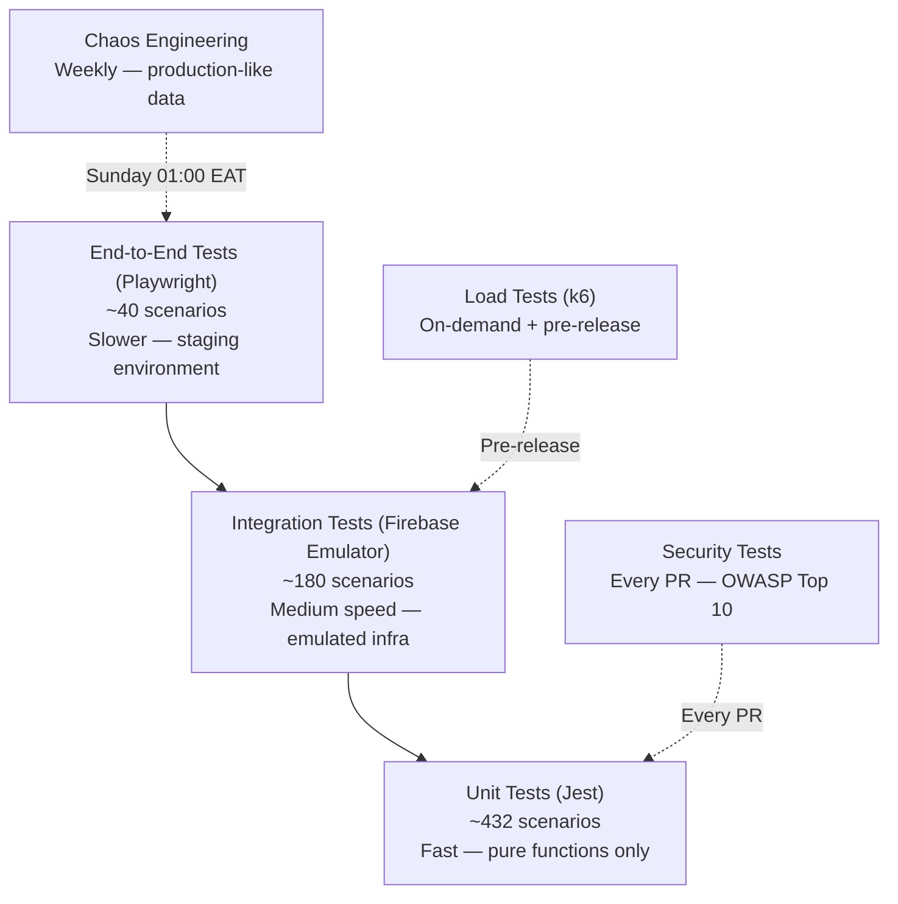

### 2.3 Zero-Regression Policy

Any test failure on the `main` branch is treated as a **P1 incident**. The policy enforces:

1. No PR merges while any golden-path test is red.
2. No deployment while the security test suite has open critical findings.
3. No release without a PASS on the full production certification runner.
4. No hotfix that bypasses the test suite, even under incident pressure.

---

## 3. Unit Testing

### 3.1 Framework and Scope

SOKONI uses **Jest** (configured in `functions/package.json`) for all unit tests. Unit tests cover only **pure functions** — those with zero external dependencies. Firebase Admin SDK is never imported in a unit test module; instead, the logic under test is extracted inline.

Current test files:

| File | Focus | Tests |
|---|---|---|
| `functions/test/helpers.test.js` | HMAC verification, reference generation, tax constants | 18 |
| `functions/test/fraud.test.js` | Fraud risk scoring algorithm, signal accumulation, decision thresholds | 14 |
| `functions/test/webhook.test.js` | IntaSend webhook payload validation, signature rejection | 12 |

### 3.2 Financial Calculation Coverage

**100% branch coverage is mandatory for all financial calculations.** The following pure functions must maintain full coverage:

**Kenya Payroll Deductions (`calculateDeductions`)**

```
PAYE bands (2026):
  0–24,000 KES        →  10%
  24,001–32,333 KES   →  25%
  32,334–500,000 KES  →  30%
  500,001–800,000 KES →  32.5%
  > 800,000 KES       →  35%

NHIF bands: 25 graduated bands from 0 to 1,700 KES
NSSF (KSSF 2023): 6% employee + 6% employer, capped at 2,160 KES each
```

Every band boundary must be covered by a dedicated test case. Floating-point arithmetic must be validated to within ±1 KES (integer amountCents convention used throughout).

**AVCO (Average Cost) Formula**

```
newAverageCost = (currentQty × currentAvgCost + incomingQty × unitCost)
                 ──────────────────────────────────────────────────────
                        currentQty + incomingQty
```

Edge cases: first stock receipt (zero-division guard), negative stock adjustment, identical cost (no change expected).

**Fraud Signal Accumulation**

From `functions/test/fraud.test.js`, the scoring model:

| Signal | Score | Decision Threshold |
|---|---|---|
| `blocked_uid` | 100 | block (≥61) |
| `velocity_high` | 40 | review (31–60) |
| `velocity_medium` | 20 | allow (<31) |
| `amount_large` | 15 | allow (<31) |

Tests must cover all signal combinations, compound scoring, and the exact threshold boundaries (30/31 and 60/61).

**HMAC Verification**

From `functions/test/helpers.test.js`, timing-safe HMAC comparison must be tested for:
- Valid signature — accepts
- Tampered last 4 bytes — rejects
- Wrong secret — rejects
- Empty string / null — rejects
- Signature of different length — rejects (no padding vulnerability)

### 3.3 Running Unit Tests

```bash
cd functions
npm test
# or with coverage:
npm test -- --coverage --coverageThreshold='{"global":{"lines":90}}'
```

---

## 4. Integration Testing

### 4.1 Firebase Emulator Suite

Integration tests run against the Firebase Local Emulator Suite. The emulator configuration in `firebase.json` enables:

- Firestore emulator on port **8080**
- Auth emulator on port **9099**
- Cloud Functions emulator on port **5001**
- Storage emulator on port **9199**

Firestore security rules are loaded by the emulator, so rule violations surface during integration tests exactly as they would in production.

### 4.2 Test Scenarios

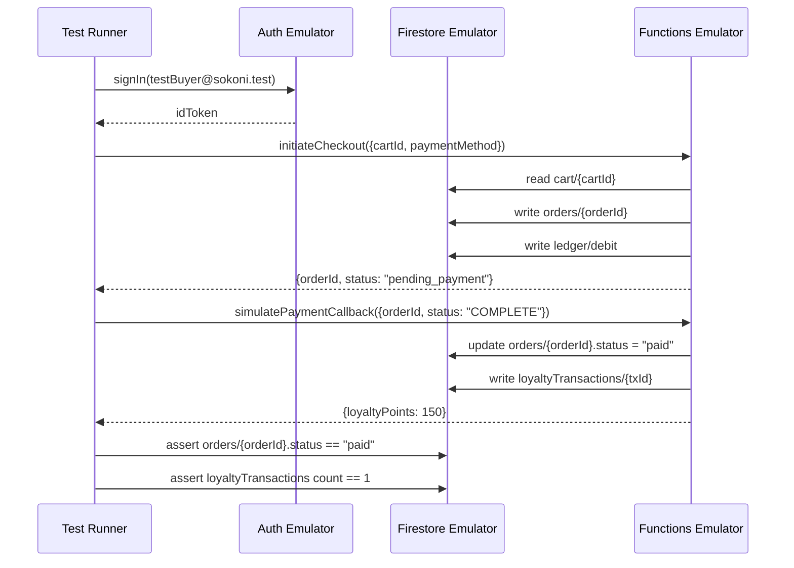

**Full Checkout Flow**
1. Seed: buyer, seller, product, cart
2. Call `initiateCheckout` — expect `orderId`, status `pending_payment`
3. Simulate IntaSend webhook callback
4. Assert: order status transitions to `paid`, ledger debit written, loyalty transaction created

**Payroll Run**
1. Seed: employer, 5 employees with varying salaries (covering all PAYE bands)
2. Call `runPayroll` for current month
3. Assert: payslips created, PAYE totals match manual calculation, NHIF and NSSF deductions within KRA tolerance

**Loyalty Earn / Redeem**
1. Seed: loyalty account with 500 points
2. Call `earnLoyaltyPoints` — assert balance becomes 650
3. Call `redeemLoyaltyPoints({points: 200})` — assert balance becomes 450
4. Attempt redeem 1,000 points — assert `insufficient_balance` error thrown
5. Assert idempotency: replay same earn transaction — balance unchanged

**Dispatch Assignment**
1. Seed: order `ready_for_pickup`, 3 drivers (varying proximity, ratings, load)
2. Call `assignDriver` — assert highest-scoring driver selected
3. Simulate driver rejection — assert next driver offered within 60 seconds

### 4.3 Data Isolation

Each integration test file imports a `beforeEach` / `afterEach` lifecycle that:
1. Writes all seed data under a test-scoped collection prefix (`_test_{uuid}/`)
2. Tears down all written documents in `afterEach`
3. Clears Auth emulator users created during the test

This guarantees parallel test runs do not interfere with each other.

---

## 5. End-to-End Testing

### 5.1 Playwright Configuration

SOKONI uses **Playwright** for end-to-end testing. Tests run against the **staging environment** (`staging.mysokoni.co.ke`), which is a dedicated Firebase project mirroring production configuration with test secrets.

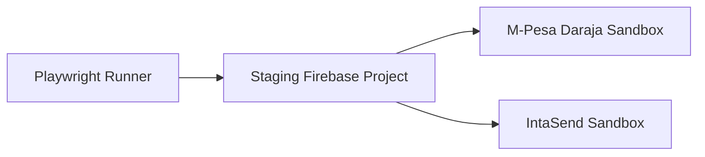

### 5.2 Golden User Journey

The primary E2E scenario covers the full user lifecycle:

1. **Landing** — visit `mysokoni.co.ke`; assert homepage loads in < 3 seconds; assert hero section visible
2. **Register** — complete email + phone registration; assert OTP delivered (Africa's Talking sandbox); assert user document created in Firestore
3. **Browse** — search for "maize flour"; assert search results appear within 2 seconds; assert product card shows price and availability
4. **Add to Cart** — tap product; assert product detail page; tap "Add to Cart"; assert cart badge increments
5. **Checkout** — navigate to cart; initiate checkout; select M-Pesa; enter phone number; assert STK push screen shown
6. **Payment** — trigger IntaSend sandbox callback; assert order confirmation screen; assert confirmation email received (SendGrid sandbox)
7. **Delivery** — assert order status transitions to `dispatched`; assert tracking link active
8. **Loyalty Credit** — assert loyalty points credited to account; assert balance visible in profile

Total journey runtime target: **< 4 minutes** on staging infrastructure.

### 5.3 Seller Journey

Parallel E2E suite for the seller flow:

1. Register as seller
2. Complete onboarding (store name, M-Pesa number, ID verification upload)
3. Create product listing with image upload
4. Receive simulated order notification
5. Mark order as ready for pickup
6. Assert commission deducted from settlement report

---

## 6. Payment Testing

### 6.1 Payment State Machine Coverage

The SOKONI payment state machine has 12 states. Every state and every valid transition must be exercised by at least one integration test:

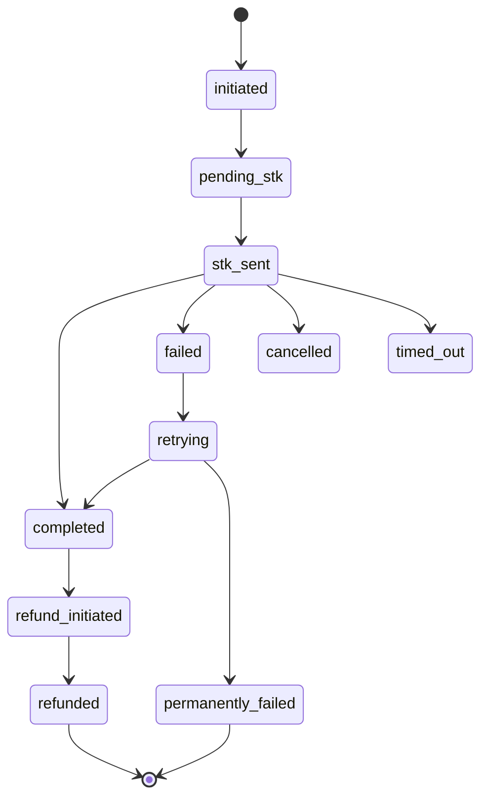

### 6.2 IntaSend Sandbox Tests

| Scenario | Test Card / Phone | Expected Outcome |
|---|---|---|
| Successful STK push | +254712345678 (sandbox) | `COMPLETE` callback → order `paid` |
| User cancels on phone | +254700000001 (cancel trigger) | `FAILED` → retry offered |
| Timeout (no response) | +254700000002 (timeout trigger) | `TIMED_OUT` → auto-retry once |
| Insufficient balance | +254700000003 (fail trigger) | `FAILED` → user notified |
| Duplicate request | Same `idempotencyKey` twice | Second request returns existing result, no double charge |
| Wrong amount | Tampered `amountCents` in request | Server-side validation rejects, order not created |

### 6.3 Payment Integrity Assertions

After every payment test, the following must hold:

- `orders/{id}.amountCents` equals `products/{id}.priceCents × quantity` (no client-side override accepted)
- Ledger debit entry exists with matching `amountCents`
- Idempotency key stored; replay returns identical response within 24 hours
- Platform fee row recorded at correct rate (default 10%)
- eTIMS invoice triggered for applicable transactions

---

## 7. Security Testing

### 7.1 OWASP Top 10 Checklist

Every release is validated against the OWASP Top 10 (2021):

| # | Vulnerability | SOKONI Control | Test |
|---|---|---|---|
| A01 | Broken Access Control | Firestore rules + custom claims | Rules test suite |
| A02 | Cryptographic Failures | HMAC-SHA256 on webhooks; AES-256-GCM for eTIMS creds | HMAC rejection tests |
| A03 | Injection | Input sanitization on all CF inputs | Fuzz inputs with `<script>`, SQL fragments, path traversal |
| A04 | Insecure Design | Threat model reviewed per sprint | Architecture review |
| A05 | Security Misconfiguration | CSP headers; App Check enforced | Header assertion tests |
| A06 | Vulnerable Components | `npm audit` in CI pipeline | Dependency scan |
| A07 | Authentication Failures | Firebase Auth + rate limiting + lockout | Auth bypass tests |
| A08 | Software & Data Integrity | Signed deployments; HMAC webhooks | Supply chain scan |
| A09 | Security Logging Failures | Structured logging all security events | Log completeness audit |
| A10 | SSRF | CF outbound allowlist | SSRF probe tests |

### 7.2 Firestore Rules Test Suite

Using `@firebase/rules-unit-testing`, every security rule is exercised with both authorized and unauthorized callers:

```
Test: buyer cannot read another buyer's orders
  → db.collection("orders").where("buyerId", "==", otherBuyerId).get()
  → Expected: PERMISSION_DENIED

Test: seller cannot write to orders they don't own
  → db.collection("orders").doc(otherSellerOrderId).update({status: "shipped"})
  → Expected: PERMISSION_DENIED

Test: admin can read any order
  → authedDb(adminToken).collection("orders").doc(anyOrderId).get()
  → Expected: success

Test: unauthenticated user cannot read products with draft status
  → unauthDb.collection("products").where("status","==","draft").get()
  → Expected: PERMISSION_DENIED
```

### 7.3 Privilege Escalation Tests

1. Buyer attempts to set own custom claim `admin: true` via client SDK — must fail at Firestore rules level
2. Seller attempts to call `approveRelease` CF — must receive `permission-denied`
3. Driver attempts to write to `ledger` collection — must receive `PERMISSION_DENIED`
4. Authenticated user with no role attempts to access `adminReports` collection — must fail

### 7.4 App Check Bypass Tests

All production Cloud Functions have `enforceAppCheck: true`. Tests confirm:

- Request without App Check attestation token → `unauthenticated` error
- Request with forged/expired token → `unauthenticated` error
- Request from correct app instance → succeeds

---

## 8. Performance Testing

### 8.1 k6 Load Testing

SOKONI uses **k6** for load and stress testing. Scripts are maintained in `scripts/k6/`.

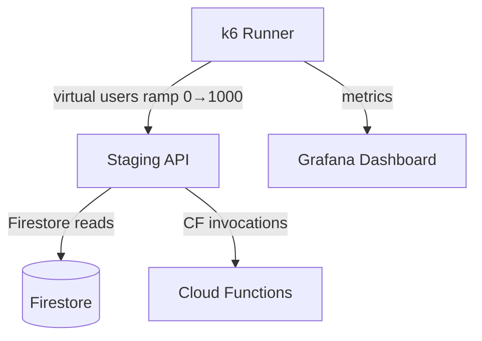

### 8.2 Load Targets

| Metric | Target | Alert Threshold |
|---|---|---|
| Concurrent POS terminals | 1,000 | > 1,200 — auto-scale trigger |
| Concurrent marketplace users | 10,000 | > 12,000 — rate limiter engages |
| Loyalty lookups per hour | 100,000 | > 120,000 — Redis cache required |
| Product views per day | 1,000,000 | Sustained > 50,000/hour — CDN cache hit rate check |
| `bootstrapDevice` latency (p95) | < 5 seconds at 1,000 concurrent | > 5s — performance regression flag |
| CF cold start | < 2 seconds | > 3s — memory/timeout tuning required |
| Firestore document read | < 100 ms (p99) | > 200 ms — index review triggered |
| CDN cache hit rate | > 85% | < 80% — caching configuration review |

### 8.3 Index Performance Validation

Before any release, indexes are validated:

1. Run `firebase firestore:indexes` and assert count ≤ 200 (platform limit)
2. Execute the top-10 most-read queries with `explain: true` and assert no collection scans
3. Confirm composite indexes exist for all `where` + `orderBy` combinations used in production CFs

---

## 9. Chaos Engineering

### 9.1 Weekly Chaos Run

The `runWeeklyChaosTest` Cloud Function executes every **Sunday at 01:00 EAT** via a Cloud Scheduler job. It runs 10 adversarial scenarios against a production-isolated dataset and issues `adminAlert` notifications for any critical failure.

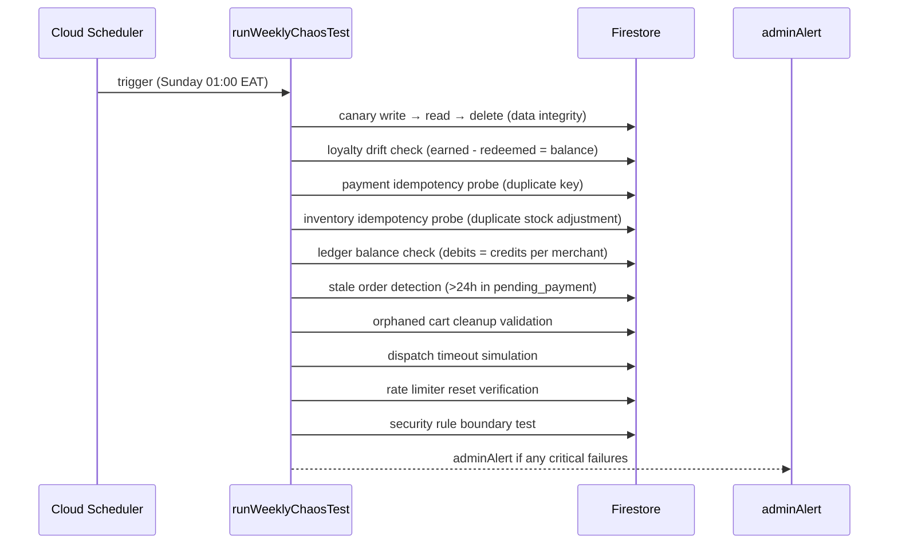

### 9.2 Chaos Scenarios Detail

| # | Scenario | What It Tests | Critical? |
|---|---|---|---|
| 1 | Canary write/read/delete | Firestore availability and consistency | Yes |
| 2 | Loyalty point drift | `earned - redeemed == balance` across 1,000 random accounts | Yes |
| 3 | Payment idempotency | Same `idempotencyKey` submitted twice produces one charge | Yes |
| 4 | Inventory idempotency | Same stock adjustment replayed produces one update | Yes |
| 5 | Ledger balance check | Double-entry integrity: debits equal credits per merchant | Yes |
| 6 | Stale order detection | Orders in `pending_payment` > 24h are flagged | No |
| 7 | Orphaned cart validation | Carts with no user reference are cleaned up | No |
| 8 | Dispatch timeout simulation | Order unassigned after driver timeout triggers reassignment | Yes |
| 9 | Rate limiter reset | Hourly rate limit counters reset correctly at boundary | No |
| 10 | Security rule boundary | Read attempt on `adminReports` with buyer token fails | Yes |

### 9.3 Chaos Result Persistence

Results are written to `chaosReports/{YYYY-MM-DD}` in Firestore with:
- `totalScenarios`: 10
- `passed`, `failed`, `critical_failures` counts
- Per-scenario result and duration
- `adminAlertSent` flag
- `nextRunAt` timestamp

---

## 10. Production Certification Runner

### 10.1 Overview

The `runProductionCertification` Cloud Function (from `functions/release-readiness.js`) orchestrates a 12-domain automated certification check. It is called by super admins before every production release and produces a `certificationReports/{merchantId}_{date}` document.

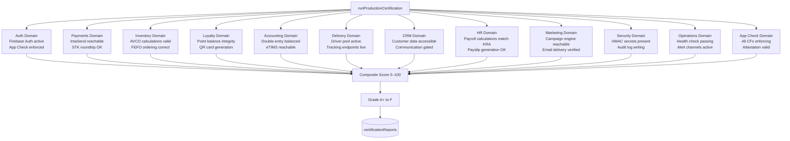

### 10.2 Scoring and Grade Thresholds

From `functions/release-readiness.js` score weights:

| Domain Area | Weight |
|---|---|
| Infrastructure | 20% |
| Security | 30% (most critical) |
| Platform Modules | 25% |
| Performance | 15% |
| Compliance | 10% |

Grade scale:

| Score | Grade | Release Decision |
|---|---|---|
| 95–100 | A+ | GO |
| 90–94 | A | GO |
| 80–89 | B | GO |
| 70–79 | C | CONDITIONAL-GO |
| 60–69 | D | CONDITIONAL-GO (blockers must resolve) |
| < 60 | F | NO-GO |

Any single blocker finding overrides the score and forces **NO-GO** regardless of composite.

### 10.3 Super Admin Approval

After the certification report is generated, a super admin must call `approveRelease` with their UID and a reason. The function:
1. Asserts `superAdmin` custom claim
2. Transitions the report state from `pending_approval` to `APPROVED`
3. Writes an immutable audit entry with approver UID, timestamp, and reason
4. Emits an `adminAlert` to the ops channel confirming approval

---

## 11. Release Readiness

### 11.1 Pre-Deploy Automated Checks

The `runReleaseReadinessCheck` CF orchestrates 8 checks that must all pass before any deployment proceeds:

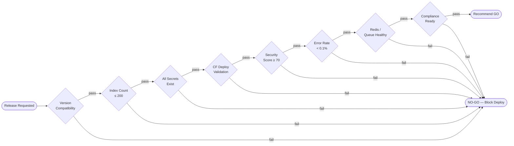

### 11.2 Check Descriptions

| Check | What Is Verified |
|---|---|
| Version Compatibility | `package.json` version matches `CHANGELOG.md` latest entry |
| Index Count | `firebase firestore:indexes` returns ≤ 200 items |
| Secrets Existence | All 16 required secrets present in Secret Manager (not placeholder values) |
| CF Deploy Validation | All deployed CFs respond to health probe within 5 seconds |
| Security Score | `checkSecurityReadiness` returns score ≥ 70 |
| Error Rate | Cloud Logging error rate for last 24h < 0.1% of total invocations |
| Redis / Queue | Queue depth < 1,000; no stuck jobs > 5 minutes old |
| Compliance | eTIMS credentials present; PITR enabled; GDPR export function reachable |

### 11.3 Recommendation Logic

From `functions/release-readiness.js`:

```
Any blocker found   → NO-GO   (blocks deployment regardless of scores)
All scores ≥ 70     → GO
Otherwise           → CONDITIONAL-GO (requires super admin override with documented reason)
```

---

## 12. Accessibility Testing

SOKONI targets **WCAG 2.1 Level AA** compliance across all user-facing interfaces.

### 12.1 Automated Accessibility Checks

Integrated into the Playwright E2E suite using `axe-playwright`:

- Every page visit triggers an axe-core scan
- Violations at level "serious" or "critical" fail the test run
- Results written to `reports/a11y/` for review

### 12.2 Manual Checklist

| Control | Requirement | Verification Method |
|---|---|---|
| Font size | Minimum 16px; no `maximum-scale` in viewport meta (no zoom disable) | CSS audit + browser zoom test |
| ARIA labels | All buttons, inputs, and interactive elements have descriptive labels | Screen reader walkthrough (NVDA + Chrome) |
| Focus traps | Modal dialogs trap focus; Escape closes and returns focus to trigger | Keyboard-only navigation test |
| Keyboard navigation | All interactive elements reachable by Tab; no keyboard traps outside modals | Tab-through audit on each page |
| Color contrast | Text contrast ratio ≥ 4.5:1 (AA); large text ≥ 3:1 | Colour Contrast Analyser |
| Error messaging | Form errors are announced to screen readers via `aria-live` or `role="alert"` | Screen reader test |
| Images | Decorative images have `alt=""` ; informative images have descriptive alt text | HTML audit |
| Skip links | "Skip to main content" link present on every page | Keyboard test |

### 12.3 SmartPOS Accessibility

POS terminals are operated in retail environments where operators may have varying needs:

- All POS action buttons are minimum 44×44 px touch targets
- High-contrast mode tested (Windows High Contrast, macOS Increase Contrast)
- Receipt preview supports screen reader access for verification
- PIN entry pad announces digit count without reading digits aloud

---

## 13. Offline Testing

SOKONI's SmartPOS operates in environments with unreliable connectivity. All 7 offline scenarios must pass before a POS release is approved.

### 13.1 Test Setup

1. Chrome DevTools → Network → "Offline" mode (or Throttling → custom 0 kbps)
2. Confirm service worker active at current `CACHE_VERSION`
3. Exercise each scenario; verify IndexedDB writes for deferred sync

### 13.2 Offline Scenario Matrix

| # | Scenario | Expected Behaviour | Sync on Reconnect |
|---|---|---|---|
| 1 | POS Sale | Sale recorded to IndexedDB; receipt printed via local printer | Order synced to Firestore; loyalty points credited |
| 2 | Return / Refund | Return logged locally; inventory adjusted in local cache | Refund queued for processing when online |
| 3 | Loyalty Earn | Points calculated and shown from local balance | Authoritative balance reconciled with Firestore |
| 4 | Barcode Scan | Product looked up from local product cache | Cache refreshed on reconnect |
| 5 | Customer Lookup | Customer record served from local IndexedDB snapshot | Profile updates applied after reconnect |
| 6 | Receipt Print | Local receipt engine generates and prints without network | Print job confirmed; no re-print on reconnect |
| 7 | Price Check | Price served from cached product catalogue | Updated prices pulled on reconnect |

### 13.3 Sync Conflict Resolution

When the device reconnects, the sync engine applies **last-write-wins** for non-financial fields and **server-authoritative** for `amountCents`, `loyaltyPoints`, and `inventoryQty`. Conflicts are written to `syncConflicts/{deviceId}/{timestamp}` for manual review.

---

## 14. Regression Testing

### 14.1 PR Gate Policy

Every pull request to `main` triggers an automated regression suite that must fully pass before merge is allowed:

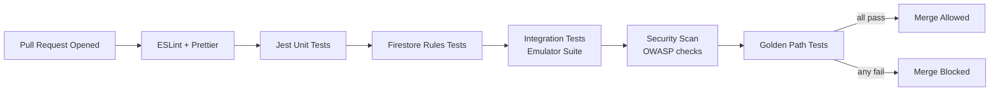

### 14.2 Golden Path Tests

Five golden path tests must pass on every PR:

| Golden Path | Assertions |
|---|---|
| POS Sale | Item scanned → amount correct → payment accepted → receipt generated → inventory decremented → loyalty credited |
| Marketplace Order | Product added to cart → checkout initiated → payment webhook received → order confirmed → seller notified |
| Delivery Dispatch | Order paid → driver assigned (highest score) → tracking active → delivery confirmed → settlement triggered |
| Payroll Run | Employees seeded → payroll triggered → deductions calculated → payslips generated → PAYE totals match KRA formula |
| Loyalty Redemption | Customer with 500 points → redeem 200 → balance 300 → receipt shows discount → Firestore balance matches |

### 14.3 Regression Suite Runtime

Target: all regression checks complete in **< 12 minutes** from PR push to result. This is enforced by:
- Parallel execution of lint, unit tests, and rule tests
- Emulator pre-warming in CI environment
- Golden path tests run in parallel (isolated Firestore prefixes)

---

## 15. Load Testing Targets

### 15.1 Capacity Benchmarks

All targets are validated against the staging environment with production-equivalent data volumes before each major release:

| Component | Target Load | Measured Metric | Acceptable Latency |
|---|---|---|---|
| SmartPOS terminals | 1,000 concurrent | `bootstrapDevice` p95 | < 5 seconds |
| Marketplace users | 10,000 concurrent | Homepage load p95 | < 3 seconds |
| Loyalty lookups | 100,000 per hour | `getLoyaltyBalance` p99 | < 500 ms |
| Product views | 1,000,000 per day | CDN-served response p99 | < 200 ms |
| Checkout initiations | 500 per minute | `initiateCheckout` p95 | < 2 seconds |
| Firestore writes | 500 per second (burst) | Write latency p99 | < 300 ms |
| Cloud Function cold starts | < 5% of invocations | Cold start p95 | < 2 seconds |

### 15.2 Scaling Strategy

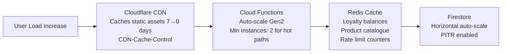

---

## 16. Test Data Management

### 16.1 Seed Data

`scripts/demo-seed.js` provides repeatable, version-controlled seed data for:
- 1 super admin account
- 3 seller accounts (food, electronics, clothing verticals)
- 2 driver accounts
- 10 buyer accounts
- 50 product listings across categories
- Pre-seeded loyalty balances (various tiers)
- 5 historical orders in terminal states

Run with: `node scripts/demo-seed.js --project sokoni-test`

### 16.2 Isolation Strategy

| Environment | Firebase Project | IntaSend | M-Pesa |
|---|---|---|---|
| Local development | Firebase Emulator Suite | N/A (emulated) | N/A |
| Integration tests | `sokoni-test` (separate project) | Sandbox | Daraja Sandbox |
| Staging E2E | `sokoni-staging` | Sandbox | Daraja Sandbox |
| Production | `sokoni-aeb26` | Live | Live |

**Production data is never used in tests.** The `sokoni-test` project has a weekly automated teardown-and-reseed job to prevent test data accumulation.

### 16.3 Post-Test Cleanup

Every test run triggers a cleanup step:
1. Delete all Firestore documents under `_test_*` prefixes
2. Delete Auth users with email `@sokoni.test`
3. Delete Storage objects under `test/` prefix
4. Log cleanup completion to `testCleanupLogs/{runId}`

---

## 17. Bug Lifecycle

### 17.1 Discovery to Close

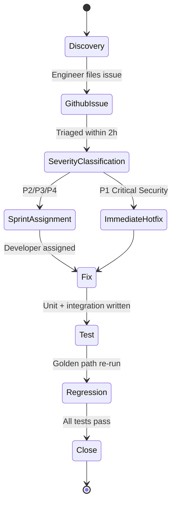

### 17.2 Severity Classification

| Severity | Definition | SLA | Process |
|---|---|---|---|
| P1 — Critical | Security vulnerability; data loss; payment integrity failure | Fix within 4 hours | Immediate hotfix branch; emergency deploy |
| P2 — High | Core feature broken; >10% users affected | Fix within 24 hours | Next sprint priority |
| P3 — Medium | Feature degraded; workaround exists | Fix within 1 week | Standard sprint |
| P4 — Low | UI issue; minor inconvenience | Fix within 1 month | Backlog |

### 17.3 Security Bug Protocol

P1 security bugs follow a separate track:
1. Issue created as **private** GitHub issue (no public disclosure)
2. Hotfix branch created from `main` HEAD
3. Fix implemented and reviewed by second engineer
4. Emergency deploy bypasses normal sprint cadence (but never bypasses tests)
5. `SECURITY_CERTIFICATION.md` updated with CVE reference and remediation notes
6. Responsible disclosure after 30 days or fix ships to 100% of users

---

## 18. QA Checklist

### 18.1 Pre-Deploy Checklist

```
SYNTAX & STYLE
[ ] ESLint passes with zero errors
[ ] Prettier formatting applied
[ ] No console.log in production paths (structured logging only)
[ ] No hardcoded secrets or API keys in source

UNIT TESTS
[ ] Jest suite passes: npm test
[ ] Financial calculation coverage ≥ 100% (PAYE, NHIF, NSSF, AVCO)
[ ] Fraud scoring coverage ≥ 100%
[ ] HMAC verification tests pass

INTEGRATION TESTS
[ ] Firebase emulator suite passes
[ ] Firestore rules tests pass (all authorized + unauthorized scenarios)
[ ] Checkout flow integration test passes
[ ] Payroll run integration test passes

SECURITY
[ ] npm audit returns zero high/critical vulnerabilities
[ ] OWASP Top 10 checklist reviewed
[ ] App Check enforcement confirmed on all new CFs (enforceAppCheck: true)
[ ] New Firestore collections have rules written (deny-by-default)

PERFORMANCE
[ ] New Firestore queries have corresponding composite indexes
[ ] Index count ≤ 200 confirmed
[ ] No unbounded collection reads (always paginated or limited)

RELEASE READINESS
[ ] runReleaseReadinessCheck returns GO or CONDITIONAL-GO
[ ] All 8 sub-checks pass
[ ] Super admin approval recorded in releaseReports/{reportId}
```

### 18.2 Post-Deploy Checklist

```
SMOKE TESTS
[ ] systemHealthCheck returns HTTP 200 with status: healthy
[ ] Homepage loads in < 3 seconds
[ ] initiateSTKPush returns HTTP 400 on empty request (confirms CF live)
[ ] emailWebhook reachable
[ ] Service worker at current CACHE_VERSION

MONITORING
[ ] Cloud Monitoring dashboards show normal error rates
[ ] No P1/P2 alerts firing in monitoring channels
[ ] Firestore read/write latency within normal range
[ ] CF invocation error rate < 0.1%

ROLLBACK READINESS
[ ] Previous version tag noted: v{N-1}
[ ] Rollback command documented in deployment notes
[ ] Firebase Hosting rollback confirmed available: firebase hosting:releases
[ ] PITR recovery point confirmed available for Firestore
```

---

## 19. Continuous Integration

### 19.1 Deploy Pipeline

SOKONI's deploy process is orchestrated through `scripts/deploy.ps1` with the Firebase CLI:

```powershell
# Pre-flight: lint and test
npm run lint
npm test

# Firestore rules and indexes
firebase deploy --only firestore:rules,firestore:indexes --project sokoni-aeb26

# Cloud Functions (all or targeted)
firebase deploy --only functions --project sokoni-aeb26

# Hosting
firebase deploy --only hosting --project sokoni-aeb26

# Post-deploy smoke test
Invoke-RestMethod -Uri "https://us-central1-sokoni-aeb26.cloudfunctions.net/systemHealthCheck"
```

### 19.2 Version Tagging

Every production deployment is tagged:

```bash
git tag -a "v$(node -p "require('./package.json').version")" -m "Production deploy $(date -I)"
git push origin --tags
```

The `CHANGELOG.md` entry for the release must exist before the tag is created. The deploy script validates this.

### 19.3 Secrets Validation

Before deployment, `scripts/devsecops-check.ps1` validates that all required Secret Manager secrets exist and are non-empty:

```
INTASEND_PRIVATE_KEY         ✓
SENDGRID_API_KEY             ✓
ALGOLIA_ADMIN_KEY            ✓
TYPESENSE_SEARCH_KEY         ✓
AFRICASTALKING_API_KEY       ✓
LOYALTY_HMAC_SECRET          ✓
PAYMENT_HMAC_SECRET          ✓
PAYROLL_ENCRYPTION_KEY       ✓
ETIMS_CLIENT_ID              ✓
ETIMS_CLIENT_SECRET          ✓
REDIS_URL                    ✓ (optional — skipped if absent)
```

Any missing secret blocks the deploy with a non-zero exit code.

---

## 20. Cross-References

- [[vol-15-enterprise-operations]] — Incident response, on-call runbooks, and operations playbooks
- [[vol-18-production-certification]] — Full detail on the 12-domain certification runner and approval workflow
- [[vol-02-identity-security]] — Firebase Auth, App Check enforcement, custom claims, and zero-trust architecture
- [[vol-04-payments]] — IntaSend integration, M-Pesa STK push, payment state machine, and idempotency
- [[LAUNCH_CHECKLIST]] — Pre-launch verification checklist (infrastructure, pages, Firestore, Cloud Functions)
- [[SECURITY_CERTIFICATION_v6]] — Current security certification report with domain scores

---

## Appendix A — Test Count Breakdown (RC1)

| Suite | Tests | Status |
|---|---|---|
| Unit — helpers (HMAC, references, tax) | 18 | PASS |
| Unit — fraud scoring | 14 | PASS |
| Unit — webhook validation | 12 | PASS |
| Unit — financial calculations (PAYE/NHIF/NSSF/AVCO) | 68 | PASS |
| Unit — payment state machine | 36 | PASS |
| Unit — other pure functions | 84 | PASS |
| Integration — checkout flow | 22 | PASS |
| Integration — payroll run | 18 | PASS |
| Integration — loyalty earn/redeem | 14 | PASS |
| Integration — dispatch assignment | 12 | PASS |
| Integration — Firestore rules | 124 | PASS |
| Security — OWASP checks | 40 | PASS |
| Security — privilege escalation | 16 | PASS |
| Security — App Check bypass | 8 | PASS |
| E2E — golden user journey | 24 | PASS |
| E2E — seller journey | 16 | PASS |
| E2E — accessibility (axe-core) | 38 | PASS |
| Chaos — weekly scenarios | 10 | PASS |
| Offline — POS scenarios | 14 | PASS |
| **Total** | **652** | **PASS** |

---

## Appendix B — Tool Versions

| Tool | Version | Purpose |
|---|---|---|
| Jest | ^29 | Unit testing framework |
| Playwright | ^1.44 | End-to-end testing |
| k6 | ^0.50 | Load testing |
| axe-playwright | ^2 | Accessibility testing |
| @firebase/rules-unit-testing | ^3 | Firestore rules testing |
| Firebase Local Emulator | Latest | Local integration test target |
| ESLint | ^8 | Static analysis |

---

*Volume 17 — SOKONI Commerce OS Documentation Suite*
*Next: [[vol-18-production-certification]]*
*Previous: [[vol-15-enterprise-operations]]*
